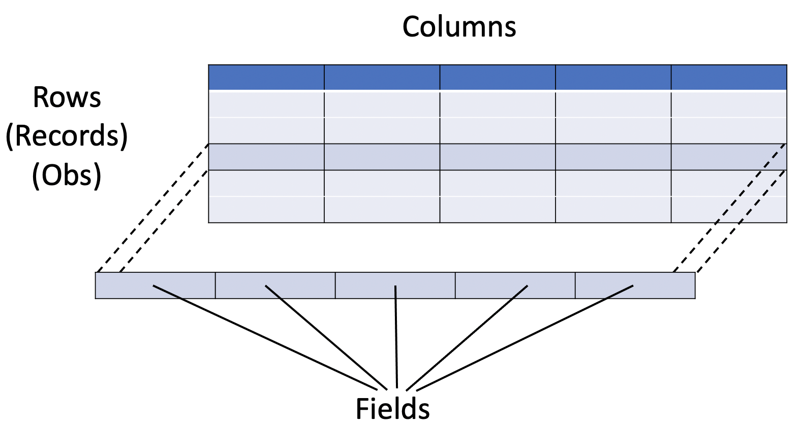

# Relational concepts

Database management systems can be characterised by the way they model data as seen by their users. A widely used approach is to represent data to their users as simply the contents of one or more tables. This kind of DBMS are called **relational systems** and are based on the the **relational model**.

## Relational model

The relational model was first put forth by E. F. Codd, a researcher in IBM's San Jose laboratories, in a paper published in 1970.

### Tables, Rows and Columns

Perhaps the simplest way to think of a relational DBMS is a system in which users see all data as the contents of one or more **tables** and nothing more. All data in the database is stored in one of these tables.

The notion of a table, with its rows and columns, is illustrated below.

- Each **table** is a simple two-dimensional structure made up of some number of **rows** (also called **records** or sometimes **observations**) and **columns** (also called **fields** or **attributes**).
  - Each **column** in a table is assigned a unique name and contains a particular type of data, such as characters or numbers.
  - Each **record** contains a value for each of the table's columns.

Stored in the table as values for the various fields in the records is the actual data. **Note that the order of the records in a table is not significant**. It is not meaningful to ask whether a particular record occurs before or after another.

A very simple database might contain only one table, but most databases will contain several.
