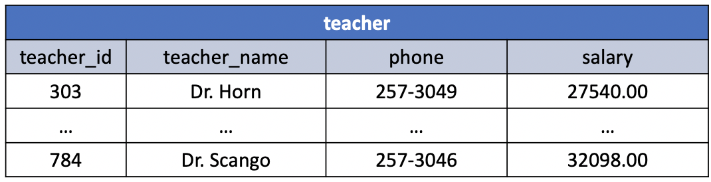

# An Example Table

The Teacher table example.

The figure above shows the content of a table called `teachers`. This table contains six rows, each record describing a particular teacher. The information stored about each is described by the names assigned to the table's four columns:

 - `teacher_id`
 - `teacher_name`
 - `phone`
 - `salary`

 The `teacher_id` column is designated as the key for this table.

 Every record in the table has four fields, each containing a value for one of these four columns. The first record in the table, for instance, contains a value of *303* for the column `teacher_id`, *Dr. Horn* for the column `teacher_name`, *257-3049* fro the column `phone`, and *27540.00* fro the last column, `salary`. Each of the other records in this table contains similar values.
