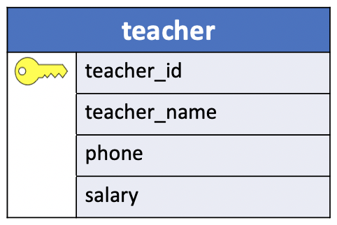
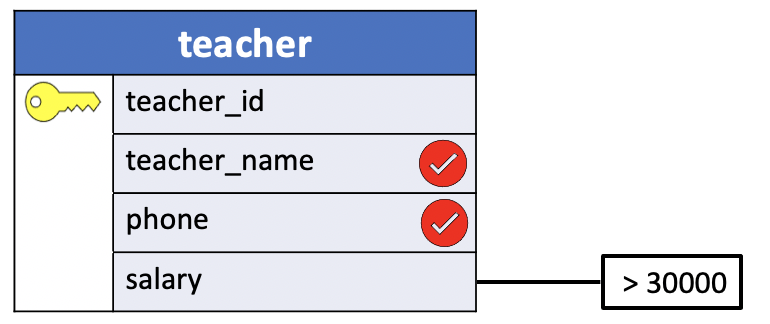

# The Visual Approach

While SQL is a very powerful tool, it can also be rather complex to use. Among the major reasons for this are the formal nature of the language (it is, after all, still a computer language) and the inherent complexity of the queries it can express. To tame this complexity, this course takes a **visual approach**. We believe that by first thinking of a query **visually**, in terms of query diagrams, you can more easily develop the formal SQL statements required to actually execute that query against a real relational database.



In the **visual approach**,
- each **table** is represented as a *box* with each of the *column names* listed.

The picture above shows how the `teachers` table looks using this representation (Note the little key next to `teacher_id`, indicating that this column contains the **key** values for `teachers`.)



Queries about the information in a table are shown graphically indicating the information to be retrieved. For example, the picture above is a diagram of the query:

- What are the names and phone numbers of all teachers earning more than $30,000 a year?

The same query expressed in SQL is:

```console
SELECT teacher_name,
       phone
  FROM teachers
 WHERE salary > 30000;
```

For many queries, information must be retrieved from two or more tables at once. Correctly formulating these kinds of requests directly in SQL can be especially difficult. In this course, we attempt to make both these and other queries easier and more intuitive by first showing a query diagram, then presenting the actual SQL.
