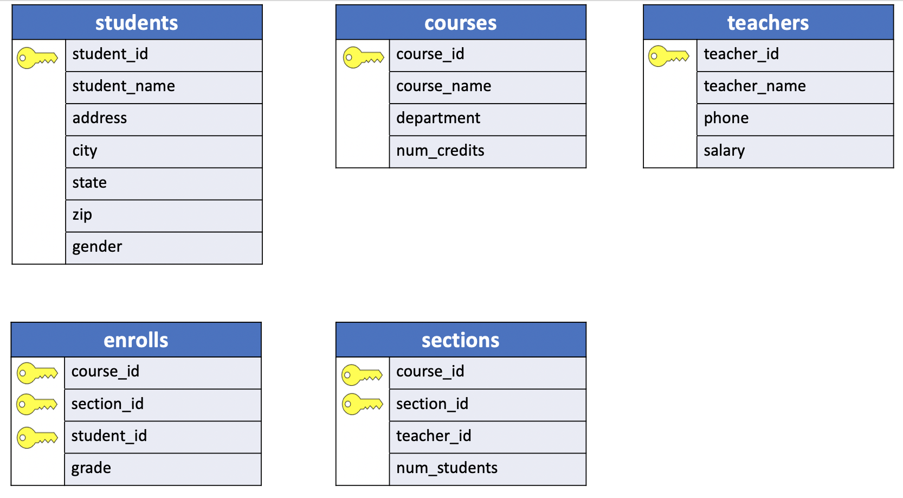
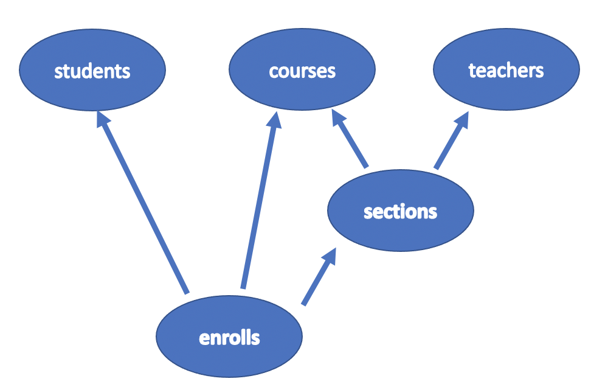
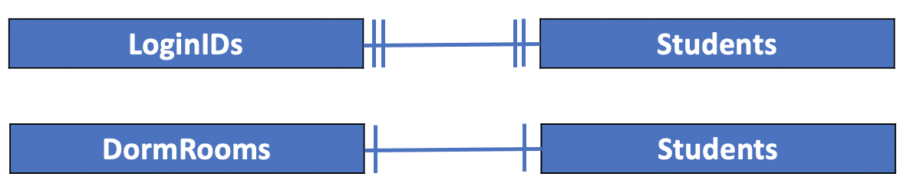

# UniY sample database

The **UniY** database contains the registration information for a fictitious (and very small) university.

The picture above shows a summary of each table's columns in query diagram form. Note that, once again, one or more columns in each table have a small picture of a **key beside the column name**, identifying **visually the columns that act as keys for that table**.

### students

The table in this database with the most columns is called **students**. It contains information on all students currently enrolled at this university. Its **columns** are as follows:

- **student_id**: A `SMALLINT` containing a **unique number** for each student.
- **student_name**: A `CHAR (18)` containing a student's name.
- **address**: A `CHAR (20)` containing this student's street address.
- **city**: A `CHAR (10)` containing the name of this student's home city.
- **state**: A `CHAR (2)` containing the two-letter postal abbreviation of this student's home state.
- **zip**: A `CHAR (5)` containing this student's home zip code.
- **gender**: A `CHAR (1)` containing an `M` if this student is male, and an `F` if the student is female.

Because it contains a unique value for each record, the **student_id** column is designated as the **key** for this table.

### teachers

Another table in the database is called **teachers**. This table describes the teachers currently active at this university. Its **columns** are as follows:

- **teacher_id**: A `SMALLINT` containing a **unique number** for each teacher.
- **teacher_name**: A `CHAR (18)` containing a teacher's name.
- **phone**: A `CHAR (10)` containing this teacher's phone number.
- **salary**: A `NUMERIC (10,2)` containing this teacher's annual salary.

Again, because of the column's unique values, **teacher_id** is the **key** for this table.

### courses

A third member of this database is the **courses** table. **courses** lists information on the courses offered by the university this term and has the following **columns**:

- **course_id**: A `SMALLINT` containing a **unique number** for each course.
- **course_name**: A `CHAR (20)` containing the name of a course.
- **department**: A `CHAR (16)` indicating which department offers this course.
- **num_credits**: A `SMALLINT` indicating the number of credits this course is worth.

Because course numbers are unique, the **course_id** column serves as this tables's **key**.

### sections

Another of the database's table is called **sections**. Many university courses are divided into two or more sections, and this table describes each section of each course. Its **columns** are as follows:

- **course_id**: A `SMALLINT` identifying the course of which this is a section. `Values in this column are drawn from the column of the same name in the` **courses** `table`.
- **section_id**: A `SMALLINT` identifying a specific section of a particular course.
- **teacher_id**: A `SMALLINT` identifying the instructor of this section. `Values in this column are drawn from the column of the same name in the` **teaches** table.
- **num_students**: A `SMALLINT` indicating how many students are enrolled in the course.

No single column in this table can act as its key. Each record describes only one section, but **section numbers are not unique**;

several different courses may have a `section 1`. Also, the **same course may have several sections**, so course number alone is not sufficient to uniquely identify a record in the table. But **taken together**, a course number (`course_id`) and a section number (`section_id`) do provide a **unique** reference for each record in this table. Therefore, the **key** for a record in **sections** consists of the values in both that record's **course_id** and **section_id** fields.

### enrolls

The final table in this example database is the **enrolls** table. It contains a record with each student's grade for every section of every course in which that student is enrolled. Because its purpose is to tie together information in other tables, its contents may appear somewhat unusual at first sight. Don't worry- the usefulness of the **enrolls** table will become clear before the end of the course. The **columns** in this table are as follows:

- **course_id**: A `SMALLINT` identifying a course. `Values in this column are drawn from the column of the same name in the` **courses** table.
- **section_id**: A `SMALLINT` identifying a particular section of this course. `Values in this column are the same as those in the` **section_id** `column in the` **sections** `table`.
- **student_id**: A `SMALLINT` identifying a `particular student from the list in the` **students** `table`.
- **grade**: A `SMALLINT` indicating the student's grade in this section. a traditional four point scale is used, so a value of 4 represents an A, 3 a B, and so on.

Once again, no single column contains enough information to act as the key for this table. To uniquely identify a record, values from no less than three columns are required: **course_id**, **section_id** and **student_id**. Taken together, the values in these three columns comprise the **unique key** for each record in **enrolls** table.

The picture of the database shown in the figure above is a useful summary of the information stored in this simple database and of the relationships between various parts of that information.

One addition has been made to the version of the first figure: **Lines now connect certain columns in the tables**. These lines show graphically which columns contain the same kinds of information, such as **student_id's**, and thus can be **used to navigate through the data**. This graph becomes clear if we look at the records stored in the database tables.

### students table

|student_id |student_name  |address |city| state | zip  | gender|
|:----------|:------------:|:--------:|:---:|:----:|:----:|:-----:|
|148        | Susan Powell | 534 East River Dr.| Haverford | PA | 19041 | F|
|210        | Bob Dawson   | 120 South Jefferson | Newport | RI | 02891 | M|
|298        | Howard Mansfield | 290 Wynkoop Drive | Vienna | VA| 22180 | M|
|348        | Susan Pugh | 534 East Hampton Dr. | Hartford | CT | 06107 | F|
|349        | Joe Adams  | 473 Emmerson Street  | Newark   | DE | 19702 | M|
|354        | Janet Ladd | 441 10th Street | Pennsburg  | PA    | 18073 | F|
|410        | Bill Jones | 120 South Harrison | Newport | CA    | 92660 | M|
|473        | Carol Dean | 983 Park Avenue | Boston     | MA    | 02169 | F|
|548        | Allen Thomas| 238 West Ox Road | Chicago  | IL    | 60624 | M|
|558        | Val Shipp   | 238 Westport Road| Chicago  | IL    | 60556 | F|
|649        | John Anderson| 473 Emmory Street | New York| NY   | 10008 | M|
|654        | Janet Thomas | 441 6th Street  | Erie     | PA    | 16510 | F|

### courses table

|course_id |     course_name      |    department    | num_credits|
|:---------|:--------------------:|:----------------:|:----------:|
|450       | Western Civilization | History          |           3|
|730       | Calculus IV          | Math             |           4|
|290       | English Composition  | English          |           3|
|480       | Compiler Writing     | Computer Science |           3|
|550       | Art History          | History          |           3|

### teachers table

|teacher_id |    teacher_name    |   phone    |  salary|
|:----------|:------------------:|:----------:|--------:|
|303        | Dr. Horn           | 257-3049   | 27540.00|
|290        | Dr. Lowe           | 257-2390   | 31450.00|
|430        | Dr. Engle          | 256-4621   | 38200.00|
|180        | Dr. Cooke          | 257-8088   | 29560.00|
|560        | Dr. Olsen          | 257-8086   | 31778.00|
|784        | Dr. Scango         | 257-3046   | 32098.00|
|213        | Dr. Wright         | 257-3393   | 35000.00|

### sections table:

|course_id | section_id | teacher_id | num_students|
|:---------|:----------:|:----------:|:-----------:|
|450       |          1 |        303 |            2|
|730       |          1 |        290 |            6|
|290       |          1 |        430 |            3|
|480       |          1 |        180 |            3|
|450       |          2 |        560 |            2|
|480       |          2 |        784 |            2|

### enrolls table:

|course_id | section_id | student_id | grade|
|:---------|:----------:|:----------:|:----:|
|730       |          1 |        148 |     3|
|450       |          2 |        210 |     3|
|730       |          1 |        210 |     1|
|290       |          1 |        298 |     3|
|480       |          2 |        298 |     3|
|730       |          1 |        348 |     2|
|290       |          1 |        349 |     4|
|480       |          1 |        410 |     2|
|450       |          1 |        473 |     2|
|730       |          1 |        473 |     3|
|480       |          2 |        473 |     0|
|290       |          1 |        548 |     2|
|730       |          1 |        558 |     3|
|730       |          1 |        649 |     4|
|480       |          1 |        649 |     4|
|450       |          1 |        654 |     4|
|450       |          2 |        548 |      |

## Foreign keys

The table's primary keys are used to create **relationships between tables**. For example, let's look at the records of the **students** and **enrolls** tables:

### students table

|student_id |student_name  |address |city| state | zip  | gender|
|:----------|:------------:|:--------:|:---:|:----:|:----:|:-----:|
|148        | Susan Powell | 534 East River Dr.| Haverford | PA | 19041 | F|
|210        | Bob Dawson   | 120 South Jefferson | Newport | RI | 02891 | M|
|298        | Howard Mansfield | 290 Wynkoop Drive | Vienna | VA| 22180 | M|
|348        | Susan Pugh | 534 East Hampton Dr. | Hartford | CT | 06107 | F|
|349        | Joe Adams  | 473 Emmerson Street  | Newark   | DE | 19702 | M|
|354        | Janet Ladd | 441 10th Street | Pennsburg  | PA    | 18073 | F|
|410        | Bill Jones | 120 South Harrison | Newport | CA    | 92660 | M|
|**473**        | **Carol Dean** | **983 Park Avenue** | **Boston**     | **MA**    | **02169** | **F**|
|548        | Allen Thomas| 238 West Ox Road | Chicago  | IL    | 60624 | M|
|558        | Val Shipp   | 238 Westport Road| Chicago  | IL    | 60556 | F|
|649        | John Anderson| 473 Emmory Street | New York| NY   | 10008 | M|
|654        | Janet Thomas | 441 6th Street  | Erie     | PA    | 16510 | F|

The student_id column is the **primary key** of the `students` table. The values in this column uniquely identify a row in the table. For example, the **student_id** 473 identifies a particular student in this table, (Carol Dean).

- **(**Carol Dean,983 Park Avenue, Boston,MA,02169,F**)**

### enrolls table:

|course_id | section_id | student_id | grade|
|:---------|:----------:|:----------:|:----:|
|730       |          1 |        148 |     3|
|450       |          2 |        210 |     3|
|730       |          1 |        210 |     1|
|290       |          1 |        298 |     3|
|480       |          2 |        298 |     3|
|730       |          1 |        348 |     2|
|290       |          1 |        349 |     4|
|480       |          1 |        410 |     2|
|450|1 |473 |2|
|730|1|473|3|
|480|2</blue>|473|0</blue>|
|290       |          1 |        548 |     2|
|730       |          1 |        558 |     3|
|730       |          1 |        649 |     4|
|480       |          1 |        649 |     4|
|450       |          1 |        654 |     4|
|450       |          2 |        548 |      |

In the **enrolls** table, the  `student_id` 473 appears in three records. It follows that **Carol Dean** is enrolled in three courses (450,730,480) and corresponding sections (1,1,2), grades (2,3,0).

Similarly, if we want to find the name of the student who got the worst grade in the course 480 section 2, (the minimum grade: 0), then we see that the record:

- **(**480,2,473,0**)**

**references** a unique record in the **students** table:

- **(**473,Carol Dean,983 Park Avenue, Boston,MA,02169,F**)**

In this example, the `student_id` column in the **enrolls** is called **foreign key** because it **refers** to the **primary key** of the **students** table. In general a foreign key may refers to other tables as well. The **foreign key** always **refers to one record** in other tables.

A **foreign key** is a **column** or a **group of columns** in a `table` that **reference** the **primary key** of `another table`.

How about the other way around?

- Does a referenced primary key have always one or more records in other tables?

The answer is no. For example, the `student_id` 354 does not appear in any records of the **enrolls** table.

The reltionship between the **students** and **enrolls** tables can be stated as follow:

- A student can be enrolled to zero or more courses: a record in the **students** table is **referenced by**  `zero or more` records in the **enrolls** table.
- A student enrolled in a course must have a record in the **students** table. A record in the **enrolls** table **must references** a record in the **students** table.

## UniY Relationships

Below is a summary of the relationships in the **UniY** sample database tables.

| tables  | referenced_by    | references                 |
|:-------:|:----------------:|:--------------------------:|
|students |        enrolls   |                            |
|courses  | enrolls, sections|                            |
|teachers | sections         |                            |
|sections | enrolls          | **courses**,**teachers**           |
|enrolls  |                  | **students**, **courses**, **sections**|

The `sections` and `enrolls` tables are the only ones to have foreign keys since they reference at least one table in the database. On the other hand the `students`, `courses` and `teachers` do not reference any other tables in the database.

The `table` that **contains** the **foreign key** is called the referencing table or child **table**.

And the `table` **referenced by** the **foreign key** is called the referenced table or parent **table**.

The picture below illustrates the `referenced_by` **relationship** between tables, or parent **relationship** graph :smile::

The courses and teachers tables are **referenced by** the sections table. The students, courses and sections tables are **referenced by** the enrolls table.

The picture below illustrates the `references` **relationship** between tables, or child **relationship** graph :smile::

The sections table **references** the courses and teachers tables. The enrolls table **references** the students, courses and sections tables.

Let's describe all the **(**parent,child**)** **relationships** in the UniY sample database.

**(**students,enrolls**)**

The reltionship between the students and enrolls tables can be stated as follow:

- **referenced by**: A student can be enrolled to zero or more courses: a record in the students table is **referenced by**  `zero or more` records in the enrolls table.
- **references**: A student enrolled in a course must references a record in the students table. A record in the enrolls table **must references** a record in the students table.

**(**courses,enrolls**)**

- **referenced by**: A course can have zero or more students enrolled: a record in the courses table is **referenced by**  `zero or more` records in the enrolls table.
- **references**: A student enrolled in a course must references a record in the courses table. A record in the enrolls table **must references** a record in the students table.

For example, the course_id 550 in the courses table does not appear in any records of the enrolls table. It seems that students in this university are not much interested in `Art history` :smile:

**(**sections,enrolls**)**

- **referenced by**: A section can have one or more students enrolled: a record in the sections table is **referenced by**  `one or more` records in the enrolls table.
- **references**: A student enrolled in a course must references a record in the sections table. A record in the enrolls table **must references** a record in the sections table.

In this particular instance of the uniY sample database a record in the sections table has actually more than a single record in the enrolls table. However, in the general design of the database we assume that a section must have at least one record. Why is not `zero or more`? To answer at this question we must analyze the relationship between the `sections` and `courses` tables.

**(**courses,sections**)**

- **referenced by**: A course can have zero or more sections: a record in the courses table is **referenced by**  `zero or more` records in the sections table.
- **references**: A section must references a record in the courses table. A record in the sections table **must references** a record in the courses table.

For example, the course_id 550 in the courses table does not appear in any records of the sections table.

**(**teachers,sections**)**

- **referenced by**: A teacher can have zero or more sections: a record in the teachers table is **referenced by**  `zero or more` records in the sections table.
- **references**: A section must references a record in the teachers table. A record in the sections table **must references** a record in the teachers table.

For example, the teacher_id 213 in the teachers table does not appear in any records of the sections table.

## UniY Entity Relationship Diagram

To visualize the cardinality of relationships between tables in a database the symbols below are often used:

Now, we can visualize the relationships between the uniY database tables using an **ERD**, which stands for **Entity Relationship Diagram**.

An **entity relationship diagram** (**ERD**) is a common way to view data in a database. These diagrams help you **visualize** the data you are analyzing including:

- The **names of the tables**.
- The **columns in each table**.
- The way the **tables work together**.

Below is the ERD for the **UniY** sample database.

### One (and only one) VS One

There is often confusion about the difference between a `one (and only one)` and `one` relationship.

A student, Alice, can only have `one` dorm room at at time. A dorm room can only house one student at a time (for the sake of this example). Next year, Alice will be assigned a new dorm room, and at that point her dorm room from this year will be assigned to a new student.

Alice can have `one and only one` login (e.g. `a11235`) and **that login can only be assigned to Alice**. When Alice graduates, **no one else can be assigned the login** `a11235`. In other words, if we delete a record in a table, the primary key of that record cannot be reassigned.
