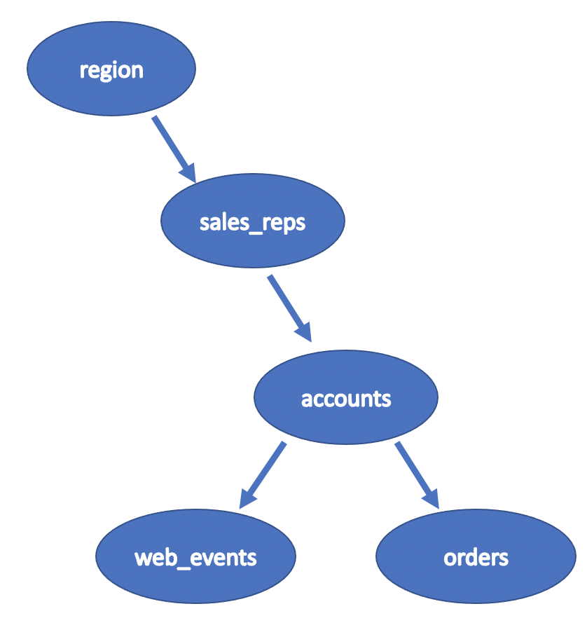

# Parch & Posey sample database

This database contains the information for a fictitious company that **sells paper**.

In the Parch & Posey database there are five tables:

1. **region**: the 4 regions in the US where P&P operates.
2. **sales_reps**: information on P&P's sales reps.
3. **accounts**: all accounts from P&P.
4. **web_events**: all web event data for P&P's accounts
5. **orders**: all orders made from 2014-12-08 to 2017-01-01.

## region

The **region** table stores the region data of the regions in the US where P&P operates. It's **columns** are as follows:

- **id**: A `INTEGER` containing a **unique** number for each region.
- **name**: A `CHAR` containing this region's name.

Because it contains a unique value for each record, the **id** column is designated as the **key** for this table.
If the size `n` is not specified, the sysstem provides the maximum lenght for the data.

## sales_reps

The **sales_reps** table stores the sales representatives (sellers) data of P&P.
It's **columns** are as follows:

- **id**: A `INTEGER` containing a **unique** number for each sales represantive.
- **name**: A `CHAR` containing this seller's name.
- **region_id**: A `INTEGER` identifying the region of this seller. `Values in this column are drawn from the column` **id** in the **region** table.

Because it contains a unique value for each record, the **id** column is designated as the **key** for this table.

## accounts

The **accounts** table stores the client accounts data of P&P. It's **columns** are as follows:

- **id**: A `INTEGER` containing a **unique** number for each account.
- **name**: A `CHAR` containing this account's name. The company account's name.
- **website**: A `CHAR` containing this account's website link.
- **lat**: A `NUMERIC (11,8)` containing the latitutde of the client's location.
- **long**: A `NUMERIC (11,8)` containing the longitude of the client's location.
- **primary_poc**: A `CHAR` containing the primary point of contact of this account. It's basically the name of the person to be contacted.
- **sales_rep_id**: A `INTEGER` identifying the sale representative of P&P for this account. `Values in this column are drawn from the column` **id** in the **sales_reps** table.  

Because it contains a unique value for each record, the **id** column is designated as the **key** for this table.

## web_events

The **web_events** table stores all web event data for P&P's accounts. It's **columns** are as follows:

- **id**: A `INTEGER` containing a **unique** number for each web_event.
- **account_id**: A `INTEGER` identifying the account of this web_event. `Values in this column are drawn from the column` **id** in the **accounts** table.
- **occurred_at**: A `TIMESTAMP` containing the date this web_event occurred.
- **channel**: A `CHAR` containing the advertising channel of this web_event.

Because it contains a unique value for each record, the **id** column is designated as the **key** for this table.

## orders

The **orders** table stores all paper orders placed for P&P's items. It's **columns** are as follows:

- **id**: A `INTEGER` containg a **unique** number for each order.
- **account_id**: A `INTEGER` identifying the account of this order. `Values in this column are drawn from the column` **id** in the **accounts** table.
- **occurred_at**: A `TIMESTAMP` containing the date this order occurred.
- **standard_qty**: A `INTEGER` containing the quantity of standard paper of this order.
- **gloss_qty**: A `INTEGER` containing the quantity of gloss paper of this order.
- **poster_qty**: A `INTEGER` containing the quantity of poster paper of this order.
- **total**: A `INTEGER` containing the the total quantity of paper ordered for this order.
- **standard_amt_usd**: A `NUMERIC (10,2)` containing the sale price (US dollars) of the standard paper for this order.
- **gloss_amt_usd**: A `NUMERIC (10,2)` containing the sale price (US dollars) of the gloss paper for this order.
- **poster_amt_usd**: A `NUMERIC (10,2)` containing the sale price (US dollars) of the poster paper for this order.
- **total_amt_usd**: A `NUMERIC (10,2)` containing the total sale price (US dollars) of this order.

Because it contains a unique value for each record, the **id** column is designated as the **key** for this table.

## HR table records

The following table shows the table names and the number of records.

| Table  | Rows |
|:-------|:----:|
|accounts|351|
|orders|6912|
|region|4|
|sales_reps|50|
|web_events|9073|

They have `50` **sales reps** spread across the US in `4` **regions**.

They sell `3` **types** of paper: `regular`, `poster` and `glossy`. Their clients are primarily large Fortune 100 companies whom they attract by advertising on Google, Facebook and Twitter.

## P&P Relationships

Below is a summary of the relationships in the **HR** sample database tables.

| tables  | referenced_by    | references                 |
|:-------:|:----------------:|:--------------------------:|
|region |        sales_reps   |                            |
|sales_reps  |accounts| **region**                           |
|accounts |web_events, orders         |**sales_reps**|
|web_events |          |**accounts**|
|orders||**accounts**|

The `region` table is the only table with no foreign key constraints.

The picture above illustrates the `referenced_by` **relationship** between tables, or **parent** **relationship** graph :smile:

Let's describe all the **(** **parent**,`child`**)** **relationships** in the P&P sample database.

**(** **regions**, `sales_reps`**)**

The relationship between the **regions** and `sales_reps` tables can be stated as follow:

- **referenced by**: A region can have many countries. A record in the **regions** table is **referenced by**  `many` records in the `sales_reps` table.
- **references**: A sales_rep has `one` region. A record in the `sales_rep` table **references** a record in the **regions** table.

**(** **sales_reps**, `accounts`**)**

The relationship between the **sales_rep** and `accounts` tables can be stated as follow:

- **referenced by**: A sale representative can have many accounts. A record in the **sales_reps** table is **referenced by**  `many` records in the `accounts` table.
- **references**: An account has `one` sale representative . A record in the `accounts` table **references** a record in the **sales_reps** table.

**(** **accounts**, `web_events`**)**

The relationship between the **accounts** and `web_events` tables can be stated as follow:

- **referenced by**: An account can have many web events. A record in the **accounts** table is **referenced by**  `many` records in the `web_events` table.
- **references**: A web event has `one` account. A record in the `web_events` table **references** a record in the **accounts** table.

**(** **accounts**, `orders`**)**

The relationship between the **accounts** and `orders` tables can be stated as follow:

- **referenced by**: An account can have many orders. A record in the **accounts** table is **referenced by**  `many` records in the `orders` table.
- **references**: An order has `one` account. A record in the `orders` table **references** a record in the **accounts** table.
