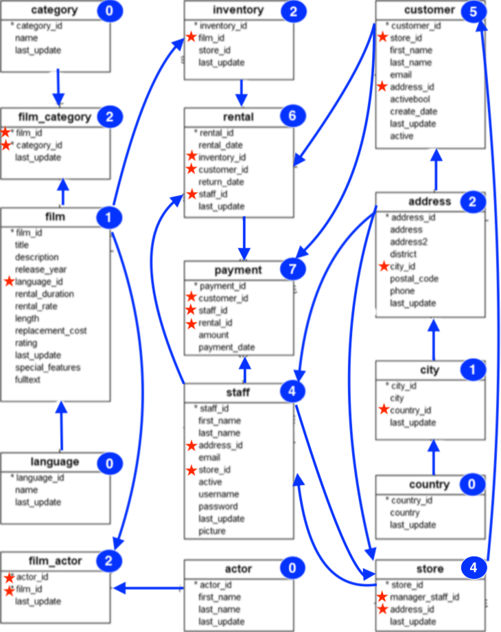
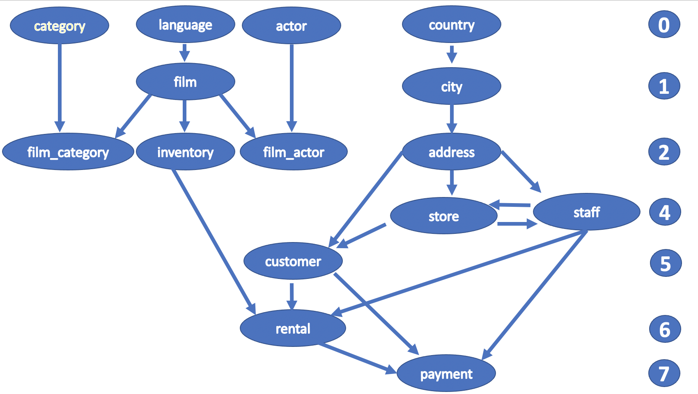

# DVDRENTAL sample database

The DVD rental database represents the business processes of a DVD rental store.

## PostgreSQL Sample Database Tables

There are 15 tables in the DVD Rental database. The following table shows the table names in alphabetical order and the number of records.

| Table  | Rows |
|:-------|:----:|
|actor|200|
|address|603|
|category|16|
|city|600|
|country|109|
|customer|599|
|film|1000|
|film_actor|5462|
|film_category|1000|
|inventory|4581|
|language|6|
|payment|14596|
|rental|16044|
|staff|2|
|store|2|

We'll describe the tables following the order of the **parent relationships** graph.

The picture above illustrates the `referenced_by` **relationship** between tables, or **parent** **relationship** graph :smile:.

Over each table there is a **number inside a circle** shape indicating the **longest path** `linking the` **first anchestor tables** `to this` **table**.

The `length of a path`: is **the number of archs** `linking the` **first anchestor tables** `to the` **numbered circle table**. All loops are discarded, since a loop does not define a path.  

For instance, the `category`, `language`, `actor` and `country` tables do not have a foreign key and therefore are not referenced by any table. It follows that the four tables do not have a parent table or anchestor. Thus, the number of archs is `zero` and they are the **first anchestor tables**. It follows that all the linking paths must start from one of the following tables:

- **anchestor tables**:
  - **CATEGORY**
  - **LANGUAGE**
  - **ACTOR**
  - **COUNTRY**

Similarly, the longest path of the `store` table has length `4`, (`COUNTRY` **->**`city`**->**`address`**->**`staff`**->**`store`).

**Notes**:

- In the parent relationships graph no tables have a maximum path of length 3 and therefore there is no `Level 3` for such database.

The blach asterisck on the left of each column table represents the primary key. On the other hand, the red star represents a foreign key.

- `0` - **CATEGORY**: lists the categories that can be assigned to a film.
  - path: (`CATEGORY`)
- `0` - **LANGUAGE**: is a lookup table listing the possible languages that films can have for thier language.
  - path: (`LANGUAGE`)
- `0` - **ACTOR**: lists information for all actors. The actor `table` is joined to the `film` table by means of the `film_actor` table.
  - path: (`ACTOR`)
- `0` - **COUNTRY**: contains a list of countries.
  - path: (`COUNTRY`)
- `1` - **film**: is a list of all films potentially in stock in the stores. The actual in-stock copies of each film are represented in the `inventory` table. The `film` table refers to the `language` table and is referenced by `film_category`, `film_actor` and `inventory`.
  - path: (`LANGUAGE`**->**`film`)
- `1` - **city**: is a list of cities. The `city` table is reffered to by a foreign key in the `address` table and refers to the `country` table using a foreign key.
  - path: (`COUNTRY`**->**`city`)
- `2` - **film_category**: is used to support a *many-to-many* relationship between `films` and `categories`. For each category applied to a film, there will be one row in the `film_category` table listing the category and film. The `film_category` table refers to the `film` and `category` tables using foreign keys.
  - path: (`LANGUAGE`**->**`film`**->**`film_category`)
- `2` - **film_actor**: is used to support a *many-to-many* relationship between `films` and `actors`. For each actor in a given film, there will be one row in the `film_actor` table liating the actor and film.
  - path: (`LANGUAGE`**->**`film`**->**`film_actor`)
- `2` - **inventory**: contains one row for each copy of a given film in a given store. The inventory table refers to the `film` and `store` tables using foreign keys and is referred to by the `rental` table.
  - path: (`LANGUAGE`**->**`film`**->**`inventory`)
- `2` - **address**: contains address information for customers, staff and stores. The `address` foreign key appears as a foreign key in the `customer`, `staff` and `store` tables.
  - path: (`COUNTRY`**->**`city`**->**`address`)
- `4` - **store**: lists all stores in the system. All inventory is assigned to specific stores, and staff and customers are assigned a 'home store'.
  - path: (`COUNTRY`**->**`city`**->**`address`**->**`staff`**->**`store`)
- `4` - **staff**: lists all staff memebers, including informnation for email address, login information and picture. The `staff` table refers to the `store` and `address` tables using foreign keys, and is referred to by the `rental`, `payment` and `store`.
  - path: (`COUNTRY`**->**`city`**->**`address`**->**`store`**->**`staff`)
- `5` - **customer**: contains a list of all customers. The `customer` table is referred to in the `payment` and `rental` tables and refers to the `address` and `store` tables.
  - path: (`COUNTRY`**->**`city`**->**`address`**->**`staff`**->**`store`**->**`customer`)
- `6` - **rental**: contains one row for each rental of each inventory item with information about who rented what item, when it was rented and when it was returned. The `rental` table refers to the `inventory`, `customer` and `staff` tables and is referred to by the `payment` table.
  - path: (`COUNTRY`**->**`city`**->**`address`**->**`staff`**->**`store`**->**`customer`**->**`rental`)
- `7` - **payment**: records each payment made by a customer, with information such as the amount and the rental being paid for (when applicable). The `payment` table refers to the `customer`, `rental` and `staff` tables.
  - path: (`COUNTRY`**->**`city`**->**`address`**->**`staff`**->**`store`**->**`customer`**->**`rental`**->**`payment`)

## DVDRENTAL TABLES

**-------------------------------------------------------------------------  Level 0  --------------------------------------------------------**

### category

The category table lists the categories that can be assigned to a film. It's **columns** are as follows:

- **category_id**: A `SERIAL` containing a **unique** integer number for each category.
- **name**: A `VARCHAR (25)` containing the name of this category.
- **last_update**:A `TIMESTAMP` containing the time when the row was created or most recently updated.

The category table lists the categories that can be assigned to a film. Because it contains a unique value for each record, the **category_id** column is designated as the **key** for this table. It's basically a **surrogate primary key** used to uniquely identify each category.

### language

The language table is a lookup table listing the possible languages that films can have for thier language and their original language values. It's **columns** are as follows:

- **language_id**: A `SERIAL` containing a **unique** integer number for each language.
- **name**: A `VARCHAR (25)` containing the English name of the language.
- **last_update**: A `TIMESTAMP` containing the time when the row was created or most recently updated.

Because it contains a unique value for each record, the **language_id** column is designated as the **key** for this table. It's basically a **surrogate primary key** used to uniquely identify each language.

### actor

The actor table lists information for all actors. The actor `table` is joined to the `film` table by means of the `film_actor` table. It's **columns** are as follows:

- **actor_id**: A `SERIAL` containing a **unique** integer number for each actor.
- **first_name**: A `VARCHAR (45)` containing the first name of the actor.
- **last_name**: A `VARCHAR (45)` containing the last name of the actor.
- **last_update**: A `TIMESTAMP` containing the time when the row was created or most recently updated.

Because it contains a unique value for each record, the **actor_id** column is designated as the **key** for this table. It's basically a **surrogate primary key** used to uniquely identify each actor.

### country

The country table contains a list of countries. It's **columns** are as follows:

- **country_id**: A `SERIAL` containing a **unique** integer number for each country.
- **country**: A `VARCHAR (45)` containing the name of the country.
- **last_update**: A `TIMESTAMP` containing the time when the row was created or most recently updated.

Because it contains a unique value for each record, the **country_id** column is designated as the **key** for this table. It's basically a **surrogate primary key** used to uniquely identify each country.

**-------------------------------------------------------------------------  Level 1  ---------------------------------------------------------**

### film

The film table is a list of all films potentially in stock in the stores. The actual in-stock copies of each film are represented in the `inventory` table. The `film` table refers to the `language` table and is referenced by `film_category`, `film_actor` and `inventory`. It's **columns** are as follows:

- **film_id**: A `SERIAL` containing a **unique** integer number for each film.
- **title**: A `VARCHAR (255)` containing the title of the film.
- **description**: A `TEXT` containing a short descriotion of plot summary of the film.
- **release_year**: A `year` containing the year in which the movie was released.
- **language_id**: A `SMALLINT` identifying the language of this film. `Values in this column are drawn from the column of the same name in the` **language** `table`.
- **rental_duration**: A `SMALLINT` indicating the lenght of the rental period, in days.
- **rental_rate**: A `NUMERIC (4,2)` indicating the cost to rent the film for the period specified in the rental duration column.
- **length**: A `SMALLINT` indicating the duration of the film, in minutes.
- **replacement_cost**: A `NUMERIC (5,2)` indicating the amount charged to the customer if the film is not returned or is returned in a damage state.
- **rating**: A `ENUM` type named `mpaa_rating` indicating the rating assigned to the film. Can be one of `G`,`PG`,`PG-13`,`R` or `NC-17`.
- **last_update**: A `TIMESTAMP` containing the time when the row was created or most recently updated.
- **sepcial_features**: A `TEXT []`, (text array), lists which common special features are included in the DVD. Can be zero or more of: `Trailers`, `Commentaries`, `Deleted Scenes`, `Behind the Scenes`.
- **last_update**: A `TIMESTAMP` containing the time when the row was created or most recently updated.
- **fulltext**: A `tsvector` containing the words in the text columns and their position in the concatenated string - `title` + `description`.

Because it contains a unique value for each record, the **country_id** column is designated as the **key** for this table. It's basically a **surrogate primary key** used to uniquely identify each country. The **language_id** column is a **foreign key** pointing to the `language` table, the language of the film.

### city

The table city is a list of cities. The `city` table is reffered to by a foreign key in the `address` table and refers to the `country` table using a foreign key. It's **columns** are as follows:

- **city_id**: A `SERIAL` containing a **unique** integer number for each city.
- **city**: A `VARCHAR (50)` containing the name of the city.
- **country_id**: A `SMALLINT` identifying the country that the city belongs to. `Values in this column are drawn from the column of the same name in the` **country** `table`.
- **last_update**: A `TIMESTAMP` containing the time when the row was created or most recently updated.

Because it contains a unique value for each record, the **city_id** column is designated as the **key** for this table. It's basically a **surrogate primary key** used to uniquely identify each country. The **country_id** column is a **foreign key** pointing to the `country` table, the country of the city.

**-------------------------------------------------------------------------  Level 2  --------------------------------------------------------**

### film_category

The film_category table is used to support a *many-to-many* relationship between `films` and `categories`. It's a bridge table. For each category applied to a film, there will be one row in the `film_category` table listing the category and film. The `film_category` table refers to the `film` and `category` tables using foreign keys. It's **columns** are as follows:

- **film_id**: A `SMALLINT` identifying the film associated to the categories in the category table linked to the film_category table.
- **category_id** A `SMALLINT` identifying the category applied to the films in the film table linked to the film_category table.
- **last_update**: A `TIMESTAMP` containing the time when the row was created or most recently updated.

The **film_id** and **category_id** form the **primary key** of this table. The **film_id** is a **foreign key** identifying the film. The **category_id** is a **foreign key** identifying the category.  

### film_actor

The film_actor table is used to support a *many-to-many* relationship between `films` and `actors`. For each actor in a given film, there will be one row in the `film_actor` table liating the actor and film. It's **columns** are as follows:

- **actor_id**: A `SMALLINT` identifying the actor associated to the films in the film table linked to the film_actor table.
- **film_id**: A `SMALLINT` identifying the film associated to the actors in the actor table linked to the film_actor table.
- **last_update**: A `TIMESTAMP` containing the time when the row was created or most recently updated.

The **film_id** and **actor_id** form the **primary key** of this table. The **film_id** is a **foreign key** identifying the film. The **actor_id** is a **foreign key** identifying the actor.

## inventory

The inventory table contains one row for each copy of a given film in a given store. The inventory table refers to the `film` and `store` tables using foreign keys and is referred to by the `rental` table. It's **columns** are as follows:

- **inventory_id**: A `SERIAL` containing a **unique** integer number for each item in the inventory.
- **film_id**: A `SMALLINT` identifying the film this item represents. `Values in this column are drawn from the column of the same name in the` **film** `table`.
- **store_id**: A `SMALLINT` identifying the store stocking this item. `Values in this column are drawn from the column of the same name in the` **store** `table`.
- **last_update**: A `TIMESTAMP` containing the time when the row was created or most recently updated.

Because it contains a unique value for each record, the **inventory_id** column is designated as the **key** for this table. It's basically a **surrogate primary key** used to uniquely identify each item. The **film_id** column is a **foreign key** pointing to the `film` table. The **store_id** column is a **foreign key** pointing to the `store` table.

## address

The address table contains address information for customers, staff and stores. The `address` foreign key appears as a foreign key in the `customer`, `staff` and `store` tables. It's **columns** are as follows:

- **address_id**: A `SERIAL` containing a **unique** integer number for each address.
- **address**: A `VARCHAR (50)` containing the first line of an address.
- **address2**: A `VARCHAR (50)` containing an optional second line of an address.
- **district**: A `VARCHAR (20)` containing the region of an address, this may be a state, province, prefecture, etc.
- **city_id**: A `SMALLINT` identifying the city of the address. `Values in this column are drawn from the column of the same name in the` **city** `table`.
- **postal_code**: A `VARCHAR (10)` containing the postal code or ZIP code of the address (where applicable).
- **phone**: A `VARCHAR (20)` containing the telephone number for the address.
- **last_update**: A `TIMESTAMP` containing the time when the row was created or most recently updated.

Because it contains a unique value for each record, the **address_id** column is designated as the **key** for this table. It's basically a **surrogate primary key** used to uniquely identify each address. The **city_id** column is a **foreign key** pointing to the `city` table, the city of the address.

**-------------------------------------------------------------------------  Level 4  --------------------------------------------------------**

## store

The table store lists all stores in the system. All inventory is assigned to specific stores, and staff and customers are assigned a 'home store'. It's **columns** are as follows:

- **store_id**: A `SERIAL` containing a **unique** integer number for each store.
- **manager_staff_id**: A `SMALLINT` identifying the manager of this store. `Values in this column are drawn from the column` **staff_id** in the **staff** `table`.
- **address_id**: A `SMALLINT` identifying the address of this store. `Values in this column are drawn from the column of the same name in the` **address** `table`.
- **last_update**: A `TIMESTAMP` containing the time when the row was created or most recently updated.

Because it contains a unique value for each record, the **store_id** column is designated as the **key** for this table. It's basically a **surrogate primary key** used to uniquely identify each country. The **manager_staff__id** column is a **foreign key** pointing to the `staff` table. The Because it contains a unique value for each record, the **address_id** column is designated as the **key** for this table. It's basically a **surrogate primary key** used to uniquely identify each country. The **address_id** column is a **foreign key** pointing to the `address` table.

### staff

The staff table lists all staff memebers, including informnation for email address, login information and picture. The `staff` table refers to the `store` and `address` tables using foreign keys, and is referred to by the `rental`, `payment` and `store`. It's **columns** are as follows:

- **staff_id**: A `SERIAL` containing a **unique** integer number for each staff memeber.
- **first_name**: A `VARCHAR (45)` containing the first name of the staff memeber.
- **last_name**: A `VARCHAR (45)` containing the last name of the staff memeber.
- **address_id**: A `SMALLINT` identifying the staff memeber address. `Values in this column are drawn from the column of the same name in the` **address** `table`.
- **email**: A `VARCHAR (50)` containing the staff memeber email address.
- **store_id**: A `SMALLINT` identifying the staff memeber "home store". `Values in this column are drawn from the column of the same name in the` **store** `table`.
- **active**: A `BOOLEAN` indicating whether this is an active employee. If employees leave, *their rows are not deleted from this table; instead this column is set to FALSE.
- **username**: A `VARCHAR (16)` containing the username used by the staff meember to access the rental system.
- **password**: A `VARCHAR (40)` containing the password used by the staff meember to acces the rental system. The password should be stored as a hash code using the `SHA2 ()` function.
- **last_update**: A `TIMESTAMP` containing the time when the row was created or most recently updated.

Because it contains a unique value for each record, the **staff_id** column is designated as the **key** for this table. It's basically a **surrogate primary key** used to uniquely identify each staff memeber. The **address_id** column is a **foreign key** pointing to the `address` table, identifying the staff member address. The **store_id** column is a **foreign key** pointing to the `store` table.

**-------------------------------------------------------------------------  Level 5  --------------------------------------------------------**

## customer

The table customer contains a list of all customers. The `customer` table is referred to in the `payment` and `rental` tables and refers to the `address` and `store` tables.
It's **columns** are as follows:

- **customer_id**: A `SERIAL` containing a **unique** integer number for each customer.
- **store_id**: A `SMALLINT` identifying the customer of "home store". `Values in this column are drawn from the column of the same name in the` **store** `table`. Customers are not limited to renting only from this store, but this is the store at which they generally shop.
- **first_name**: A `VARCHAR (45)` containing the customer first name.
- **last name**: A `VARCHAR (45)` containing the customer last name.
- **email**: A `VARCHAR (50)` containing the customer email address.
- **address_id**: A `SMALLINT` identifying the customer address. `Values in this column are drawn from the column of the same name in the` **address** `table`.
- **activebool**: A `BOOLEAN` indicting whether the customer is an active customer. Setting this to `FALSE` serves as an alternative to delete a customer outright. Most queries should have a `WHERE active = TRUE` clause.
- **create_date**: A `DATE` indicating the date when the customer was added to the system. The date is automatically set using a TRIGGER during an INSERT.
- **last_update**: A `TIMESTAMP` containing the time when the row was created or most recently updated.
- **active**: A `INTEGER` ???

Because it contains a unique value for each record, the **customer_id** column is designated as the **key** for this table. It's basically a **surrogate primary key** used to uniquely identify each customer. The **address_id** column is a **foreign key** pointing to the `address` table, identifying the customer address.

**-------------------------------------------------------------------------  Level 6  --------------------------------------------------------**

### rental

The rental table contains one row for each rental of each inventory item with information about who rented what item, when it was rented and when it was returned. The `rental` table refers to the `inventory`, `customer` and `staff` tables and is referred to by the `payment` table. It's **columns** are as follows:

- **rental_id**: A `SERIAL` containing a **unique** integer number for each staff memeber.
- **rental_date**: A `TIMESTAMP` containing the date and time that the item was rented.
- **inventory_id**: A `INTEGER` identifying the item being rented. `Values in this column are drawn from the column of the same name in the` **inventory** `table`.
- **customer_id**: A `SMALLINT` identifying the customer renting the item. `Values in this column are drawn from the column of the same name in the` **customer** `table`.
- **renturn_date**: A `TIMESTAMP` containinng the date and time the item was returned.
- **staff_id**: A `SMALLINT` identifying the staff member who processed the rental. `Values in this column are drawn from the column of the same name in the` **staff** `table`.
- **last_update**: A `TIMESTAMP` containing the time when the row was created or most recently updated.

Because it contains a unique value for each record, the **rental_id** column is designated as the **key** for this table. It's basically a **surrogate primary key** used to uniquely identify each staff memeber. The **inventory_id** column is a **foreign key** pointing to the `inventory` table. The **customer_id** column is a **foreign key** pointing to the `customer` table. The **staff_id** column is a **foreign key** pointing to the `staff` table.

**-------------------------------------------------------------------------  Level 7  --------------------------------------------------------**

### payment

The payment table records each payment made by a customer, with information such as the amount and the rental being paid for (when applicable). The `payment` table refers to the `customer`, `rental` and `staff` tables. It's **columns** are as follows:

- **payment_id**: A `SERIAL` containing a **unique** integer number for each staff memeber.
- **customer_id**: A `SMALLINT` identifying the customer whose balance the payment is being applied to. `Values in this column are drawn from the column of the same name in the` **customer** `table`.
- **staff_id**: A `SMALLINT` identifying the staff memeber who processed the payment. `Values in this column are drawn from the column of the same name in the` **staff** `table`.
- **rental_id**: A `INTEGER` identifying the rental that the payment is being applied to. This is optional because some payments are for outstanding fees and may not be directly related to the rental.
- **amount**: A `NUMERIC (5,2)` containing the amount of the payment.
- **payment_date**: A `TIMESTAMP` containing the date the payment was processed.

Because it contains a unique value for each record, the **payment_id** column is designated as the **key** for this table. It's basically a **surrogate primary key** used to uniquely identify each staff memeber. The **rental_id** column is a **foreign key** pointing to the `rental` table. The **customer_id** column is a **foreign key** pointing to the `customer` table. The **staff_id** column is a **foreign key** pointing to the `staff` table.

## DVDRENTAL Relationships

Below is a summary of the relationships in the **DVDRENTAL** sample database tables.

| tables  | referenced_by    | references                 | Level|
|:-------:|:----------------:|:--------------------------:|:----:|
|**CATEGORY** |film_category|                            | **0**|
|**LANGUAGE** |film|                            |**0**|
|**ACTOR**|film_actor||**0**|
|**COUNTRY**|city||**0**|
|film|film_category, inventory, film_actor|language|`1`|
|city|address|country|`1`|
|**film_category**||film, category|**2**|
|**film_actor**||film,actor|**2**|
|**inventory**|rental|film|**2**|
|**address**|customer, store, staff| city|**2**|
|store|customer, staff| address, staff|4|
|staff|store, rental, payment| address, store|4|
|**customer**|rental, payment|address, store|**5**|
|rental|payment|inventory, customer, staff| 6|
|**payment**| |rental, customer, staff| **7**|
