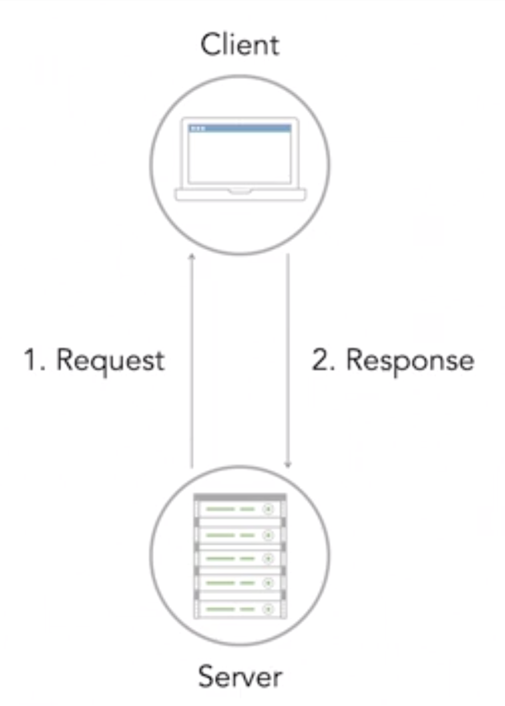

# What is PostgreSQL?

A commonly used relational database is Postgres.

- PostgreSQL is a relational database management system
- Data is organized in tables with columns and rows
- Postgres is an object-relational database, including advance features like table inheritance and function overloading

Similar to the other relational databases, data is organized into tables with columns and rows, unlike SQLite and MySQL, Postgres is an object relational database. Postgres includes advanced features like table inheritance and function overloading, which can be important to certain applications.

## PostgreSQL Feature

- known for being **highly extensible and standards compliant**
- Capable of handling **multiple tasks at the same time**
- **ACID** compliant
- **Adheres more closely to SQL standards**

Postgres advertises itself as the most advanced, open-source database system, because it was created with the goal of being highly extensible and standards compliant. It's capable of efficiently handling multiple tasks at the same time, ensuring data integrity while being ACID compliant. It also requires very minimum maintenance efforts due to its stability. In addition, Postgres adheres more closely to the SQL standards than MySQL.

## PostgresSQL Extensiblity

- You can define data types, and custom functions, and more.
- you can develop plugins to replace components

Postgres was designed to be extensible. You can define your own data types, add custom functions using other programming languages, and more. With Postgres it's easy to develop plugins to replace any part of the system you don't like. **All of this makes Postgres very scalable, but all of these features can come with some downsides**.

## PostgreSQL Cons

- Advanced features come at the expense of speed.
- For every client connection PostgreSQL forks a new process
- For read-heavy applications, MySQL will be more performant

These advanced features can sometimes come at the expense of speed. For every new client connection, Postgres forks a new process, which requires 10 megabytes of memory and that can add up quickly. Furthermore, if your application is very read-heavy, it might be better to go with MySQL as it will be more performant. However, overall Postgres is still less popular than MySQL. This means there are less third party tools you can use with it and less developers that work with it. But if there's a platform or tool that prefers Postgres by all means use it.

## Interacting with PostgreSQL

- Use a python module that follows the **Python database API**
- Use **SQLAlchemy** or another **ORM**

It might be worth choosing Postgres over another database system. Like the other RDBMSs we've worked with, we can interact with our database in Python using SQLAlchemy, another ORM, or a Python module that follows the Python database API specification. Like MySQL, **Postgres follows a client server model**. So we'll need to install a driver to interact with the database.

## Client-Server Model

Similar to SQLite, it uses a **relational model with tables** to describe relationships between its data. But instead of being contained directly on the file system, your **database lives on a server**. PostgreSQL follows a **client-server relationship**. This means your database lives on a server.
**And any time you want to make changes to your database, you send a request to the server**.

- The request contains your SQL statement or instructions for the modification or selection.

- Once received the server accepts that request, performs the action and

- sends a response back to you the client with the results.

Most of this is abstracting to us as users of the database. All we have to do is **install the correct driver and configure the connection correctly** which we'll do throughout this chapter. Although we only have one client pictured here, your database can have multiple clients or multiple machines that can each access and modify your database on the server.
