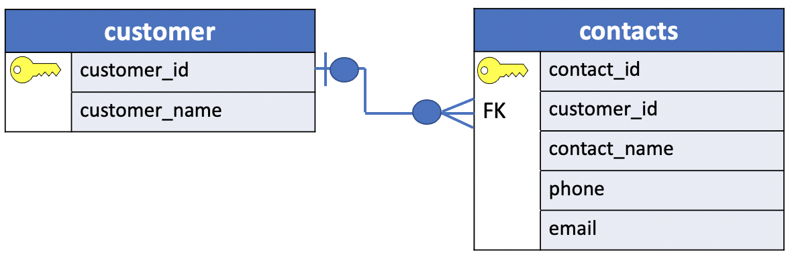
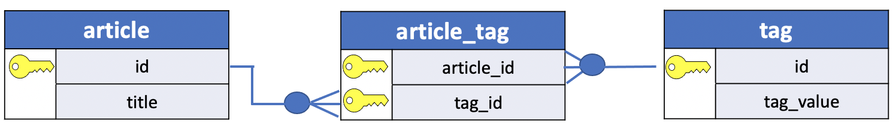

# Foreign Key

In the previous lesson we introduced the notion of **PRIMARY KEY** to identify a row uniquely in a table. We illustrated also how to define the PRIMARY KEY of a table in PostgreSQL.

In this lesson, we'll show how to **define the relations of the tables in a database** using their **primary keys**.

So, the question is:

- `How the columns in one table relate to the columns in another table?`

When key values from one table are stored in a column in another table, that column is said to contain a **foreign key**.

Therefore, a **foreign key** is a **column** or a **group of columns** in a `table` that **reference** the **primary key** of `another table`.

The `table` that **contains** the **foreign key** is called the referencing table or **child table**.

And the `table` **referenced** by the **foreign key** is called the referenced table or **parent table**.

A table can have multiple foreign keys depending on its relationships with other tables.

These `foreign keys` are **used to link related tables together**.

## What is a Foreign key constraint?

In PostgreSQL, you define a foreign key using the **foreign key constraint**.

The **foreign key constraint helps maintain the** `referential integrity of data` **between the** `child` **and** `parent` **tables**.

A **foreign key constraint** indicates that

| **child** |    | **parent**|
|:---------:|:--:|:---------:|
|**The values in a column** or a **group of columns** in the `child table`| **=**|**The values in a column** or a **group of columns** of the `parent table`|

- **values in a column** or a **group of columns** in the `child table`

**EQUAL THE VALUES**

- **in a column** or a **group of columns** of the `parent table`.

As a result, the relationship between two tables involves two `actors`, a **parent** table and a **child** table. The relationship can be enforced by defining the right foreign key constraint on the columns. Therefore, once we link two tables with a foreign key constraint **it's not possible to include another foreign key constraint in the parent table**.

### Foreign Key Relationships

A `foreign key` relationship could be:

- **one-to-one**: a record in one table is linked to one and only one record in another table.

- **one-to-many**: a record in one table is linked to multiple records in another table.

It's also possible to define a **many-to-many** relationship. We'll discuss this case in the next section, so stay tune!

## PostgreSQL foreign key constraint syntax

The following illustrates a **foreign key constraint** syntax for the `child` table:

```console
[CONSTRAINT fk_name]
   FOREIGN KEY(fk_columns)
   REFERENCES parent_table(parent_key_columns)
   [ON DELETE delete_action]
   [ON UPDATE update_action]
```
In this syntax:

1. `[CONSTRAINT fk_name]`: First, specify the **name** for the **foreign key constraint** after the CONSTRAINT keyword. The `CONSTRAINT` **clause is optional**. If you omit it, PostgreSQL will assign an auto-generated name.

2. `FOREIGN KEY(fk_columns)`: Second, **specify one or more foreign key columns** in parentheses after the FOREIGN KEY keywords.

3. `REFERENCES parent_table(parent_key_columns)`: Third, specify the **parent table** and **parent key columns referenced by the foreign key columns** in the REFERENCES clause.

4. `[ON DELETE delete action]`, `[ON UPDATE update action]`: Finally, specify the delete and update actions in the ON DELETE and ON UPDATE clauses.

The delete and update actions determine the behaviors when the primary key in the parent table is deleted and updated. Since the primary key is rarely updated, the `ON UPDATE` action is not often used in practice. We’ll focus on the `ON DELETE` action.

PostgreSQL supports the following actions:

- SET NULL
- SET DEFAULT
- RESTRICT
- NO ACTION
- CASCADE

**Note**
> A primary key and foreign key constraints are not required to join the tables in a relation database. You can construct a query joining two tables on any column you wish as long as the datatypes either match or are converted to match. No relationship needs to explicitly exist. However, these constraints are important to maintain the self and referential integrity of data in a database when inserting and deleting rows or updating row's values.

## PostgreSQL foreign key constraint examples



The "**crow's foot**" that connects the tables together shows us how the columns in one table relate to the columns in another table.


The table above illustrates the meaning of the symbols in a ERD.

In this example, the `customers` table is the **parent table** and the `contacts` table is the **child table**.

- Each customer has `zero or many` contacts. (**one-to-many**)
- Each contact belongs to `zero or one` customer. (**one-to-one**)

The `customer_id` column in the **contacts table** is the **foreign key column** that references the **primary key column** with the same name in the customers table.

The following statements create the `customers` and `contacts` tables:

```console
DROP TABLE IF EXISTS contacts;
DROP TABLE IF EXISTS customers;

CREATE TABLE customers(
   customer_id INT GENERATED ALWAYS AS IDENTITY,
   customer_name VARCHAR(255) NOT NULL,
   PRIMARY KEY(customer_id)
);

CREATE TABLE contacts(
   contact_id INT GENERATED ALWAYS AS IDENTITY,
   customer_id INT,
   contact_name VARCHAR(255) NOT NULL,
   phone VARCHAR(15),
   email VARCHAR(100),
   PRIMARY KEY(contact_id),
   CONSTRAINT fk_customer
      FOREIGN KEY(customer_id)
	    REFERENCES customers(customer_id)
);
```

For the `DROP TABLE IF EXIST` and `GENERATED ALWAYS AS IDENTITY`  statements please refer to these tutorials: [DROP TABLE](https://www.postgresqltutorial.com/postgresql-tutorial/postgresql-drop-table/) and [GENERATED ALWAYS AS IDENTITY](https://www.postgresqltutorial.com/postgresql-tutorial/postgresql-identity-column/).

The following foreign key constraint `fk_customer` in the **contacts table** defines the `customer_id` as the **foreign key**:

```console
CONSTRAINT fk_customer
   FOREIGN KEY (customer_id)
   REFERENCES customers (customer_id)
```
Because the foreign key constraint does not have the `ON DELETE` and `ON UPDATE` action, they default to `NO ACTION`.

If you want to include the foreign key constraint without giving a name to the constraint is better to follow this less verbose syntax:

```console
CREATE TABLE contacts(
   contact_id INT GENERATED ALWAYS AS IDENTITY,
   customer_id INT REFERENCES customers (customer_id),
   contact_name VARCHAR(255) NOT NULL,
   phone VARCHAR(15),
   email VARCHAR(100),
   PRIMARY KEY(contact_id)
);
```
I prefer to write all the table constraints at the end for readability and the column constraints right to the right of the column name.

## NO ACTION

The following inserts data into the `customers` and `contacts` tables:

```console
INSERT INTO customers(customer_name)
VALUES('BlueBird Inc'),
      ('Dolphin LLC');	   

INSERT INTO contacts(customer_id, contact_name, phone, email)
VALUES(1,'John Doe','(408)-111-1234','john.doe@bluebird.dev'),
      (1,'Jane Doe','(408)-111-1235','jane.doe@bluebird.dev'),
      (2,'David Wright','(408)-222-1234','david.wright@dolphin.dev');
```

The following statement deletes the `customer_id` **1** from the **customers** table:

```console
DELETE FROM customers
      WHERE customer_id = 1;
```
Because of the `ON DELETE NO ACTION`, PostgreSQL issues a **constraint violation** because the referencing rows of the `customer_id` **1** **still exist in the contacts table:**

```console
ERROR:  update or delete on table "customers" violates foreign key constraint "fk_customer" on table "contacts"
DETAIL:  Key (customer_id)=(1) is still referenced from table "contacts".
SQL state: 23503
```

The `RESTRICT` action is similar to the `NO ACTION`. The difference only arises when you define the foreign key constraint as `DEFERRABLE` with an `INITIALLY DEFERRED` or `INITIALLY IMMEDIATE` mode. We’ll discuss more on this in the subsequent tutorial.

## SET NULL

The **SET NULL** `automatically` **sets NULL to the foreign key columns in the referencing rows of the child table when the referenced rows in the parent table are deleted**.

The following statements drop the sample tables and re-create them with the foreign key that uses the `SET NULL` action in the `ON DELETE` clause:

```console
DROP TABLE IF EXISTS contacts;
DROP TABLE IF EXISTS customers;

CREATE TABLE customers(
   customer_id INT GENERATED ALWAYS AS IDENTITY,
   customer_name VARCHAR(255) NOT NULL,
   PRIMARY KEY(customer_id)
);

CREATE TABLE contacts(
   contact_id INT GENERATED ALWAYS AS IDENTITY,
   customer_id INT,
   contact_name VARCHAR(255) NOT NULL,
   phone VARCHAR(15),
   email VARCHAR(100),
   PRIMARY KEY(contact_id),
   CONSTRAINT fk_customer
      FOREIGN KEY(customer_id)
	  REFERENCES customers(customer_id)
	  ON DELETE SET NULL
);

INSERT INTO customers(customer_name)
VALUES('BlueBird Inc'),
      ('Dolphin LLC');	   

INSERT INTO contacts(customer_id, contact_name, phone, email)
VALUES(1,'John Doe','(408)-111-1234','john.doe@bluebird.dev'),
      (1,'Jane Doe','(408)-111-1235','jane.doe@bluebird.dev'),
      (2,'David Wright','(408)-222-1234','david.wright@dolphin.dev');
```

The following statements insert data into the `customers` and `contacts` tables:

```console
INSERT INTO customers(customer_name)
VALUES('BlueBird Inc'),
      ('Dolphin LLC');	   

INSERT INTO contacts(customer_id, contact_name, phone, email)
VALUES(1,'John Doe','(408)-111-1234','john.doe@bluebird.dev'),
      (1,'Jane Doe','(408)-111-1235','jane.doe@bluebird.dev'),
      (2,'David Wright','(408)-222-1234','david.wright@dolphin.dev');
```

To see how the `SET NULL` works, let’s delete the customer with id `1` from the customers table:

```console
DELETE FROM customers
      WHERE customer_id = 1;
```

Because of the `ON DELETE SET NULL` action, the referencing rows in the contacts table set to NULL. The following statement displays the data in the contacts table.

```console
SELECT *
  FROM contacts;
```


As can be seen clearly from the output, the rows that have the `customer_id` **1** now have the `customer_id` **sets to** `NULL`.

## CASCADE

The **ON DELETE CASCADE** `automatically` **deletes all the referencing rows in the child table when the referenced rows in the parent table are deleted**. In practice, the ON DELETE CASCADE is the most commonly used option.

The following statements recreate the sample tables. However, the delete action of the `fk_customer` changes to **CASCADE**:

```console
DROP TABLE IF EXISTS contacts;
DROP TABLE IF EXISTS customers;

CREATE TABLE customers(
   customer_id INT GENERATED ALWAYS AS IDENTITY,
   customer_name VARCHAR(255) NOT NULL,
   PRIMARY KEY(customer_id)
);

CREATE TABLE contacts(
   contact_id INT GENERATED ALWAYS AS IDENTITY,
   customer_id INT,
   contact_name VARCHAR(255) NOT NULL,
   phone VARCHAR(15),
   email VARCHAR(100),
   PRIMARY KEY(contact_id),
   CONSTRAINT fk_customer
      FOREIGN KEY(customer_id)
	  REFERENCES customers(customer_id)
	  ON DELETE CASCADE
);

INSERT INTO customers(customer_name)
VALUES('BlueBird Inc'),
      ('Dolphin LLC');	   

INSERT INTO contacts(customer_id, contact_name, phone, email)
VALUES(1,'John Doe','(408)-111-1234','john.doe@bluebird.dev'),
      (1,'Jane Doe','(408)-111-1235','jane.doe@bluebird.dev'),
      (2,'David Wright','(408)-222-1234','david.wright@dolphin.dev');
```

The following statement deletes the `customer_id` **1**:

```console
DELETE FROM customers
      WHERE customer_id = 1;
```

Because of the **ON DELETE CASCADE** action, **all the referencing rows in the contacts table are automatically deleted**:

```console
SELECT *
  FROM contacts;
```


## SET DEFAULT

The **ON DELETE SET DEFAULT** sets the default value to the foreign key column of the referencing rows in the child table when the referenced rows from the parent table are deleted.

## Add a foreign key constraint to an existing table

To add a foreign key constraint to the existing table, you use the following form of the [ALTER TABLE](https://www.postgresqltutorial.com/postgresql-tutorial/postgresql-alter-table/) statement:

```console
ALTER TABLE child_table
ADD CONSTRAINT constraint_name
FOREIGN KEY (fk_columns)
REFERENCES parent_table (parent_key_columns);
```

When you add a foreign key constraint with **ON DELETE CASCADE option** to an existing table, you need to follow these steps:

First, drop existing foreign key constraints:

```console
ALTER TABLE child_table
DROP CONSTRAINT constraint_fkey;
```

First, add a new foreign key constraint with  **ON DELETE CASCADE** action:

```console
ALTER TABLE child_table
ADD CONSTRAINT constraint_fk
FOREIGN KEY (fk_columns)
REFERENCES parent_table (parent_key_columns)
ON DELETE CASCADE;
```

## Many-to-Many Relationship

There is one more relationship in a relation database: `Many-to-Many`.

- **many-to-many**: a record in **both tables** is linked to multiple records in another table.

The foreign key constraint allows only to define a relationship with a parent and child table. However, in a  many-to-many relationship both tables act as parent and child. So, How do we solve this problem?

In order to overcome this issue, a **many-to-many** relationship is typically created using a **join table**.

Consider the following two tables `article` and `tags`:

```console
CREATE TABLE article (
  id SERIAL PRIMARY KEY,
  title TEXT
);

CREATE TABLE tag (
  id SERIAL PRIMARY KEY,
  tag_value TEXT
);
```

In practical use cases, each article can have multiple tags and each tag can be mapped to multiple articles.



Now, let's create a bridge table called `article_tag`

```console
CREATE TABLE article_tag (
  article_id INT,
  tag_id INT,
  PRIMARY KEY(article_id, tag_id),
  CONSTRAINT fk_article
     FOREIGN KEY (article_id)
     REFERENCES article (id),
  CONSTRAINT fk_tag  
     FOREIGN KEY (tag_id)
     REFERENCES tag (id)
);
```

We have applied two foreign key constraints, one for `article_id` and one for `tag_id`. The table `article_tag` is **the bridge** table involved in the **many-to-many** relationship.

## Summary

In this tutorial, you have learned about PostgreSQL foreign keys and how to use the foreign key constraint to create foreign keys for a table. In the next lesson, we are going to add the foreign key constraint to The Parch & Posey database.

- PostgreSql documentation [foreign key](https://www.postgresql.org/docs/current/ddl-constraints.html)
