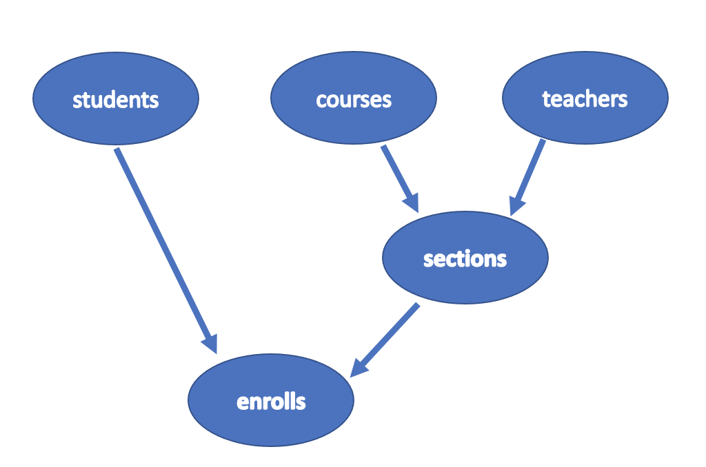
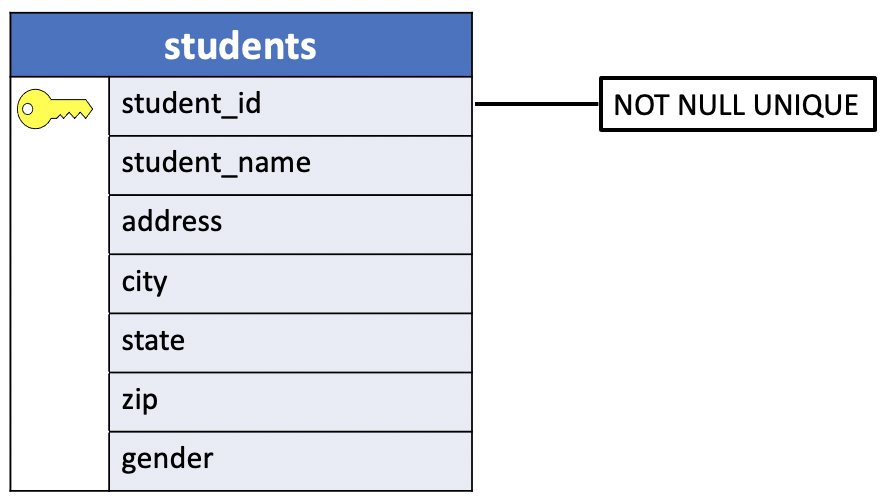

# Create UniY's Tables

Relational databases consist solely of tables. To retrieve the information stored in those tables, we can use the `SELECT` statement. But tables must be created before any information can be retrieved from them. Also, it might sometimes be necessary to destroy existing tables in the database. To carry out these essential actions, we must introduce two new SQL statements: **CREATE** and **DROP**.

Before the creation of any table in the database **you must comprehend the ERD of your database in order to decide which table should be created first**.

In the previous lessons we stressed the importance of the **primary** and **foreign** **keys constranits** to maintain **the self and referential integrity of data in a database when inserting and deleting rows or updating row's values**. We also added that a primary key and foreign key constraints are not required to join the tables in a relation database. **You can construct a query joining two tables on any column you wish as long as the datatypes either match or are converted to match**. No relationship needs to explicitly exist.

In the last scenario you do not probably need to follow a specific order in the creation of the tables in the database. However, it's a bad practice to leave the primary and foreign keys constraints out, especially when you populate the tables.

Therefore, it's important to analyse the ERD carefully before any action.

## UniY ERD


The picture of the database shown in the figure above illustrates the relationships between the tables of uniY's database.

The diagram in the picture is not an ERD but it helps to understand the table's relationship hierarchy and clarify the foreign key constraint better.

A relationship, like a foreign key constraint, involves **two entities**:
- A **parent** table and
- A **child** table

The **child** table is the **entity** in the relationship with the **foreign key constraint**.

So the first question that comes in mind is:

- How many child tables the uniY database has?

The answer lies in the foreign key definition.

A **foreign key** is a **column** or a **group of columns** in a `table` that **reference** the **primary key** of `another table`.

Thus, in a **foreign key constraint**:

| **child** |    | **parent**|
|:---------:|:--:|:---------:|
|**The values in a column** or a **group of columns** in the `child table`| **=**|**The values in a column** or a **group of columns** of the `parent table`|

For instance, the `student_id` **foreign key column** in the **enrolls** table references the **primary key column** `student_id` in the **students** table. In this example, it's clear that the values in the `student_id` column of the **enrolls** table are drawn from the column of the same name in the **students** table. Consequently, the **students** table is the `parent`, while the **enrolls** table is the `child`.



The picture above shows that the **child tables** are:

- **sections** : is the child table of two tables, `courses` and `teachers`.
- **enrolls**: is the child table of three tables, `students`,`courses` and `sections`.

On the other hand, the remaining tables are **only** `parent` tables.

- **students**
- **courses**
- **teachers**

Therefore, we can create these tables in an arbitrary order then we create the **sections** table and finally the **enrolls** table. The **enrolls** table is the `child` of the **sections** table.

In the following section we'll execute the SQL statements directly from the `psql` prompt to illustrate what's happening behind the scene. At the end we'll include these statements in `uniy.sql`, including additional statements to cancel all the tables and records in the database.

## Creating a table

Creating a table with SQL is easy. The general form of a SQL statement that creates a table is:

```console
CREATE TABLE <table> (
  <column descriptions>
);
```

The first two words of the statement, **CREATE TABLE**, tell SQL **what we are doing**. Next comes `<table>`, the name we want to give this newly created table(as always, expression wrapped in < and > are replaced by actual words in SQL statements). Finally comes the `<column descriptions>`, a parenthesized list giving the name and type of each column we want to be in the table.


In **PostgreSql** the basic syntax of the **CREATE** statement is:

```console
CREATE TABLE [IF NOT EXISTS] table_name (
   column1 datatype(length) column_contraint,
   column2 datatype(length) column_contraint,
   column3 datatype(length) column_contraint,
   table_constraints
);
```

In this syntax:

1. First, `specify the name` of the table after the **CREATE TABLE** keywords.
2. Second, creating a table that already exists will result in a error. The `IF NOT EXISTS` option allows you to create the new table only if it does not exist. When you use the `IF NOT EXISTS` option and the table already exists, PostgreSQL issues a notice instead of the error and skips creating the new table.
3. Third, specify a **comma-separated list of table columns**.
  - Each column consists of the column name,
  - the kind of data that column stores,
  - the length of data, and
  - the **column constraint**: The column constraints specify rules that data stored in the column must follow. For example, the `not-null` constraint enforces the values in the column cannot be `NULL`. The column constraints include not null, unique, primary key, check, foreign key constraints.
4. Finally, specify the **table constraints** including `primary key`, `foreign key`, and `check constraints`.

Note that some table constraints can be defined as column constraints like `primary key`, `foreign key`, `check`, `unique` constraints.

### Constraints

PostgreSQL includes the following **column constraints**:

- [NOT NULL](https://www.postgresqltutorial.com/postgresql-tutorial/postgresql-not-null-constraint/) – ensures that values in a column cannot be NULL.
- [UNIQUE](https://www.postgresqltutorial.com/postgresql-tutorial/postgresql-unique-constraint/) – ensures the values in a column unique across the rows within the same table.
- [PRIMARY KEY](https://www.postgresqltutorial.com/postgresql-tutorial/postgresql-primary-key/) – a primary key column uniquely identify rows in a table. A table can have one and only one primary key. The primary key constraint allows you to define the primary key of a table.
- [CHECK](https://www.postgresqltutorial.com/postgresql-tutorial/postgresql-check-constraint/) – a CHECK constraint ensures the data must satisfy a boolean expression.
- [FOREIGN KEY](https://www.postgresqltutorial.com/postgresql-tutorial/postgresql-foreign-key/) – ensures values in a column or a group of columns from a table exists in a column or group of columns in another table. Unlike the primary key, a table can have many foreign keys.

Table constraints are similar to column constraints except that they are applied to more than one column.

## uniY CREATE TABLE examples

Let's create the first tables of the uniY database.

### students table

```console
CREATE TABLE students (
  student_id SMALLINT PIMARY KEY,
  student_name CHAR (18),
  address CHAR (20),
  city CHAR (10),
  state CHAR (2),
  zip CHAR (5),
  gender CHAR (1)
);
```

The table constraint `PRIMARY KEY` is equivalent to:



```console
CREATE TABLE students (
  student_id SMALLINT NOT NULL,
  student_name CHAR (18),
  address CHAR (20),
  city CHAR (10),
  state CHAR (2),
  zip CHAR (5),
  gender CHAR (1),
  UNIQUE(student_id)
);
```

We'll be using the `PRIMARY KEY` table constraint in the creation of the table.

This statement creates a table called **students** with seven columns. The first column of this table contains values of type `SMALLINT` while all the others contain character strings of various lengths. After this statement is executed, the **students** table exists but it contains no records.

If the **students** table is created with this statement, SQL will not allow the same value to appear twice in the table's `student_id` column. Any attempt to violate this constraint will result in an error message from SQL. Recall that the values to be used as keys in a table must be unique. Also, it makes no sense to allow NULL values within keys. Therefore, the value NULL should never appear in that column.

The number in parentheses after the word `CHAR` indicate the maximum length of a character string value that can be stored in that column. Given the previous definition, the **students** table cannot store student names longer than 18 characters because the `student_name` column is defined as `CHAR (18)`.

As usual, where line breaks occur makes no difference, except possibly to a human reader. This entire `CREATE` statement could have appeared on one line, and the effect would have been the same. Also, some of the spaces in the previous example are added only for readability and have no effect on the execution of the statement. While the space between `student_name` and `CHAR` is required (how else could SQL tell where the column name left off and the type began? :smile:), the space between `CHAR` and `(18)` is not. While including that space might make the statement more readable, the result would have been identical had it read `CHAR(18)`.

```console
postgres=> \c uniy
You are now connected to database "uniy" as user "usertest".
uniy=>
```

So let's now execute the sql statement in the `psql` prompt.

```console
uniy=> CREATE TABLE students (
uniy(>   student_id SMALLINT PRIMARY KEY,
uniy(>   student_name CHAR (18),
uniy(>   address CHAR (20),
uniy(>   city CHAR (10),
uniy(>   state CHAR (2),
uniy(>   zip CHAR (5),
uniy(>   gender CHAR (1)
uniy(> );
CREATE TABLE
```
Unlike `SELECT`, execution of a `CREATE` does not return results to the user. Because `CREATE` does not choose values from existing tables but instead creates an entirely new table, there are no results to return. Most implementations of SQL will respond, however, with an indication that the specified table was cerated. In the case of PostgrSql the message is `CREATE TABLE`.


Now let's list the tables in our database.

```console
uniy=> \dt
          List of relations
 Schema |   Name   | Type  |  Owner
--------+----------+-------+----------
 public | students | table | usertest
(1 row)
```

Let's execute the describe table command:

```console
uniy=> \d students
                    Table "public.students"
    Column    |     Type      | Collation | Nullable | Default
--------------+---------------+-----------+----------+---------
 student_id   | smallint      |           | not null |
 student_name | character(18) |           |          |
 address      | character(20) |           |          |
 city         | character(10) |           |          |
 state        | character(2)  |           |          |
 zip          | character(5)  |           |          |
 gender       | character(1)  |           |          |
Indexes:
    "students_pkey" PRIMARY KEY, btree (student_id)
```

Let's count the number of records:

```console
uniy=> SELECT COUNT(*)
uniy->   FROM students;
 count
-------
     0
(1 row)
```

### courses table

```console
CREATE TABLE courses (
  course_id SMALLINT PRIMARY KEY,
  course_name CHAR (20),
  department CHAR (16),
  num_credits SMALLINT
);
```

Let's execute the statement:

```console
uniy=> CREATE TABLE courses (
uniy(>   course_id SMALLINT PRIMARY KEY,
uniy(>   course_name CHAR (20),
uniy(>   department CHAR (16),
uniy(>   num_credits SMALLINT
uniy(> );
CREATE TABLE
uniy=> \d courses
                    Table "public.courses"
   Column    |     Type      | Collation | Nullable | Default
-------------+---------------+-----------+----------+---------
 course_id   | smallint      |           | not null |
 course_name | character(20) |           |          |
 department  | character(16) |           |          |
 num_credits | smallint      |           |          |
Indexes:
    "courses_pkey" PRIMARY KEY, btree (course_id)
```

### teachers table

```console
CREATE TABLE teachers (
  teacher_id SMALLINT PRIMARY KEY,
  teacher_name CHAR (18),
  phone CHAR (10),
  salary NUMERIC (10,2)
);
```

Let's execute the statement:

```console
uniy=> CREATE TABLE teachers (
uniy(>   teacher_id SMALLINT PRIMARY KEY,
uniy(>   teacher_name CHAR (18),
uniy(>   phone CHAR (10),
uniy(>   salary NUMERIC (10,2)
uniy(> );
CREATE TABLE
uniy=> \d teachers
                    Table "public.teachers"
    Column    |     Type      | Collation | Nullable | Default
--------------+---------------+-----------+----------+---------
 teacher_id   | smallint      |           | not null |
 teacher_name | character(18) |           |          |
 phone        | character(10) |           |          |
 salary       | numeric(10,2) |           |          |
Indexes:
    "teachers_pkey" PRIMARY KEY, btree (teacher_id)

uniy=>
```
