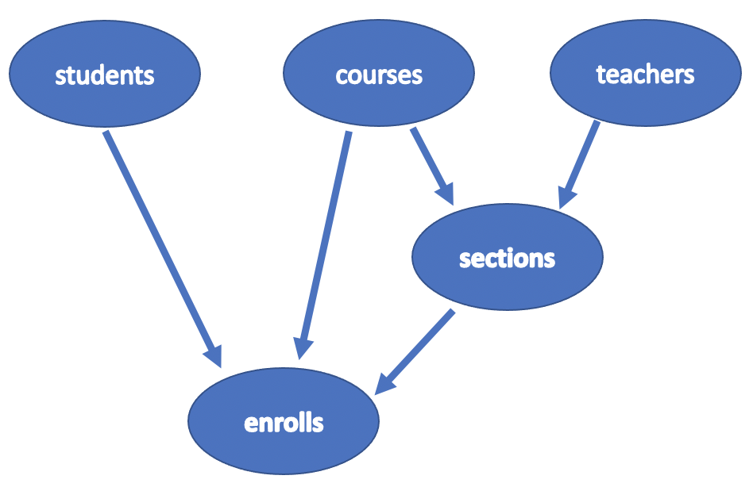
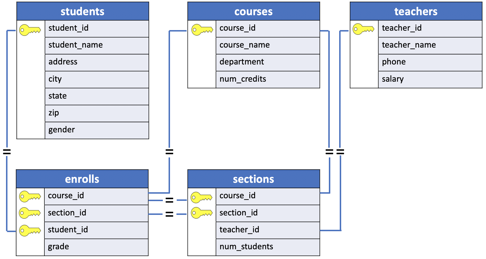
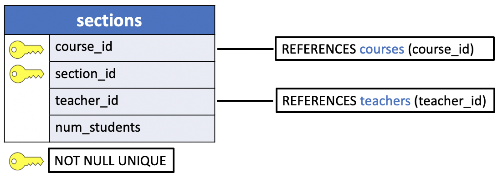
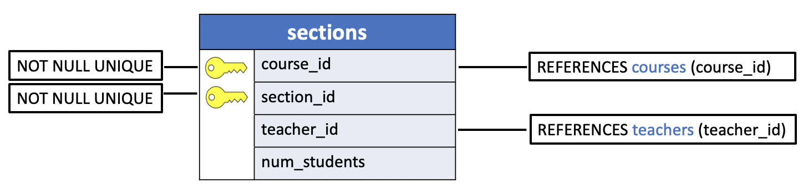
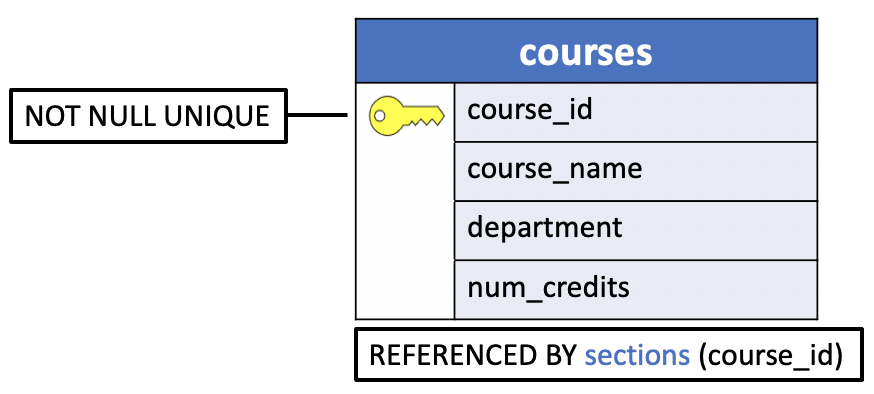

# Create uniY's table with Foreign keys

In the previous lesson, we created the first three tables of the uniY database, (i.e. **students, courses** and **teachers**).

```console
uniy=> \dt
          List of relations
 Schema |   Name   | Type  |  Owner
--------+----------+-------+----------
 public | courses  | table | usertest
 public | students | table | usertest
 public | teachers | table | usertest
(3 rows)

uniy=>
```

Those tables do not have any foreign key constraints and therefore their creation doesn't depend on other tables in the database.



The picture above shows the relationship tables' hierarchy. In this hierarchy the  **sections** table comes `first` the **enrolls** table. The **sections** table is the `child` of the **courses** and **teachers** tables. Therefore, the creation of the **sections** table **must includes two foreign key constraints**.

## sections



Let's define the `two` **foreign key constraints**:

1. In the `sections` **TABLE** the **FOREIGN KEY**, `course_id` **REFERENCES** a record in the `courses` parent table using the primary key (`course_id`). Let's name the foreign key **CONSTRAINT** `sections_fkey_course`.

```console
CONSTRAINT sections_fkey_course
   FOREIGN KEY (course_id)
   REFERENCES courses (course_id)
   ON DELETE CASCADE
```

The foreign key constraint includes the `ON DELETE CASCADE` clause since the `course_id` column is also one of the primary key columns in the `sections` table.

2. In the `sections` **TABLE** the **FOREIGN KEY**, `teacher_id` **REFERENCES** a record in the `teachers` parent table using the primary key (`teacher_id`). Let's name the foreign key **CONSTRAINT** `sections_fkey_teacher`.

```console
CONSTRAINT sections_fkey_teacher
   FOREIGN KEY (teacher_id)
   REFERENCES teachers (teacher_id)
   ON DELETE SET NULL
```

The foreign key constraint includes the `ON DELETE SET NULL` clause since the `teacher_id` column is not one of the primary key columns in the `sections` table and we do not want to delete the records in this table.

Lastly, we include these table constraints in the `CREATE TABLE` statement:

```console
CREATE TABLE sections (
  course_id SMALLINT,
  section_id SMALLINT,
  teacher_id SMALLINT,
  num_students SMALLINT,
  PRIMARY KEY (course_id, section_id),
  CONSTRAINT sections_fkey_course
     FOREIGN KEY (course_id)
     REFERENCES courses (course_id)
     ON DELETE CASCADE,
  CONSTRAINT sections_fkey_teacher
     FOREIGN KEY (teacher_id)
     REFERENCES teachers (teacher_id)
     ON DELETE SET NULL
);
```

A less verbose `CREATE TABLE` statement is given below:

```console
CREATE TABLE sections (
  course_id SMALLINT REFERENCES courses (course_id) ON DELETE CASCADE,
  section_id SMALLINT,
  teacher_id SMALLINT REFERENCES teachers (teacher_id) ON DELETE SET NULL,
  num_students SMALLINT,
  PRIMARY KEY (course_id, section_id)
);
```

A simple diagram for the `CREATE TABLE` statement is illustrated below:



A more explicit diagram for the **sections** `child` table is illustrated below:



A diagram for the **courses** `parent` table:



Let's first check the attributes of the existing **courses** and **teachers** tables in the database.

**courses**
```console
uniy=> \d courses
                    Table "public.courses"
   Column    |     Type      | Collation | Nullable | Default
-------------+---------------+-----------+----------+---------
 course_id   | smallint      |           | not null |
 course_name | character(20) |           |          |
 department  | character(16) |           |          |
 num_credits | smallint      |           |          |
Indexes:
    "courses_pkey" PRIMARY KEY, btree (course_id)
```

**teachers**
```console
uniy=> \d teachers
                    Table "public.teachers"
    Column    |     Type      | Collation | Nullable | Default
--------------+---------------+-----------+----------+---------
 teacher_id   | smallint      |           | not null |
 teacher_name | character(18) |           |          |
 phone        | character(10) |           |          |
 salary       | numeric(10,2) |           |          |
Indexes:
    "teachers_pkey" PRIMARY KEY, btree (teacher_id)
```

Let's execute the `CREATE TABLE` statement in the `psql` prompt.

```console
uniy=> CREATE TABLE sections (
uniy(>   course_id SMALLINT,
uniy(>   section_id SMALLINT,
uniy(>   teacher_id SMALLINT,
uniy(>   num_students SMALLINT,
uniy(>   PRIMARY KEY (course_id, section_id),
uniy(>   CONSTRAINT sections_fkey_course
uniy(>      FOREIGN KEY (course_id)
uniy(>      REFERENCES courses (course_id)
uniy(>      ON DELETE CASCADE,
uniy(>   CONSTRAINT sections_fkey_teacher
uniy(>      FOREIGN KEY (teacher_id)
uniy(>      REFERENCES teachers (teacher_id)
uniy(>      ON DELETE SET NULL
uniy(> );
CREATE TABLE
```

Let's list the tables in the uniy database.

```console
uniy=> \dt
          List of relations
 Schema |   Name   | Type  |  Owner
--------+----------+-------+----------
 public | courses  | table | usertest
 public | sections | table | usertest
 public | students | table | usertest
 public | teachers | table | usertest
(4 rows)
```

The **sections** table has been created. Let's execute the describe command to show the constraints of the child table and the dependencies on the parent tables.

**sections** `child` table.

```console
uniy=> \d sections
                 Table "public.sections"
    Column    |   Type   | Collation | Nullable | Default
--------------+----------+-----------+----------+---------
 course_id    | smallint |           | not null |
 section_id   | smallint |           | not null |
 teacher_id   | smallint |           |          |
 num_students | smallint |           |          |
Indexes:
    "sections_pkey" PRIMARY KEY, btree (course_id, section_id)
Foreign-key constraints:
    "sections_fkey_course" FOREIGN KEY (course_id) REFERENCES courses(course_id) ON DELETE CASCADE
    "sections_fkey_teacher" FOREIGN KEY (teacher_id) REFERENCES teachers(teacher_id) ON DELETE SET NULL
```

**courses** `parent` table.

```console
uniy=> \d courses
                    Table "public.courses"
   Column    |     Type      | Collation | Nullable | Default
-------------+---------------+-----------+----------+---------
 course_id   | smallint      |           | not null |
 course_name | character(20) |           |          |
 department  | character(16) |           |          |
 num_credits | smallint      |           |          |
Indexes:
    "courses_pkey" PRIMARY KEY, btree (course_id)
Referenced by:
    TABLE "sections" CONSTRAINT "sections_fkey_course" FOREIGN KEY (course_id) REFERENCES courses(course_id) ON DELETE CASCADE
```

**teachers** `parent` table.

```console
uniy=> \d teachers
                    Table "public.teachers"
    Column    |     Type      | Collation | Nullable | Default
--------------+---------------+-----------+----------+---------
 teacher_id   | smallint      |           | not null |
 teacher_name | character(18) |           |          |
 phone        | character(10) |           |          |
 salary       | numeric(10,2) |           |          |
Indexes:
    "teachers_pkey" PRIMARY KEY, btree (teacher_id)
Referenced by:
    TABLE "sections" CONSTRAINT "sections_fkey_teacher" FOREIGN KEY (teacher_id) REFERENCES teachers(teacher_id) ON DELETE SET NULL
```

## enrolls

The last table in the uniY database is the **enrolls** table. The **enrolls** table is the `child` of `three` tables: **students**,**courses** and **sections**. Therefore, the creation of the **enrolls** table **must include** `3` **foreign key constraints**.


Let's define the `three` **foreign key constraints**:

1. In the `enrolls` **TABLE** the **FOREIGN KEY**, `student_id` **REFERENCES** a record in the `students` parent table using the primary key (`student_id`). Let's name the foreign key **CONSTRAINT** `enrolls_fkey_student`:

```console
CONSTRAINT enrolls_fkey_student
   FOREIGN KEY (student_id)
   REFERENCES students (student_id)
   ON DELETE CASCADE
```

2. In the `enrolls` **TABLE** the **FOREIGN KEY**, `course_id` **REFERENCES** a record in the `courses` parent table using the primary key (`course_id`). Let's name the foreign key **CONSTRAINT** `enrolls_fkey_course`:

```console
CONSTRAINT enrolls_fkey_course
   FOREIGN KEY (course_id)
   REFERENCES courses (course_id)
   ON DELETE CASCADE
```

3. In the `enrolls` **TABLE** the **FOREIGN KEY**, (`course_id`, `section_id`) **REFERENCES** a record in the `sections` parent table using the primary key (`course_id, section_id`). Let's name the foreign key **CONSTRAINT** `enrolls_fkey_section`:

```console
CONSTRAINT enrolls_fkey_section
   FOREIGN KEY (course_id, section_id)
   REFERENCES sections (course_id, section_id)
   ON DELETE CASCADE
```

Lastly, we include these table constraints in the `CREATE TABLE` statement:

```console
CREATE TABLE enrolls (
  course_id SMALLINT,
  section_id SMALLINT,
  student_id SMALLINT,
  grade SMALLINT,
  PRIMARY KEY (course_id, section_id, student_id),
  CONSTRAINT enrolls_fkey_student
     FOREIGN KEY (student_id)
     REFERENCES students (student_id)
     ON DELETE CASCADE,
  CONSTRAINT enrolls_fkey_course
     FOREIGN KEY (course_id)
     REFERENCES courses (course_id)
     ON DELETE CASCADE,
  CONSTRAINT enrolls_fkey_section
     FOREIGN KEY (course_id, section_id)
     REFERENCES sections (course_id, section_id)
     ON DELETE CASCADE
);
```
Let's execute the `CREATE TABLE` statement in the `psql` prompt.

```console
uniy=> CREATE TABLE enrolls (
uniy(>   course_id SMALLINT,
uniy(>   section_id SMALLINT,
uniy(>   student_id SMALLINT,
uniy(>   grade SMALLINT,
uniy(>   PRIMARY KEY (course_id, section_id, student_id),
uniy(>   CONSTRAINT enrolls_fkey_student
uniy(>      FOREIGN KEY (student_id)
uniy(>      REFERENCES students (student_id)
uniy(>      ON DELETE CASCADE,
uniy(>   CONSTRAINT enrolls_fkey_course
uniy(>      FOREIGN KEY (course_id)
uniy(>      REFERENCES courses (course_id)
uniy(>      ON DELETE CASCADE,
uniy(>   CONSTRAINT enrolls_fkey_section
uniy(>      FOREIGN KEY (course_id, section_id)
uniy(>      REFERENCES sections (course_id, section_id)
uniy(>      ON DELETE CASCADE
uniy(> );
CREATE TABLE
uniy=>
```

Let's list the tables in the uniy database.

```console
uniy=> \dt
          List of relations
 Schema |   Name   | Type  |  Owner
--------+----------+-------+----------
 public | courses  | table | usertest
 public | enrolls  | table | usertest
 public | sections | table | usertest
 public | students | table | usertest
 public | teachers | table | usertest
(5 rows)
```

The **enrolls** table has been created. Let's execute the describe command to show the constraints of the child table and the dependencies on the parent tables.

**enrolls** `child` table.

```console
uniy=> \d enrolls
                 Table "public.enrolls"
   Column   |   Type   | Collation | Nullable | Default
------------+----------+-----------+----------+---------
 course_id  | smallint |           | not null |
 section_id | smallint |           | not null |
 student_id | smallint |           | not null |
 grade      | smallint |           |          |
Indexes:
    "enrolls_pkey" PRIMARY KEY, btree (course_id, section_id, student_id)
Foreign-key constraints:
    "enrolls_fkey_course" FOREIGN KEY (course_id) REFERENCES courses(course_id) ON DELETE CASCADE
    "enrolls_fkey_section" FOREIGN KEY (course_id, section_id) REFERENCES sections(course_id, section_id) ON DELETE CASCADE
    "enrolls_fkey_student" FOREIGN KEY (student_id) REFERENCES students(student_id) ON DELETE CASCADE
```

**courses** `parent` table.

```console
uniy=> \d courses
                    Table "public.courses"
   Column    |     Type      | Collation | Nullable | Default
-------------+---------------+-----------+----------+---------
 course_id   | smallint      |           | not null |
 course_name | character(20) |           |          |
 department  | character(16) |           |          |
 num_credits | smallint      |           |          |
Indexes:
    "courses_pkey" PRIMARY KEY, btree (course_id)
Referenced by:
    TABLE "enrolls" CONSTRAINT "enrolls_fkey_course" FOREIGN KEY (course_id) REFERENCES courses(course_id) ON DELETE CASCADE
    TABLE "sections" CONSTRAINT "sections_fkey_course" FOREIGN KEY (course_id) REFERENCES courses(course_id) ON DELETE CASCADE
```

**students** `parent` table.

```console
uniy=> \d students
                    Table "public.students"
    Column    |     Type      | Collation | Nullable | Default
--------------+---------------+-----------+----------+---------
 student_id   | smallint      |           | not null |
 student_name | character(18) |           |          |
 address      | character(20) |           |          |
 city         | character(10) |           |          |
 state        | character(2)  |           |          |
 zip          | character(5)  |           |          |
 gender       | character(1)  |           |          |
Indexes:
    "students_pkey" PRIMARY KEY, btree (student_id)
Referenced by:
    TABLE "enrolls" CONSTRAINT "enrolls_fkey_student" FOREIGN KEY (student_id) REFERENCES students(student_id) ON DELETE CASCADE
```

**sections** `parent` table.

```console
uniy=> \d sections
                 Table "public.sections"
    Column    |   Type   | Collation | Nullable | Default
--------------+----------+-----------+----------+---------
 course_id    | smallint |           | not null |
 section_id   | smallint |           | not null |
 teacher_id   | smallint |           |          |
 num_students | smallint |           |          |
Indexes:
    "sections_pkey" PRIMARY KEY, btree (course_id, section_id)
Foreign-key constraints:
    "sections_fkey_course" FOREIGN KEY (course_id) REFERENCES courses(course_id) ON DELETE CASCADE
    "sections_fkey_teacher" FOREIGN KEY (teacher_id) REFERENCES teachers(teacher_id) ON DELETE SET NULL
Referenced by:
    TABLE "enrolls" CONSTRAINT "enrolls_fkey_section" FOREIGN KEY (course_id, section_id) REFERENCES sections(course_id, section_id) ON DELETE CASCADE
```
