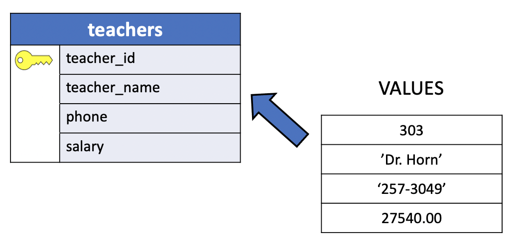

# Adding Records to the UniY Database

As we saw in the previous lesson,SQL's `CREATE` statement allows us to add new tables to our database. `CREATE` alone, however, does not provide any mechanism for **populating our new tables with records**.

And while the `SELECT` statement enables us to access the records stored in a table (see lesson [select](../01_basic_sql/07_select_from.md)), it does not let us **add** `new records`, **delete** `old ones`, or **modify** `existing ones`. To perform these functions, we must make use of still more SQL statements.

## INSERT INTO statement

When a table is created, it contains no data. The first thing to do before a database can be of much use is to insert data. A new table must be filled with values. Because all values in a table are contained in **records**, **adding a new value** `to a table requires` **adding an entire record**.

Data is **inserted one row at a time**.

You can also **insert more than one row in a single command**, but **it is not possible to insert something that is not a complete row**.

Even `if you know only some column values`, **a complete row must be created**.

The general form of an **INSERT** statement is:

```console
INSERT INTO <table> (<column names>)
VALUES (<values>);
```

This statement adds one record to the table specified by `<table>`.

The new record can contain values for all or only some of its fields. Especially when only some of the new record's fields are given values, the name of those field's columns might optionally be specified via `<column names>` following the table's name. Next comes the keyword `VALUES` and the actual `<values>` of the record being added.

### INSERT INTO syntax

The PostgreSQL INSERT statement allows you to insert a new row into a table.

The following illustrates the most basic syntax of the `INSERT` statement:

```console
INSERT INTO table_name(column1, column2, …)
VALUES (value1, value2, …);
```

In this syntax:

1. First, specify the name of the table (`table_name`) that you want to insert data after the **INSERT INTO** keywords and **a list of comma-separated columns** `(colum1, column2, ....)`.

2. Second, supply a **list of comma-separated values** in a parentheses `(value1, value2, ...)` after the **VALUES** keyword. The columns and values in the column and value lists must be in the same order.

The `INSERT` statement returns a command tag with the following form:

```console
INSERT oid count
```

`OID` is an object identifier. PostgreSQL used the OID internally as a primary key for its system tables. Typically, the `INSERT` statement returns OID with value `0`. **The** `count` **is the number of rows that the INSERT statement inserted successfully**.

### RETURNING clause

The INSERT statement also has an optional `RETURNING` clause that returns the information of the inserted row.

If you want to return the entire inserted row, you use an asterisk (`*`) after the **RETURNING** keyword:

```console
INSERT INTO table_name(column1, column2, …)
VALUES (value1, value2, …)
RETURNING *;
```

If you want to return just **some information of the inserted row**, you can specify one or more columns after the RETURNING clause.

For example, the following statement **returns the** `id` **of the inserted row**:

```console
INSERT INTO table_name(column1, column2, …)
VALUES (value1, value2, …)
RETURNING id;
```

To rename the returned value, you use the `AS` keyword followed by the name of the output. For example:

```console
INSERT INTO table_name(column1, column2, …)
VALUES (value1, value2, …)
RETURNING output_expression AS output_name;
```

### Example INSERT INTO

Let's insert a new record to the **teachers** table in the uniY database.

```console
niy=> \d teachers
                    Table "public.teachers"
    Column    |     Type      | Collation | Nullable | Default
--------------+---------------+-----------+----------+---------
 teacher_id   | smallint      |           | not null |
 teacher_name | character(18) |           |          |
 phone        | character(10) |           |          |
 salary       | numeric(10,2) |           |          |
Indexes:
    "teachers_pkey" PRIMARY KEY, btree (teacher_id)
Referenced by:
    TABLE "sections" CONSTRAINT "sections_fkey_teacher" FOREIGN KEY (teacher_id) REFERENCES teachers(teacher_id) ON DELETE SET NULL

uniy=>
```



|teacher_id | teacher_name | phone| salary|
|:---------:|:------------:|:----:|:-----:|
|303        | Dr. Horn     | 257-3049| 27540.00|

For example, to add `Dr. Horn`'s **record** to the **teachers** table, you could type:

```console
INSERT INTO teachers
       (teacher_id, teacher_name, phone, salary)
VALUES (303,'Dr. Horn','257-3049',27540.00);     
```

or just `without specifying the column names`:

```console
INSERT INTO teachers
VALUES (303,'Dr. Horn','257-3049',27540.00);
```
To insert `character` data, you enclose it single quotes (`'`), for example `'Dr. Horn'` or `'257-3049'`. While `smallint` and `numeric` data are numbers without single quotes, such as `303` or `2754.00`.

Now, I'll run the command in the prompt to show you the output.

```console
uniy=> INSERT INTO teachers
uniy->        (teacher_id, teacher_name, phone, salary)
uniy-> VALUES (303,'Dr. Horn','257-3049',27540.00);
INSERT 0 1
```
One record has been inserted. (COUNT is `1`).

```console
uniy=> SELECT *
uniy->   FROM teachers;
 teacher_id |    teacher_name    |   phone    |  salary
------------+--------------------+------------+----------
        303 | Dr. Horn           | 257-3049   | 27540.00
(1 row)
```
You can verify the insertion of the record by executing the `SELECT` statement.

```console
uniy=> DELETE FROM teachers
uniy->       WHERE teacher_id = 303;
```
In the last statement I deleted the records. Don't worry if you don't understand the `DELETE` statement now, I'll introduce this notion later.

In this example example the column names might or might not be specified, because the record being added contains a **value for all four columns**.The data **values are listed in the order in which the columns appear in the table, separated by commas**. Usually, the data values will be literals (constants), but scalar expressions are also allowed.

However, The above syntax has the drawback that you need to know the order of the columns in the table. To avoid this it's better to list the columns explicitly. **Many users consider it good practice to always list the column names**.

`It is possible` (**although usually not advisable**) `to specify a record's value in some other order`. In this case, the names of the columns must be listed to tell SQL which value belongs to which column. In the absence of this list of names, as in the second previous example, SQL assumes that the values are entered in the order in which the columns appear in the table.

For instance, the record in the **teachers** table could have been added with:

```console
INSERT INTO teachers
       (teacher_id, teacher_name, salary, phone)
VALUES (303,'Dr. Horn',27540.00,'257-3049');     
```

In this table, the columns were created in the order `teacher_id`, `teacher_name`, `phone` and `salary`. To specify the new record's values in some other order, that new order must be given. Of course, the ordering of the columns in **teachers** does not change;

- The **list of column names given** in `INSERT` **serves only to tell SQL which values belong to which fields in the new record**.

Whenever a new record is added, it is required that the **data type of each value** `being added` **must match the type declared for that column** when the table was created.

For instance, it is not possible to insert a new record into the **teachers** table with a value of `'None'` for `teacher_id`, because:

- `'None'`: `CHAR` value while
- `teacher_id` was declared to be `SMALLINT`, (no single quotes).

Recall that the **records in a table are not ordered**. In other words, a record is either in the table or not, but **it is not meaningful to ask whether that record appears before or after some other record in the table**.

When a **new record is added** to a table by using `INSERT`, then that `record is not necessarily added after the former last record or before the former first one`. It simply becomes a **new member of the unordered list of records** `comprising that table`.

#### PostgreSQL INSERT - Inserting character string that contains single quotes

If you want to insert a string that contains a single quote (`'`) such as `Dr.  O'Reilly` , you have to use an additional single quote (`'`) to escape it. For example:

```console
INSERT INTO teachers
       (teacher_id, teacher_name, phone, salary)
VALUES (303,'Dr. O''Reilly','257-3049',27540.00);     
```

Let's execute the command.

```console
uniy=> INSERT INTO teachers
uniy->        (teacher_id, teacher_name, phone, salary)
uniy-> VALUES (303,'Dr. O''Reilly','257-3049',27540.00);
INSERT 0 1
uniy=> SELECT teacher_name
uniy->   FROM teachers;
    teacher_name
--------------------
 Dr. O'Reilly
(1 row)
```

Let's delete the record:

```console
uniy=> DELETE FROM teachers
uniy->       WHERE teacher_id = 303;
DELETE 1
```

#### PostgreSQL INSERT - Inserting Temporal Data types

Follow the links below to insert a value into a column with:

- [DATE](https://www.postgresqltutorial.com/postgresql-tutorial/postgresql-date/) type. It follows the notorious format: `YYYY-MM-DD` :smile:
- [TIME](https://www.postgresqltutorial.com/postgresql-tutorial/postgresql-time/) type.
- [TIMESTAMP](https://www.postgresqltutorial.com/postgresql-tutorial/postgresql-timestamp/) type.
- [INTERVAL](https://www.postgresqltutorial.com/postgresql-tutorial/postgresql-interval/) type.


### Adding Records with Values Only for Some Columns

What happens if we do not specify values for all the fields in a newly added record?

Let's insert a new record in the **students** table.

```console
uniy=> \d students
                    Table "public.students"
    Column    |     Type      | Collation | Nullable | Default
--------------+---------------+-----------+----------+---------
 student_id   | smallint      |           | not null |
 student_name | character(18) |           |          |
 address      | character(20) |           |          |
 city         | character(10) |           |          |
 state        | character(2)  |           |          |
 zip          | character(5)  |           |          |
 gender       | character(1)  |           |          |
Indexes:
    "students_pkey" PRIMARY KEY, btree (student_id)
Referenced by:
    TABLE "enrolls" CONSTRAINT "enrolls_fkey_student" FOREIGN KEY (student_id) REFERENCES students(student_id) ON DELETE CASCADE
```

What is the result, for instance, of saying:

```console
INSERT INTO students
       (student_id, student_name, city, state, gender)
VALUES (558,
        'Val Shipp',
        'Chicago',
        'IL',
        'F');       
```

As the list of column names indicates, we are specifying values only for the `student_id`, `student_name`,`city`,`state` and `gender` fields of this new record.

What values are placed in `address` and `zip`, the **fields for which we have not specified values**?

The answer should not be a surprise. Because every field in every record must have some *value*, and because we have not specified a *value* for those fileds, SQL will place **DEFAULT VALUESE** in both of them.  

When a new row is created and no values are specified for some of the columns, those columns will be filled with their respective **default values**. When the the default values is not explicitly defined in the `CREATE` statement of the table, the default value for that column is **NULL**.

In this case, the value of the `address` and `zip` columns will be set to **NULL**. If you want to set a `DEFAUL` value when creating a table you can simply use the following syntax:

- `[column name] DEFAULT [value]`

For instance, if you want a DEFAULT value for the `zip` column set to `'01234'`, then the syntax is as follow `zip CHAR (5) DEFAULT '01234'`.

```console
CREATE TABLE students (
  student_id SMALLINT NOT NULL,
  student_name CHAR (18),
  address CHAR (20),
  city CHAR (10),
  state CHAR (2),
  zip CHAR (5) DEFAULT '00123',
  gender CHAR (1),
  UNIQUE(student_id)
);
```

Let's execute the last `INSERT` example in the prompt.

```console
uniy=> INSERT INTO students
uniy->        (student_id, student_name, city, state, gender)
uniy-> VALUES (558,
uniy(>        'Val Shipp',
uniy(>        'Chicago',
uniy(>        'IL',
uniy(>        'F')
uniy-> RETURNING *;
 student_id |    student_name    | address |    city    | state | zip | gender
------------+--------------------+---------+------------+-------+-----+--------
        558 | Val Shipp          |         | Chicago    | IL    |     | F
(1 row)

INSERT 0 1
```

Let's delete the last insertion.

```console
uniy=> DELETE FROM students
uniy->       WHERE student_id = 558;
DELETE 1
```

Note that if an `INSERT` statement does not specify a *value* for a field whose column was declared `NOT NULL` when the table was created, **SQL will not allow the record to be recorded**.

There is only an exception to this rule. It is when the **PRIMARY KEY** column is a `SERIAL` pseudo-type. To see an example go to the next [lesson](./15_populate_uniy_tables.md).
