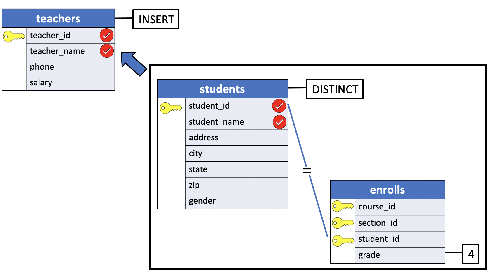

# Adding Records Using SELECT

SQL allows a second style of `INSERT` that allows to **insert the result of a query (which might be no rows, one row, or many rows)**. The genral form of this style is:

```console
INSERT INTO <table>
            (<column names>)
     SELECT  <column names>
       FROM <table>
      WHERE <predicate>;
```

In place of the word `VALUES` and a list of values, this second form of `INSERT` includes a `SELECT` statement. This `SELECT` can be as **simple** or as **complex** as desired.

With this second style of `INSERT`, the user does not directly specify new values for a table. Instead, they must be drawn from one or more tables that already exist in the database.

## Dummy example

For example, suppose we have the two tables below, `products` and `new_products`:

```console
CREATE TABLE products (
    product_no integer,
    name text,
    price numeric
);

CREATE TABLE new_products (
    product_no integer,
    name text,
    price numeric,
    release_date CHAR
);
```

It is also possible to insert the product released `today` in the `products` table:

```console
INSERT INTO products
            (product_no, name, price)
      SELECT product_no, name, price
        FROM new_products
       WHERE release_date = 'today';
```

## Example with a join

Don't worry if you do not understand the following example. It'll become clear when we introduce the **join** operation between tables.


For example, supposed we wished to promote all *students* who had recieved an `A` in any class to *teachers*.

That is, the record in the **students** table for any student who has recieved an `A` in one or more classes should be added to the **teachers** table. (This is admittedly a very loose criterion for promotion to teacherhood :smile:)

An obvious problem is that the columns in the two tables are not identical. The records in **teachers** each have a:

- `teacher_id`
- `teacher_name`
- `phone` and a
- `salary`.

Those in **students**, on the other hand, contain fields for:

- `student_id`
- `student_name`
- `address`
- and so on ...

To allow this promotion, we will assume that the selected students' `student_id` and `student_name` fields will become the `teacher_id` and `teacher_name` fields in the new record in **teachers**. The other columns in **teachers**, `phone` and `salary`, will simply be left unspecified.

To perform this operation, we must first devise a `SELECT` statement that returns the names and student numbers of those students who have recieved `A`s.

There is one hitch, however: What if a student has recieved an `A` in more than one class? If so, the student's name and number will appear more than once in the results of the `SELECT`. Because SQL does not prohibit duplicate records in a table unless a `UNIQUE` constraint has been defined, using this `SELECT` within an `INSERT` could cause more than one record to be added to the **teachers** table for that student. We can avoid this situation by specifying the `DISTINCT` option on the `SELECT`. Recall that when `DISTINCT` is used, any duplicates that would otherwise appear in the results of the `SELECT` will be eliminated, leaving only one record per student.

A correct formulation of the desired `SELECT` statement is:

```console
SELECT DISTINCT student_id, student_name
  FROM students, enrolls
 WHERE students.student_id = enrolls.student_id AND
       grade = 4;
```



Next, this query must be embedded within the `INSERT`, such as:

```console
INSERT INTO teachers
            (teacher_id, teacher_name)
SELECT DISTINCT student_id, student_name
  FROM students, enrolls
 WHERE students.student_id = enrolls.student_id AND
       grade = 4;
```

When this statement is executed, the **teachers** table will swell to include several new records. Each of those new records will have a `teacher_id` equivalent to that student's `student_id` and that student's `student_name` as its `teacher_name`. The fields `phone` and `salary` in each of those newly added records will be set to `NULL`. As usual, the `SELECT` statement used within the `INSERT` can be as complex as desired. It could contain a subquery or any other legal option within its `WHERE` clause.

An important note: the `teacher_id` column is constrained to be `UNIQUE`, it's a PRIMARY KEY. If the value in `student_id` for one of the new records being added were identical to that for an existing `teacher_id`, that record would not be added to the table. In the example database, this doesn't happen, but in a similar real world application it might. The restrictions specified when a table is created apply to all records added, no matter what technique is used to add them.
