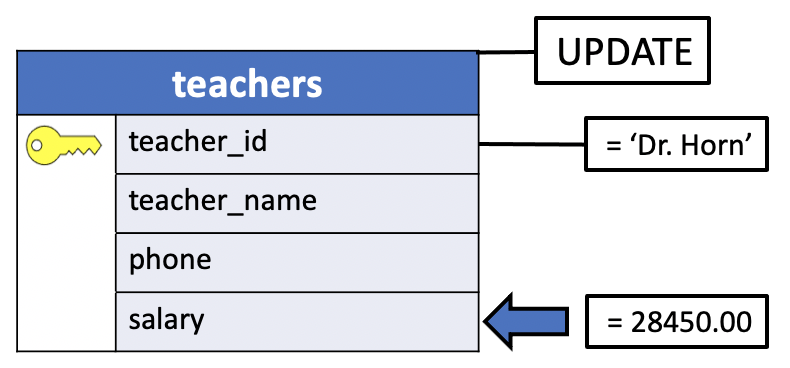
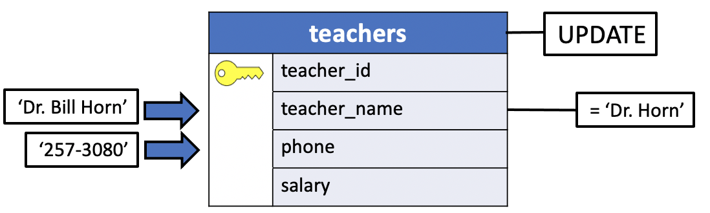
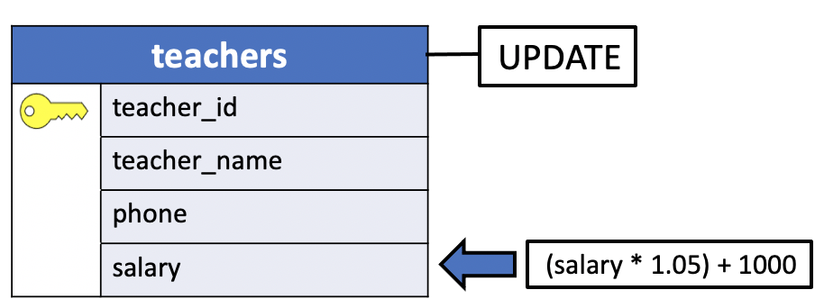

# Modifying Records in a Table

Once a record is in a table, it may be necessary to modify one or more of its values. This task is accomplished with SQL's `UPDATE` statement.

The modification of data that is already in the database is referred to as **updating**. You can update

- **individual** `rows`,
- **all** the `rows` in a table, or
- **a subset of all** `rows`.

Each **column can be updated separately**; the other columns are not affected.

To update existing rows, use the `UPDATE` command. This requires four pieces of information:

1. The `name` of the **table**
2. The `name` of the **column** to update
3. The `new value` of the **column**
4. `Which row(s)` to **update**

Recall that **SQL does not, in general, provide a unique identifier for rows**. The rows inserted in a table do not have a specific order, it's just an unordered list of records. Therefore it is not always possible to directly specify which row to update.

Instead, you specify **which conditions a row must meet in order to be updated**. Only if you have a `primary key` in the table (independent of whether you declared it or not) can you **reliably address individual rows by choosing a condition that matches the primary key**.

The general form of an `UPDATE` is:

```console
UPDATE <table>
   SET <column name> = <value>
   WHERE <predicate>;
```

1. The table containing the record(s) to be modified is specified in `<table>`.

Following the word `SET` appears one or more expressions of the form `<column name> = <value>`. Each of these must:
2. First `name` a **column** in that table
3. then specify a `new value` for that column, either a constant or an expression of some kind.
4. Finally, a `WHERE` clause can **optionally** appear, limiting the records to which the modifications apply.
  - If **no** `WHERE` clause is used, the **changes apply to all records** in the specified table.

Like many other SQL statements (all except `SELECT`, in fact), `UPDATE` returns no results with the possible exception of a message indicating successful modification of the specified records.

## PostgreSQL UPDATE statement

The following illustrates the syntax of the `UPDATE` statement in PostgreSQL:

```console
UPDATE table_name
   SET column1 = value1,
       column2 = value2,
       ...
   WHERE condition;
```

In this syntax:

1. First, specify the `name` of the **table** that you want to update data after the `UPDATE` keyword.
2. Second, specify `columns` and their `new values` after `SET` keyword. **The columns that do not appear in the SET clause retain their original values**.
3. Third, determine **which rows to update** in the optional condition of the `WHERE` clause.

The `WHERE` clause **is optional**. If you omit the `WHERE` clause, the `UPDATE` statement **will update all rows in the table**.

When the `UPDATE` statement is executed *successfully*, it returns the following command tag:

```console
UPDATE count
```
The `count` is the **number of rows updated including rows whose values did not change**, rows where the value is identical to the one specified in the set condition.

### Returning updated rows

The `UPDATE` statement has an optional `RETURNING` clause that returns the updated rows:

```console
UPDATE table_name
   SET column1 = value1,
       column2 = value2,
       ...
   WHERE condition
   RETURNING * | output_expression AS output_name;
```

## PostgreSQL UPDATE examples

Let’s take some examples of using the PostgreSQL UPDATE statement.

### Setting up a samples table

The following statements create a table called **courses** and insert some data into it:

```console
DROP TABLE IF EXISTS courses;

CREATE TABLE courses(
	course_id serial primary key,
	course_name VARCHAR(255) NOT NULL,
	description VARCHAR(500),
	published_date date
);

INSERT INTO courses
  (course_name, description, published_date)
VALUES
	('PostgreSQL for Developers','A complete PostgreSQL for Developers','2020-07-13'),
	('PostgreSQL Admininstration','A PostgreSQL Guide for DBA',NULL),
	('PostgreSQL High Performance',NULL,NULL),
	('PostgreSQL Bootcamp','Learn PostgreSQL via Bootcamp','2013-07-11'),
	('Mastering PostgreSQL','Mastering PostgreSQL in 21 Days','2012-06-30');
```

|course_id | course_name| description | published_date |
|:--------:|:----------:|:------------:|:-------------:|
|1|PostgreSQL for Developers |A complete PostgreSQL for Developers|2020-07-13|
|2|PostgreSQL Admininstration|A PostgreSQL Guide for DBA|NULL|
|3|PostgreSQL High Performance|NULL|NULL|
|4|PostgreSQL Bootcamp|Learn PostgreSQL via Bootcamp|2013-07-11|
|5|Mastering PostgreSQL|Mastering PostgreSQL in 21 Days|2012-06-30|

### Example: Updating a record (row)

The following statement uses the `UPDATE` statement to update the course with `id` **3**. It changes the `published_date` from `NULL` to **'2020-08-01'**.

```console
UPDATE courses
   SET published_date = '2020-08-01'
   WHERE course_id = 3;
```

The statement returns the following message indicating that one row has been updated:

```console
UPDATE 1
```

|course_id | course_name| description | published_date |
|:--------:|:----------:|:------------:|:-------------:|
|1|PostgreSQL for Developers |A complete PostgreSQL for Developers|2020-07-13|
|2|PostgreSQL Admininstration|A PostgreSQL Guide for DBA|NULL|
|`3`|PostgreSQL High Performance|NULL|**2020-08-01**|
|4|PostgreSQL Bootcamp|Learn PostgreSQL via Bootcamp|2013-07-11|
|5|Mastering PostgreSQL|Mastering PostgreSQL in 21 Days|2012-06-30|


### Example: Updating a record in uniy sample database


|teacher_id | teacher_name | phone| salary|
|:---------:|:------------:|:----:|:-----:|
|303        | Dr. Horn     | 257-3049| 27540.00|

Recalling the `INSERT` statement in the uniy database [example](./13_populate_uniy_tables.md)

Suppose, for instance, that we wished to increase Dr. Horn's `salary` to `$28,450`. This task could be accomplished with:

```console
UPDATE teachers
   SET salary = 28450.00
   WHERE teachers_name = 'Dr. Horn';
```



The `Dr. Horn`'s line is linked to the `teacher_name` in the picture :smile:

|teacher_id | teacher_name | phone| salary|
|:---------:|:------------:|:----:|:-----:|
|303        | `Dr. Horn`     | 257-3049| **2845.00**|


Let's execute the command in the prompt.

```console
uniy=> UPDATE teachers
uniy->    SET salary = 28450.00
uniy->    WHERE teacher_name = 'Dr. Horn';
UPDATE 1
```


The following statement selects the record with teacher_name column's values equal to `Dr. Horn` to verify the update:

```console
uniy=> SELECT *
uniy->   FROM teachers
uniy->  WHERE teacher_id = 303;
 teacher_id |    teacher_name    |   phone    |  salary
------------+--------------------+------------+----------
        303 | Dr. Horn           | 257-3049   | 28450.00
(1 row)
```

**updating a row and returning the updated row**

```console
uniy=> UPDATE teachers
uniy->    SET salary = 28450.00
uniy->    WHERE teacher_name = 'Dr. Horn'
uniy-> RETURNING *;
 teacher_id |    teacher_name    |   phone    |  salary
------------+--------------------+------------+----------
        303 | Dr. Horn           | 257-3049   | 28450.00
(1 row)

UPDATE 1
```

As mentioned at the beginning of this chapter the `count` is the number of rows updated **including rows whose values did not change**, rows where the value is identical to the one specified in the set condition. The `count` **indicates** the number of matching rows of the `UPDATE` statement execution. This might cause zero, one, or many rows to be updated.

For example, let's update the salary of a record with `teacher_name` equals to `Dr. Smith`.

```console
uniy=> UPDATE teachers
uniy->    SET salary = 28450.00
uniy->    WHERE teacher_name = 'Dr. Smith';
UPDATE 0
```

It is not an error to attempt an update that does not match any rows.

### Example: Updating a record using arithmetic operations

We can even modify exisitng values by using arithmetic operations.

For example, to give `Dr. Horn` a **5 percent** cost of **living increase** along with a **$1,000** merit **raise** for the `salary` column, you could type:

```console
UPDATE teachers
   SET salary = (salary * 1.05) + 1000
   WHERE teacher_name = 'Dr. Horn';   
```

This statement starts with `Dr. Horn`'s old `salary`, increases it by **5 percent**, adds **1,000**, then puts the result back in the `salary` field of `Dr.Horn`'s record. (In this example, the parentheses around `salary * 1.05` aeren't really required, because multiplication is by default perform before addition. Using parentheses never hurts, though, and usually makes things clearer to a human reader.)

## Example: Updating more than one field in a record at once

It's possible to modify more than one column at a time. The columns to be updated, together with their new values, are separated by commas and listed after the word `SET`.

For example, to both add `Dr. Horn`'s **first name**, (`'Bill'`) and change his `phone` number, one could type:

```console
UPDATE teachers
   SET phone = '257-3080',
       teacher_name = 'Dr. Bill Horn'
   WHERE teacher_name = 'Dr. Horn';
```

**Note** that the **order** in which the column names are listed is **not significant**.



|teacher_id | teacher_name | phone| salary|
|:---------:|:------------:|:----:|:-----:|
|303        | **Dr. Bill Horn**     | **257-3080**| 2845.00|

```console
uniy=> UPDATE teachers
uniy->    SET salary = 28450.00
uniy->  WHERE teacher_name = 'Dr. Smith';
UPDATE 0
uniy=> SELECT * FROM teachers;
 teacher_id |    teacher_name    |   phone    |  salary
------------+--------------------+------------+----------
        303 | Dr. Horn           | 257-3049   | 28450.00
(1 row)

uniy=> UPDATE teachers
uniy->    SET phone = '257-3080',
uniy->        teacher_name = 'Dr. Bill Horn'
uniy->    WHERE teacher_name = 'Dr. Horn'
uniy-> RETURNING *;
 teacher_id |    teacher_name    |   phone    |  salary
------------+--------------------+------------+----------
        303 | Dr. Bill Horn      | 257-3080   | 28450.00
(1 row)

UPDATE 1
```

### Example: Updating several records using arithmetic operations

So far, every example has contained a `WHERE` clause. As mentioned earlier, however, the `WHERE` clause is optional in an `UPDATE`. If it is **omitted**, the **update applies to all records** in the table.

For example, suppose we have the following instance of the teachers table.

 |teacher_id |    teacher_name    |   phone    |  salary  |
 |:---------:|:------------------:|:----------:|:--------:|
      |  303 | Dr. Bill Horn      | 257-3080   | 28450.00 |
      |  290 | Dr. Lowe           | 257-2390   | 31450.00 |
      |430 | Dr. Engle          | 256-4621   | 38200.00 |


For example, to **give all teachers** a `5 percent` cost of living increase and a `$1,000` merit raise, the command is:

```console
UPDATE teachers
   SET salary = (salary + 1.05) + 1000;
```



|teacher_id |    teacher_name    |   phone    |  salary|
|:---------:|:------------------:|:----------:|:-------:|
       |303 | Dr. Bill Horn      | 257-3080   | **30872.50**|
       |290 | Dr. Lowe           | 257-2390   | **34022.50**|
       |430 | Dr. Engle          | 256-4621   | **41110.00**|

Because no `WHERE` clause is specified to limit the records affected, this `UPDATE` modifies the `salary` field of every record in the **teachers** table.

```console
uniy=> SELECT * FROM teachers;
 teacher_id |    teacher_name    |   phone    |  salary
------------+--------------------+------------+----------
        303 | Dr. Bill Horn      | 257-3080   | 28450.00
        290 | Dr. Lowe           | 257-2390   | 31450.00
        430 | Dr. Engle          | 256-4621   | 38200.00
(3 rows)
```

Let's execute the `UPDATE`

```console
uniy=> UPDATE teachers
uniy->    SET salary = (salary * 1.05) + 1000
uniy-> RETURNING *;
 teacher_id |    teacher_name    |   phone    |  salary
------------+--------------------+------------+----------
        303 | Dr. Bill Horn      | 257-3080   | 30872.50
        290 | Dr. Lowe           | 257-2390   | 34022.50
        430 | Dr. Engle          | 256-4621   | 41110.00
(3 rows)

UPDATE 3
```
