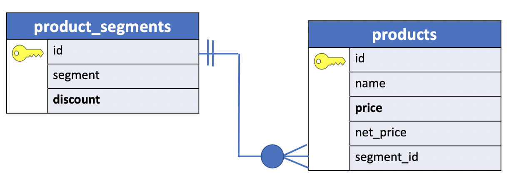
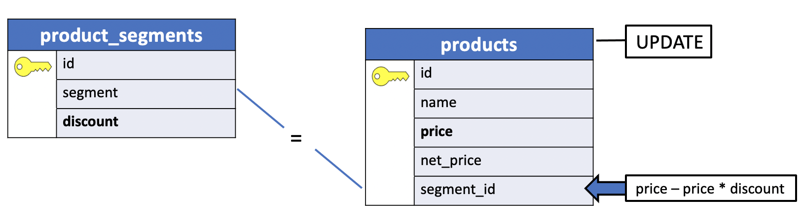

# PostgreSQL UPDATE JOIN

In this lesson, you will learn how to use the PostgreSQL `UPDATE` **join syntax** to **update data** in a `table` **based on values in another table**.

## Introduction to the PostgreSQL UPDATE join syntax

Sometimes, you need to update data in a table based on values in another table. In this case, you can use the PostgreSQL `UPDATE join syntax` as follows:

```console
UPDATE t1
   SET t1.c1 = new_value
   FROM t2
  WHERE t1.c2 = t2.c2;
```

To join to another table in the `UPDATE` statement, you specify the joined table in the FROM clause (`t2`) and provide the join condition in the WHERE clause (`t1.c2 = t2.c2`). The `FROM` **clause must appear immediately after the** `SET` clause.

For each row of table `t1`, the `UPDATE` statement examines every row of table `t2`.

- If the **value** in the `c2` column of table **t1**

- **equals**

- the **value** in the `c2` column of table **t2**,

- the `UPDATE` statement **updates** the value in the `c1` column of the table **t1** the new value (`new_value`).

## PostgreSQL UPDATE JOIN example

Let’s take a look at an example to understand how the PostgreSQL `UPDATE` **join** works. We will use the following database tables for the demonstration:


**product_segments**

|id |   segment    | discount|
|:--|:------------:|--------:|
|1  | Grand Luxury |     0.05|
|2  | Luxury       |     0.06|
|3  | Mass         |     0.10|

The **product_segments** that stores the product segments including `grand luxury`, `luxury`, and `mass`. The product_segment table has the discount **column** that stores the discount percentage based on a specific segment. For example, products with the grand luxury segment have `5%` discount while luxury and mass products have `6%` and `10%` discounts respectively.

**products**

|id |           name            | price  | net_price | segment_id|
|:--|:-------------------------:|:-------|:----------:|---------:|
| 1 | diam                      | 804.89 |           |          1|
|2  | vestibulum aliquet        | 228.55 |           |          3|
|3  | lacinia erat              | 366.45 |           |          2|
|4  | scelerisque quam turpulis | 145.33 |           |          3|
|5  | justo lacinia             | 551.77 |           |          2|
|6  | ultrices mattis odio      | 261.58 |           |          3|
|7  | hendrerit                 | 519.62 |           |          2|
|8  | in hac habitasse          | 843.31 |           |          1|
|9  | orci eget orci            | 254.18 |           |          3|
|10 | pellentesque              | 427.78 |           |          2|
|11 | sit amet nunc             | 936.29 |           |          1|
|12 | sed vestibulum            | 910.34 |           |          1|
|13 | turpis eget               | 208.33 |           |          3|
|14 | cursus vestibulum         | 985.45 |           |          1|
|15 | orci nullam               | 841.26 |           |          1|
|16 | est quam pharetra         | 896.38 |           |          1|
|17 | posuere                   | 575.74 |           |          2|
|18 | ligula                    | 530.64 |           |          2|
|19 | convallis                 | 892.43 |           |          1|
|20 | nulla elit ac             | 161.71 |           |          3|

The **products** table that stores the product data. The product table has the foreign key column `segment_id` that links to the `id` of the **product_segments** table.


The corresponding `ERD` is shown in the picture below.



A record in the `product_segments` table can have zero or more records in the `product` table. A record in the `product` table can have one and only one record in the `product_segments` table.


Third, suppose you have to calculate the `net_price` **of every product based on** the `discount` of the product segment. To do this, you can apply the `UPDATE` **join** statement as follows:

```console
UPDATE product
   SET net_price = price - price * discount
   FROM product_segment
   WHERE product.segment_id = product_segment.id;
```
You can utilize the table aliases to make the query shorter like this:

```console
UPDATE product p
   SET net_price = price - price * discount
   FROM product_segment s
   WHERE p.segment_id = s.id;
```



|id |           name            | price  | net_price | segment_id|
|:---|:-------------------------|:------:|:---------:|----------:|
|1   | diam                      | 804.89 |    764.65 |          1|
|2   | vestibulum aliquet        | 228.55 |    205.70 |          3|
|3   | lacinia erat              | 366.45 |    344.46 |          2|
|4   | scelerisque quam turpulis | 145.33 |    130.80 |          3|
|5   | justo lacinia             | 551.77 |    518.66 |          2|
|6   | ultrices mattis odio      | 261.58 |    235.42 |          3|
|7   | hendrerit                 | 519.62 |    488.44 |          2|
|8   | in hac habitasse          | 843.31 |    801.14 |          1|
|9   | orci eget orci            | 254.18 |    228.76 |          3|
|10  | pellentesque              | 427.78 |    402.11 |          2|
|11  | sit amet nunc             | 936.29 |    889.48 |          1|
|12  | sed vestibulum            | 910.34 |    864.82 |          1|
|13  | turpis eget               | 208.33 |    187.50 |          3|
|14  | cursus vestibulum         | 985.45 |    936.18 |          1|
|15  | orci nullam               | 841.26 |    799.20 |          1|
|16  | est quam pharetra         | 896.38 |    851.56 |          1|
|17  | posuere                   | 575.74 |    541.20 |          2|
|18  | ligula                    | 530.64 |    498.80 |          2|
|19  | convallis                 | 892.43 |    847.81 |          1|
|20  | nulla elit ac             | 161.71 |    145.54 |          3|


Let's execute the commands in the prompt.

```console
uniy=> CREATE TABLE product_segments (
uniy(>   id SERIAL PRIMARY KEY,
uniy(>   segment VARCHAR NOT NULL,
uniy(>   discount NUMERIC (4, 2)
uniy(> );
CREATE TABLE
uniy=> INSERT INTO product_segments
uniy->        (segment, discount)
uniy-> VALUES
uniy->        ('Grand Luxury', 0.05),
uniy->        ('Luxury', 0.06),
uniy->        ('Mass', 0.1)
uniy-> RETURNING *;
 id |   segment    | discount
----+--------------+----------
  1 | Grand Luxury |     0.05
  2 | Luxury       |     0.06
  3 | Mass         |     0.10
(3 rows)

INSERT 0 3
```
**products** table:

```console
uniy=> CREATE TABLE products (
uniy(>   id SERIAL PRIMARY KEY,
uniy(>   name VARCHAR NOT NULL,
uniy(>   price NUMERIC(10,2),
uniy(>   net_price NUMERIC(10,2),
uniy(>   segment_id INT NOT NULL,
uniy(>   FOREIGN KEY (segment_id) REFERENCES product_segments(id)
uniy(> );
CREATE TABLE
uniy=> INSERT INTO products
uniy->        (name, price, segment_id)
uniy-> VALUES
uniy->        ('diam', 804.89, 1),
uniy->        ('vestibulum aliquet', 228.55, 3),
uniy->        ('lacinia erat',366.45, 2),
uniy->        ('scelerisque quam turpulis', 145.33, 3),
uniy->        ('justo lacinia', 551.77, 2),
uniy->        ('ultrices mattis odio', 261.58, 3),
uniy->        ('hendrerit', 519.62, 2),
uniy->        ('in hac habitasse', 843.31, 1),
uniy->        ('orci eget orci', 254.18, 3),
uniy->        ('pellentesque', 427.78, 2),
uniy->        ('sit amet nunc', 936.29, 1),
uniy->        ('sed vestibulum', 910.34, 1),
uniy->        ('turpis eget', 208.33, 3),
uniy->        ('cursus vestibulum', 985.45, 1),
uniy->        ('orci nullam', 841.26, 1),
uniy->        ('est quam pharetra', 896.38, 1),
uniy->        ('posuere', 575.74, 2),
uniy->        ('ligula', 530.64, 2),
uniy->        ('convallis', 892.43, 1),
uniy->        ('nulla elit ac', 161.71, 3)
uniy-> RETURNING *;
id |           name            | price  | net_price | segment_id
----+---------------------------+--------+-----------+------------
 1 | diam                      | 804.89 |           |          1
 2 | vestibulum aliquet        | 228.55 |           |          3
 3 | lacinia erat              | 366.45 |           |          2
 4 | scelerisque quam turpulis | 145.33 |           |          3
 5 | justo lacinia             | 551.77 |           |          2
 6 | ultrices mattis odio      | 261.58 |           |          3
 7 | hendrerit                 | 519.62 |           |          2
 8 | in hac habitasse          | 843.31 |           |          1
 9 | orci eget orci            | 254.18 |           |          3
10 | pellentesque              | 427.78 |           |          2
11 | sit amet nunc             | 936.29 |           |          1
12 | sed vestibulum            | 910.34 |           |          1
13 | turpis eget               | 208.33 |           |          3
14 | cursus vestibulum         | 985.45 |           |          1
15 | orci nullam               | 841.26 |           |          1
16 | est quam pharetra         | 896.38 |           |          1
17 | posuere                   | 575.74 |           |          2
18 | ligula                    | 530.64 |           |          2
19 | convallis                 | 892.43 |           |          1
20 | nulla elit ac             | 161.71 |           |          3
(20 rows)

INSERT 0 20
```

```console
uniy=> UPDATE products p
uniy->    SET net_price = price - price * discount
uniy->   FROM product_segments s
uniy->   WHERE p.segment_id = s.id;
```
Let's show the records:

```console
uniy=> SELECT * FROM products;
 id |           name            | price  | net_price | segment_id
----+---------------------------+--------+-----------+------------
  1 | diam                      | 804.89 |    764.65 |          1
  2 | vestibulum aliquet        | 228.55 |    205.70 |          3
  3 | lacinia erat              | 366.45 |    344.46 |          2
  4 | scelerisque quam turpulis | 145.33 |    130.80 |          3
  5 | justo lacinia             | 551.77 |    518.66 |          2
  6 | ultrices mattis odio      | 261.58 |    235.42 |          3
  7 | hendrerit                 | 519.62 |    488.44 |          2
  8 | in hac habitasse          | 843.31 |    801.14 |          1
  9 | orci eget orci            | 254.18 |    228.76 |          3
 10 | pellentesque              | 427.78 |    402.11 |          2
 11 | sit amet nunc             | 936.29 |    889.48 |          1
 12 | sed vestibulum            | 910.34 |    864.82 |          1
 13 | turpis eget               | 208.33 |    187.50 |          3
 14 | cursus vestibulum         | 985.45 |    936.18 |          1
 15 | orci nullam               | 841.26 |    799.20 |          1
 16 | est quam pharetra         | 896.38 |    851.56 |          1
 17 | posuere                   | 575.74 |    541.20 |          2
 18 | ligula                    | 530.64 |    498.80 |          2
 19 | convallis                 | 892.43 |    847.81 |          1
 20 | nulla elit ac             | 161.71 |    145.54 |          3
(20 rows)
```
