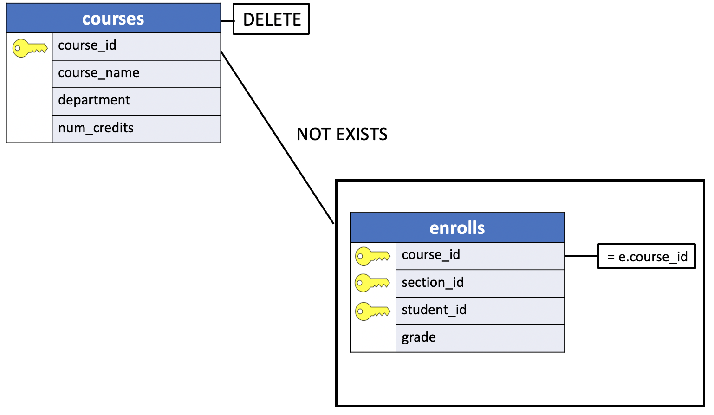

# Uniy - SQL Delete rows from related rows

In the previous section we illustrated how the `DELETE` statement executed on a table referenced by another table with a foreign key constraint and an `ON DELETE CASCADE` action can delete the related rows in the child table.

In this sectionwe'll show you that the `ON DELETE CASCADE` action can impact more than a single table in the hierarchy of the tables.

## Deleting records in more than a single child


For example, the Uniy sample database shows that the **enrolls** table is the `grandchild` of the **course** and **teachers** tables. Similarly, the **sections** table is the child of the **course** and **teachers** tables.

The records in the **teachers**, **courses**, **sections** and **enrolls** tables are listed below:

### Parent tables

**teachers**

|teacher_id |    teacher_name    |   phone    |  salary|
|:----------|:------------------:|:----------:|--------:|
|430        | Dr. Engle          | 256-4621   | 38200.00|
|213        | Dr. Wright         | 257-3393   | 35000.00|
|303        | Dr. Horn           | 257-3049   | 29605.50|
|290        | Dr. Lowe           | 257-2390   | 33808.75|
|180        | Dr. Cooke          | 257-8088   | 31777.00|
|560        | Dr. Olsen          | 257-8086   | 34161.35|
|784        | Dr. Scango         | 257-3046   | 34505.35|

**courses**

|course_id |     course_name      |    department    | num_credits|
|:---------|:--------------------:|:----------------:|-----------:|
|450       | Western Civilization | History          |           3|
|730       | Calculus IV          | Math             |           4|
|290       | English Composition  | English          |           3|
|480       | Compiler Writing     | Computer Science |           3|
|550       | Art History          | History          |           3|

**students**

|student_id | student_name | address  | city   | state |  zip  | gender |
|:----------|:------------:|:----------:|:------:|:-----:|:-----:|-------:|
|148        | Susan Powell | 534 East River Dr.  | Haverford | PA | 19041 | F |
|210        | Bob Dawson   | 120 South Jefferson | NewPort   | RI | 02891 | M |
|298        | Howard Mansfield | 290 Wynkoop Drive | Vienna  | VA | 22180 | M |


## Child tables

**sections**

|course_id | section_id | teacher_id | num_students|
|:---------|:----------:|:----------:|------------:|
|450       |          1 |        303 |            2|
|730       |          1 |        290 |            6|
|290       |          1 |        430 |            3|
|480       |          1 |        180 |            3|
|450       |          2 |        560 |            2|
|480       |          2 |        784 |            2|

**enrolls**

|course_id | section_id | student_id | grade|
|:---------|:----------:|:----------:|-----:|
|730       |          1 |        148 |     3|
|450       |          2 |        210 |     3|
|730       |          1 |        210 |     1|
|290       |          1 |        298 |     3|

### uniy - DELETE teachers record

Let's say we want to delete a record from the **teachers** table. What will happen to the **sections** and **enrolls** table ?

```console
DELETE FROM teachers
      WHERE teacher_id = 430;
```

**teachers**

|teacher_id |    teacher_name    |   phone    |  salary|
|:----------|:------------------:|:----------:|--------:|
|**430**    | **Dr. Engle**      | **256-4621** | **38200.00**|
|213        | Dr. Wright         | 257-3393   | 35000.00|
|303        | Dr. Horn           | 257-3049   | 29605.50|
|290        | Dr. Lowe           | 257-2390   | 33808.75|
|180        | Dr. Cooke          | 257-8088   | 31777.00|
|560        | Dr. Olsen          | 257-8086   | 34161.35|
|784        | Dr. Scango         | 257-3046   | 34505.35|

**sections**

|course_id | section_id | teacher_id | num_students|
|:---------|:----------:|:----------:|------------:|
|450       |          1 |        303 |            2|
|730       |          1 |        290 |            6|
|**290**   |      **1** |    **430** |        **3**|
|480       |          1 |        180 |            3|
|450       |          2 |        560 |            2|
|480       |          2 |        784 |            2|

**enrolls**

|course_id | section_id | student_id | grade|
|:---------|:----------:|:----------:|-----:|
|**730**   |      **1** |    **148** | **3**|
|**450**   |      **2** |    **210** | **3**|
|730       |          1 |        210 |     1|
|**290**   |      **1** |    **298** | **3**|

Let's execute the command in the `psql` prompt.

```console
uniy=> DELETE FROM teachers
uniy->       WHERE teacher_id = 430
uniy-> RETURNING *;
 teacher_id |    teacher_name    |   phone    |  salary
------------+--------------------+------------+----------
        430 | Dr. Engle          | 256-4621   | 38200.00
(1 row)

DELETE 1
```

It seems that only a record has been deleted. Let's list the records of the **sections** and **enrolls** tables.

**sections**

```console
uniy=> SELECT * FROM sections;
 course_id | section_id | teacher_id | num_students
-----------+------------+------------+--------------
       450 |          1 |        303 |            2
       730 |          1 |        290 |            6
       480 |          1 |        180 |            3
       450 |          2 |        560 |            2
       480 |          2 |        784 |            2
       290 |          1 |            |            3
(6 rows)
```

The output shows that the `teacher_id` column value for the `course_id` is now `NULL`. Why the `DELETE` statement did not cancel the record with `course_id` equals to `290` ?

```console
uniy=> \d sections;
                 Table "public.sections"
    Column    |   Type   | Collation | Nullable | Default
--------------+----------+-----------+----------+---------
 course_id    | smallint |           | not null |
 section_id   | smallint |           | not null |
 teacher_id   | smallint |           |          |
 num_students | smallint |           |          |
Indexes:
    "sections_pkey" PRIMARY KEY, btree (course_id, section_id)
Foreign-key constraints:
    "sections_fkey_course" FOREIGN KEY (course_id) REFERENCES courses(course_id) ON DELETE CASCADE
    "sections_fkey_teacher" FOREIGN KEY (teacher_id) REFERENCES teachers(teacher_id) ON DELETE SET NULL
Referenced by:
    TABLE "enrolls" CONSTRAINT "enrolls_fkey_section" FOREIGN KEY (course_id, section_id) REFERENCES sections(course_id, section_id) ON DELETE CASCADE
```

Answer: The foreign key constraint `sections_fkey_teacher` in the **sections** table has `ON DLETE SET NULL` action.

**enrolls**

```console
uniy=> SELECT * FROM enrolls;
 course_id | section_id | student_id | grade
-----------+------------+------------+-------
       730 |          1 |        148 |     3
       450 |          2 |        210 |     3
       730 |          1 |        210 |     1
       290 |          1 |        298 |     3
(4 rows)
```

All the recods in the **enrolls** table with `section_id` equals to `1` haven't been deleted.

If we delete the `English Composition` course , (`course_id`: 290), what do you think will happen?

```console
uniy=> DELETE FROM courses
uniy->       WHERE course_id = 290
uniy-> RETURNING *;
 course_id |     course_name      |    department    | num_credits
-----------+----------------------+------------------+-------------
       290 | English Composition  | English          |           3
(1 row)

DELETE 1
```

Let's list the records in the **sections** table:

```console
uniy=> SELECT * FROM sections;
 course_id | section_id | teacher_id | num_students
-----------+------------+------------+--------------
       450 |          1 |        303 |            2
       730 |          1 |        290 |            6
       480 |          1 |        180 |            3
       450 |          2 |        560 |            2
       480 |          2 |        784 |            2
(5 rows)
```

As expected, the `English Composition` course taught has been deleted.

Let's list the records in the **enrolls** table:

```console
uniy=> SELECT * FROM enrolls;
 course_id | section_id | student_id | grade
-----------+------------+------------+-------
       730 |          1 |        148 |     3
       450 |          2 |        210 |     3
       730 |          1 |        210 |     1
(3 rows)
```

All the students enrolled in the `English Compostion` course have been deleted.

## Deleting all Records From a Table

SQL also provides a very easy way to delete all records from a table: Simply omit the `WHERE` clause.

### Using PostgreSQL DELETE to delete all rows from the table


If, for example, we wished to delete the record of every student in the uniY sample database, we could type:

```console
DELETE FROM students;
```

While to delete all the **teachers** table records, the command is:

```console
DELETE FROM teachers;
```

Let's list the the records of the **teachers** and **sections** tables:

```console
uniy=> SELECT * FROM teachers;
 teacher_id |    teacher_name    |   phone    |  salary
------------+--------------------+------------+----------
        213 | Dr. Wright         | 257-3393   | 35000.00
        303 | Dr. Horn           | 257-3049   | 29605.50
        290 | Dr. Lowe           | 257-2390   | 33808.75
        180 | Dr. Cooke          | 257-8088   | 31777.00
        560 | Dr. Olsen          | 257-8086   | 34161.35
        784 | Dr. Scango         | 257-3046   | 34505.35
(6 rows)

uniy=> SELECT * FROM sections;
 course_id | section_id | teacher_id | num_students
-----------+------------+------------+--------------
       450 |          1 |        303 |            2
       730 |          1 |        290 |            6
       480 |          1 |        180 |            3
       450 |          2 |        560 |            2
       480 |          2 |        784 |            2
(5 rows)
```

Let's delete all the records of the **teachers** table:

```console
uniy=> DELETE FROM teachers;
DELETE 6
```

All 6 records in the **teachers** table have been deleted.

```console
uniy=> SELECT * FROM sections;
 course_id | section_id | teacher_id | num_students
-----------+------------+------------+--------------
       450 |          1 |            |            2
       730 |          1 |            |            6
       480 |          1 |            |            3
       450 |          2 |            |            2
       480 |          2 |            |            2
(5 rows)
```

The values in the `teacher_id` column have been set ot `NULL`.

## Deleting Records with JOIN and Subquery

```console
uniy=> SELECT * FROM enrolls;
 course_id | section_id | student_id | grade
-----------+------------+------------+-------
       730 |          1 |        148 |     3
       450 |          2 |        210 |     3
       730 |          1 |        210 |     1
(3 rows)

uniy=> SELECT * FROM courses;
 course_id |     course_name      |    department    | num_credits
-----------+----------------------+------------------+-------------
       450 | Western Civilization | History          |           3
       730 | Calculus IV          | Math             |           4
       480 | Compiler Writing     | Computer Science |           3
       550 | Art History          | History          |           3
(4 rows)
```

In the previous example, all the values of the `teacher_id` column in the **sections** table have been set to `NULL`. Suppose, we wanted to delete all the courses in the **courses** table without a teacher and enrolled students.

```console
uniy=> SELECT courses.course_id
uniy->   FROM courses, enrolls
uniy->  WHERE courses.course_id = enrolls.course_id;
 course_id
-----------
       730
       450
       730
(3 rows)
```

The last command clearly shows that the only courses to be listed in the **courses** table must be `730` and `450`. On the other hand, the courses `480` and `550` can be discarded. In other words, we want to delete all records in the **courses** table that has no matching in the **enrolls** table.

```console
uniy=> DELETE FROM courses c
uniy->       WHERE NOT EXISTS
uniy->             ( SELECT course_id
uniy(>                 FROM enrolls e
uniy(>                WHERE c.course_id = e.course_id)
uniy-> RETURNING *;
 course_id |     course_name      |    department    | num_credits
-----------+----------------------+------------------+-------------
       480 | Compiler Writing     | Computer Science |           3
       550 | Art History          | History          |           3
(2 rows)

DELETE 2
uniy=>
```



Let's list the **courses**, **sections** and **enrolls** tables.

**courses**

```console
uniy=> SELECT * FROM courses;
 course_id |     course_name      |    department    | num_credits
-----------+----------------------+------------------+-------------
       450 | Western Civilization | History          |           3
       730 | Calculus IV          | Math             |           4
(2 rows)
```

**sections**

```console
uniy=> SELECT * FROM sections;
 course_id | section_id | teacher_id | num_students
-----------+------------+------------+--------------
       450 |          1 |            |            2
       730 |          1 |            |            6
       450 |          2 |            |            2
(3 rows)
```

**enrolls**

```console
uniy=> SELECT * FROM enrolls;
 course_id | section_id | student_id | grade
-----------+------------+------------+-------
       730 |          1 |        148 |     3
       450 |          2 |        210 |     3
       730 |          1 |        210 |     1
(3 rows)
```
