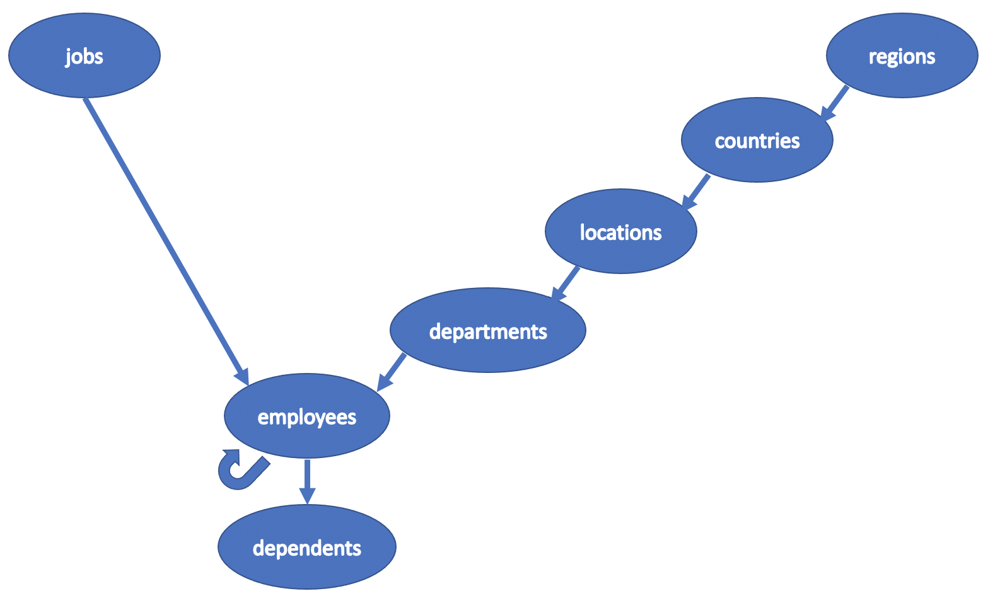

# HR database schema

In the previous lesson, we created the `hr` database schema. In this lesson, we include the `CREATE TABLE` and `DROP TABLE` statements in the `hr-schema.sql` file.

In order to do that, we insert a few records in the `hr` database tables and test the `DROP TABLE` statement. Next, we finalize the editing of the `hr-schema.sql` file and execute the file in the `psql` prompt.

## DROP TABLE

```console
hr=> INSERT INTO regions
hr->        (region_id, region_name)
hr-> VALUES (2, 'Americas');
INSERT 0 1
hr=> INSERT INTO countries
hr->        (country_id, country_name, region_id)
hr-> VALUES ('US', 'United States of America', 2);
INSERT 0 1
hr=> INSERT INTO locations
hr->        (location_id, street_address, postal_code, city, state_province, country_id)
hr-> VALUES (1700, '2004 Charade Rd', '98199', 'Seattle', 'Washington', 'US');
INSERT 0 1
hr=> INSERT INTO departments
hr->        (department_id, department_name, location_id)
hr-> VALUES (9, 'Executive', 1700);
INSERT 0 1
hr=> INSERT INTO jobs
hr->        (job_id, job_title, min_salary, max_salary)
hr-> VALUES (4, 'President', 20000.00, 40000.00);
INSERT 0 1
hr=> INSERT INTO employees
hr->        (employee_id, first_name, last_name, email, phone_number, hire_date, job_id, salary, manager_id, department_id)
hr-> VALUES (100, 'Steven', 'King', 'steven.king@sqltutorial.org', '515.123.4567','1987-06-17',4,24000.00,NULL,9);
INSERT 0 1
hr=> INSERT INTO dependents
hr->        (dependent_id, first_name, last_name, relationship, employee_id)
hr-> VALUES (4,'Jennifer','King','Child',100);
INSERT 0 1
```

Now all the tables have one record.

### regions

|region_id | region_name|
|:---------|:----------:|
|**2**         |Americas|

### countries

|country_id | country_name | region_id |
|:----------|:------------:|----------:|
|**US**|United States of America|`2`|

### locations

|location_id|street_address|postal_code|city|state_province|country_id|
|:----------|:------------:|:---------:|:--:|:------------:|---------:|
|**1700**|2004 Charade Rd|98199|Seattle|Washington|`US`|

### departments

|department_id|department_name|location_id|
|:------------|:-------------:|----------:|
|**9**|Executive|`1700`|

### jobs

|job_id|job_title|min_salary|max_salary|
|:-----|:-------:|:--------:|:--------:|
|**4**|President|20000.00|40000.00|

### employees

|employee_id|first_name|last_name|email|phone_number|hire_date|job_id|salary|manager_id|department_id|
|:----------|:--------:|:-------:|:---:|:----------:|:---------:|:----:|:----:|:--------:|----------:|
|**100**|Steven|King|steven.king@sqltutorial.org|515.123.4567|1987-06-17|`4`|24000.00||`9`|

### dependents

|dependent_id|first_name|last_name|relationship|employee_id|
|:-----------|:--------:|:-------:|:----------:|----------:|
|4|Jennifer|King|Child|`100`|

What do you think would happen if we delete a record in the table `regions`:

- (**2**,Americas)

```console
hr=> DELETE FROM regions
hr->       WHERE region_id = 2;
DELETE 1
```

All the records in the `hr` database have been deleted, except the record in the jobs table. This effect is the result of the `ON DELETE CASCADE` option in the definition of the `foreign key` constraints for the `hr` sample database. Looking carefully at the record deleted, you see that the primary key is referenced by the record in the countries table. Similarly, the record in the countries table is referenced by the the record in the locations table and so on ...

Now, what do you think would happen if we `DROP` the `regions` table?

```console
hr=> DROP TABLE IF EXISTS
hr->               regions
hr-> CASCADE;
NOTICE:  drop cascades to constraint countries_fkey_region on table countries
DROP TABLE
```
Now, the table countries does not reference regions anymore.

```console
hr=> \dt
            List of relations
 Schema |    Name     | Type  |  Owner
--------+-------------+-------+----------
 public | countries   | table | usertest
 public | departments | table | usertest
 public | dependents  | table | usertest
 public | employees   | table | usertest
 public | jobs        | table | usertest
 public | locations   | table | usertest
(6 rows)

hr=> \d countries
                       Table "public.countries"
    Column    |         Type          | Collation | Nullable | Default
--------------+-----------------------+-----------+----------+---------
 country_id   | character(2)          |           | not null |
 country_name | character varying(40) |           |          |
 region_id    | integer               |           | not null |
Indexes:
    "countries_pkey" PRIMARY KEY, btree (country_id)
Referenced by:
    TABLE "locations" CONSTRAINT "locations_fkey_country" FOREIGN KEY (country_id) REFERENCES countries(country_id) ON UPDATE CASCADE ON DELETE CASCADE
```

Now, let's insert a record in the countries and locations tables.

```console
hr=> INSERT INTO countries
hr->        (country_id,country_name,region_id)
hr-> VALUES ('US','United States of America',2);
INSERT 0 1
hr=> INSERT INTO locations
hr->        (location_id,street_address,postal_code,city,state_province,country_id)
hr-> VALUES (1700,'2004 Charade Rd','98199','Seattle','Washington','US');
INSERT 0 1
```

Now, let's `DROP` the countries parent table.

```console
hr=> DROP TABLE IF EXISTS countries CASCADE;
NOTICE:  drop cascades to constraint locations_fkey_country on table locations
DROP TABLE
hr=> SELECT * FROM locations;
 location_id | street_address  | postal_code |  city   | state_province | country_id
-------------+-----------------+-------------+---------+----------------+------------
        1700 | 2004 Charade Rd | 98199       | Seattle | Washington     | US
(1 row)

hr=> \d locations
                                            Table "public.locations"
     Column     |         Type          | Collation | Nullable |                    Default
----------------+-----------------------+-----------+----------+------------------------------------------------
 location_id    | integer               |           | not null | nextval('locations_location_id_seq'::regclass)
 street_address | character varying(40) |           |          |
 postal_code    | character varying(12) |           |          |
 city           | character varying(30) |           | not null |
 state_province | character varying(25) |           |          |
 country_id     | character(2)          |           | not null |
Indexes:
    "locations_pkey" PRIMARY KEY, btree (location_id)
Referenced by:
    TABLE "departments" CONSTRAINT "departments_fkey_location" FOREIGN KEY (location_id) REFERENCES locations(location_id) ON UPDATE CASCADE ON DELETE CASCADE
```

As you can see the `DROP TABLE` statement followed by the `CASCADE` option removes the foreign key constraints of the child tables and delete the parent table. It follows that the order of the `DROP TABLE` statement is not relevant. Therefore, we can choose any order we want in the `DROP TABLE` statement.

Just to be consistent with the choice of the `child relationship` graph, we delete the `hr` database tables in the following order.



```console
DROP TABLE IF EXISTS
           dependents,
           employees,
           departments,
           locations,
           countries,
           regions,
           jobs
CASCADE;
```

Now, we have all the satements needed to edit the `hr-schema.sql` file. Before moving to the impleemntation of the `hr-schema.sql` file, we run a last experiment on the employees tables.

First, we `DROP` the other tables in the `hr` database.

```console
hr=> DROP TABLE IF EXISTS
hr->               locations,
hr->               departments
hr-> CASCADE;
NOTICE:  drop cascades to constraint employees_fkey_department on table employees
DROP TABLE
```
We see that following a `parent relationship` order the DBMS shows a NOTICE message on the dependent objects deleted.

```console
hr=> DROP TABLE IF EXISTS dependents CASCADE;
DROP TABLE
```

On the other hand, following a `child relationship` graph no depndent foreign key constraint is deleted in the `hr` database. Let's drop the jobs table.

```console
hr=> DROP TABLE IF EXISTS jobs CASCADE;
NOTICE:  drop cascades to constraint employees_fkey_job on table employees
DROP TABLE
```

Let's insert some records in the employees table.

```console
hr=> INSERT INTO employees
hr->        (employee_id, first_name, last_name, email, phone_number, hire_date, job_id, salary, manager_id, department_id)
hr-> VALUES
hr->        (100,'Steven','King','steven.king@sqltutorial.org','515.123.4567','1987-06-17',4,24000.00,NULL,9),
hr->        (101,'Neena','Kochhar','neena.kochhar@sqltutorial.org','515.123.4568','1989-09-21',5,17000.00,100,9),
hr->        (102,'Lex','De Haan','lex.dehaan@sqltutorial.org','515.123.4569','1993-01-13',5,17000.00,100,9);
```

If we delete the record with `employee_id`: **100**, what do you think would happen ?

```console
hr=> DELETE FROM employees
hr->       WHERE employee_id = 100;
DELETE 1
hr=> SELECT * FROM employees;
 employee_id | first_name | last_name | email | phone_number | hire_date | job_id | salary | manager_id | department_id
-------------+------------+-----------+-------+--------------+-----------+--------+--------+------------+---------------
(0 rows)
```

All the records are gomne since the CEO of the company is the manager of all employees :smile:

### hr-schema.sql

```console
/*
-----------------------------------
   database: hr
   dbms: postgres (PostgreSQL) 11.4
   author: Ludovico Pinzari
-----------------------------------
*/

-- START A TRANSACTION
BEGIN;


-- ********************************
-- DESTROY the hr database schema
-- ********************************

DROP TABLE IF EXISTS
           dependents,
           employees,
           departments,
           locations,
           countries,
           regions,
           jobs
CASCADE;


-- ********************************
-- CREATE the hr database schema
-- ********************************

/*
------------------------------------
Level 0: jobs, regions
------------------------------------
*/

--
-- Table structure for jobs
--

CREATE TABLE jobs (
	job_id SERIAL PRIMARY KEY,
	job_title VARCHAR (35) NOT NULL,
	min_salary NUMERIC (8, 2),
	max_salary NUMERIC (8, 2)
);

--
-- Table structure for regions
--

CREATE TABLE regions (
	region_id SERIAL PRIMARY KEY,
	region_name VARCHAR (25)
);


/*
------------------------------------
Level 1: countries
------------------------------------
*/

--
-- Table structure for countries
--

CREATE TABLE countries (
	country_id CHARACTER (2) PRIMARY KEY,
	country_name VARCHAR (40),
	region_id INTEGER NOT NULL,
  CONSTRAINT countries_fkey_region
     FOREIGN KEY (region_id)
     REFERENCES regions (region_id)
     ON UPDATE CASCADE
     ON DELETE CASCADE
);


/*
------------------------------------
Level 2: locations
------------------------------------
*/

--
-- Table structure for locations
--

CREATE TABLE locations (
	location_id SERIAL PRIMARY KEY,
	street_address VARCHAR (40),
	postal_code VARCHAR (12),
	city VARCHAR (30) NOT NULL,
	state_province VARCHAR (25),
	country_id CHARACTER (2) NOT NULL,
  CONSTRAINT locations_fkey_country
     FOREIGN KEY (country_id)
     REFERENCES countries (country_id)
     ON UPDATE CASCADE
     ON DELETE CASCADE
);


/*
------------------------------------
Level 3: departments
------------------------------------
*/

--
-- Table structure for departments
--

CREATE TABLE departments (
	department_id SERIAL PRIMARY KEY,
	department_name VARCHAR (30) NOT NULL,
	location_id INTEGER,
  CONSTRAINT departments_fkey_location
     FOREIGN KEY (location_id)
     REFERENCES locations (location_id)
     ON UPDATE CASCADE
     ON DELETE CASCADE
);

/*
------------------------------------
Level 4: employees
------------------------------------
*/

--
-- Table structure for employees
--

CREATE TABLE employees (
	employee_id SERIAL PRIMARY KEY,
	first_name VARCHAR (20),
	last_name VARCHAR (25) NOT NULL,
	email VARCHAR (100) NOT NULL,
	phone_number VARCHAR (20),
	hire_date DATE NOT NULL,
	job_id INTEGER NOT NULL,
	salary NUMERIC (8, 2) NOT NULL,
	manager_id INTEGER,
	department_id INTEGER,
  CONSTRAINT employees_fkey_job
     FOREIGN KEY (job_id)
     REFERENCES jobs (job_id)
     ON UPDATE CASCADE
     ON DELETE CASCADE,
  CONSTRAINT employees_fkey_department
     FOREIGN KEY (department_id)
     REFERENCES departments (department_id)
     ON UPDATE CASCADE
     ON DELETE CASCADE,
  CONSTRAINT employees_fkey_manager
     FOREIGN KEY (manager_id)
     REFERENCES employees (employee_id)
     ON UPDATE CASCADE
     ON DELETE CASCADE
);

/*
------------------------------------
Level 5: dependents
------------------------------------
*/

--
-- Table structure for dependents
--

CREATE TABLE dependents (
	dependent_id SERIAL PRIMARY KEY,
	first_name VARCHAR (50) NOT NULL,
	last_name VARCHAR (50) NOT NULL,
	relationship VARCHAR (25) NOT NULL,
	employee_id INTEGER NOT NULL,
	CONSTRAINT dependents_fkey_employee
		 FOREIGN KEY (employee_id)
		 REFERENCES employees (employee_id)
		 ON UPDATE CASCADE
		 ON DELETE CASCADE
);

-- COMMIT A TRANSACTION
COMMIT;
```
