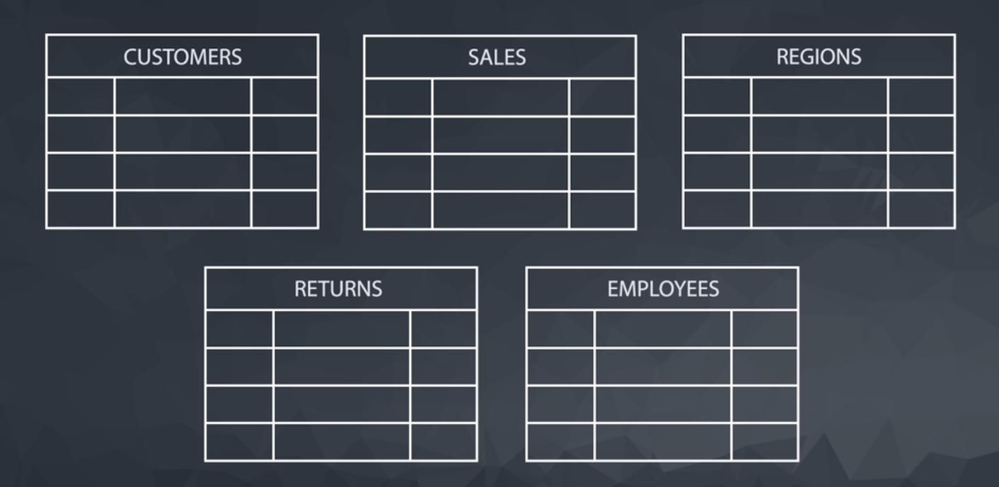
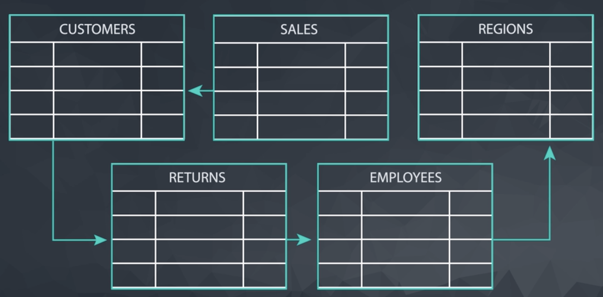

# ERD (Entity Relationship Diagram)

One way to store data is on spreadsheets.

Sometimes, you need lots of spreadsheets to store data from different sources.

We can visualize the relationships between these spreadsheets using an **ERD**, which stands for **Entity Relationship Diagram**.

An **entity relationship diagram** (**ERD**) is a common way to view data in a database. Below is the ERD for the database we will use from Parch & Posey. These diagrams help you **visualize** the data you are analyzing including:

- The **names of the tables**.
- The **columns in each table**.
- The way the **tables work together**.

## Parch & Posey ERD

You can think of each of the boxes in the diagram as a spreadsheet. Therefore, each spreadsheet is represented on a table. At the top, you will see the name of the table, and then below, each column name is listed.

### What to Notice

In the Parch & Posey database there are five tables (essentially 5 spreadsheets):

1. **web_events**
2. **accounts**
3. **orders**
4. **sales_reps**
5. **region**

You can think of each of these tables as an individual spreadsheet. Then the columns in each spreadsheet are listed below the table name. For example, the **region** table has two columns: `id` and `name`. Alternatively the **web_events** table has *four columns*.

5. **region**

| id | name|
|----|-----|
|    |     |

1. **web_events**

| id | account_id  | occurred_at  | channel  |
|:---| :---------: | :----------: | -------: |
|    |             |              |          |

The "**crow's foot**" that **connects the tables together shows us how the columns in one table relate to the columns in another table**.

In this first lesson, you will be learning the basics of how to work with SQL to interact with a single table. In the next lesson, you will learn more about why these connections are so important for working with SQL and relational databases.
