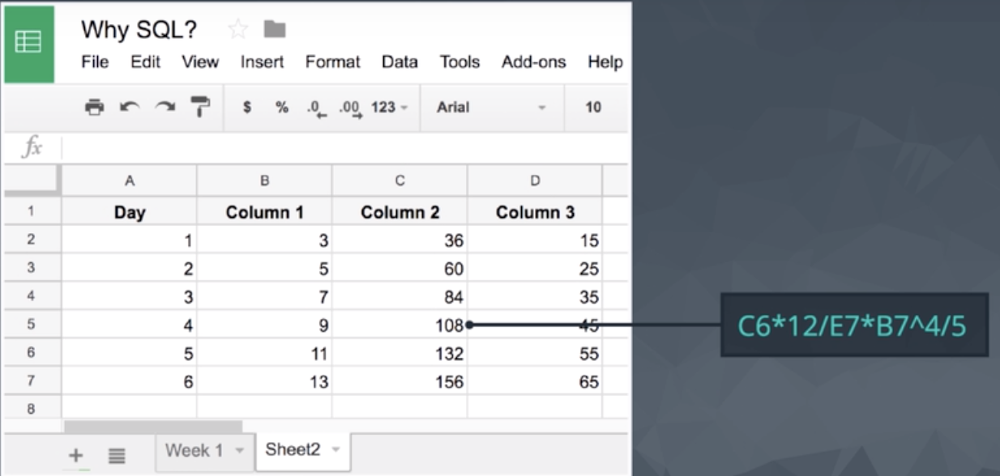
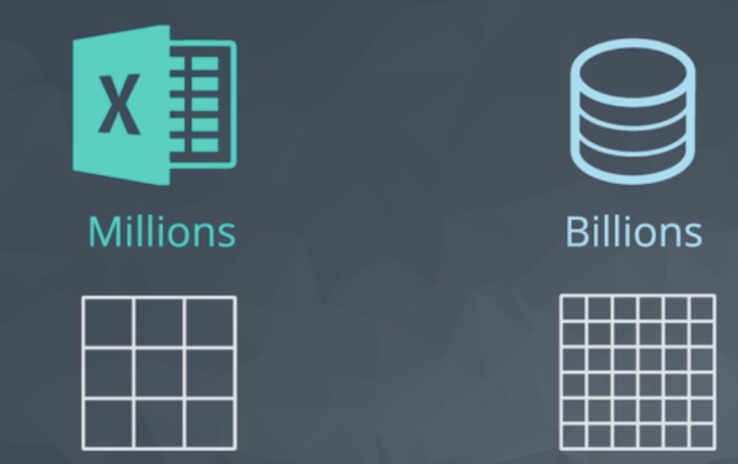
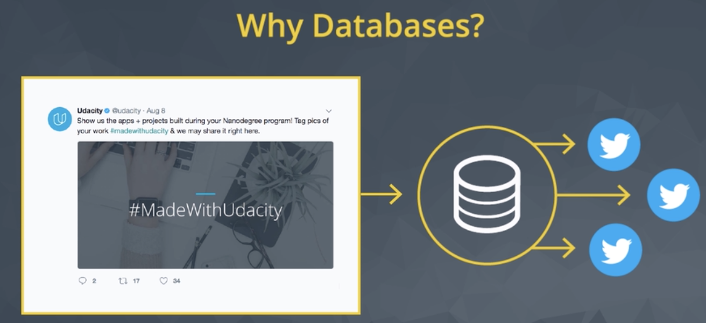
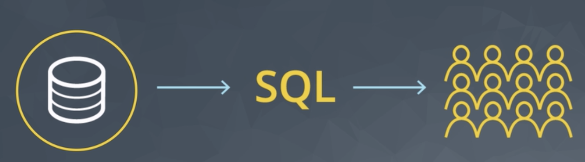

# Why SQL ?

Before we dive into writing Structured Query Language (**SQL**) **queries**, let's take a look at what makes SQL and the databases that utilize SQL so popular.

I think it is an important distinction to say that **SQL is a language**. Hence, the last word of SQL being language.

SQL is used all over the place beyond the databases we will utilize in this class. With that being said, SQL is most popular for its interaction with databases.

For this class, you can think of a database as a bunch of excel spreadsheets all sitting in one place. Not all databases are a bunch of excel spreadsheets sitting in one place, but it is a reasonable idea for this class.

## Why Do Data Analysts use SQL?

A lot of the world's data lives in databases, and most of the world's databases are accessed using **Structured Query Language**, which is typically abbreviated as **SQL**.

- **SQL**: **Structured Query Language**.

It's been around since the 1970s and is the most common method of accessing data and databases today.

**SQL** has a variety of functions that allow its users to read, manipulate and change data. It's also popular for data analysis for a few reasons.

There are some major advantages to using traditional relational databases, which we interact with using SQL. The five most apparent are:

1. SQL is **easy to understand**.
2. Traditional databases allow us to **access data directly**.
3. Traditional databases allow us to **audit and replicate our data**.
4. SQL is a great tool for analyzing multiple tables at once.
5. SQL allows you to analyze more complex questions than dashboard tools like Google Analytics.

**First**, it's semantically easy to understand and learn.

2. **Access Data Directly**

It can be used to access large amounts of data directly where it's stored. You don't have to copy data into other applications to view it, and you don't need to worry about your spreadsheet program crashing because of data overload.

3. **Easy to audit and replicate**

In a spreadsheet tool like Excel, you have to click into each cell to know how they're calculated. With **SQL**, you can just read a **query** from top to bottom, nothing's hidden.

4. **Multiple tables at once**

SQL can run queries on multiple tables at once, across large datasets.

It's great for performing the types of aggregations you might normally do in an Excel *pivot table*, sums, count, minimum and maximum, etc.

But Excel maxes out at just over 1 million rows. With SQL, you can query across **billions** of rows at a time.

5. SQL allows you to **analyze more complex questions than dashboard tools** like Google Analytics.

Maybe most importantly, SQL's incredibly **flexible**, especially when compared to out of the box dashboard products like *Google Analytics*.

In *Goolge analytics*, you might be able to answer questions like,

- Which pages on my site receive the most traffic?
- And Where does it come from?

But you can use **SQL's filtering** capabilities to answer much deeper, more complex questions like,

- How many viewers return to my site between one and three weeks after their first visit?
- What typically bring them back?

The features make SQL one of the primary data analysis tools for both beginners and experts.

## SQL vs. NoSQL

You may have heard of **NoSQL**, which stands for **not only SQL**.

Databases using NoSQL allow for you to write code that interacts with the data a bit differently than what we will do in this course. These NoSQL environments tend to be particularly popular for web based data, but less popular for data that lives in spreadsheets the way we have been analyzing data up to this point.

One of the most popular NoSQL languages is called **MongoDB**.[MongoDB](https://www.mongodb.com/).

## Why Do Business choose SQL?

Nearly all applications have a need to store data so that it can be accessed later.

Let's use Twitter as an example. every time I write a tweet, the text of my tweet needs to be stored somewhere so that all my followers can read it.

Twitters store a bunch of information about my tweet.

- Who the author is?
- The time I wrote it
- links to any other relevant tweets if I'm writing a reply or a re-tweet, etc.

All this information is used to determine who sees my tweet and when they see it.

This is the function databases serve. They store information so that it can be accessed later, and SQL is the language that allows analysts and others to access that information.

Databases have a number of attributes that make them great for this.

### Features

1. **Data integrity is ensured** - only the data you want entered is entered, and only certain users are able to enter data into the database.

Databases do a check for **Data Integrity**. They can make sure that the data entered is **consistent**. For example, if you're storing the number of children a given person has, the database can **enforce** that **only whole numbers** be used, since you can't have half a child.

2. **Data can be accessed quickly** - SQL allows you to obtain results very quickly from the data stored in a database. Code can be optimized to quickly pull results.

3. **Data is easily shared** - multiple individuals can access data stored in a database, and the data is the same for all users allowing for consistent results for anyone with access to your database.

Many people can access a database **concurrently**. More importantly, all of those people will be working with the same data. To facilitate this, databases have lots of administrative features like **access controls**.
