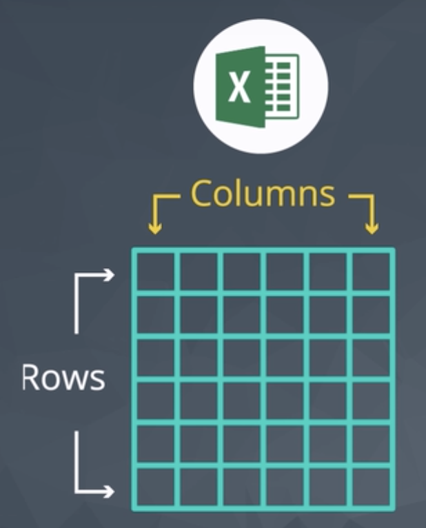

# How Databases Store Data

If you've ever used Excel, you should already be familiar with tables.

They're similar to spreadsheet tables. They have rows and columns just like Excel but **have some rigid rules**.

Database tables, for instance, are organized by column, and **each column must have a unique name**. You'll notice that some columns contain numbers, while others contain text.

In a spreadsheet, each cell can have it's own data type. But in a database table, **all the data in a column must be of the same type**.

This makes performing analysis on databases tables pretty simple. While the data type **must be consistent**, the database doesn't necessarily know that a number means latitude, or that the text is a name of a company. That's Why **Descriptive column names are important**.

## Summary

A few key points about data stored in SQL databases:

- **Data in databases is stored in tables that can be thought of just like Excel spreadsheets**.
For the most part, you can think of a database as a bunch of Excel spreadsheets. Each spreadsheet has rows and columns. Where each row holds data on a transaction, a person, a company, etc., while each column holds data pertaining to a particular aspect of one of the rows you care about like a name, location, a unique id, etc.

- **All the data in the same column must match in terms of data type**.
An entire column is considered quantitative, discrete, or as some sort of string. This means if you have one row with a string in a particular column, the entire column might change to a text data type. This can be very bad if you want to do math with this column!

- **Consistent column types are one of the main reasons working with databases is fast**.
Often databases hold a **LOT** of data. So, knowing that the columns are all of the same type of data means that obtaining data from a database can still be fast. 
