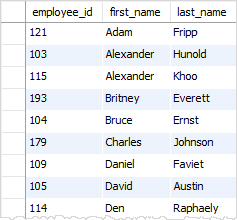
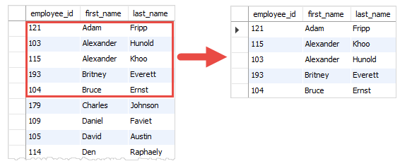
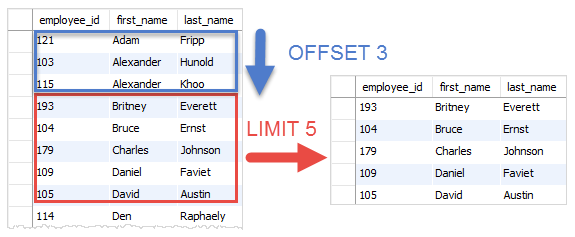

# LIMIT clause

In this lesson, you will learn how to use the PostgreSQL LIMIT clause to get a subset of rows generated by a query.

## Scenarios

The aim of many of your queries will simply be to see what a particular table looks like.

You want to **scan the first rows of data** to get an **idea of which fields you care about and how you want to manipulate them**, or maybe you want to get the first three rows because the result of your table query is in a specific order (such as descending or ascending prices). **Typically, you often use the LIMIT clause to select rows with the highest or lowest values from a table**.

For example, if you want to take a look at traffic departure in Posey's website, the first thing you want to do is get a sense of what data is stored in the web traffic table.

In order to do this, you really only need to see a few lines of data. Many analysts use the **LIMIT** clause as a **simple way to keep their queries from taking too long to return**.

If you query a table with hundreds of millions of rows and don't use a **LIMIT**, you could end up waiting a long time for all of your results to be displayed. This doesn't make sense if you only care about the first few lines.

## Introduction to PostgreSQL LIMIT clause

PostgreSQL `LIMIT` is an optional clause of the `SELECT` statement that constrains the number of rows returned by the query.

The following illustrates the syntax of the `LIMIT` clause:

```console
SELECT select_list
  FROM table_name
  ORDER BY sort_expression
LIMIT row_count
```

Don't worry about the `ORDER BY` clause, you'll learn about ordering the records of a query in the next lesson.

The statement returns `row_count` rows generated by the query.
- If row_count is `zero`, `LIMIT 0`, the query returns an empty set.
- In case row_count is `NULL`, `LIMIT NULL` the query returns the same result set as it does not have the LIMIT clause.
- In case row_count is `10`, `LIMIT 10` the query returns the first 10 rows generated by the query.

In case you want to skip a number of rows before returning the `row_count` rows, you use `OFFSET` clause placed after the `LIMIT` clause as the following statement:

```console
SELECT select_list
  FROM table_name
 LIMIT row_count OFFSET row_to_skip;
```

The statement first skips `row_to_skip` rows before returning `row_count` rows generated by the query.
- If `row_to_skip` is zero, `LIMIT 10 OFFSET 0` the statement will work like it doesn’t have the `OFFSET` clause, `LIMIT 10`.
- If `row_to_skip` is 4, `LIMIT 10 OFFSET 4` the statement skips the first 4 rows generated by the query and returns the next 10 records in the output, the records `5,6,7,..,14`.

Because a table may store rows in an **unspecified order**, when you use the LIMIT clause, you **should always use** the `ORDER BY` clause **to control the row order**.

If you **don’t use** the `ORDER BY` clause, **you may get a result set with the unspecified order of rows**.


## HR LIMIT example

We’ll use the `employees` table in the sample database to demonstrate the `LIMIT & OFFSET` clauses.

```console
hr=# \d employees
                                            Table "public.employees"
    Column     |          Type          | Collation | Nullable |                    Default
---------------+------------------------+-----------+----------+------------------------------------------------
 employee_id   | integer                |           | not null | nextval('employees_employee_id_seq'::regclass)
 first_name    | character varying(20)  |           |          |
 last_name     | character varying(25)  |           | not null |
 email         | character varying(100) |           | not null |
 phone_number  | character varying(20)  |           |          |
 hire_date     | date                   |           | not null |
 job_id        | integer                |           | not null |
 salary        | numeric(8,2)           |           | not null |
 manager_id    | integer                |           |          |
 department_id | integer                |           |          |
Indexes:
    "employees_pkey" PRIMARY KEY, btree (employee_id)
```

The following statement returns all rows in the `employees` table sorted by the `first_name` column:

```console
hr=# SELECT employee_id, first_name, last_name
hr-#   FROM employees
hr-#  ORDER BY first_name;
```



The following example uses the `LIMIT` clause to return `the first 5 rows` in the result set returned by the `SELECT` clause:

**Query**
```console
hr=# SELECT employee_id, first_name, last_name
hr-#   FROM employees
hr-#  ORDER BY first_name
hr-#  LIMIT 5;
```

**Output**




```console
 employee_id | first_name | last_name
-------------+------------+-----------
         121 | Adam       | Fripp
         115 | Alexander  | Khoo
         103 | Alexander  | Hunold
         193 | Britney    | Everett
         104 | Bruce      | Ernst
(5 rows)
```

### LIMIT with OFFSET example

The following example uses both `LIMIT` & `OFFSET` clauses to return **five rows** `starting from the` **4th row**:

**Query**
```console
hr=# SELECT employee_id, first_name, last_name
hr-#   FROM employees
hr-#  ORDER BY first_name
hr-#  LIMIT 5 OFFSET 3;
```

**Output**



```console
 employee_id | first_name | last_name
-------------+------------+-----------
         193 | Britney    | Everett
         104 | Bruce      | Ernst
         179 | Charles    | Johnson
         109 | Daniel     | Faviet
         105 | David      | Austin
(5 rows)
```

### Using SQL LIMIT to get the top N rows with the highest or lowest value

You can use the `LIMIT` clause to get the `top N rows` with the `highest` or `lowest` **value**.

For example, the following statement gets the **top five employees with the highest salaries**.

**Query**
```console
hr=# SELECT employee_id, first_name, last_name, salary
hr-#   FROM employees
hr-#  ORDER BY salary DESC
hr-#  LIMIT 5;
```

**Output**
```console
 employee_id | first_name | last_name |  salary
-------------+------------+-----------+----------
         100 | Steven     | King      | 24000.00
         102 | Lex        | De Haan   | 17000.00
         101 | Neena      | Kochhar   | 17000.00
         145 | John       | Russell   | 14000.00
         146 | Karen      | Partners  | 13500.00
(5 rows)
```

1. First, the `ORDER BY` clause sorts the employees by salary in descending order and
2. then the `LIMIT` clause restricts five rows returned from the query.

To get **the top five employees with the lowest salary**, you sort the employees by salary in the ascending order instead.

**Query**
```console
hr=# SELECT employee_id, first_name, last_name, salary
hr-#   FROM employees
hr-#  ORDER BY salary ASC
hr-#  LIMIT 5;
```
**Output**
```console
 employee_id | first_name |  last_name  | salary
-------------+------------+-------------+---------
         119 | Karen      | Colmenares  | 2500.00
         118 | Guy        | Himuro      | 2600.00
         126 | Irene      | Mikkilineni | 2700.00
         117 | Sigal      | Tobias      | 2800.00
         116 | Shelli     | Baida       | 2900.00
(5 rows)
```

### Getting the rows with the Nth highest value

Suppose you have to get employees who have the **2nd highest salary in the company**. To do so, you use the `LIMIT OFFSET` clauses as follows.

**Query**
```console
hr=# SELECT employee_id, first_name, last_name, salary
hr-#   FROM employees
hr-#  ORDER BY salary DESC
hr-#  LIMIT 1 OFFSET 1;
```
**Output**
```console
 employee_id | first_name | last_name |  salary
-------------+------------+-----------+----------
         101 | Neena      | Kochhar   | 17000.00
(1 row)
```

The `ORDER BY` clause sorts the employees by salary in descending order. And the `LIMIT 1 OFFSET 1` clause gets the second row from the result set.

|employee_id | first_name | last_name |  salary|
|:----------:|:----------:|:---------:|:------:|
|100 | Steven     | King      | 24000.00
|**102** | **Lex**        | **De Haan**   | **17000.00**
|101 | Neena      | Kochhar   | **17000.00**
|145 | John       | Russell   | 14000.00
|146 | Karen      | Partners  | 13500.00
(5 rows)

This query `works` with the **assumption that every employee has a different salary**. It will `fail` if **there are two employees who have the same highest salary**.

To fix this issue, you can get the second highest salary first using the following statement.

```console
hr=# SELECT DISTINCT salary
hr-#   FROM employees
hr-#  ORDER BY salary DESC
hr-#  LIMIT 1 OFFSET 1;
  salary
----------
 17000.00
(1 row)
```

And pass the result to another query:

**Query**
```console
hr=# SELECT employee_id, first_name, last_name, salary
hr-#   FROM employees
hr-#  WHERE salary = 17000.00;
```
**Output**
```console
 employee_id | first_name | last_name |  salary
-------------+------------+-----------+----------
         101 | Neena      | Kochhar   | 17000.00
         102 | Lex        | De Haan   | 17000.00
(2 rows)
```

If you know `subquery`, you can combine both queries into a single query as follows:

**Query**
```console
hr=# SELECT employee_id, first_name, last_name, salary
hr-#   FROM employees
hr-#  WHERE salary = (
hr(#               SELECT DISTINCT salary
hr(#                 FROM employees
hr(#                ORDER BY salary DESC
hr(#                LIMIT 1 OFFSET 1);
```

**Output**
```console
 employee_id | first_name | last_name |  salary
-------------+------------+-----------+----------
         101 | Neena      | Kochhar   | 17000.00
         102 | Lex        | De Haan   | 17000.00
(2 rows)
```

## DVDRENTAL LIMIT example

Let’s take some examples of using the PostgreSQL `LIMIT` clause. We will use the **film** table in the sample database for the demonstration.

```console
dvdrental=# \d film
                                              Table "public.film"
      Column      |            Type             | Collation | Nullable |                Default
------------------+-----------------------------+-----------+----------+---------------------------------------
 film_id          | integer                     |           | not null | nextval('film_film_id_seq'::regclass)
 title            | character varying(255)      |           | not null |
 description      | text                        |           |          |
 release_year     | year                        |           |          |
 language_id      | smallint                    |           | not null |
 rental_duration  | smallint                    |           | not null | 3
 rental_rate      | numeric(4,2)                |           | not null | 4.99
 length           | smallint                    |           |          |
 replacement_cost | numeric(5,2)                |           | not null | 19.99
 rating           | mpaa_rating                 |           |          | 'G'::mpaa_rating
 last_update      | timestamp without time zone |           | not null | now()
 special_features | text[]                      |           |          |
 fulltext         | tsvector                    |           | not null |
Indexes:
    "film_pkey" PRIMARY KEY, btree (film_id)
```

1. **Using PostgreSQL LIMIT to constrain the number of returned rows example**

This example uses the LIMIT clause to get the `first five films sorted by` **film_id**:

**QUERY**
```console
dvdrental=# SELECT
dvdrental-#        film_id,
dvdrental-#        title,
dvdrental-#        release_year
dvdrental-#   FROM film
dvdrental-#  ORDER BY film_id
dvdrental-#  LIMIT 5;
```

**Output**
```console
film_id |      title       | release_year
---------+------------------+--------------
      1 | Academy Dinosaur |         2006
      2 | Ace Goldfinger   |         2006
      3 | Adaptation Holes |         2006
      4 | Affair Prejudice |         2006
      5 | African Egg      |         2006
(5 rows)
```

2. **Using PostgreSQL LIMIT with OFFSET example**

To retrieve 4 films starting from the fourth one ordered by `film_id`, you use both `LIMIT` and `OFFSET` clauses as follows:

**Query**
```console
dvdrental=# SELECT
dvdrental-#        film_id,
dvdrental-#        title,
dvdrental-#        release_year
dvdrental-#   FROM film
dvdrental-#  ORDER BY film_id
dvdrental-#  LIMIT 4 OFFSET 3;
```
**Output**
```console
 film_id |      title       | release_year
---------+------------------+--------------
       4 | Affair Prejudice |         2006
       5 | African Egg      |         2006
       6 | Agent Truman     |         2006
       7 | Airplane Sierra  |         2006
(4 rows)
```

3. **Using PostgreSQL LIMIT OFFSSET to get top / bottom N rows**

Typically, you often use the `LIMIT` clause to select rows with the `highest` or `lowest` values from a table.

For example, **to get the top 10 most expensive films in terms of rental**, you sort films by the rental rate in descending order and use the LIMIT clause to get the first 10 films. The following query illustrates the idea:

**Query**
```console
dvdrental=# SELECT
dvdrental-#        film_id,
dvdrental-#        title,
dvdrental-#        rental_rate
dvdrental-#   FROM film
dvdrental-#  ORDER BY rental_rate DESC
dvdrental-#  LIMIT 10;
```

**Output**
```console
 film_id |        title        | rental_rate
---------+---------------------+-------------
      13 | Ali Forever         |        4.99
      20 | Amelie Hellfighters |        4.99
       7 | Airplane Sierra     |        4.99
      10 | Aladdin Calendar    |        4.99
       2 | Ace Goldfinger      |        4.99
       8 | Airport Pollock     |        4.99
      98 | Bright Encounters   |        4.99
     133 | Chamber Italian     |        4.99
     384 | Grosse Wonderful    |        4.99
      21 | American Circus     |        4.99
(10 rows)
```


## Parch&Posey LIMIT example

Let's use the **LIMIT** to **look at just the first 10 rows** of `web_traffic`.

```console
SELECT *
  FROM web_events
 LIMIT 10;
```

**LIMIT** gets written in at **the end of the query with the number**. this will limit the number of rows returned. For example, `LIMIT 10` will return the first 10 rows of results and omit the rest. `LIMIT 100000` will return the first 100000 rows. Since there aren't that many, it simply returns all the rows in the table.

Let's execute this query from the `psql` prompt. See the previous lessons to connect to the database.

```console
parch_posey=# SELECT *
parch_posey-#   FROM web_events
parch_posey-#  LIMIT 10;
 id | account_id |     occurred_at     | channel
----+------------+---------------------+---------
  1 |       1001 | 2015-10-06 17:13:58 | direct
  2 |       1001 | 2015-11-05 03:08:26 | direct
  3 |       1001 | 2015-12-04 03:57:24 | direct
  4 |       1001 | 2016-01-02 00:55:03 | direct
  5 |       1001 | 2016-02-01 19:02:33 | direct
  6 |       1001 | 2016-03-02 15:15:22 | direct
  7 |       1001 | 2016-04-01 10:58:55 | direct
  8 |       1001 | 2016-05-01 15:26:44 | direct
  9 |       1001 | 2016-05-31 20:53:47 | direct
 10 |       1001 | 2016-06-30 12:09:45 | direct
(10 rows)
```

**LIMIT with OFFSET example**

To retrieve 4 records starting from the fourth one.

```console
parch_posey=# SELECT *
parch_posey-#   FROM web_events
parch_posey-#  LIMIT 4 OFFSET 3;
 id | account_id |     occurred_at     | channel
----+------------+---------------------+---------
  4 |       1001 | 2016-01-02 00:55:03 | direct
  5 |       1001 | 2016-02-01 19:02:33 | direct
  6 |       1001 | 2016-03-02 15:15:22 | direct
  7 |       1001 | 2016-04-01 10:58:55 | direct
(4 rows)
```

### Summary

We have already seen the `SELECT` (**to choose columns**) and `FROM` (**to choose tables**) statements. The `LIMIT` statement is useful when you want to see just the first few rows of a table. This can be much faster for loading than if we load the entire dataset.

The LIMIT command is always the very last part of a query. An example of showing just the first 10 rows of the orders table with all of the columns might look like the following:

```console
SELECT *
  FROM orders
 LIMIT 10;
```

We could also change the number of rows by changing the 10 to any other number of rows.

### Additional resources

- [LIMIT](https://www.postgresqltutorial.com/postgresql-tutorial/postgresql-limit/)
