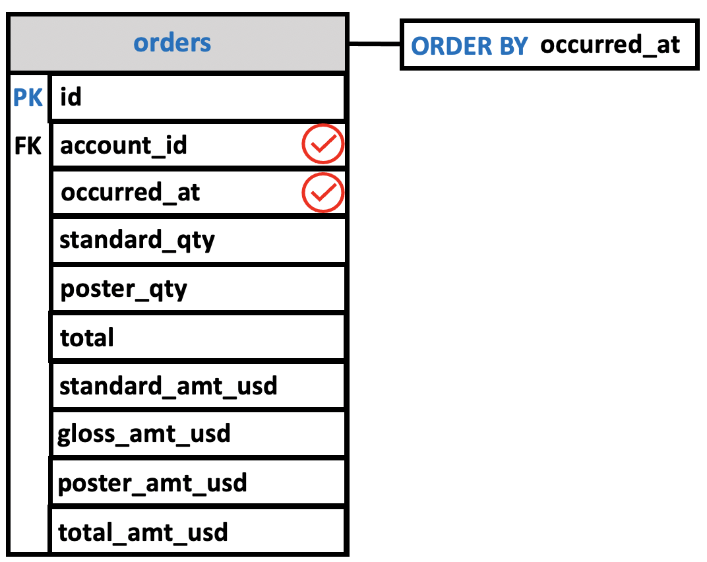
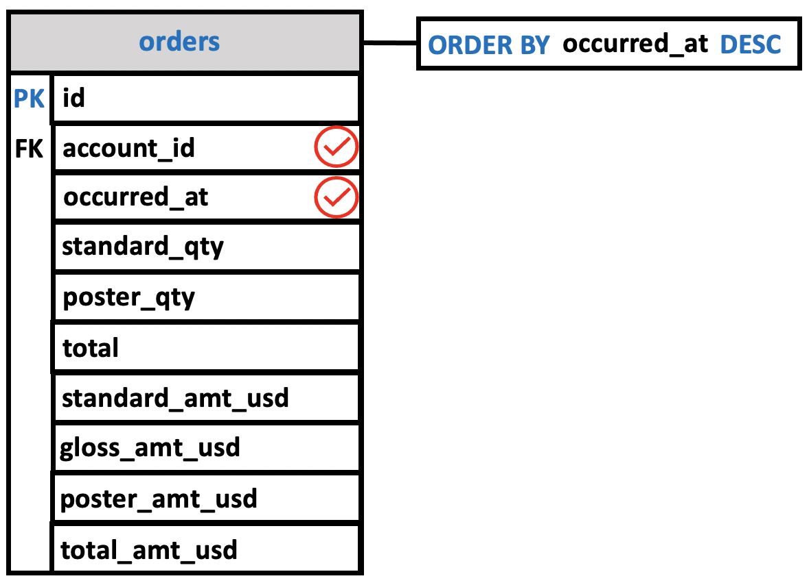
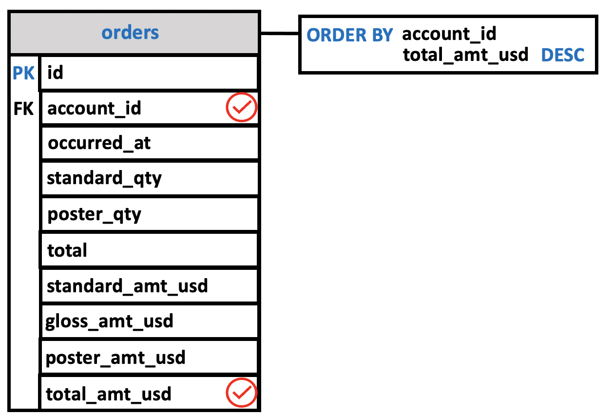
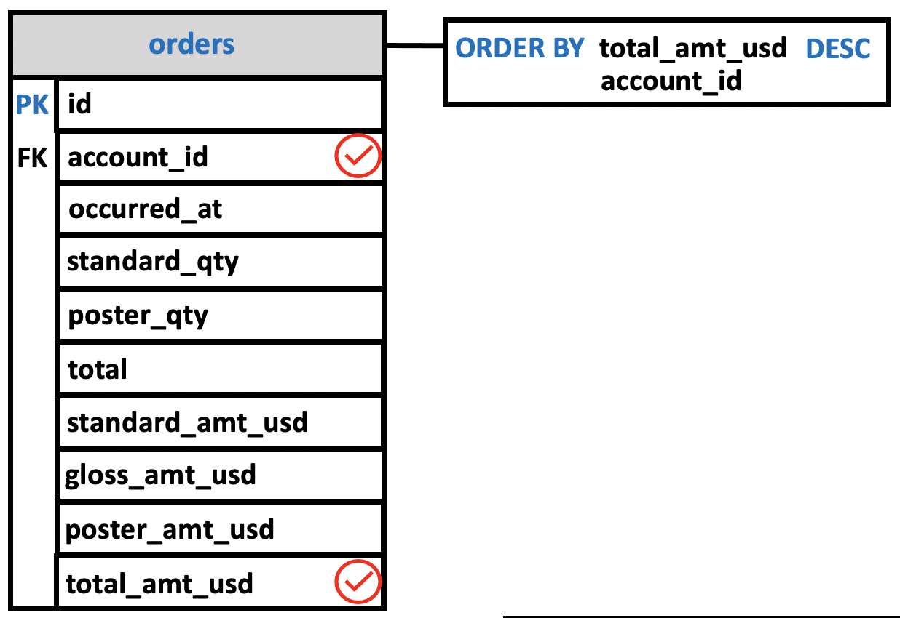

# ORDER BY clause

The order of the records within a table has no significance to SQL.  **When records are retrieved from a table**, therefore, **the order in which they appear is arbitrary**. So, When you query data from a table, **the** `SELECT` **statement returns rows in an unspecified order**.

Yet sometimes we wish to see the data resulting from a query ordered in a specific way. To allow this, SQL provides the `ORDER BY` clause for the `SELECT` statement.

**To sort the rows of the result set**, you use the `ORDER BY` clause in the SELECT statement.

The general form of a `SELECT` **statement using** `ORDER BY` is:

```console
SELECT <column names>
  FROM <table>
 ORDER BY <column names>;
```

As before, `<column names>` after `SELECT` and `<table>` indicate the columns that should be selected from the named table. Most importantly for our purposes, the `<column names>` following `ORDER BY` indicate the column(s) whose values should be used to order the selected records. The default order is **ascending order** or `ASC`.

SQL also allows records to be listed in **reverse order** or **descending order**.

```console
SELECT <column names>
  FROM <table>
 ORDER BY <column names> DESC;
```

The following illustrates the syntax of the ORDER BY clause:

```cosnole
SELECT <column names>
  FROM <table>
 ORDER BY <column name> (ASC | DESC),
          <column name> (ASC | DESC),
            ...            ...
          <column name> (ASC | DESC);
```
this syntax:

First, specify a column that you want to sort after the ORDER BY keywords. If you want to sort the result set based on multiple columns you need to place a comma (,) between two columns or expressions to separate them.
Second, you use the `ASC` option to sort rows in ascending order and the `DESC` option to sort rows in descending order. If you omit the `ASC` or `DESC` option, the `ORDER BY` **uses** `ASC` **by default**.

PostgreSQL evaluates the clauses in the SELECT statment in the following order: FROM, SELECT, and ORDER BY:

```console
FROM -> SELECT -> ORDER BY
```

Due to the order of evaluation, if you have a column `alias` in the SELECT clause, you can use it in the ORDER BY clause. But we'll talk about alias in the following lessons.

Let’s take some examples of using the PostgreSQL ORDER BY clause.

The **query diagram** for `ORDER BY` is shows the selected table with a **box indicating the column on which the ordering is based**. If two or more columns are used, both are included in the `ORDER BY` box.


## Parch&Posey ORDER BY example

Imagine yourself in the finance department at Parch & Posey. You want to look up the **most recent** orders, so that you can confirm that invoices have been sent to those customers.

The `ORDER BY` clause will help you to accomplish this by **allowing you to sort the orders by date**.

Let's first take a look at how data is ordered by default.

```console
parch_posey=# SELECT id,
parch_posey-#        account_id,
parch_posey-#        occurred_at
parch_posey-#   FROM orders
parch_posey-#   LIMIT 20;

id | account_id |     occurred_at
----+------------+---------------------
  1 |       1001 | 2015-10-06 17:31:14
  2 |       1001 | 2015-11-05 03:34:33
  3 |       1001 | 2015-12-04 04:21:55
  4 |       1001 | 2016-01-02 01:18:24
  5 |       1001 | 2016-02-01 19:27:27
  6 |       1001 | 2016-03-02 15:29:32
  7 |       1001 | 2016-04-01 11:20:18
  8 |       1001 | 2016-05-01 15:55:51
  9 |       1001 | 2016-05-31 21:22:48
 10 |       1001 | 2016-06-30 12:32:05
 11 |       1001 | 2016-07-30 03:26:30
 12 |       1001 | 2016-08-28 07:13:39
 13 |       1001 | 2016-09-26 23:28:25
 14 |       1001 | 2016-10-26 20:31:30
 15 |       1001 | 2016-11-25 23:21:32
 16 |       1001 | 2016-12-24 05:53:13
 17 |       1011 | 2016-12-21 10:59:34
 18 |       1021 | 2015-10-12 02:21:56
 19 |       1021 | 2015-11-11 07:37:01
 20 |       1021 | 2015-12-11 16:53:18
(20 rows)
```

You'll notice that this table `appears` to be sorted by `account_id`. It starts at 1001 and goes to 1011, 1021 ... However, the order of the rows in the table has no significance to SQL.

### Using PostgreSQL ORDER BY clause to sort rows by one column

Let's add an `ORDER BY` clause to **reorder** the results **based on the date the order was placed**, which you can see in the `occurred_at` column.

```console
SELECT account_id,
       occurred_at
  FROM orders
 ORDER BY occurred_at
 LIMIT 20;
```

Notice that the `ORSER BY` clause goes between the `FROM` and `LIMIT` clauses. Remember the `ORDER BY` **must appear after** `FROM` **and before** `LIMIT` **clauses**. **You must write the clauses in this order, or the query will not run**.




```console
parch_posey=# SELECT account_id,
parch_posey-#        occurred_at
parch_posey-#   FROM orders
parch_posey-#  ORDER BY occurred_at
parch_posey-#  LIMIT 20;
 account_id |     occurred_at
------------+---------------------
       2861 | 2013-12-04 04:22:44
       2861 | 2013-12-04 04:45:54
       4311 | 2013-12-04 04:53:25
       1281 | 2013-12-05 20:29:16
       1281 | 2013-12-05 20:33:56
       2481 | 2013-12-06 02:13:20
       3431 | 2013-12-06 12:55:22
       3431 | 2013-12-06 12:57:41
       3251 | 2013-12-06 13:14:47
       3251 | 2013-12-06 13:17:25
       3491 | 2013-12-06 23:45:16
       3491 | 2013-12-06 23:47:45
       2731 | 2013-12-08 00:54:42
       4491 | 2013-12-08 06:34:23
       1301 | 2013-12-08 07:05:07
       1301 | 2013-12-08 07:11:38
       1881 | 2013-12-08 18:24:52
       1881 | 2013-12-08 18:32:52
       3141 | 2013-12-08 20:13:49
       3141 | 2013-12-08 20:37:53
(20 rows)
```

By the **default**, `ORDER BY` goes from:

- `a` to `z`, **Ascending alphabetical order**.
- `lowest` to `highest`, **Ascending numerical order**.
- `earliest` to `latest`, **Ascending date order**.

This is referred to as **ascending** order. You'll notice that that's happening in the result of our last query. The **earliest date** is `2013-12-04 04:22:44` and the client `2861` is the first client that placed an order.

## Using PostgreSQL ORDER BY clause to sort rows by one column in descending order

If you want to order the other way, you can add `DESC` option, short for **descending**, to the **end of the** `ORDER BY` clause. This will get us the data set that we're after, which **shows the 10 most recent orders** with the most recent at the top.

```console
SELECT account_id,
       occurred_at
  FROM orders
  ORDER BY occurred_at DESC
  LIMIT 10;
```



```console
parch_posey=# SELECT account_id,
parch_posey-#        occurred_at
parch_posey-#   FROM orders
parch_posey-#  ORDER BY occurred_at DESC
parch_posey-#  LIMIT 10;
 account_id |     occurred_at
------------+---------------------
       3841 | 2017-01-02 00:02:40
       3841 | 2017-01-01 23:50:16
       3861 | 2017-01-01 22:29:50
       3861 | 2017-01-01 22:17:26
       4051 | 2017-01-01 21:04:25
       4051 | 2017-01-01 20:52:23
       1761 | 2017-01-01 17:34:10
       1961 | 2017-01-01 16:40:57
       3431 | 2017-01-01 14:05:39
       3431 | 2017-01-01 13:57:21
(10 rows)
```
The last order was placed the `2017-01-02 00:02:40`.

### Using PostgreSQL ORDER BY clause to sort rows by multiple columns

Let's say you want to **order results by** `account`, and **within each account**, have **orders sorted** from **largest to smallest**, so you'll be able to quickly see

- what the largest orders were for each account.

You can use an `ORDER BY` clause **over multiple columns** to achieve this, and the **sorting** will happen in **the order that you specify the columns**.

```console
SELECT account_id
       total_amt_usd
  FROM orders
 ORDER BY account_id,
          total_amt_usd DESC
```


so, let's start by ordering by `account_id` first, and then `total_amt_usd`, which we'll make **descending**, so the largest values will be first.

```console
parch_posey=# SELECT account_id,
parch_posey-#        total_amt_usd
parch_posey-#   FROM orders
parch_posey-#  ORDER BY account_id,
parch_posey-#           total_amt_usd DESC;
account_id | total_amt_usd
------------+---------------
      1001 |       9426.71
      1001 |       9230.67
      1001 |       9134.31
      1001 |       8963.91
      1001 |       8863.24
      1001 |       8757.18
      .... |        ......
      .... |        ......
      .... |        ......
      1011 |       2734.59
      1021 |       2945.73
      1021 |       2944.24
      1021 |       2936.92
      1021 |       2747.11
      .... |       .......
```

So, I run this, you can see that the first account we get is `1001` and then the orders descends from `9426` all the way down to `2734.59`. And then after that, we have `1021` and that account's largest orders and so forth.

Now, what happens if I flip the columns in the `ORDER BY` clause.

```console
SELECT account_id
       total_amt_usd
  FROM orders
 ORDER BY total_amt_usd DESC,
          account_id;
```

So, the amount will be first and then we sort by account_id.



```console
parch_posey=# SELECT account_id,
parch_posey-#        total_amt_usd
parch_posey-#   FROM orders
parch_posey-#  ORDER BY total_amt_usd DESC,
parch_posey-#           account_id
parch_posey-#  LIMIT 50;
 account_id | total_amt_usd
------------+---------------
       4251 |     232207.07
       4161 |     112875.18
       4211 |     107533.55
       2861 |      95005.82
       4101 |      93547.84
       4111 |      93505.69
       1301 |      93106.81
       1521 |      92991.05
       1341 |      84099.62
       4151 |      82163.71
       .... |      ........
```

What's happening here is that we're starting with the highest amount and sorting descending. So, this is the largest order of all time at `$ 232207.07` and that went to account `4251`. Now, it doesn't seem to be sorting by `account_id`. The reason for that is that, all of these amounts **are so precise** that there aren't multiple rows of the same amount. So, if there were two rows in the set with the exact same amount, you might notice that account_id within that is sorted from smallest to largest. So the secondary sorting by account ID **is difficult to see here**, since only if there were two orders with equal total dollar amounts would there need to be any sorting by account ID.

## DVDRENTAL ORDER BY examples

We will use the `customer` table in the sample database for the demonstration.

```console
dvdrental=# \d customer
                                             Table "public.customer"
   Column    |            Type             | Collation | Nullable |                    Default
-------------+-----------------------------+-----------+----------+-----------------------------------------------
 customer_id | integer                     |           | not null | nextval('customer_customer_id_seq'::regclass)
 store_id    | smallint                    |           | not null |
 first_name  | character varying(45)       |           | not null |
 last_name   | character varying(45)       |           | not null |
 email       | character varying(50)       |           |          |
 address_id  | smallint                    |           | not null |
 activebool  | boolean                     |           | not null | true
 create_date | date                        |           | not null | ('now'::text)::date
 last_update | timestamp without time zone |           |          | now()
 active      | integer                     |           |          |
Indexes:
    "customer_pkey" PRIMARY KEY, btree (customer_id)
```

### Using PostgreSQL ORDER BY clause to sort rows by one column

The following query uses the ORDER BY clause to sort customers by their `first names` in `ascending order`:

**Query**
```console
dvdrental=# SELECT first_name, last_name
dvdrental-#   FROM customer
dvdrental-#  ORDER BY first_name ASC
dvdrental-#  LIMIT 10;
```

**Output**
```console
 first_name | last_name
------------+-----------
 Aaron      | Selby
 Adam       | Gooch
 Adrian     | Clary
 Agnes      | Bishop
 Alan       | Kahn
 Albert     | Crouse
 Alberto    | Henning
 Alex       | Gresham
 Alexander  | Fennell
 Alfred     | Casillas
(10 rows)
```

Since the `ASC` option is the default, you can omit it in the `ORDER BY` clause like this:

**Query**
```console
dvdrental=# SELECT first_name, last_name
dvdrental-#   FROM customer
dvdrental-#  ORDER BY first_name
dvdrental-#  LIMIT 10;
```

**Output**
```console
 first_name | last_name
------------+-----------
 Aaron      | Selby
 Adam       | Gooch
 Adrian     | Clary
 Agnes      | Bishop
 Alan       | Kahn
 Albert     | Crouse
 Alberto    | Henning
 Alex       | Gresham
 Alexander  | Fennell
 Alfred     | Casillas
(10 rows)
```

### Using PostgreSQL ORDER BY clause to sort rows by one column in descending order

The following statement selects the first name and last name from the `customer` table and sorts the rows by values in the `last name` column in `descending order`:

**Query**
```console
dvdrental=# SELECT first_name, last_name
dvdrental-#   FROM customer
dvdrental-#  ORDER BY last_name DESC
dvdrental-#  LIMIT 10;
```

**Output**
```console
 first_name | last_name
------------+-----------
 Cynthia    | Young
 Marvin     | Yee
 Luis       | Yanez
 Brian      | Wyman
 Brenda     | Wright
 Tyler      | Wren
 Florence   | Woods
 Lori       | Wood
 Virgil     | Wofford
 Darren     | Windham
(10 rows)
```

### Using PostgreSQL ORDER BY clause to sort rows by multiple columns

The following statement selects the `first name` and `last name` from the customer table and sorts the rows by
- the `first name` in `ascending order` and
- `last name` in `descending order`:

**Query**
```console
dvdrental=# SELECT first_name, last_name
dvdrental-#   FROM customer
dvdrental-#  ORDER BY first_name ASC,
dvdrental-#           last_name DESC
dvdrental-#  LIMIT 10 OFFSET 320;
```

**Output**
```console
first_name | last_name
------------+-----------
Kathleen   | Adams
Kathryn    | Coleman
Kathy      | James
Katie      | Elliott
Kay        | Caldwell
Keith      | Rico
Kelly      | Torres
Kelly      | Knott
Ken        | Prewitt
Kenneth    | Gooden
(10 rows)
```

|first_name | last_name|
|:---------:|:--------:|
|Kathleen   | Adams|
|Kathryn    | Coleman|
|Kathy      | James|
|Katie      | Elliott|
|Kay        | Caldwell|
|Keith      | Rico|
|**Kelly**      | **Torres**|
|**Kelly**      | **Knott**|

In this example, the `ORDER BY` clause sorts rows by values in
- the `first_name` column first. And then it sorts the sorted rows by values
- in the `last name` column.

As you can see clearly from the output, two customers with the same first name `Kelly` have the **last name sorted in descending order**.

### Using PostgreSQL ORDER BY clause to sort rows by expressions

The `LENGTH()` function accepts a string and returns the length of that string.

The following statement selects the `first names` and their *lengths*. **It sorts the rows by the lengths of the** `first_name`:

**Query**
```console
dvdrental=# SELECT first_name,
dvdrental-#        LENGTH(first_name) AS len
dvdrental-#   FROM customer
dvdrental-#  ORDER BY len DESC
dvdrental-#  LIMIT 10;
```

**Output**
```console
 first_name  | len
-------------+-----
 Christopher |  11
 Jacqueline  |  10
 Charlotte   |   9
 Christina   |   9
 Elizabeth   |   9
 Josephine   |   9
 Christine   |   9
 Stephanie   |   9
 Katherine   |   9
 Catherine   |   9
(10 rows)
```

Because the `ORDER BY` clause is evaluated after the `SELECT` clause, the column alias `len` is available and can be used in the `ORDER BY` clause.

```console
FROM -> SELECT -> ORDER BY
```

### PostgreSQL ORDER BY clause and NULL

In the database world, `NULL` is a marker that indicates the missing data or the data is unknown at the time of recording.

When you sort rows that contains `NULL`, **you can specify the order of** `NULL` with other *non-null* values by using the `NULLS FIRST` or `NULLS LAST` option of the `ORDER BY` clause:

```console
ORDER BY sort_expresssion [ASC | DESC] [NULLS FIRST | NULLS LAST]
```

- The `NULLS FIRST` option places `NULL` **before** other *non-null* values and
- the `NULL LAST` option places `NULL` **after** other *non-null* values.

Let’s create a table for the demonstration.

```console
uniy=# CREATE TABLE sort_demo (
uniy(#         num INT
uniy(# );
CREATE TABLE
uniy=# \d sort_demo
             Table "public.sort_demo"
 Column |  Type   | Collation | Nullable | Default
--------+---------+-----------+----------+---------
 num    | integer |           |          |
```

insert some data:

```console
uniy=# INSERT INTO sort_demo
uniy-#        (num)
uniy-# VALUES (1),
uniy-#        (2),
uniy-#        (3),
uniy-#        (NULL);
INSERT 0 4
```

The following query returns data from the `sort_demo` table:

```console
uniy=# \pset null NULL
Null display is "NULL".
```

**Query**
```console
uniy=# SELECT num
uniy-#   FROM sort_demo
uniy-#  ORDER BY num;
```

**Output**
```console
 num
------
    1
    2
    3
 NULL
(4 rows)
```

In this example, the `ORDER BY` clause sorts values in the `num` column of the `sort_demo` table in **ascending order**. It places `NULL` **after other values**.

So if you use the `ASC` option, the `ORDER BY` clause uses the `NULLS LAST` option by **default**. Therefore, the following query returns the same result:

```console
SELECT num
FROM sort_demo
ORDER BY num NULLS LAST;
```

To place `NULL` before other *non-null* values, you use the `NULLS FIRST` option:

**Query**
```console
uniy=# SELECT num
uniy-#   FROM sort_demo
uniy-#  ORDER BY num NULLS FIRST;
```

**Output**
```console
 num
------
 NULL
    1
    2
    3
(4 rows)
```

The following statement sorts values in the `num` column of the `sort_demo` table in **descending order**:

**Query**
```console
uniy=# SELECT num
uniy-#   FROM sort_demo
uniy-#  ORDER BY num DESC;
```
**Output**
```console
 num
------
 NULL
    3
    2
    1
(4 rows)
```

As you can see clearly from the output, the `ORDER BY` clause with the `DESC` option uses the `NULLS FIRST` by default.

To reverse the order, you can use the `NULLS LAST` option:

**Query**
```console
uniy=# SELECT num
uniy-#   FROM sort_demo
uniy-#  ORDER BY num DESC NULLS LAST;
```

**Output**
```console
 num
------
    3
    2
    1
 NULL
(4 rows)
```

## Uniy ORDER BY example

1. **Example: Listing selected data in order using column name**

**Problem**: Give an alphabetical list of teachers and their phone numbers.

```console
uniy=# \d teachers
                    Table "public.teachers"
    Column    |     Type      | Collation | Nullable | Default
--------------+---------------+-----------+----------+---------
 teacher_id   | smallint      |           | not null |
 teacher_name | character(18) |           |          |
 phone        | character(10) |           |          |
 salary       | numeric(10,2) |           |          |
Indexes:
    "teachers_pkey" PRIMARY KEY, btree (teacher_id)
```

**Query**
```console
uniy=# SELECT teacher_name, phone
uniy-#   FROM teachers
uniy-#  ORDER BY teacher_name;
```

**Output**
```console
    teacher_name    |   phone
--------------------+------------
 Dr. Cooke          | 257-8088
 Dr. Engle          | 256-4621
 Dr. Horn           | 257-3049
 Dr. Lowe           | 257-2390
 Dr. Olsen          | 257-8086
 Dr. Scango         | 257-3046
 Dr. Wright         | 257-3393
(7 rows)
```

2. **Example: Listing selected data in reverse order**

**Problem**: Give a list of teachers and their phone numbers in reverse alphabetical order.

**Query**
```console
uniy=# SELECT teacher_name, phone
uniy-#   FROM teachers
uniy-#  ORDER BY teacher_name DESC;
```

**Output**
```console
    teacher_name    |   phone
--------------------+------------
 Dr. Wright         | 257-3393
 Dr. Scango         | 257-3046
 Dr. Olsen          | 257-8086
 Dr. Lowe           | 257-2390
 Dr. Horn           | 257-3049
 Dr. Engle          | 256-4621
 Dr. Cooke          | 257-8088
(7 rows)
```

3. **Example: Ordering selected data by two columns**

**Problem**: List the name, cities, and states of all students ordered first by state, then by city within that state.

```console
uniy=# \d students
                    Table "public.students"
    Column    |     Type      | Collation | Nullable | Default
--------------+---------------+-----------+----------+---------
 student_id   | smallint      |           | not null |
 student_name | character(18) |           |          |
 address      | character(20) |           |          |
 city         | character(10) |           |          |
 state        | character(2)  |           |          |
 zip          | character(5)  |           |          |
 gender       | character(1)  |           |          |
Indexes:
    "students_pkey" PRIMARY KEY, btree (student_id)
```

**Query**
```console
uniy=# SELECT state, city, student_name
uniy-#   FROM students
uniy-#  ORDER BY state, city;
```
**Output**
```console
 state |    city    |    student_name
-------+------------+--------------------
 CA    | Newport    | Bill Jones
 CT    | Hartford   | Susan Pugh
 DE    | Newark     | Joe Adams
 IL    | Chicago    | Val Shipp
 IL    | Chicago    | Allen Thomas
 MA    | Boston     | Carol Dean
 NY    | New York   | John Anderson
 PA    | Erie       | Janet Thomas
 PA    | Haverford  | Susan Powell
 PA    | Pennsburg  | Janet Ladd
 RI    | Newport    | Bob Dawson
 VA    | Vienna     | Howard Mansfield
(12 rows)
```

4. **Example: Combining ordering with a WHERE clause**

**Problem**: List all three-credit courses alphabetically by departments.

```console
uniy=# \d courses
                    Table "public.courses"
   Column    |     Type      | Collation | Nullable | Default
-------------+---------------+-----------+----------+---------
 course_id   | smallint      |           | not null |
 course_name | character(20) |           |          |
 department  | character(16) |           |          |
 num_credits | smallint      |           |          |
Indexes:
    "courses_pkey" PRIMARY KEY, btree (course_id)
```

**Query**

```console
uniy=# SELECT department, course_name
uniy-#   FROM courses
uniy-#  WHERE num_credits = 3
uniy-#  ORDER BY department;
```

**Output**
```console
    department    |     course_name
------------------+----------------------
 Computer Science | Compiler Writing
 English          | English Composition
 History          | Western Civilization
 History          | Art History
(4 rows)
```

## Summary

The `ORDER BY` statement **allows us to sort our results using the data in any column**. If you are familiar with *Excel* or *Google Sheets*, using `ORDER BY` is similar to sorting a sheet using a column. A key difference, however, is that **using ORDER BY in a SQL query only has temporary effects**, for the results of that query, unlike sorting a sheet by column in Excel or Sheets.

In other words, when you use ORDER BY in a SQL query, your output will be sorted that way, but then the next query you run will encounter the unsorted data again. It's important to keep in mind that this is different than using common spreadsheet software, where sorting the spreadsheet by column actually alters the data in that sheet until you undo or change that sorting. This highlights the meaning and function of a SQL "query."

The **ORDER BY** statement always comes in a query after the **SELECT** and **FROM** statements, but before the **LIMIT** statement.

If you are using the **LIMIT** statement, it **will always appear last**. As you learn additional commands, the order of these statements will matter more.

Remember `DESC` can be added after the column in your `ORDER BY` statement to sort in descending order, as the default is to sort in ascending order.

Lastly, we saw that we can `ORDER BY` **more than one column at a time**. When you **provide a list of columns** in an ORDER BY command, **the sorting occurs using the leftmost column in your list first**, then the next column from the left, and so on. We still have the ability to flip the way we order using DESC.

## Exercises

1. Write a query to return the **10 earliest** `orders` in the orders table. Include the `id`, `occurred_at`, and `total_amt_usd`.

```console
SELECT id,
       occurred_at,
       total_amt_usd
  FROM orders
 ORDER BY occurred_at
 LIMIT 10;
```

2. Write a query to return **the top 5** `orders` in terms of largest `total_amt_usd`. Include the `id`, `account_id`, and `total_amt_usd`.

```console
SELECT id,
       account_id,
       total_amt_usd
  FROM orders
 ORDER BY total_amt_usd DESC
 LIMIT 5;
```

3. Write a query to return **the lowest 20** `orders` in terms of smallest `total_amt_usd`. Include the `id`, `account_id`, and `total_amt_usd`.

```console
SELECT id,
       account_id,
       total_amt_usd
  FROM orders
 ORDER BY total_amt_usd
 LIMIT 20;
```


## Additional Resources

- [ODER BY](https://www.postgresqltutorial.com/postgresql-tutorial/postgresql-order-by/)
