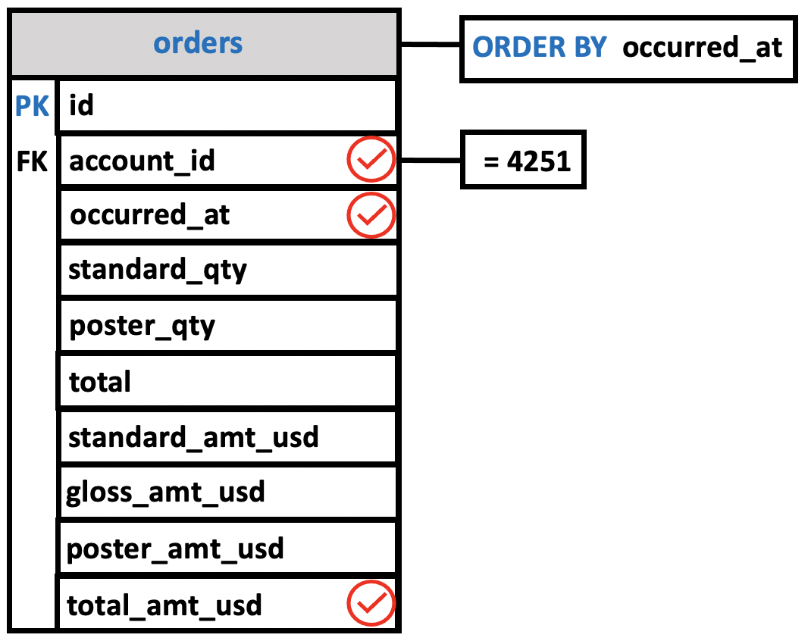
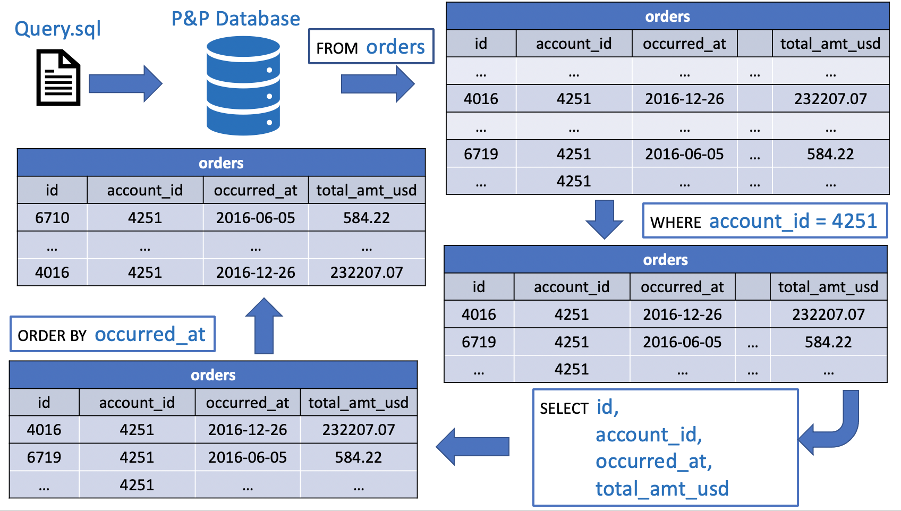

# WHERE clause

In this lesson, you will learn how to use PostgreSQL **WHERE** clause **to filter rows returned by a SELECT statement**.

The `SELECT` statement **returns all rows from one or more columns in a table**.

To **select rows that satisfy a specified condition**, you use a `WHERE` clause.

## Selecting Only Some of a Table's Records: The WHERE clause

So far, every `SELECT` statement has returned at least one value for every record in the table.

- What if we wish to see the **values only for records that meet specific criteria**?

To do this, we must use the `SELECT` statement's `WHERE` clause. The `WHERE` clause lets us specify a *predicate*, something that is either **true** or **false** about each record in the table.

**Only those records for which the** `predicate` **is** `true` **will be listed in the results**.

The general form of a `SELECT` using `WHERE` is:

```console
SELECT <column names>
  FROM <table>
 WHERE <predicate>;  
```

As before, `<column names>` and `<table>` are replaced by appropriate column and table names. `<predicate>` can be replaced by a number of different things, depending on exactly what restrictions you wish to place on the results. In the next lessons, we'll examine the possible restrictions allowed by predicates.

The **query diagrams** for `SELECT`'s with a `WHERE` clause indicate the `WHERE`'s restriction in a box attached to the restricted column. For each type of predicate, the box contains an appropriate description of the restriction applied to that column.

## Comparisons in a WHERE Clause

Probably the most common *predicates* are those that compare values. For these types of queries, the general form is:

```console
SELECT <column names>
  FROM <table>
 WHERE <column name> <operator> <value>;
```

As before, `<column names>` and `<table>` represent the names of the desired columns and the name of the table from which you should draw them.  The `WHERE` clause is more complex, however. The first item, `<column name>`, must name a particular column in the table. This column might or might not be among those listed in `<column names>`.

After the `<column name>` but before the `<value>` comes an `<operator>`. The choices for this operator, known as a *comparison* operator, are shown in the table below:

| OPERATOR | FUNCTION |
|:----------:|:----------:|
|    **=**     | **true** if the value contained in <column name> equals the value given in the WHERE clause|
| **<>** | **true** if the value contained in <column name> is not equal to that given in the WHERE clause (some systems use other symbols, such as **!=**, in place of <>)|
| **<** | **true** if the value contained in <column name> is less than the value given in the WHERE clause |
| **>** | **true** if the value contained in <column name> is greater than the value given in the WHERE clause |
| **<=** | **true** if the value contained in <column name> is less than or equal to the value given in the WHERE clause |
| **>=** | **true** if the value contained in <column name> is greater than or equal to the value given in the WHERE clause |

The *predicate* ends with a `<value>`. The exact form of this value varies depending on the type of the named column. For columns of numeric types, a numeric value is simply placed after the operator. If the column is `CHARACTER (CHAR)` or `CHARACTER VARYING (VARCHAR)`, however, the characters comprising the value must be enclosed in single quotes.

Although SQL is usually not sensitive to the difference between upper and lower-case letters, case does make a difference for comparisons using quoted character values. For example, the character string 'Hello' and 'HELLO' are not considered equal to one another. Also, some strings are longer than others. According to the SQL standard, comparing two strings of unequal length conceptually adds blanks to the end of the shorter string and then performs the comparison. And, like numeric values, you can ask whether one character string is less than or greater than another. The comparison is performed based on the collating sequence used byb your system. In general, this collating sequence for an English-language installation of SQL will result in a normal alphabetic comparison, with `A` less than `B`, `B` less than `C`, and so on. (Whether digits are less than letters varies, though, depending on the character set specified as the default for the implementation.)

In some cases, the `<value>` might also be a `<column name>`. If the `<table>` identifies a column in `<column name>`, the values in the two columns are compared for each record; only those records in which the two values satisfy the condiction (e.g., =) are returned. Alternatively, the `<column name>` might identify a column in a *different* table. In this case, records from both tables can be examined and retrieved. Retrieving data from more than one table at a time is called a *join* and is discussed later in the course.

## Postgres WHERE Clause overview

The syntax of the PostgreSQL WHERE clause is as follows:

```console
SELECT <column names>
  FROM <table>
 WHERE condition
 ORDER BY sort_expression;
```

The `WHERE` clause appears right after the `FROM` clause of the `SELECT` statement. Just remember this order `SELECT,FROM, WHERE`.  The WHERE clause uses the condition to filter the rows returned from the SELECT clause.

**The condition must evaluate** to `true`, `false`, or `unknown`.

It can be a
- boolean expression or
- a combination of boolean expressions using the AND and OR operators.

The query returns only rows that satisfy the condition in the WHERE clause. In other words, **only rows that cause the condition evaluates to** `true` will be included in the result set.

PostgreSQL evaluates the WHERE clause after the FROM clause and before the SELECT and ORDER BY clause:

If you use column **aliases** in the `SELECT` clause, **you cannot use them in the** `WHERE` **clause**.

```console
FROM -> WHERE -> SELECT -> ORDER BY
```

Besides the SELECT statement, you can use the WHERE clause in the UPDATE and DELETE statement to specify rows to be updated or deleted.

## Using WHERE clause with the equal (=) operator example

Imagine yourself as an account manager at Parch and Posey. You are about to head out to visit one of your most important customer and you want to show up prepared, which means making sure that you are up to speed on all of their recent purchases.

You can use a `WHERE` clause to generate a list of all purchases made by that specific customer.

The `WHERE` clause allows you to filter a set of results based on specific criteria as you would with Excel's filter capability.

**Filtering** with `WHERE` allows you to answer much more meaningful questions. You'll end up using it in most of the queries that you write.

The `WHERE` clause goes after `FROM` but before `ORDER BY` or `LIMIT`.

As in previous queries the clauses must be in the right order or the query will return an error.

As an account manager, we'll write a query to show only orders from our top customers, which is represented by account_id `4251` (see the query in the previous lesson `10_order_by`).

```console
SELECT account_id,
       occurred_at,
       total_amt_usd
  FROM orders
 WHERE account_id = 4251
 ORDER BY occurred_at
 LIMIT 20;
```

This simple equation `account_id = 4251` produce a result set that includes **all rows** for which the **value** in the `account_id` column is equal to `4251`.



```console
parch_posey=# SELECT account_id,
parch_posey-#        occurred_at,
parch_posey-#        total_amt_usd
parch_posey-#   FROM orders
parch_posey-#  WHERE account_id = 4251
parch_posey-#  ORDER BY occurred_at
parch_posey-#  LIMIT 20;
 account_id |     occurred_at     | total_amt_usd
------------+---------------------+---------------
       4251 | 2016-06-05 01:16:37 |        584.22
       4251 | 2016-06-05 01:36:42 |       3236.09
       4251 | 2016-07-04 12:34:49 |       2546.20
       4251 | 2016-08-02 00:53:28 |       3698.45
       4251 | 2016-08-02 01:13:08 |        199.19
       4251 | 2016-09-01 02:32:51 |       2867.18
       4251 | 2016-09-01 02:39:55 |        952.76
       4251 | 2016-09-30 13:31:53 |       2802.08
       4251 | 2016-10-29 12:04:06 |       2500.05
       4251 | 2016-11-27 15:16:07 |        514.25
       4251 | 2016-11-27 15:17:06 |       2808.93
       4251 | 2016-12-26 08:39:56 |        402.71
       4251 | 2016-12-26 08:53:24 |     232207.07
(13 rows)
```
There are 13 rows in the query output. When using SQL entire rows of data **preserved intact**. If you write a WHERE clause that filters based on values in one column as we have done in the last query, you'll limit the results in all columns to rows that satisfy the condition. The idea is that **each row is one data point or observation and all the information contained in that row belongs together**.

**All the information in one row is about one order of paper**.

For instance, in the previous query we included the column `account_id` in the `SELECT` statement. However, we see that this value appears in all the rows and therefore is redundant. A more clever query is to **include the primary key** so that we can retrieve all the values of the other columns for each record in the table with a `WHERE` clause.

```console
parch_posey=# SELECT id,
parch_posey-#        occurred_at,
parch_posey-#        total_amt_usd
parch_posey-#   FROM orders
parch_posey-#  WHERE account_id = 4251
parch_posey-#  ORDER BY occurred_at;
  id  |     occurred_at     | total_amt_usd
------+---------------------+---------------
 6719 | 2016-06-05 01:16:37 |        584.22
 4009 | 2016-06-05 01:36:42 |       3236.09
 4010 | 2016-07-04 12:34:49 |       2546.20
 4011 | 2016-08-02 00:53:28 |       3698.45
 6720 | 2016-08-02 01:13:08 |        199.19
 4012 | 2016-09-01 02:32:51 |       2867.18
 6721 | 2016-09-01 02:39:55 |        952.76
 4013 | 2016-09-30 13:31:53 |       2802.08
 4014 | 2016-10-29 12:04:06 |       2500.05
 6722 | 2016-11-27 15:16:07 |        514.25
 4015 | 2016-11-27 15:17:06 |       2808.93
 6723 | 2016-12-26 08:39:56 |        402.71
 4016 | 2016-12-26 08:53:24 |     232207.07
(13 rows)
```

Now, let's say we want to retrieve all the information about the oldest order placed by customer `4251`.

```console
parch_posey=# SELECT *
parch_posey-#   FROM orders
parch_posey-#  WHERE id = 6719;
  id  | account_id |     occurred_at     | standard_qty | gloss_qty | poster_qty | total | standard_amt_usd | gloss_amt_usd | poster_amt_usd | total_amt_usd
------+------------+---------------------+--------------+-----------+------------+-------+------------------+---------------+----------------+---------------
 6719 |       4251 | 2016-06-05 01:16:37 |            0 |        78 |          0 |    78 |             0.00 |        584.22 |           0.00 |        584.22
(1 row)

parch_posey=#
```

We see that the entire row of data is preserved intact. In the picture below there is a logical flow on how PostgreSQL process our query.



### Questions
Write a query that:

1. Pulls the first 5 rows and all columns from the `orders` table that have a dollar amount of `gloss_amt_usd` **greater than or equal** to **1000**.

```console
SELECT *
  FROM orders
 WHERE gloss_amt_usd >= 1000
 LIMIT 5;
```

2. Pulls the first 10 rows and all columns from the `orders` table that have a `total_amt_usd` **less than 500**.

```console
SELECT *
  FROM orders
 WHERE total_amt_usd < 500
 LIMIT 10;
```

## Summary

Using the WHERE statement, we can **display subsets of tables based on conditions that must be met**. You can also think of the WHERE command as **filtering** the data.


Common symbols used in WHERE statements include:

1. `>` (greater than)

2. `<` (less than)

3. `>=` (greater than or equal to)

4. `<=` (less than or equal to)

5. `=` (equal to)

6. `!=` or `<>` (not equal to)
