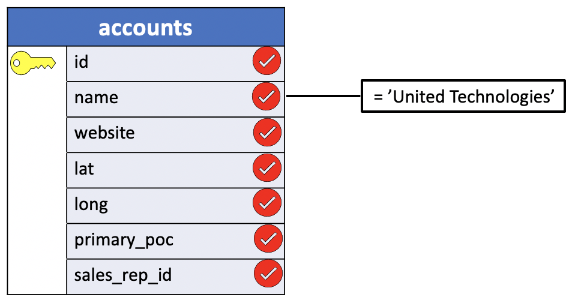

# WHERE Clause with Non-numeric Data

Comparison operators can work with **non-numerical data** as well.

Includes `=`, `!=`, `>`, `<` as well as other tools for comparing columns/values.

## Using WHERE clause with the equal (=) and (!=) operator example

The `=` and `!=` allow you to select rows that match or don't match any value.

```console
parch_posey=# \d accounts
                    Table "public.accounts"
    Column    |     Type      | Collation | Nullable | Default
--------------+---------------+-----------+----------+---------
 id           | integer       |           | not null |
 name         | bpchar        |           |          |
 website      | bpchar        |           |          |
 lat          | numeric(11,8) |           |          |
 long         | numeric(11,8) |           |          |
 primary_poc  | bpchar        |           |          |
 sales_rep_id | integer       |           |          |
Indexes:
    "accounts_pkey" PRIMARY KEY, btree (id)
```

Let's look an example from P&P's `accounts` table which simply lists all of their customers and tell attributes about them.

```console
parch_posey=# SELECT *
parch_posey-#   FROM accounts
parch_posey-#   LIMIT 5;
  id  |        name        |          website          |     lat     |     long     |  primary_poc   | sales_rep_id
------+--------------------+---------------------------+-------------+--------------+----------------+--------------
 1001 | Walmart            | www.walmart.com           | 40.23849561 | -75.10329704 | Tamara Tuma    |       321500
 1011 | Exxon Mobil        | www.exxonmobil.com        | 41.16915630 | -73.84937379 | Sung Shields   |       321510
 1021 | Apple              | www.apple.com             | 42.29049481 | -76.08400942 | Jodee Lupo     |       321520
 1031 | Berkshire Hathaway | www.berkshirehathaway.com | 40.94902131 | -75.76389759 | Serafina Banda |       321530
 1041 | McKesson           | www.mckesson.com          | 42.21709326 | -75.28499823 | Angeles Crusoe |       321540
(5 rows)
```

There are some important rules when using the comparison operators with non-numeric data.

**Operations**: If you're using an `operation` with **values that are not-numeric**, you need **to put the value in single quotes**, `('')`.

```console
SELECT *
  FROM accounts
 WHERE name = 'United Technologies';
```



Let's execute this query.

```console
parch_posey=# SELECT *
parch_posey-#   FROM accounts
parch_posey-#  WHERE name = 'United Technologies';
  id  |        name         |   website   |     lat     |     long     |    primary_poc    | sales_rep_id
------+---------------------+-------------+-------------+--------------+-------------------+--------------
 1441 | United Technologies | www.utc.com | 42.32939700 | -75.15785469 | Janett Wisecarver |       321520
(1 row)
```

As you can see, this data set has been filtered down to the single row that matches the condition in our `WHERE` clause.

```console
SELECT *
  FROM accounts
 WHERE name != 'United Technologies';
```

If we change the condition in our `WHERE` to `!=`, the results will show every row except the one for the `United Technologies`.

```console
parch_posey=# SELECT *
parch_posey-#   FROM accounts
parch_posey-#  WHERE name != 'United Technologies';
  id  |                name                 |              website              |     lat     |     long      |      primary_poc      | sales_rep_id
------+-------------------------------------+-----------------------------------+-------------+---------------+-----------------------+--------------
 1001 | Walmart                             | www.walmart.com                   | 40.23849561 |  -75.10329704 | Tamara Tuma           |       321500
 1011 | Exxon Mobil                         | www.exxonmobil.com                | 41.16915630 |  -73.84937379 | Sung Shields          |       321510
 1021 | Apple                               | www.apple.com                     | 42.29049481 |  -76.08400942 | Jodee Lupo            |       321520
 1031 | Berkshire Hathaway                  | www.berkshirehathaway.com         | 40.94902131 |  -75.76389759 | Serafina Banda        |       321530
 1041 | McKesson                            | www.mckesson.com                  | 42.21709326 |  -75.28499823 | Angeles Crusoe        |       321540
```

We can double check the number of rows for each query output with the `COUNT` operation. We'll discuss about `COUNT` later.

```console
parch_posey=# SELECT COUNT(*)
parch_posey-#   FROM accounts;
 count
-------
   351
(1 row)
```

There are `351` rows or records in the `accounts` table.

```console
parch_posey=# SELECT COUNT(*)
parch_posey-#   FROM accounts
parch_posey-#  WHERE name != 'United Technologies';
 count
-------
   350
(1 row)
```

As expected, there is only one record with the 'United Technologies' name.

## Exercise

- Filter the accounts table to include the company `name`, `website`, and the primary point of contact (`primary_poc`) just for the `Exxon Mobil` company in the accounts table.


```console
SELECT name,
       website,
       primary_poc
  FROM accounts
 WHERE name = 'Exxon Mobil';
```
