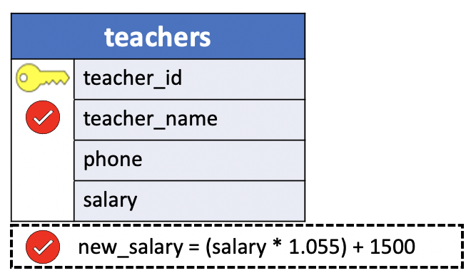
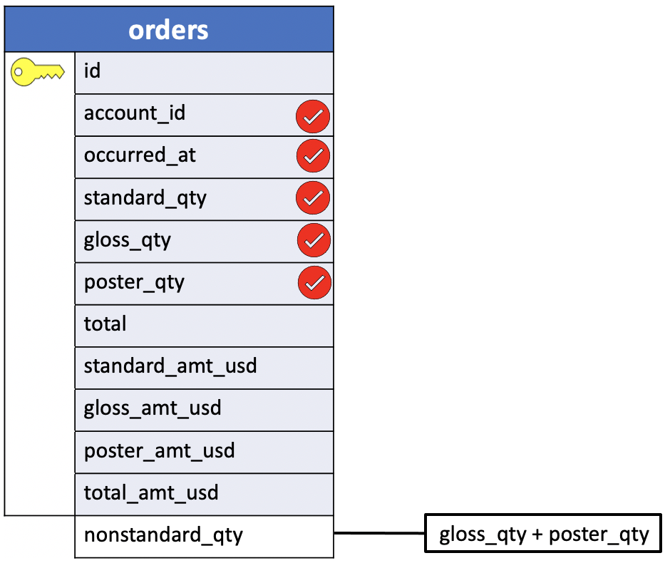

# Arithmetic operations - Derived columns - column Alias

Retrieving the information stored in a table is undoubtedly useful. Sometimes, though, the stored information is not exactly what we are interested in. Suppose, for example, that we wish to know how much each employee's salary would be if we gave everyone a flat $1000 raise. Or perhaps we would like to see what the new salaries would be after an across-the-board 10 percent increase. For these kind of queries, SQL provides the four basic arithmetic operations of addition, subtraction, multiplication and division. (While addition and subtraction are represented in queries by the familiar `+` and `-` symbols, multiplication and division use the symbols `*` and `/`, respectively).

Within a query, for instance,
- we can add a fixed amount to every value in a column or multiply each of a column's values by some amount.
- It is even possible to add two columns together or subtract the values of one column in a record from those of another.

In this lesson you will learn about PostgreSQL `column aliases` and how to use column aliases to `assign temporary names` to `columns` in queries.

SQL alias allows you to assign a table or a column a temporary name during the execution of a query. SQL has two types of aliases:

1. table alias
2. column alias.

We'll talk about table alias later in this course.

## Introduction to the PostgreSQL column aliases

A column alias allows you to assign a column or an expression in the select list of a `SELECT` statement a temporary name. **The column alias exists temporarily during the execution of the query**.


The following illustrates the syntax of using a column alias:

```sql
SELECT column_name AS alias_name
FROM table_name;
```

In this syntax, the `column_name` is assigned an alias `alias_name`. The **AS** keyword is *optional* so you can omit it like this:

```sql
SELECT column_name alias_name
FROM table_name;
```
The following syntax illustrates how to set an alias for an expression in the `SELECT` clause:

```sql
SELECT expression AS alias_name
FROM table_name;
```

The main purpose of column aliases is to make the headings of the output of a query more meaningful.

**IMPORTANT NOTE REMINDER**

Since you assign aliases to columns in the `SELECT` clause, **you can only reference the aliases in the clauses that are evaluated after** the `SELECT` clause.

PostgreSQL evaluates the `WHERE` clause after the `FROM` clause and before the `SELECT` and `ORDER BY` clause:

If you use column **aliases** in the `SELECT` clause, **you cannot use them in the** `WHERE` **clause**.


- `FROM` **->** `WHERE` **->** `SELECT` **->** `ORDER BY`


### DVDRENTAL columns ALIAS example

We’ll use the `customer` table from the sample database to show you how to work with column aliases.

```console
dvdrental=# \d customer
                                             Table "public.customer"
   Column    |            Type             | Collation | Nullable |                    Default
-------------+-----------------------------+-----------+----------+-----------------------------------------------
 customer_id | integer                     |           | not null | nextval('customer_customer_id_seq'::regclass)
 store_id    | smallint                    |           | not null |
 first_name  | character varying(45)       |           | not null |
 last_name   | character varying(45)       |           | not null |
 email       | character varying(50)       |           |          |
 address_id  | smallint                    |           | not null |
 activebool  | boolean                     |           | not null | true
 create_date | date                        |           | not null | ('now'::text)::date
 last_update | timestamp without time zone |           |          | now()
 active      | integer                     |           |          |
Indexes:
    "customer_pkey" PRIMARY KEY, btree (customer_id)
```

1. **Assigning a column alias to a column example**

The following query returns the first names and last names of all customers from the customer table:

**SQL**

```sql
SELECT first_name,
       last_name
  FROM customer;
```

**Query**
```console
dvdrental=# SELECT first_name,
dvdrental-#        last_name
dvdrental-#   FROM customer
dvdrental-#  LIMIT 5;
```

**Output**
```console
 first_name | last_name
------------+-----------
 Jared      | Ely
 Mary       | Smith
 Patricia   | Johnson
 Linda      | Williams
 Barbara    | Jones
(5 rows)
```

If you want to rename the `last_name` heading, you can assign it a new name using a column alias like this:

**SQL**
```sql
SELECT first_name,
       last_name AS surname
  FROM customer;
```

**Query**
```console
dvdrental=# SELECT first_name,
dvdrental-#        last_name AS surname
dvdrental-#   FROM customer
dvdrental-#  LIMIT 5;
```
**Output**
```console
 first_name | surname
------------+----------
 Jared      | Ely
 Mary       | Smith
 Patricia   | Johnson
 Linda      | Williams
 Barbara    | Jones
(5 rows)
```

This query assigned the surname as the alias of the last_name column:

Or you can make it shorter by removing the AS keyword as follows:

**SQL**
```sql
SELECT first_name,
       last_name surname
  FROM customer;
```
2. **Assigning a column alias to an expression example**

The following query returns the full names of all customers. It constructs the full name by concatenating the first name, space, and the last name:

**SQL**
```sql
SELECT first_name || ' ' || last_name
FROM customer;
```

Note that in PostgreSQL, you use the `||` as the **concatenating operator** that concatenates one or more **strings** into a single string.

**Query**
```console
dvdrental=# SELECT first_name || ' ' || last_name
dvdrental-#   FROM customer
dvdrental-#  LIMIT 5;
```
**Output**
```console
     ?column?
------------------
 Jared Ely
 Mary Smith
 Patricia Johnson
 Linda Williams
 Barbara Jones
(5 rows)
```

As you can see clearly from the output, the heading of the column is not meaningful `?column?`.

To fix this, you can assign the **expression** `first_name || ' ' || last_name` a column alias e.g., `full_name`:

**SQL**
```sql
SELECT first_name || ' ' || last_name AS full_name
  FROM customer;
```

**Query**
```console
dvdrental=# SELECT first_name || ' ' || last_name AS full_name
dvdrental-#   FROM customer
dvdrental-#  LIMIT 5;
```

**Output**
```console
    full_name
------------------
 Jared Ely
 Mary Smith
 Patricia Johnson
 Linda Williams
 Barbara Jones
(5 rows)
```

3. **Column aliases that contain spaces**

If a column alias contains one or more spaces, you need to surround it with double `""` quotes like this:

**SQL**
```sql
column_name AS "column alias"
```

For example:

```sql
SELECT first_name || ' ' || last_name "full name"
FROM customer;
```

**Query**
```console
dvdrental=# SELECT first_name || ' ' || last_name "full name"
dvdrental-#   FROM customer
dvdrental-#  LIMIT 5;
```
**Output**
```console
    full name
------------------
 Jared Ely
 Mary Smith
 Patricia Johnson
 Linda Williams
 Barbara Jones
(5 rows)
```

## HR column alias example

When designing database tables, you may use abbreviations for the column names to keep them short. For example:

The `so_no` stands for sales order number.
The `qty` stands for quantity.
Or you may have to work with legacy systems that aggressively use abbreviations for naming `columns` and `tables`.

When you use SQL to query data from these tables, the **output is not obvious**. To fix it, you can use column aliases that give columns temporary names during the execution of the query.

The following example shows how to use the column aliases:

```sql
SELECT inv_no AS invoice_no,
	     amount,
	     due_date AS "Due date",
	     cust_no "Customer No"
 FROM invoices;
```

This query has multiple column aliases:

- The `invoice_no` is the column alias of the `inv_no` column.
- The `Due date` is the column alias of the `due_date` column. Because the alias contains space, you have to place it inside double quotes `""`.
- The `Customer no` is the alias of the `cust_no` column. Note that it doesn’t has the `AS` keyword.

1. **Aliases for expressions**

If a query contains expressions, you can assign column aliases to the expressions. For example, consider the `employees` table in the `hr` sample database:

```console
hr=# \d employees
                                            Table "public.employees"
    Column     |          Type          | Collation | Nullable |                    Default
---------------+------------------------+-----------+----------+------------------------------------------------
 employee_id   | integer                |           | not null | nextval('employees_employee_id_seq'::regclass)
 first_name    | character varying(20)  |           |          |
 last_name     | character varying(25)  |           | not null |
 email         | character varying(100) |           | not null |
 phone_number  | character varying(20)  |           |          |
 hire_date     | date                   |           | not null |
 job_id        | integer                |           | not null |
 salary        | numeric(8,2)           |           | not null |
 manager_id    | integer                |           |          |
 department_id | integer                |           |          |
Indexes:
    "employees_pkey" PRIMARY KEY, btree (employee_id)
```

**SQL**
```sql
SELECT first_name,
       last_name,
       salary * 1.1 AS new_salary
  FROM employees;
```

**Query**
```console
hr=# SELECT first_name,
hr-#        last_name,
hr-#        salary * 1.1 AS new_salary
hr-#   FROM employees
hr-#  LIMIT 5;
```

**Output**
```console
 first_name | last_name | new_salary
------------+-----------+------------
 Steven     | King      |  26400.000
 Neena      | Kochhar   |  18700.000
 Lex        | De Haan   |  18700.000
 Alexander  | Hunold    |   9900.000
 Bruce      | Ernst     |   6600.000
(5 rows)
```
In this example, the database will use the column aliases as the heading of the expressions in the result set.

### Common mistakes of column aliases

Since you assign aliases to columns in the `SELECT` clause, **you can only reference the aliases in the clauses that are evaluated after** the `SELECT` clause.

The following query will result in an error:

**Sql**
```sql
SELECT first_name,
       last_name,
       salary * 1.1 AS new_salary
  FROM employees
 WHERE new_salary > 5000
```

**Query**
```console
hr=# SELECT first_name,
hr-#        last_name,
hr-#        salary * 1.1 AS new_salary
hr-#   FROM employees
hr-#  WHERE new_salary > 5000;
```

**Output**: `ERROR`
```console
ERROR:  column "new_salary" does not exist
LINE 5:  WHERE new_salary > 5000;
               ^
```

Why ?

If you use column **aliases** in the `SELECT` clause, **you cannot use them in the** `WHERE` **clause**.

In the previous `SELECT` statement, the database evaluates the clauses in the following order:

- `FROM` **->** `WHERE` **->** `SELECT`

The database evaluates the `WHERE` clause before the `SELECT` clause. Therefore, at the time it evaluates the `WHERE` clause, the database doesn’t have the information of the `new_salary` column alias. So it issued an error.

On the other hand, you can use aliases in the `ORDER BY` clause.

- `FROM` **->** `WHERE` **->** `SELECT` **->** `ORDER BY`

The following query works correctly:

**SQL**
```sql
SELECT first_name,
       last_name,
       salary * 1.1 AS new_salary
  FROM employees
 ORDER BY new_salary;
```

**Query**
```console
hr=# SELECT first_name,
hr-#        last_name,
hr-#        salary * 1.1 AS new_salary
hr-#   FROM employees
hr-#  ORDER BY new_salary
hr-#  LIMIT 5;
```

**Output**
```console
 first_name |  last_name  | new_salary
------------+-------------+------------
 Karen      | Colmenares  |   2750.000
 Guy        | Himuro      |   2860.000
 Irene      | Mikkilineni |   2970.000
 Sigal      | Tobias      |   3080.000
 Shelli     | Baida       |   3190.000
(5 rows)
```
In this example, the database evaluates the clauses of the query in the following order:

- `FROM` **->** `SELECT` **->** `ORDER BY`

The database evaluates the `SELECT` clause before the `ORDER BY` clause. Therefore, at the time of evaluating the `ORDER BY` clause, the database has the information of the `new_salary` alias, which is the alias of the expression `salary * 1.1`. Hence, it works as expected.

## Uniy: Doing Arithmetic with Selected Information

Retrieving the information stored in a table is undoubtedly useful. Sometimes, though, the stored information is not exactly what we're interested in.

Suppose, for example, that we wish to know how much each teacher's salary would be if we gave everyone a flat `$1,000` raise.

Or perhaps we would like to see what the new salaries would be after an across-the-board 10 percent increase.

For these kinds of queries, SQL provides the four basic arithmetic operations of `addition`,`subtraction`,`multiplication` and `division`. (While addition and subtraction are represented in queries by the familiar `+` and `-` symbols, multiplication and division use the symbols `*` and `/`, respectively.)

Within a query, for instance, we can
- **add a fixed amount to every value in a column** (as we saw in the examples of the previous sections in this course) or
- **multiply each of a column's values by some amount**.
- It's even possible to **add two columns together** or
- **subtract the values of one column in a record from those of another**.

To see what each teacher's salary would be after a flat `$1,000` raise, you could use the query:


**SQL**
```sql
SELECT teacher_name,
       salary + 1000 AS new_salary
  FROM teachers;
```

Because the second column of the results will be derived from one of the table's original columns, we give it a new name by adding `AS new_salary` after the arithmetic expression. In the results table, that column now will be labeled with our new name.

Similarly, to see what the teachers' salaries would be after a 10 percent raise, the query is:

**SQL**
```sql
SELECT teacher_name,
       salary * 1.10 AS new_salary
  FROM teachers;
```

As usual, a `WHERE` clause can be added to the query to restrict which records are selected.

To see, for example, the results of giving a 10 percent raise only to those teachers earning less than `$30,000`, one could type:

**SQL**
```sql
SELECT teacher_name,
       salary * 1.10 AS new_salary
  FROM teachers
 WHERE salary < 3000;
```

As might be expected, these arithmetic operations **can only be used on columns containing numeric values**. The query diagrams for queries containing these derived columns temporarily add an extra field to the table from which the values are derived.

### Operation precedence rules

Also, the four operations can be combined to form arbitrarily complex expressions. When two or more operations are combined in a single query, SQL defines rules for the precedence of each. In general, all occurrences of `*` and `/`, `multiplication` and `division`, are **performed first**, followed by all occurrences of `+` and `-`, `addition` and `subtraction`. Operations of equal precedence are carried out left to right.

If desired, these rules can be overridden by using `parentheses`: Anything inside parentheses happens first. For example, the expression:

- `salary - 10 + 5`

would first subtract 10 from salary, then add 5 back (why you would want to do this is unclear, but it is only an example :smile:). If we change the `+` to a `*`, however, giving:

- `salary - 10 * 5`

the precedence rules previously described cause a quite different outcome. Because multiplication has higher precedence than subtraction, the `10 * 5` happens first, and so `salary` is reduced by 50. If we instead wanted to subtract 10 from `salary`, then multiply the result by 5, we would need parentheses:

- `(salary - 10) * 5`

With the added parentheses, the subtraction is performed first, followed by the multiplication.

### NULL values

What about `NULL` values? Recalling that a `NULL` in a numeric field isn't the same as a `0` but is instead a value unique to itself. How then are `NULLs` handled during arithmetic operations?

The rule turns out to be somewhat extreme but very simple.

**rule**: Any arithmetic operation applied to a column containing a `NULL` value in one of its fields will return the value `NULL`.

This means, for instance, for any record in the `teachers` table that contains a `NULL` in its `salary` field, every expression involving that record's salary will also result in the value `NULL`. This simple but inflexible rule can sometimes be rather limiting. To avoid the problems of `NULL` values, it is possible to specify during a table's creation that one or more of its columns cannot contain `NULLs`.

### Example: Using arithmetic operations in queries

Let's consider the `teachers` table in the `uniy` sample database.

```console
uniy=# \d teachers
                    Table "public.teachers"
    Column    |     Type      | Collation | Nullable | Default
--------------+---------------+-----------+----------+---------
 teacher_id   | smallint      |           | not null |
 teacher_name | character(18) |           |          |
 phone        | character(10) |           |          |
 salary       | numeric(10,2) |           |          |
Indexes:
    "teachers_pkey" PRIMARY KEY, btree (teacher_id)
```

**Problem**

What would each teacher's salary be if he or she received a 5.5 percent cost of living increase and a `$1,500` merit increase?

**Query Diagram**



**SQL**
```sql
SELECT teacher_name,
       (salary * 1.055) + 1500 AS new_salary
  FROM teachers;
```

**Query**
```console
uniy=# SELECT teacher_name,
uniy-#        (salary * 1.055) + 1500 AS new_salary
uniy-#   FROM teachers;
```

**Output**
```console
    teacher_name    | new_salary
--------------------+-------------
 Dr. Horn           | 30554.70000
 Dr. Lowe           | 34679.75000
 Dr. Engle          | 41801.00000
 Dr. Cooke          | 32685.80000
 Dr. Olsen          | 35025.79000
 Dr. Scango         | 35363.39000
 Dr. Wright         | 38425.00000
(7 rows)
```


## Parch&Posey: Doing arithmetic with SELECTION and column Alias

Before we calculate **how much non-standard paper was sold**, let's check out the order quantities in each column of the orders.

```console
parch_posey=# \d orders
                              Table "public.orders"
      Column      |            Type             | Collation | Nullable | Default
------------------+-----------------------------+-----------+----------+---------
 id               | integer                     |           | not null |
 account_id       | integer                     |           |          |
 occurred_at      | timestamp without time zone |           |          |
 standard_qty     | integer                     |           |          |
 gloss_qty        | integer                     |           |          |
 poster_qty       | integer                     |           |          |
 total            | integer                     |           |          |
 standard_amt_usd | numeric(10,2)               |           |          |
 gloss_amt_usd    | numeric(10,2)               |           |          |
 poster_amt_usd   | numeric(10,2)               |           |          |
 total_amt_usd    | numeric(10,2)               |           |          |
Indexes:
    "orders_pkey" PRIMARY KEY, btree (id)
```

Let's select only the quantity columns.

- `standard_qty`
- `gloss_qty`  (non-standard)
- `poster_qty` (non-standard)

**SQL**
```sql
SELECT account_id,
       occurred_at,
       standard_qty,
       gloss_qty,
       poster_qty
  FROM orders
 LIMIT 5;
```

**Query**
```console
parch_posey=# SELECT account_id,
parch_posey-#        occurred_at,
parch_posey-#        standard_qty,
parch_posey-#        gloss_qty,
parch_posey-#        poster_qty
parch_posey-#   FROM orders
parch_posey-#  LIMIT 5;
```
**Output**
```console
account_id |     occurred_at     | standard_qty | gloss_qty | poster_qty
------------+---------------------+--------------+-----------+------------
       1001 | 2015-10-06 17:31:14 |          123 |        22 |         24
       1001 | 2015-11-05 03:34:33 |          190 |        41 |         57
       1001 | 2015-12-04 04:21:55 |           85 |        47 |          0
       1001 | 2016-01-02 01:18:24 |          144 |        32 |          0
       1001 | 2016-02-01 19:27:27 |          108 |        29 |         28
(5 rows)
```
Now, let's **create a new column** that **adds** `gloss_qty` and `poster_qty` to create a field `non_standard` paper. To do this, we'll create a new line in the query and use an arithmetic operator.

```sql
SELECT account_id,
       occurred_at,
       standard_qty,
       gloss_qty,
       poster_qty,
       gloss_qty + poster_qty
  FROM orders
 LIMIT 5;
```

Let's execute the query.

**Query**
```console
parch_posey=# SELECT account_id,
parch_posey-#        occurred_at,
parch_posey-#        standard_qty,
parch_posey-#        gloss_qty,
parch_posey-#        poster_qty,
parch_posey-#        gloss_qty + poster_qty
parch_posey-#   FROM orders
parch_posey-#  LIMIT 5;
```
**Output**
```console
account_id |     occurred_at     | standard_qty | gloss_qty | poster_qty | ?column?
------------+---------------------+--------------+-----------+------------+----------
      1001 | 2015-10-06 17:31:14 |          123 |        22 |         24 |       46
      1001 | 2015-11-05 03:34:33 |          190 |        41 |         57 |       98
      1001 | 2015-12-04 04:21:55 |           85 |        47 |          0 |       47
      1001 | 2016-01-02 01:18:24 |          144 |        32 |          0 |       32
      1001 | 2016-02-01 19:27:27 |          108 |        29 |         28 |       57
(5 rows)
```

You'll notice that the values in the column `?column?` are equal to the sum of the `gloss_qty` and `poster_qty` **on a row-by-row basis**.

In the first row:

| gloss_qty | poster_qty | ?column? |
|:---------:|:----------:|:--------:|
| 22| 24| 46|

22 `gloss` and 24 `poster` sum to 46 non standrad paper in the new column we've created. There is a special name for this. It's a **derived column**.

**Derived Column**: A **new column that is a manipulation of the exisiting columns in your database**.

Derive columns can include simple arithmetic or any number of advanced calculations. What makes them special is the fact that they're not just directly selected from the underlying data. **They are manipulated in some way**.

Rather than stick with this ugly column name `?column?`, let's add something more descriptive using an **alias**. We can do this by adding `AS` to the end of the line that produces the derived column and giving it a name.

The best practice is to use names that are clearly descriptive, following existing conventions and don't include capital letters or spaces.

**SQL**
```sql
SELECT account_id,
       occurred_at,
       standard_qty,
       gloss_qty,
       poster_qty,
       gloss_qty + poster_qty AS nonstandard_qty
  FROM orders
 LIMIT 5;
```



**Query**
```console
parch_posey=# SELECT account_id,
parch_posey-#        occurred_at,
parch_posey-#        standard_qty,
parch_posey-#        gloss_qty,
parch_posey-#        poster_qty,
parch_posey-#        gloss_qty + poster_qty AS nonstandard_qty
parch_posey-#   FROM orders
parch_posey-#  LIMIT 5;
```

**Output**
```console
 account_id |     occurred_at     | standard_qty | gloss_qty | poster_qty | nonstandard_qty
------------+---------------------+--------------+-----------+------------+-----------------
       1001 | 2015-10-06 17:31:14 |          123 |        22 |         24 |              46
       1001 | 2015-11-05 03:34:33 |          190 |        41 |         57 |              98
       1001 | 2015-12-04 04:21:55 |           85 |        47 |          0 |              47
       1001 | 2016-01-02 01:18:24 |          144 |        32 |          0 |              32
       1001 | 2016-02-01 19:27:27 |          108 |        29 |         28 |              57
(5 rows)
```

## Summary

Creating a new column that is a combination of existing columns is known as a **derived column** (or "**calculated**" or "**computed**" column). Usually you want to give a name, or "**alias**," to your new column using the `AS` keyword.

This derived column, and its alias, are generally only temporary, existing just for the duration of your query. The next time you run a query and access this table, the new column will not be there.

If you are deriving the new column from existing columns using a mathematical expression, then these familiar mathematical operators will be useful:

1. `*` (Multiplication)
2. `+` (Addition)
3. `-` (Subtraction)
4. `/` (Division)

Consider this example:

```console
SELECT id,
       (standard_amt_usd/total_amt_usd)*100 AS std_percent,
       total_amt_usd
  FROM orders
 LIMIT 10;
```

Here we divide the standard paper dollar amount by the total order amount to find the standard paper percent for the order, and use the `AS` keyword to name this new column "`std_percent`."

### Order of Operations
math [class](https://www.purplemath.com/modules/orderops.htm) to help remember the order of operations. The same order of operations applies when using arithmetic operators in SQL.

## Questions using Arithmetic Operations

Using the `orders` table:

1. Create a column that divides the `standard_amt_usd` by the `standard_qty` to find **the unit price** for *standard paper* for each order. Limit the results to the first 10 orders, and include the `id` and `account_id` fields.

```console
SELECT id,
       account_id,
       standard_amt_usd/standard_qty AS unit_price
  FROM orders
 LIMIT 10;
```

2. Write a query that finds the **percentage of revenue** that comes from poster paper for each order. You will need to use only the columns that end with `_usd`. (Try to do this without using the total column.) Display the id and account_id fields also. **NOTE** - **you will receive an error with the correct solution to this question. This occurs because at least one of the values in the data creates a division by zero in your formula. You will learn later in the course how to fully handle this issue**. For now, you can just limit your calculations to the first 10 orders, as we did in question 1, and you'll avoid that set of data that causes the problem.

```console
SELECT id,
       account_id,
       poster_amt_usd/(standard_amt_usd + gloss_amt_usd + poster_amt_usd) AS post_per
  FROM orders
 LIMIT 10;
```
