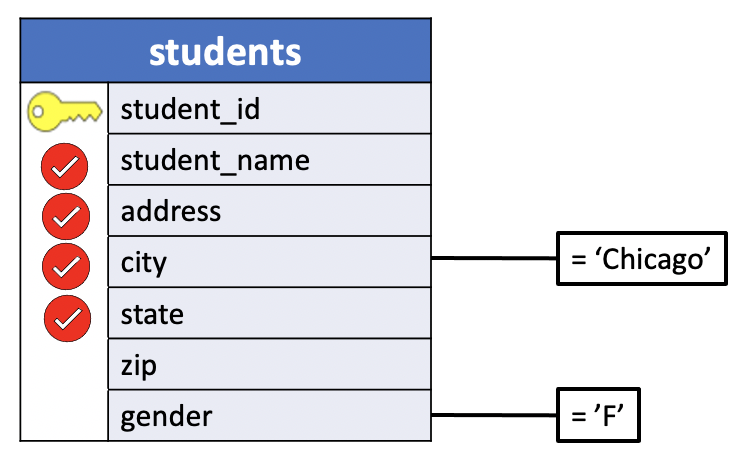
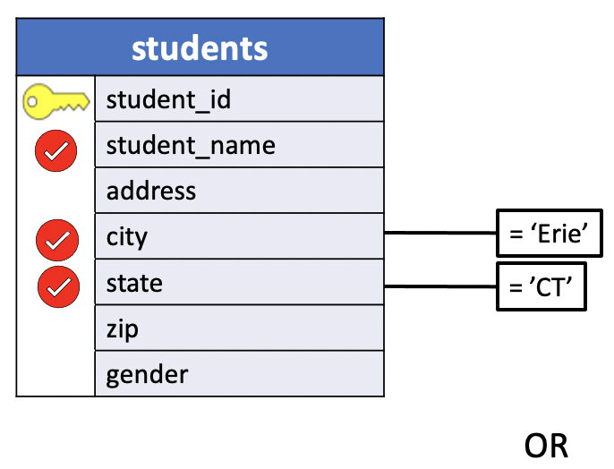
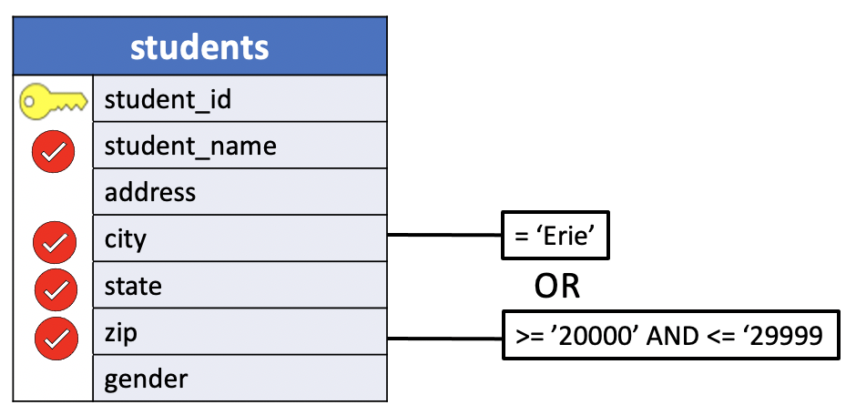

# Combining Predicates in a WHERE Clause

It is often useful to combine two or more predicates in a single `WHERE` clause. For example, you might want to identify all students who both live in Chicago and are women. Performing this action requires using SQL's `AND` and `OR` operators. `AND` and `OR`, together with a third operator `NOT`, are known as **boolean operators**.

In the following an `<expression>` identifies a literal **Boolean** value, such as `(TRUE, 't','true','y','yes','on','1')` or `(FALSE, 'f','false','n','no','off','0')`.

## 1. Introduction to AND operator

The `AND` operator is a logical operator that combines Boolean expressions and returns

- **true**: `if both expressions are true`.
- **false**: `If one of the expressions is false`, the AND operator returns false.

The syntax of the AND operator is as follows:

```SQL
expression_1 AND expression_2
```

The following table illustrates the result when you combine the `true`, `false`, and a `NULL` value using the `AND` operator:

|        |TRUE  |	FALSE|NULL |
|:------:|:----:|:----:|:---:|
|**TRUE**|`TRUE`|	FALSE|NULL|
|**FALSE**|FALSE|FALSE |FALSE|
|**NULL**|	NULL|NULL  |NULL|

Typically, we use `AND` is used in the `WHERE` clause of the `SELECT`, `DELETE`, and `UPDATE` statements to form a condition for matching data. In addition, we use the `AND` operator in the predicate of the `JOIN` clause to form the join condition.

When you use more than one logical operator in a statement, PostgreSQL **always evaluates** the `AND` **operators first**. However, **you can use parentheses to change the order of evaluation**.

### Using AND

SQL uses the word `AND` in much the same way as English does. Two predicates can be combined with `AND`, and the entire predicate is true anly if both of its parts are also true. If desired, either or both of the predicates can be enclosed in parentheses. We will soon see examples where parentheses are required, but for now they are optional.

Visually, `AND` is indicated by showing both conditions. If more than one condition is shown in a query diagram, you can assume that they are connected together in the actual SQL query with `AND`.

Always remember:

- **table** -> `FROM`
- **columns** -> `SELECT`
- **condition** -> `WHERE`

SQL syntax:
```SQL
SELECT
  FROM
 WHERE
```

### UniY Using AND in a WHERE clause

We’ll use the `courses` and `students` tables in the `uniy` sample database for the demonstration.

**Problem**: List the names and addresses of all `female students from Chicago`.

- **table**: students
- **columns**: student_name, address, city, state
- **condition**: `female students from Chicago`

**Query Diagram**



**table**
```console
uniy=# \d students
                    Table "public.students"
    Column    |     Type      | Collation | Nullable | Default
--------------+---------------+-----------+----------+---------
 student_id   | smallint      |           | not null |
 student_name | character(18) |           |          |
 address      | character(20) |           |          |
 city         | character(10) |           |          |
 state        | character(2)  |           |          |
 zip          | character(5)  |           |          |
 gender       | character(1)  |           |          |
Indexes:
    "students_pkey" PRIMARY KEY, btree (student_id)
```


**SQL**
```SQL
SELECT student_name,
       address,
       city,
       state
  FROM students
 WHERE city = 'Chicago' AND
       gender = 'F';
```

**Results**

|student_name     |       address        |    city    | state|
|:---------------:|:--------------------:|:----------:|:---:|
|Val Shipp          | 238 Westport Road    | Chicago    | IL|


**Query**
```console
uniy=# SELECT student_name,
uniy-#        address,
uniy-#        city,
uniy-#        state
uniy-#   FROM students
uniy-#  WHERE city = 'Chicago' AND
uniy-#        gender = 'F';
```

**Output**
```console
    student_name    |       address        |    city    | state
--------------------+----------------------+------------+-------
 Val Shipp          | 238 Westport Road    | Chicago    | IL
(1 row)
```

2. **Problem**: Which `math courses have three or more credits`?

- **table**: courses
- **columns**: course_name, department, num_credits
- **condition**: `math courses have three or more credits`.


**table**
```console
uniy=# \d courses
                    Table "public.courses"
   Column    |     Type      | Collation | Nullable | Default
-------------+---------------+-----------+----------+---------
 course_id   | smallint      |           | not null |
 course_name | character(20) |           |          |
 department  | character(16) |           |          |
 num_credits | smallint      |           |          |
Indexes:
    "courses_pkey" PRIMARY KEY, btree (course_id)
```

**SQL**
```SQL
SELECT course_name,
       department,
       num_credits
  FROM courses
 WHERE department = 'Math' AND
       num_credits >= 3;
```

**Results**

|course_name      |    department    | num_credits|
|:---------------:|:----------------:|:----------:|
|Calculus IV          | Math             |           4|


**Query**
```console
uniy=# SELECT course_name,
uniy-#        department,
uniy-#        num_credits
uniy-#   FROM courses
uniy-#  WHERE department = 'Math' AND
uniy-#        num_credits >= 3;
```

**Output**
```console
     course_name      |    department    | num_credits
----------------------+------------------+-------------
 Calculus IV          | Math             |           4
(1 row)
```

### DVDrental Using Multiple AND in a WHERE clause

We’ll use the `rental` table in the `dvdrental` sample database for the demonstration.

You can use multiple AND operators to combine Boolean expressions.

**Problem**: Find only rental information occurred at the date `2005-08-22` for customer ids 1 and 2. Sort the results by customer_id and rental_date DESC.

- **table**: rental
- **columns**: customer_id, rental_id, rental_date
- **condition**: `date 2005-08-22` and `customer id1` and `customer id2`.
- **sorting**: customer_id ASC, rental_date DESC.

Note:

- expression_1: `date 2005-08-22` (True/False)
- expression_2: `customer id1`    (True/False)
- expression_3: `customer id2`    (True/False)

Execution:

```console

expression_1 AND expression_2 AND expression_3

expression_1  expression_2
           \    /
            \  /
             \/
           val_12   expression_3   
               \    /
                \  /
                 \/
               val_13
```


```SQL
SELECT customer_id,
       rental_id,
       rental_date
  FROM rental
 WHERE customer_id = 1 AND
       customer_id = 2 AND
       CAST (rental_date AS DATE) = '2005-08-22'
 ORDER BY customer_id, rental_date DESC;
```

In this example, we used the CAST() function to get the DATE field from the rental date timestamp and compare it with '2005-08-22'.

**Results**

|customer_id | rental_id |     rental_date|
|:----------:|:---------:|:--------------:|
|1 |     15315 | 2005-08-22 20:03:46|
|1 |     15298 | 2005-08-22 19:41:37|
|1 |     14825 | 2005-08-22 01:27:57|
|2 |     15145 | 2005-08-22 13:53:04|


**Query**
```console
dvdrental=# SELECT customer_id,
dvdrental-#        rental_id,
dvdrental-#        rental_date
dvdrental-#   FROM rental
dvdrental-#  WHERE customer_id = 1 AND
dvdrental-#        customer_id = 2 AND
dvdrental-#        CAST (rental_date AS DATE) = '2005-08-22'
dvdrental-#  ORDER BY customer_id, rental_date DESC;
```

**Output**
```console
customer_id | rental_id |     rental_date
-------------+-----------+---------------------
          1 |     15315 | 2005-08-22 20:03:46
          1 |     15298 | 2005-08-22 19:41:37
          1 |     14825 | 2005-08-22 01:27:57
          2 |     15145 | 2005-08-22 13:53:04
(4 rows)
```

### HR Using AND in a WHERE clause

We’ll use the `employees` table in the `hr` sample database for the demonstration.

**Problem**: The following example finds all employees whose salaries are greater than 5,000 and less than 7,000. Sort the results by job_id and salary DESC.

- **table**: employees
- **columns**: job_id, salary, first_name, last_name
- **condition**: 4,000 < salary < 7,000.
- **sorting**: job_id ASC, salary DESC.

**Table**
```console
hr=# \d employees
                                            Table "public.employees"
    Column     |          Type          | Collation | Nullable |                    Default
---------------+------------------------+-----------+----------+------------------------------------------------
 employee_id   | integer                |           | not null | nextval('employees_employee_id_seq'::regclass)
 first_name    | character varying(20)  |           |          |
 last_name     | character varying(25)  |           | not null |
 email         | character varying(100) |           | not null |
 phone_number  | character varying(20)  |           |          |
 hire_date     | date                   |           | not null |
 job_id        | integer                |           | not null |
 salary        | numeric(8,2)           |           | not null |
 manager_id    | integer                |           |          |
 department_id | integer                |           |          |
Indexes:
    "employees_pkey" PRIMARY KEY, btree (employee_id)
```

**Query**

```SQL
SELECT job_id,
       salary,
       first_name,
       last_name
  FROM employees
 WHERE salary > 4000 AND
       salary < 7000
 ORDER BY job_id, salary;
```

**Results**

|job_id | salary  | first_name | last_name|
|:-----:|:-------:|:----------:|:--------:|
|3 | 4400.00 | Jennifer   | Whalen|
|6 | 6900.00 | Luis       | Popp|
|8 | 6500.00 | Susan      | Mavris|
|9 | 4200.00 | Diana      | Lorentz|
|9 | 4800.00 | David      | Austin|
|9 | 4800.00 | Valli      | Pataballa|
|9 | 6000.00 | Bruce      | Ernst|
|11 | 6000.00 | Pat        | Fay|
|16 | 6200.00 | Charles    | Johnson|
|19 | 6500.00 | Shanta     | Vollman|

**Query**
```console
hr=# SELECT job_id,
hr-#        salary,
hr-#        first_name,
hr-#        last_name
hr-#   FROM employees
hr-#  WHERE salary > 4000 AND
hr-#        salary < 7000
hr-#  ORDER BY job_id, salary;
```

**Output**
```console
 job_id | salary  | first_name | last_name
--------+---------+------------+-----------
      3 | 4400.00 | Jennifer   | Whalen
      6 | 6900.00 | Luis       | Popp
      8 | 6500.00 | Susan      | Mavris
      9 | 4200.00 | Diana      | Lorentz
      9 | 4800.00 | David      | Austin
      9 | 4800.00 | Valli      | Pataballa
      9 | 6000.00 | Bruce      | Ernst
     11 | 6000.00 | Pat        | Fay
     16 | 6200.00 | Charles    | Johnson
     19 | 6500.00 | Shanta     | Vollman
(10 rows)
```

## 2. Introduction to OR operator

The `OR` operator is a logical operator that combines Boolean expressions and returns
- **true** if one of the expressions is true.
- **false** if both expressions are false.

The following illustrates the syntax of the `OR` operator:

|    |TRUE|	FALSE|	NULL|
|:--:|:--:|:----:|:----:|
|**TRUE**|	`TRUE`|	`TRUE`|	`TRUE`|
|**FALSE**|	`TRUE`|	FALSE|	NULL|
|**NULL**|	`TRUE`|	NULL|	NULL|

We often use the `OR` operator in the `WHERE` clause of the `SELECT`, `DELETE`, and `UPDATE` statements to form a condition for filtering data.

If you use multiple logical operators in a statement, PostgreSQL **evaluates the**
- `OR` **operators after the** `NOT` **and** `AND` **operators**.
- However, **you can change the order of evaluation by using parentheses**.

### Using OR

The `OR` operator is used in a similar way to `AND`. Once again, two predicates can be combined, and the value of both is used in determining which records are returned from a table.

With `AND`, both predicates had to be true for a particular record to be selected.

With `OR`, on the other hand, a record is selected and appears on the results of the query if either of the predicates is true or if both are true.

Because it is used less often than `AND`, `OR` is explicitly indicated in query diagrams.


### UniY Using OR in a WHERE clause

We’ll use the `students` table in the `uniy` sample database for the demonstration.

**Problem**: List the name, city and state for all students who are either from Connecticut or from a city called Erie.

- **table**: students
- **columns**: name, city, state
- **condition**: state Connecticut or city called Erie.

**Query Diagram**



**SQL**
```SQL
SELECT student_name,
       city,
       state
  FROM students
 WHERE state = 'CT' OR
       city = 'Erie';
```

**Results**

|student_name    |    city    | state|
|---------------:|:----------:|:----:|
|Susan Pugh         | Hartford   | **CT**|
|Janet Thomas       | **Erie**       | PA|

**Query**
```console
uniy=# SELECT student_name,
uniy-#        city,
uniy-#        state
uniy-#   FROM students
uniy-#  WHERE state = 'CT' OR
uniy-#        city = 'Erie';
```

**Output**
```console
    student_name    |    city    | state
--------------------+------------+-------
 Susan Pugh         | Hartford   | CT
 Janet Thomas       | Erie       | PA
(2 rows)
```

### DVDRENTAL Using OR in a WHERE clause

We’ll use the `customer` table in the `dvdrental` sample database for the demonstration.

**Problem**: Find the customers whose last name is Rodriguez or first name is Adam by using the OR operator.

- **table**: customers
- **columns**: first_name, last_name
- **condition**: first_name is Adam or last_name is Rodriguez

**table**
```console
dvdrental=# \d customer
                                             Table "public.customer"
   Column    |            Type             | Collation | Nullable |                    Default
-------------+-----------------------------+-----------+----------+-----------------------------------------------
 customer_id | integer                     |           | not null | nextval('customer_customer_id_seq'::regclass)
 store_id    | smallint                    |           | not null |
 first_name  | character varying(45)       |           | not null |
 last_name   | character varying(45)       |           | not null |
 email       | character varying(50)       |           |          |
 address_id  | smallint                    |           | not null |
 activebool  | boolean                     |           | not null | true
 create_date | date                        |           | not null | ('now'::text)::date
 last_update | timestamp without time zone |           |          | now()
 active      | integer                     |           |          |
Indexes:
    "customer_pkey" PRIMARY KEY, btree (customer_id)
```

**SQL**
```SQL
SELECT first_name,
	     last_name
  FROM customer
 WHERE last_name = 'Rodriguez' OR
	     first_name = 'Adam';
```

**Results**

|first_name | last_name|
|:----------:|:----------:|
|Laura      | **Rodriguez**|
|**Adam**       | Gooch |


**Query**
```console
dvdrental=# SELECT first_name,
dvdrental-#        last_name
dvdrental-#   FROM customer
dvdrental-#  WHERE last_name = 'Rodriguez' OR
dvdrental-#        first_name = 'Adam';
```

**Output**
```console
 first_name | last_name
------------+-----------
 Laura      | Rodriguez
 Adam       | Gooch
```

### HR Using OR in a WHERE clause

We’ll use the `employees` table in the `hr` sample database for the demonstration.

**Problem**: The following example finds all employees whose salaries are less than 4,000 or greater than 10,000. Sort the results by salary DESC.

- **table**: employees
- **columns**: job_id, salary, first_name, last_name
- **condition**: salary < 4,000 or salary > 10,000.
- **sorting**: job_id ASC, salary DESC.

**Table**
```console
hr=# \d employees
                                            Table "public.employees"
    Column     |          Type          | Collation | Nullable |                    Default
---------------+------------------------+-----------+----------+------------------------------------------------
 employee_id   | integer                |           | not null | nextval('employees_employee_id_seq'::regclass)
 first_name    | character varying(20)  |           |          |
 last_name     | character varying(25)  |           | not null |
 email         | character varying(100) |           | not null |
 phone_number  | character varying(20)  |           |          |
 hire_date     | date                   |           | not null |
 job_id        | integer                |           | not null |
 salary        | numeric(8,2)           |           | not null |
 manager_id    | integer                |           |          |
 department_id | integer                |           |          |
Indexes:
    "employees_pkey" PRIMARY KEY, btree (employee_id)
```

**Query**

```SQL
SELECT job_id,
       salary,
       first_name,
       last_name
  FROM employees
 WHERE salary < 4000 OR
       salary > 10000
 ORDER BY salary;
```

**Results**

|job_id |  salary  | first_name |  last_name|
|:-----:|:---------:|:---------:|:---------:|
| 4 | 24000.00 | Steven     | King|
| 5 | 17000.00 | Lex        | De Haan|
| 5 | 17000.00 | Neena      | Kochhar|
|15 | 14000.00 | John       | Russell|
|15 | 13500.00 | Karen      | Partners|
|10 | 13000.00 | Michael    | Hartstein|
| 2 | 12000.00 | Shelley    | Higgins|
| 7 | 12000.00 | Nancy      | Greenberg|
|14 | 11000.00 | Den        | Raphaely|
|17 |  3900.00 | Britney    | Everett|
|13 |  3100.00 | Alexander  | Khoo|
|13 |  2900.00 | Shelli     | Baida|
|13 |  2800.00 | Sigal      | Tobias|
|18 |  2700.00 | Irene      | Mikkilineni|
|13 |  2600.00 | Guy        | Himuro|
|13 |  2500.00 | Karen      | Colmenares|


**Query**
```console
hr=# SELECT job_id,
hr-#        salary,
hr-#        first_name,
hr-#        last_name
hr-#   FROM employees
hr-#  WHERE salary < 4000 OR
hr-#        salary > 10000
hr-#  ORDER BY salary DESC;
```

**Output**
```console
 job_id |  salary  | first_name |  last_name
--------+----------+------------+-------------
      4 | 24000.00 | Steven     | King
      5 | 17000.00 | Lex        | De Haan
      5 | 17000.00 | Neena      | Kochhar
     15 | 14000.00 | John       | Russell
     15 | 13500.00 | Karen      | Partners
     10 | 13000.00 | Michael    | Hartstein
      2 | 12000.00 | Shelley    | Higgins
      7 | 12000.00 | Nancy      | Greenberg
     14 | 11000.00 | Den        | Raphaely
     17 |  3900.00 | Britney    | Everett
     13 |  3100.00 | Alexander  | Khoo
     13 |  2900.00 | Shelli     | Baida
     13 |  2800.00 | Sigal      | Tobias
     18 |  2700.00 | Irene      | Mikkilineni
     13 |  2600.00 | Guy        | Himuro
     13 |  2500.00 | Karen      | Colmenares
(16 rows)
```


## 2. Combining AND and OR

The `AND` and `OR` operators can both be used in the same `WHERE` clause. In fact, arbitrarily complex expressions can be created by using various combinations of `AND` and `OR`.

### Using combination AND and OR

if both `AND` and `OR` appear in the same `WHERE` clause, all of the `ANDs` are evaluated first, followed by all of the `ORs`.

**Example: exp1 OR exp2 AND exp3**
```console
hr=# SELECT TRUE OR FALSE AND FALSE AS tff,
hr-#        FALSE OR FALSE AND TRUE AS fft,
hr-#        FALSE OR TRUE AND FALSE AS ftf;
```

**Output**
```console
 tff | fft | ftf
-----+-----+-----
 t   | f   | f
(1 row)
```

```console
expression_1 AND expression_2 AND expression_3
----- tff------       ------fft------         ------ftf------
FALSE AND FALSE       FALSE AND TRUE          TRUE AND FALSE
    \    /                \    /                  \    /
     \  /                  \  /                    \  /
      \/                    \/                      \/
    TRUE OR TRUE          FALSE OR FALSE           FALSE OR FALSE
      \    /                   \    /                  \    /
       \  /                     \  /                    \  /
        \/                       \/                      \/
       TRUE                     FALSE                  FALSE
```


There is one exception to this rule: Anything enclosed in parentheses will be executed first. In some cases, then, you might be required to use parentheses to correctly express what you mean.

For example, in the `uniy` sample database, to see the names of all male students who live in either Connecticut or New York, you could type:

```SQL
SELECT student_name
  FROM students
 WHERE (state = 'CT' OR state = 'NY') AND
        gender = 'M';
```

If the parentheses were omitted, the statement would become

```SQL
SELECT student_name
  FROM students
 WHERE state = 'CT' OR
       state = 'NY' AND
       gender = 'M';
```

It now has a quite different meaning. Because SQL first evaluates all `ANDs`, it is as if the query were written.

```SQL
SELECT student_name
  FROM students
 WHERE state = 'CT' OR
       (state = 'NY' AND gender = 'M');
```

This query will select the records of all male students from New york as well as those of all students, both male and female, from Connecticut.

The moral is this: Use parentheses whenever you combine `AND` and `OR` in a `WHERE` clause. They never hurt, and they sometimes can prevent you from inadvertently making the wrong request.

### UniY Using AND and OR in a WHERE clause

We’ll use the `students` table in the `uniy` sample database for the demonstration.

**Problem**: List the names, cities, states and zip codes of all students whose zip codes are between 20000 and 29999 or who live in a city called Erie.

- **table**: students
- **columns**: student_name, city, state, zip
- **condition**: city is Erie OR zip between 20000 and 29999.

**Query Diagram**



**SQL**
```SQL
SELECT student_name,
       city,
       state,
       zip
  FROM students
 WHERE (zip >= '20000' AND zip <= '29999') OR
       city = 'Erie';
```

**Results**

|student_name    |    city    | state |  zip|
|:--------------:|:----------:|:-----:|:----:|
|Howard Mansfield   | Vienna     | VA    | 22180|
|Janet Thomas       | Erie       | PA    | 16510|


**Query**
```console
uniy=# SELECT student_name,
uniy-#        city,
uniy-#        state,
uniy-#        zip
uniy-#   FROM students
uniy-#  WHERE (zip >= '20000' AND zip <= '29999') OR
uniy-#        city = 'Erie';
```

**Output**
```console
    student_name    |    city    | state |  zip
--------------------+------------+-------+-------
 Howard Mansfield   | Vienna     | VA    | 22180
 Janet Thomas       | Erie       | PA    | 16510
(2 rows)
```

### HR Using AND and OR in a WHERE clause

We’ll use the `employees` table in the `hr` sample database for the demonstration.

**Problem**: The following example finds all employees whose salaries are less than 3,000 or between 5,000 and 7,000 or greater than 10,000. Sort the results by salary DESC.

- **table**: employees
- **columns**: job_id, salary, first_name, last_name
- **condition**: salary < 3,000 or between 5,000 and 7,000 or greater than 10,000.
- **sorting**: salary DESC.

**Table**
```console
hr=# \d employees
                                            Table "public.employees"
    Column     |          Type          | Collation | Nullable |                    Default
---------------+------------------------+-----------+----------+------------------------------------------------
 employee_id   | integer                |           | not null | nextval('employees_employee_id_seq'::regclass)
 first_name    | character varying(20)  |           |          |
 last_name     | character varying(25)  |           | not null |
 email         | character varying(100) |           | not null |
 phone_number  | character varying(20)  |           |          |
 hire_date     | date                   |           | not null |
 job_id        | integer                |           | not null |
 salary        | numeric(8,2)           |           | not null |
 manager_id    | integer                |           |          |
 department_id | integer                |           |          |
Indexes:
    "employees_pkey" PRIMARY KEY, btree (employee_id)
```

**Query**

```SQL
SELECT job_id,
       salary,
       first_name,
       last_name
  FROM employees
 WHERE salary < 3000 OR
       (salary > 5000 AND salary < 7000) OR
       salary > 10000
 ORDER BY salary;
```

In the SQL statement below I simply added a column to indicate the salary range.

```SQL
SELECT job_id,
       first_name,
       last_name,
       salary,
       CASE WHEN salary < 3000 THEN 's < 3000'
            WHEN (salary > 5000 AND salary < 7000) THEN '5000 < s < 7000'
            WHEN salary > 10000 THEN 's > 10000'
            ELSE 'other'
       END AS salary_range
  FROM employees
 WHERE salary < 3000 OR
      (salary > 5000 AND salary < 7000) OR
       salary > 10000
 ORDER BY salary;
```

**Results**

|job_id | first_name |  last_name  |  salary  |  salary_range|
|:-----:|:----------:|:-----------:|:--------:|:------------:|
|13 | Karen      | Colmenares  |  2500.00 | s < 3000|
|13 | Guy        | Himuro      |  2600.00 | s < 3000|
|18 | Irene      | Mikkilineni |  2700.00 | s < 3000|
|13 | Sigal      | Tobias      |  2800.00 | s < 3000|
|13 | Shelli     | Baida       |  2900.00 | s < 3000|
|9 | Bruce      | Ernst       |  6000.00 | 5000 < s < 7000|
|11 | Pat        | Fay         |  6000.00 | 5000 < s < 7000|
|16 | Charles    | Johnson     |  6200.00 | 5000 < s < 7000|
|19 | Shanta     | Vollman     |  6500.00 | 5000 < s < 7000|
|8 | Susan      | Mavris      |  6500.00 | 5000 < s < 7000|
|6 | Luis       | Popp        |  6900.00 | 5000 < s < 7000|
|14 | Den        | Raphaely    | 11000.00 | s > 10000|
|2 | Shelley    | Higgins     | 12000.00 | s > 10000|
|7 | Nancy      | Greenberg   | 12000.00 | s > 10000|
|10 | Michael    | Hartstein   | 13000.00 | s > 10000|
|15 | Karen      | Partners    | 13500.00 | s > 10000|
|15 | John       | Russell     | 14000.00 | s > 10000|
|5 | Lex        | De Haan     | 17000.00 | s > 10000|
|5 | Neena      | Kochhar     | 17000.00 | s > 10000|
|4 | Steven     | King        | 24000.00 | s > 10000|


**Query**
```console
hr=# SELECT job_id,
hr-#        first_name,
hr-#        last_name,
hr-#        salary,
hr-#        CASE WHEN salary < 3000 THEN 's < 3000'
hr-#             WHEN (salary > 5000 AND salary < 7000) THEN '5000 < s < 7000'
hr-#             WHEN salary > 10000 THEN 's > 10000'
hr-#             ELSE 'other'
hr-#        END AS salary_range
hr-#   FROM employees
hr-#  WHERE salary < 3000 OR
hr-#       (salary > 5000 AND salary < 7000) OR
hr-#        salary > 10000
hr-#  ORDER BY salary;
```

**Output**
```console
 job_id | first_name |  last_name  |  salary  |  salary_range
--------+------------+-------------+----------+-----------------
     13 | Karen      | Colmenares  |  2500.00 | s < 3000
     13 | Guy        | Himuro      |  2600.00 | s < 3000
     18 | Irene      | Mikkilineni |  2700.00 | s < 3000
     13 | Sigal      | Tobias      |  2800.00 | s < 3000
     13 | Shelli     | Baida       |  2900.00 | s < 3000
      9 | Bruce      | Ernst       |  6000.00 | 5000 < s < 7000
     11 | Pat        | Fay         |  6000.00 | 5000 < s < 7000
     16 | Charles    | Johnson     |  6200.00 | 5000 < s < 7000
     19 | Shanta     | Vollman     |  6500.00 | 5000 < s < 7000
      8 | Susan      | Mavris      |  6500.00 | 5000 < s < 7000
      6 | Luis       | Popp        |  6900.00 | 5000 < s < 7000
     14 | Den        | Raphaely    | 11000.00 | s > 10000
      2 | Shelley    | Higgins     | 12000.00 | s > 10000
      7 | Nancy      | Greenberg   | 12000.00 | s > 10000
     10 | Michael    | Hartstein   | 13000.00 | s > 10000
     15 | Karen      | Partners    | 13500.00 | s > 10000
     15 | John       | Russell     | 14000.00 | s > 10000
      5 | Lex        | De Haan     | 17000.00 | s > 10000
      5 | Neena      | Kochhar     | 17000.00 | s > 10000
      4 | Steven     | King        | 24000.00 | s > 10000
(20 rows)
```
