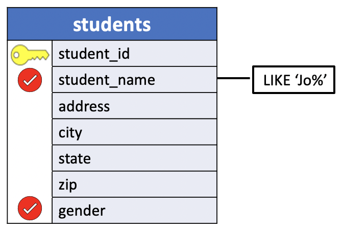

# LIKE operator

Sometimes, you want to query data based on a **specified pattern**. For example, when searching for information, we often already know part of what we're looking for.

We might, for instance, know someone's last name but not their first name, or we might know only that their last name begins with **Jo**. For example, **Jo**hnson, **Jo**yce or **Jo**rdan, etc.

In this example, we search for strings following the **pattern**: **Jo**`...`, where `...` is any sequence of characters.

For situations like this, SQL provides `LIKE` and `NOT LIKE` functions.

The syntax of the PostgreSQL `LIKE` operator is as follows:

- `value` **LIKE** `pattern` `[ESCAPE escape_characters]`

The **LIKE** operator returns `true` if **the value matches the pattern** or false otherwise.

To negate the `LIKE` operator, you use the `NOT` operator as follows:

- `value` **NOT LIKE** `pattern` `[ESCAPE escape_characters]`

The **NOT LIKE** operator returns `true` when **the value does not match the pattern** or false otherwise.

In this syntax there are two basic components and an optional one:

- **Basic components**: `value`, `pattern`
- **Optional component**: `[ESCAPE escape_characters]`

## Basic components: value and pattern

1. `value`: The value can be a `column name` or an `expression` that you want to test against the `pattern`. It's clear that the `value` must be a **CHAR** type.

In the case of `<column name>` we use the **LIKE** operator in the `WHERE` clause. the general form is:

```sql
SELECT <column names>
  FROM <table>
 WHERE <column name> LIKE <pattern>;   
```

In this case, `<column name>` must identify a `CHAR` column. Therefore, if the values in the column's records matches the pattern the **LIKE** function returns `true` in the `WHERE` clause and the query filters all the matching rows.

In the case of an `expression`, the general form is:

```sql
SELECT <expression> LIKE <pattern>;
```

The `<expression>` can be a literal string or any function that returns a string value.

2. `pattern`: the pattern must be a **character string** enclosed in single quotes. The SQL standard provides you with two wildcard characters to make a pattern:
  - `%` percent wildcard matches **zero, one, or more characters**
  - `_` underscore wildcard matches **a single character**.

When contained within the quoted character string value, a percent sign `%` matches any string of characters of any length. An underscore `_` matches any single character. Using these two wild cards, a wide variety of searches can be performed.

Recalling the example given earlier, the pattern  **Jo**`...` indicating any string that starts with **Jo** and ends with any number of characters is defined as

- `LIKE` '**Jo**`%`'

The following show an example of using the `%` and `_` wildcard characters:

|Expression| Meaning|
|:--------:|:------:|
|`LIKE`  '**Jo**`%`'|	match a string that **starts with Jo**|
|`LIKE`  '`%`**er**'|	match a string that **ends with er**|
|`LIKE`  '`%`**ch**`%`'|	match a string that **contains ch**|
|`LIKE`  '**Le**`_`'|	match a string that **starts with Le** and is **followed by one character** e.g., Les, Len, etc|
|`LIKE`  '`_`**uy**'|	match a string that **ends with uy** and is **preceded by one character** e.g., guy|
|`LIKE`  '`%`**are**`_`'|	match a string that **contains are** and **ends with one character**|
|`LIKE`  '`_`**are**`%`'|	match a string that **contains are**, **starts with one character**, and **ends with any number of characters**|

If the pattern does not contain any wildcard character, the `LIKE` operator behaves like the equal (`=`) operator.

### pattern matching expressions examples

Let's take some examples of using the `LIKE` and `NOT LIKE` operators.

**SQL**
```sql
SELECT
	'foo' LIKE 'foo', -- true (t)
	'foo' LIKE 'f%', -- true (t)
	'foo' LIKE '%o', -- true (t)
	'foo' LIKE '_o_', -- true (t)
  'foo' LIKE '%o%', -- true (t)
  'bar' LIKE 'bar', -- true (t)
	'bar' LIKE 'b_', -- false (f)
  'bar' LIKE 'b__', -- true (t)
  'hello World' LIKE '%w%', -- false (f)
  'hello World' LIKE '%W%', -- true (t)
  'hello World' LIKE '%o%'; -- true (t)
```

**SQL Expression**
```console
uniy=# SELECT
uniy-#   'foo' LIKE 'foo' AS "foo",
uniy-#   'foo' LIKE 'f%' AS "f%",
uniy-#   'foo' LIKE '%o' AS "%o",
uniy-#   'foo' LIKE '_o_' AS "_o_",
uniy-#   'foo' LIKE '%o%' AS "%o%",
uniy-#   'bar' LIKE 'bar' AS "bar",
uniy-#   'bar' LIKE 'b_' AS "b_",
uniy-#   'bar' LIKE 'b__' AS "b__",
uniy-#   'hello World' LIKE '%w%' AS "%w%",
uniy-#   'hello World' LIKE '%W%' AS "%W%",
uniy-#   'hello World' LIKE '%o%' AS "%o%";
```
**Output**
```console
 foo | f% | %o | _o_ | %o% | bar | b_ | b__ | %w% | %W% | %o%
-----+----+----+-----+-----+-----+----+-----+-----+-----+-----
 t   | t  | t  | t   | t   | t   | f  | t   | f   | t   | t
(1 row)
```


How it works.

- `foo`: The first expression returns true because the `foo` pattern does not contain any wildcard character so the LIKE operator acts like the equal (=) operator, `foo = foo`.
- `f%`: The second expression returns true because it matches any string that begins with the letter `f` and followed by any number of characters.
- `%o`: The third expression returns true because it matches any string that begins with any number of characters and ends with the letter `o`.
- `_o_`: The fourth expression returns true because the pattern (`_o_`) matches any string that begins with any single character, followed by the letter o and ended with any single character.
- `%o%`: The fifth expression returns true because the pattern matches any string with at least three characters containing the letter `o` not at the beginning or the end of the string.
- `bar`: it's like the first case.
- `b_`: this expression returns false because the pattern `b_` matches any two characters string starting with the letter `b`. The string `bar` has more than two characters.
- `b__`: this expression returns true because the pattern matches any three characters string starting with the letter `b`.
- `%w%`: this expression returns false because the pattern matches any string containing the letter `w`. However, the string `hello World` contains the letter `W`. Case sensitive!
- `%W%`: This expression return true, see the previous case.
- `%o%`: The last expression returns true because the pattern matches any string with at least three characters containing the letter `o` not at the beginning or the end of the string.

To perform a `case-insensitive` match you could use either `LOWER()` or `UPPER()` function as follows:

**SQL**
```sql
SELECT UPPER ('hello world') LIKE '%W%'; -- true
SELECT LOWER ('hello World') LIKE '%w%'; -- true
```

**SQL Expression**
```console
hr=# SELECT UPPER('hello World') LIKE '%W%',
hr-#        UPPER('hello world') LIKE '%W%';
```

**Output**
```console
 ?column? | ?column?
----------+----------
 t        | t
(1 row)
```

**One more example**: `_%`

```console
hr=# SELECT 'foooo' LIKE 'f___%',
hr-#        'fooo'  LIKE 'f___%',
hr-#        'foo'   LIKE 'f___%';
```
The pattern `f___%` finds all the strings that starts with the letter `f` and have at least four characters.

**Output**
```console
 ?column? | ?column? | ?column?
----------+----------+----------
 t        | t        | f
(1 row)
```


## Optional component: Escape character

To match a string that contains a wildcard for example `25%`, you need to instruct the `LIKE` operator to treat the `%` in `25%` as a regular character.

To do that, you need to explicitly specify an escape character after the `ESCAPE` clause. The ESCAPE clause allows you to find strings that include one or more wildcard characters.

```sql
expression LIKE pattern ESCAPE escape_character
```

For example, a table may include data that has percent `%` character such as discount values, depreciation rate.

To search for the string `25%`, you use the ESCAPE clause as follows:

For example:

```sql
value LIKE '%25!%%' ESCAPE '!'
```

In this example, the `!` is an **escape character**. It instructs the `LIKE` operator to treat the `%` in the `25%` as a regular character. It follows that the substring `!%` is treated as the character `%`.

The following statements create discounts table and insert some sample data for testing:


```console
uniy=# CREATE TABLE discounts (
uniy(#        product_id INTEGER,
uniy(#        discount_message VARCHAR (255) NOT NULL,
uniy(#        PRIMARY KEY (product_id)
uniy(# );
CREATE TABLE
uniy=# INSERT INTO discounts
uniy-#        (product_id, discount_message)
uniy-# VALUES
uniy-#        (1, 'Buy 1 and Get 25% OFF on 2nd'),
uniy-#        (2, 'Buy 2 and Get 50% OFF on 3rd'),
uniy-#        (3, 'Buy 3 Get 1 free');
INSERT 0 3
```

**discounts**

|product_id | discount_message|
|:---------:|:----------------|
| 1 | Buy 1 and Get **25%** OFF on 2nd|
| 2 | Buy 2 and Get 50% OFF on 3rd|
|3  | Buy 3 Get 1 free|

The following statement retrieves products which have discount `25%`:

**Sql**
```sql
SELECT product_id, discount_message
  FROM discounts
 WHERE discount_message LIKE '%25!%%' ESCAPE '!';
```

**Query**
```console
uniy=# SELECT product_id, discount_message
uniy-#   FROM discounts
uniy-#  WHERE discount_message LIKE '%25!%%' ESCAPE '!';
```

**Output**
```console
 product_id |       discount_message
------------+------------------------------
          1 | Buy 1 and Get 25% OFF on 2nd
(1 row)
```

## UniY LIKE examples

We’ll use the `students` and `teachers` tables in the `uniy` sample database for the demonstration.

1. **Problem**: List the name and gender of every student whose name begins with `Jo`.

```console
uniy=# \d students
                    Table "public.students"
    Column    |     Type      | Collation | Nullable | Default
--------------+---------------+-----------+----------+---------
 student_id   | smallint      |           | not null |
 student_name | character(18) |           |          |
 address      | character(20) |           |          |
 city         | character(10) |           |          |
 state        | character(2)  |           |          |
 zip          | character(5)  |           |          |
 gender       | character(1)  |           |          |
Indexes:
    "students_pkey" PRIMARY KEY, btree (student_id)
```


**Query Diagram**



**SQL**
```sql
SELECT student_name, gender
  FROM students
 WHERE student_name LIKE 'Jo%';  
```

**Results**

|student_name    | gender|
|:--------------:|:-----:|
|**Jo**e Adams   | M|
|**Jo**hn Anderson | M|


**Query**
```console
uniy=# SELECT student_name, gender
uniy-#   FROM students
uniy-#  WHERE student_name LIKE 'Jo%';
```

**Output**
```console
    student_name    | gender
--------------------+--------
 Joe Adams          | M
 John Anderson      | M
(2 rows)
```

I'll omit the Query diagram in the next queries for convenience..

2. **Problem**: List the names and home states of all students from states that begin with the letter `C`.

**SQL**
```sql
SELECT student_name, state
  FROM students
 WHERE state LIKE 'C_';
```

**Results**

|student_name    | state|
|:--------------:|:----:|
|Susan Pugh         | **C**T|
|Bill Jones         | **C**A|


**Query**

```console
uniy=# SELECT student_name, state
uniy-#   FROM students
uniy-#  WHERE state LIKE 'C_';
```

**Output**
```console
    student_name    | state
--------------------+-------
 Susan Pugh         | CT
 Bill Jones         | CA
(2 rows)
```

3. **Problem**: List the names and phone numbers of all teachers whose phone numbers do not begin with `257`.

```console
uniy=# \d teachers
                    Table "public.teachers"
    Column    |     Type      | Collation | Nullable | Default
--------------+---------------+-----------+----------+---------
 teacher_id   | smallint      |           | not null |
 teacher_name | character(18) |           |          |
 phone        | character(10) |           |          |
 salary       | numeric(10,2) |           |          |
Indexes:
    "teachers_pkey" PRIMARY KEY, btree (teacher_id)
```

**SQL**
```sql
SELECT teacher_name, phone
  FROM teachers
 WHERE phone NOT LIKE '257%';
```

**Results**
|teacher_name    |   phone|
|:--------------:|:------:|
|Dr. Engle       | 256-4621|


**Query**
```console
uniy=# SELECT teacher_name, phone
uniy-#   FROM teachers
uniy-#  WHERE phone NOT LIKE '257%';
```

**Output**
```console
    teacher_name    |   phone
--------------------+------------
 Dr. Engle          | 256-4621
```

### common mistakes CHAR vs VARCHAR

3. **Problem**: List all teachers whose last names begin with `E`, end with `e`, and have any three letters in between.

Recalling the previous example, we know that `Dr. Engle` must be in the output. The last name starts with the letter `E`, ends with `e`, and the letters between are three `ngl`. Before writing the query let's see the `teachers` table structure.

```console
uniy=# \d teachers
                    Table "public.teachers"
    Column    |     Type      | Collation | Nullable | Default
--------------+---------------+-----------+----------+---------
 teacher_id   | smallint      |           | not null |
 teacher_name | character(18) |           |          |
 phone        | character(10) |           |          |
 salary       | numeric(10,2) |           |          |
Indexes:
    "teachers_pkey" PRIMARY KEY, btree (teacher_id)
```

The first approach is to write the following SQL statement:

```sql
SELECT teacher_name
  FROM teachers
 WHERE teacher_name LIKE 'Dr. E___e';
```

However, this SQL query returns zero rows. Why?

The reason is clear if we look at the `teacher_name` data type. We see that the column is a `CHARACTER (18)`, therefore the values in this column are strings with `18` characters. It follows that the matching string must be `Dr. E__e` followed by a string of `9` white characters.

```sql
SELECT teacher_name
  FROM teachers
 WHERE teacher_name LIKE 'Dr. E___e         ';
```

**Query**
```console
uniy=# SELECT teacher_name
uniy-#   FROM teachers
uniy-#  WHERE teacher_name LIKE 'Dr. E___e         ';
```

**Output**
```console
    teacher_name
--------------------
 Dr. Engle
(1 row)
```

## HR LIKE examples

We’ll use the `employees` table in the sample database for the demonstration.

```console
hr=# \d employees
                                            Table "public.employees"
    Column     |          Type          | Collation | Nullable |                    Default
---------------+------------------------+-----------+----------+------------------------------------------------
 employee_id   | integer                |           | not null | nextval('employees_employee_id_seq'::regclass)
 first_name    | character varying(20)  |           |          |
 last_name     | character varying(25)  |           | not null |
 email         | character varying(100) |           | not null |
 phone_number  | character varying(20)  |           |          |
 hire_date     | date                   |           | not null |
 job_id        | integer                |           | not null |
 salary        | numeric(8,2)           |           | not null |
 manager_id    | integer                |           |          |
 department_id | integer                |           |          |
Indexes:
    "employees_pkey" PRIMARY KEY, btree (employee_id)
```

1. The following example uses the LIKE operator to find all employees whose first names start with `Da` :

**SQL**
```sql
SELECT employee_id, first_name, last_name
  FROM employees
 WHERE first_name LIKE 'Da%';
```

**Results**

|employee_id | first_name | last_name|
|:----------:|:-----------:|:-------:|
|        105 | **Da**vid      | Austin|
|        109 | **Da**niel     | Faviet|

**Query**
```console
hr=# SELECT employee_id, first_name, last_name
hr-#   FROM employees
hr-#  WHERE first_name LIKE 'Da%';
```

**Output**
```console
 employee_id | first_name | last_name
-------------+------------+-----------
         105 | David      | Austin
         109 | Daniel     | Faviet
(2 rows)
```

2. The following example use the LIKE operator to find all employees whose first names end with `er`:

**SQL**
```sql
SELECT employee_id, first_name, last_name
  FROM employees
 WHERE first_name LIKE '%er';
```

**Results**

|employee_id | first_name | last_name|
|:----------:|:----------:|:--------:|
|103         | Alexand**er**  | Hunold|
|115         | Alexand**er**  | Khoo|
|200         | Jennif**er**   | Whalen|

**Query**
```console
hr=# SELECT employee_id, first_name, last_name
hr-#   FROM employees
hr-#  WHERE first_name LIKE '%er';
```

**Output**
```console
 employee_id | first_name | last_name
-------------+------------+-----------
         103 | Alexander  | Hunold
         115 | Alexander  | Khoo
         200 | Jennifer   | Whalen
(3 rows)
```

3. The following example uses the LIKE operator to find employees whose first names contain the word `an`:

**SQL**

```sql
SELECT employee_id, first_name, last_name
  FROM employees
 WHERE first_name LIKE '%an%';
```

**Results**

|employee_id | first_name  | last_name|
|:----------:|:-----------:|:--------:|
|103 | Alex**an**der   | Hunold|
|107 | Di**an**a       | Lorentz|
|108 | N**an**cy       | Greenberg|
|109 | D**an**iel      | Faviet|
|112 | Jose M**an**uel | Urman|
|115 | Alex**an**der   | Khoo|
|123 | Sh**an**ta      | Vollman|
|203 | Sus**an**       | Mavris|
|204 | Herm**an**n     | Baer|


**Query**
```console
hr=# SELECT employee_id, first_name, last_name
hr-#   FROM employees
hr-#  WHERE first_name LIKE '%an%';
```

**Output**
```console
 employee_id | first_name  | last_name
-------------+-------------+-----------
         103 | Alexander   | Hunold
         107 | Diana       | Lorentz
         108 | Nancy       | Greenberg
         109 | Daniel      | Faviet
         112 | Jose Manuel | Urman
         115 | Alexander   | Khoo
         123 | Shanta      | Vollman
         203 | Susan       | Mavris
         204 | Hermann     | Baer
(9 rows)
```

4. The following statement retrieves employees whose first names start with `Jo` and are followed by 2 characters:

**SQL**
```sql
SELECT employee_id, first_name, last_name
  FROM employees
 WHERE first_name LIKE 'Jo__';
```

**Results**

|employee_id | first_name | last_name|
|:----------:|:----------:|:--------:|
|110 | **Jo**hn       | Chen|
|145 | **Jo**hn       | Russell|

**Query**
```console
hr=# SELECT employee_id, first_name, last_name
hr-#   FROM employees
hr-#  WHERE first_name LIKE 'Jo__';
```

**Output**
```console
 employee_id | first_name | last_name
-------------+------------+-----------
         110 | John       | Chen
         145 | John       | Russell
(2 rows)
```

5. The following statement uses the `LIKE` operator with the `%` and `_` wildcard to find employees whose first names start with any number of characters and are followed by one character:

**SQL**
```sql
SELECT employee_id, first_name, last_name
  FROM employees
 WHERE first_name LIKE '%are_';
```

**Results**

|employee_id | first_name | last_name|
|:----------:|:----------:|:--------:|
|119         | K**are**n      | Colmenares|
|146         | K**are**n      | Partners|


**Query**
```console
hr=# SELECT employee_id, first_name, last_name
hr-#   FROM employees
hr-#  WHERE first_name LIKE '%are_';
```

**Output**
```console
 employee_id | first_name | last_name
-------------+------------+------------
         119 | Karen      | Colmenares
         146 | Karen      | Partners
(2 rows)
```

### SQL NOT LIKE operator example

1. The following example uses the `NOT LIKE` operator to find all employees whose first names **start** with the letter `S` but **not start** with `Sh`:

**SQL**
```sql
SELECT employee_id, first_name, last_name
  FROM employees
 WHERE first_name LIKE 'S%' AND
       first_name NOT LIKE 'Sh%'
 ORDER BY first_name;
```

**Results**

|employee_id | first_name | last_name|
|:----------:|:----------:|:--------:|
| 192        | **S**arah      | Bell|
| 117        | **S**igal      | Tobias|
|100         | **S**teven     | King|
|203         | **S**usan      | Mavris|


**Query**
```console
hr=# SELECT employee_id, first_name, last_name
hr-#   FROM employees
hr-#  WHERE first_name LIKE 'S%' AND
hr-#        first_name NOT LIKE 'Sh%'
hr-#  ORDER BY first_name;
```

**Output**
```console
 employee_id | first_name | last_name
-------------+------------+-----------
         192 | Sarah      | Bell
         117 | Sigal      | Tobias
         100 | Steven     | King
         203 | Susan      | Mavris
(4 rows)
```

2. The following example uses the `NOT LIKE` operator to find all employees whose first names **start** with the letter `S` but **not start** with `Sh` and have no more than 5 characters:

**SQL**
```sql
SELECT employee_id, first_name, last_name
  FROM employees
 WHERE first_name LIKE 'S%' AND
       first_name NOT LIKE 'Sh%' AND
       LENGTH(first_name) <= 5;
```

**Results**

|employee_id | first_name | last_name|
|:----------:|:----------:|:--------:|
| 192        | **S**arah      | Bell|
| 117        | **S**igal      | Tobias|
|203         | **S**usan      | Mavris|

**Query**
```console
hr=# SELECT employee_id, first_name, last_name
hr-#   FROM employees
hr-#  WHERE first_name LIKE 'S%' AND
hr-#        first_name NOT LIKE 'Sh%' AND
hr-#        LENGTH(first_name) <= 5;
```

**Output**
```console
 employee_id | first_name | last_name
-------------+------------+-----------
         117 | Sigal      | Tobias
         192 | Sarah      | Bell
         203 | Susan      | Mavris
(3 rows)
```

## DVDRENTAL LIKE examples

We’ll use the `customer` table in the `dvdrental` sample database for the demonstration.

```console
dvdrental=# \d customer
                                             Table "public.customer"
   Column    |            Type             | Collation | Nullable |                    Default
-------------+-----------------------------+-----------+----------+-----------------------------------------------
 customer_id | integer                     |           | not null | nextval('customer_customer_id_seq'::regclass)
 store_id    | smallint                    |           | not null |
 first_name  | character varying(45)       |           | not null |
 last_name   | character varying(45)       |           | not null |
 email       | character varying(50)       |           |          |
 address_id  | smallint                    |           | not null |
 activebool  | boolean                     |           | not null | true
 create_date | date                        |           | not null | ('now'::text)::date
 last_update | timestamp without time zone |           |          | now()
 active      | integer                     |           |          |
Indexes:
    "customer_pkey" PRIMARY KEY, btree (customer_id)
```

For example, the following query returns **customers** whose first name contains `er` string like `Jenif`**er**, `Kimb`**er**`ly`, etc.

**SQL**
```sql
SELECT first_name, last_name
  FROM customer
 WHERE first_name LIKE '%er%'
 ORDER BY first_name
 LIMIT 10;
```

**Results**
|first_name | last_name|
|:---------:|:--------:|
|Alb**er**t     | Crouse|
|Alb**er**to    | Henning|
|Alexand**er**  | Fennell|
|Amb**er**      | Dixon|
|B**er**nard    | Colby|
|B**er**nice    | Willis|
|B**er**tha     | Ferguson|
|Bev**er**ly    | Brooks|
|Cath**er**ine  | Campbell|
|Ch**er**yl     | Murphy|


**Query**
```console
dvdrental=# SELECT first_name, last_name
dvdrental-#   FROM customer
dvdrental-#  WHERE first_name LIKE '%er%'
dvdrental-#  ORDER BY first_name
dvdrental-#  LIMIT 10;
```

**Output**
```console
 first_name | last_name
------------+-----------
 Albert     | Crouse
 Alberto    | Henning
 Alexander  | Fennell
 Amber      | Dixon
 Bernard    | Colby
 Bernice    | Willis
 Bertha     | Ferguson
 Beverly    | Brooks
 Catherine  | Campbell
 Cheryl     | Murphy
(10 rows)
```
You can combine the percent (`%`) with underscore (`_`) to construct a pattern as the following example:

**SQL**
```sql
SELECT first_name, last_name
  FROM customer
 WHERE first_name LIKE '_her%'
 ORDER BY first_name;
```

|first_name | last_name|
|:---------:|:--------:|
|C**her**yl     | Murphy|
|S**her**ri     | Rhodes|
|S**her**ry     | Marshall|
|T**her**esa    | Watson|

The pattern `_her%` matches any string that:

- Begin with any single character (`_`)
- And is followed by the literal string **her**.
- And is ended with any number of characters (`%`).

**Query**
```console
dvdrental=# SELECT first_name, last_name
dvdrental-#   FROM customer
dvdrental-#  WHERE first_name LIKE '_her%'
dvdrental-#  ORDER BY first_name;
```

**Output**
```console
 first_name | last_name
------------+-----------
 Cheryl     | Murphy
 Sherri     | Rhodes
 Sherry     | Marshall
 Theresa    | Watson
```

### PostgreSQL NOT LIKE examples

The following query uses the `NOT LIKE` operator to find customers whose first names do not begin with **Jen**:

**SQL**
```sql
SELECT first_name, last_name
  FROM customer
 WHERE first_name NOT LIKE 'Jen%'
 ORDER BY first_name
 LIMIT 10;
```

**Query**
```console
dvdrental=# SELECT first_name, last_name
dvdrental-#   FROM customer
dvdrental-#  WHERE first_name NOT LIKE 'Jen%'
dvdrental-#  ORDER BY first_name
dvdrental-#  LIMIT 10;
```

**Output**
```console
 first_name | last_name
------------+-----------
 Aaron      | Selby
 Adam       | Gooch
 Adrian     | Clary
 Agnes      | Bishop
 Alan       | Kahn
 Albert     | Crouse
 Alberto    | Henning
 Alex       | Gresham
 Alexander  | Fennell
 Alfred     | Casillas
(10 rows)
```
