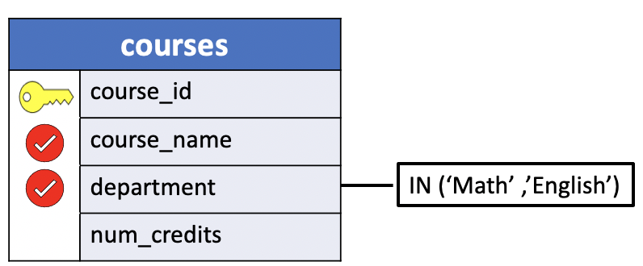
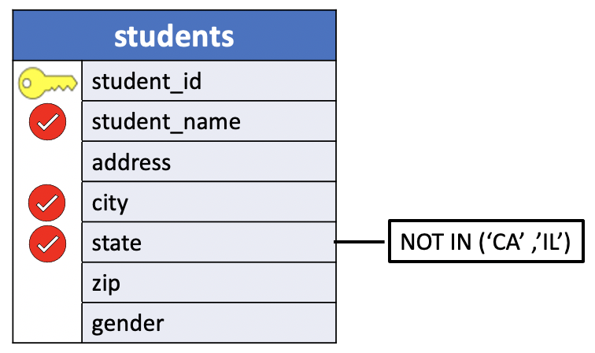

# IN and NOT IN

In this lesson, you will learn how to use the PostgreSQL `IN` operator in the `WHERE` clause to **check if a value matches any value in a list**.

Another possible way to restrict which records are selected is to use `IN` and `NOT IN`. Like the other mechanisms discussed so far, they appear in the `WHERE` clause, and **only records that match their requirements are returned**.

The PostgreSQL `IN` operator determines whether **a value matches any values in a** `list` **or a** `subquery`.

1. We'll first give basic examples on how the `IN` and `NOT` operators work with simple expressions value and list of values.
2. Then we show how to use the `IN` operator in a `WHERE` clause with a list of values and basic subqueries.
3. Lastly, we introduce the equivalent examples of the `NOT IN` operator for the `WHERE` clause.

## IN and NOT IN operator syntax

**The syntax of PostgreSQL** `IN` **operator** that determines whether an expression matches a list of value is as follows:

`<expression>` **IN** `(value1, value2, .., valueN)`

- `<expression>`: The first item is any valid expression, which can be a **value** or a **column**, (or a computation on a set of columns), of a table that you want to match in a `WHERE` clause.
- `(value1, value2, ...)`:  The second item consists of one `(value1)`, two (`value1, value2`) or more N values `(value1, value2, ..., valueN)`, separated by commas and enclosed in parentheses.

The `IN` operator returns **true** if the `<expression>` to be compared equals to any value in the list of values or false otherwise.

Using `IN` is equivalent to grouping several tests for equality together with `OR`s.

Technically, you can substitute the `IN` operator with the `=` and `OR` operators.

The condition that uses the `IN` operator **can be rewritten using** one or more `OR` operators as follows:

```SQL
<expression> = value1 OR
<expression> = value2 OR
...
<expression> = valueN;  
```

This situation is yet another example of a **shorthand form** provided by SQL for common requests.

Similarly, **the syntax of PostgreSQL** `NOT IN` **operator** that determines whether an expression does not match a list of value is as follows:

`<expression>` **NOT IN** `(value1, value2, ..)`

The `NOT IN` operator returns **true** if the `<expression>` does not equal any values in the list or false otherwise. Basically, The `NOT` operator negates the result of the `IN` operator.

Similarly, `NOT IN` is equivalent to grouping tests for inequality together with `AND`s.

Technically, you can substitute the `NOT IN` operator with the `!=` (or `<>`) and `AND` operators.

The condition that uses the `NOT IN` operator **can be rewritten using** one or more `AND` operators as follows:

```SQL
<expression> != value1 AND
<expression> != value2 AND
...
<expression> != valueN;  
```

:warning: **Note**: All the `values` must have the **same data type** as the expression.

### 1. expression value examples

`value` **IN** `(value1, value2, ..)`

The `IN` operator returns **true** if the `value` to be compared equals to any value in the list of values.

`value` **NOT IN** `(value1, value2, ..)`

The `NOT IN` operator returns **true** if the `value` to be compared does not equal to any value in the list of values.

For example, let's consider the case of strings, numeric, boolean and date data types.


#### STRINGS

- if `<expression>` is a **CHAR** value, the `values` separated by commas and enclosed in parentheses must all be **quoted character** strings, ex: `('value1', 'value2',...)`.


- **IN** example:

**SQL**
```SQL
SELECT 'Ludo' IN ('Alex', 'Albert', 'John', 'Ludo', 'Susan') -- True (t)
```

**Query**
```console
test=# SELECT 'Ludo' IN ('Alex', 'Albert', 'John', 'Susan', 'Ludo') AS "Ludo";
```
**Output**

```console
 Ludo
------
 t
(1 row)
```

The string `Ludo` is in the list of values and therefore the `IN` operator returns the boolean value true, `t`.

**SQL**
```SQL
SELECT 'Ludo' IN ('Alex', 'Albert', 'John', 'Susan', 'Maria'); -- FALSE
```

**Query**
```console
hr=# SELECT 'Ludo' IN ('Alex', 'Albert', 'John', 'Susan', 'Maria') AS "Ludo";
```

**Output**
```console
 Ludo
------
 f
(1 row)
```

The string `Ludo` is in not in the list of values and therefore the `IN` operator returns the boolean value false, `f`.

- **NOT IN** example:

**SQL**
```SQL
SELECT 'Ludo' NOT IN ('Alex', 'Albert', 'John', 'Susan', 'Maria'); -- True.
```

**Query**
```console
hr=# SELECT 'Ludo' NOT IN ('Alex', 'Albert', 'John', 'Susan', 'Maria') AS "not_ludo";
```

**Output**
```console
 not_ludo
----------
 t
(1 row)
```

The string `Ludo` is not in the list of values and therefore the `NOT IN` operator returns the boolean value true, `t`.


**SQL**
```SQL
SELECT 'Ludo' NOT IN ('Alex', 'Albert', 'John', 'Susan', 'Ludo'); -- FALSE
```

**Query**
```console
hr=# SELECT 'Ludo' NOT IN ('Alex', 'Albert', 'John', 'Susan', 'Ludo') AS "not_Ludo";
```

**Output**
```console
 not_Ludo
----------
 f
(1 row)
```

The string `Ludo` is in the list of values and therefore the `NOT IN` operator returns the boolean value false, `f`.

#### NUMERIC

- if `<expression>` identifies a **numeric** value, such as `INTEGER` or `SMALLINT`, then the values must be number, so they can be entered directly. ex: `(value1, value2, ...)`.

**SQL**
```SQL
SELECT 4 IN (1, 2, 5, 4) AS "four"; -- True (t)
```

**Query**
```console
test=# SELECT 4 IN (1, 2, 5, 4) AS "four";
```

**Output**
```console
 four
------
 t
(1 row)
```

The `value` can be the result of a computation such as a sum or a function applied to a number of arguments. For example, let's say to apply the modulo function to a number to find the remainders greater than 10 for 13. The list of values are `(10, 11, 12)`.

```SQL
SELECT MOD(36, 13) IN (10, 11, 12) AS MOD_13_UP_10; -- True. MOD(36,13) = 10
```

**Query**
```console
parch_posey=# SELECT MOD(36, 13) IN (10, 11, 12) AS MOD_13_UP_10;
```

**Output**
```console
 mod_13_up_10
--------------
 t
(1 row)
```

It returns true since `36 = 13 * 2 +`**10**.

#### BOOLEAN

- if `<expression>` identifies a literal **Boolean** value, such as `(TRUE, 't','true','y','yes','on','1')` or `(FALSE, 'f','false','n','no','off','0')`, then the values must be literal booleans.


**SQL**
```SQL
SELECT 'y' IN (TRUE,'t','true','y','on','1'); -- True
SELECT `n` IN (FALSE, 'f','false','n','no','off','0'); -- True
SELECT 't' IN (TRUE,FALSE); -- True
SELECT TRUE IN ('t'); -- True
```

**Query**
```console
test=# SELECT 'y' IN ('t','true','y','on','1',TRUE) AS y_TRUE;
```

**Output**
```console
 y_true
--------
 t
(1 row)
```

However, if we use a value different than a boolean literals PostgreSQL throws an error:

**Query**
```console
test=# SELECT 'ok' IN ('t','true','y','on','1',TRUE) AS ok_TRUE;
```

**Output ERROR**:
```console
ERROR:  invalid input syntax for type boolean: "ok"
LINE 1: SELECT 'ok' IN ('t','true','y','on','1',TRUE) AS ok_TRUE;
               ^
```

#### DATE

- if `<expression>` identifies a literal **DATE** value, (i.e: `YYYY-mm-dd` format), then the values must be DATE type values.

For example, suppose we want to compare a set of date values with the current date.

To get the current date we use the PostgreSQL function `NOW()`.

```console
hr=# SELECT NOW()::date;
    now
------------
 2022-05-07
(1 row)
```

**SQL**
```SQL
SELECT NOW()::date IN ('1980-01-15', '1999-02-03', '2022-05-07'); -- True
```

**Query**
```console
hr=# SELECT NOW()::date IN ('1980-01-15', '1999-02-03','2022-05-07') AS now;
```

**Output**
```console
 now
-----
 t
(1 row)
```

However, if we use a different format than PostgreSQL throws an error:

**Query**
```console
hr=# SELECT NOW()::date IN ('1980-01-15', '1999-15-03','2022-05-07') AS now;
```
**Output ERROR**
```console
ERROR:  date/time field value out of range: "1999-15-03"
LINE 1: SELECT NOW()::date IN ('1980-01-15', '1999-15-03','2022-05-0...
                                             ^
HINT:  Perhaps you need a different "datestyle" setting.
```

### 2. WHERE clause example

The general form of a SQL statement using `IN` that determines whether the **values in a table's column** `match` a **list of values** is:

```SQL
SELECT <column_names>
  FROM <table>
 WHERE <column_name> IN (value1, value2, ...);
```

In the `WHERE` clause:

- `<column_name>`: The first item must name a particular column in the table.
- `(value1, value2, ...)`:  The second item consists of one `(value1)`, two (`value1, value2`) or more values `(value1, value2, ...)`, separated by commas and enclosed in parentheses.

The `IN` operator returns **true** if the value to be compared equals to any value in the list of values.

Therefore, in this query:

```SQL
SELECT <column_names>
  FROM <table>
 WHERE <column_name> IN (value1, value2, ...);
```

The **records returned** are those where the field named `<column_name>` **contains one of the values specified in the parenthesized list**.

The condition that uses the `IN` operator **can be rewritten using** one or more `OR` operators as follows:

```SQL
SELECT <column_names>
  FROM <table>
 WHERE <column_name> = value1 OR
       <column_name> = value2 OR
       ...
       <column_name> = valueN;
```

This situation is yet another example of a shorthand form provided by SQL for common requests.

Similarly, **the syntax of PostgreSQL** `NOT IN` **operator** that determines whether the **values in a table's column** `do not match` a **list of values** is:

```SQL
SELECT <column_names>
  FROM <table>
 WHERE <column_name> NOT IN (value1, value2, ...);
```

The **records returned** are those where the field named `<column_name>` **does not contain any of the values specified in the parenthesized list**.

The condition that uses the `NOT IN` operator **can be rewritten using** one or more `AND` operators as follows:

```SQL
SELECT <column_names>
  FROM <table>
 WHERE <column_name> != value1 AND
       <column_name> != value2 AND
       ...
       <column_name> != valueN;
```

:warning: **Note**: All the `values` must have the **same data type** as the column identified by `<column_name`. In other words, all the values must be of a type comparable to that of the column identified by `<column_name>`.

For example,

- if `<column_name>` is a **CHAR** column, the `values` separated by commas and enclosed in parentheses must all be **quoted character** strings, ex: `('value1', 'value2',...)`.
- if `<column_name>` identifies a numeric column, such as `INTEGER` or `SMALLINT`, then the values must be number, so they can be entered directly. ex: `(value1, value2, ...)`.

#### Subquery

In the previous example we introduced the `IN` operator to **compare** `the column's values stored in the records of the table` to a list of values, such as literal strings or numbers.

What if we wanted to **compare** `the column's values stored in the records of the table` to another `set of values contained in another column`?  

In other words, we want to return the records columns stored in `<table>` and indicated in the `SELECT` statement based on the following condition:

- `<column_name>` **IN** (`result set of values contained in one column`);

The second part in the `IN` operator is a **subquery**.

```SQL
SELECT <column_names>
  FROM <table>
 WHERE <column_name> IN subquery;
```

The `subquery` **returns a result set of one column** `to test for the match`. The column must also have the same data type as `<column_name>`.  The `IN` operator returns **true** if the value equals to any value in the list of values or the result set returned by the subquery. Otherwise, it returns false.

The concept of `subquery` will be explained later in the course. However, we can give you a basic idea of what a subquery is with a trivial example.

For example, the list of values can be the result of a `SELECT` statement like this:

```SQL
SELECT <column_names>
  FROM <table>
 WHERE <column_name> IN ( SELECT column_name FROM table_name);
```

The query inside the parentheses is called a `subquery`, which is a **query nested inside another query**.

## UniY IN and NOT IN examples

We’ll use the `courses` and `students` tables in the `uniy` sample database for the demonstration.

1. **Problem**: List the `names` and `departments` of all Math and English **courses**.

- **table**: courses
- `columns`: names, departments
- **condition**: all Math and English departments.

```console
uniy=# \d courses
                    Table "public.courses"
   Column    |     Type      | Collation | Nullable | Default
-------------+---------------+-----------+----------+---------
 course_id   | smallint      |           | not null |
 course_name | character(20) |           |          |
 department  | character(16) |           |          |
 num_credits | smallint      |           |          |
Indexes:
    "courses_pkey" PRIMARY KEY, btree (course_id)
```

**Query Diagram**



**SQL**
```SQL
SELECT course_name,
       department
  FROM courses
 WHERE department IN ('Math', 'English');
```

```SQL
SELECT course_name,
       department
  FROM courses
 WHERE department = 'Math' OR
       department = 'English';
```

**Results**

|course_name      |    department|
|:---------------:|:------------:|
|Calculus IV          | **Math**|
|English Composition  | **English**|

**Query**

```console
uniy=# SELECT course_name,
uniy-#        department
uniy-#   FROM courses
uniy-#  WHERE department IN ('Math', 'English');
```

**Output**

```console
     course_name      |    department
----------------------+------------------
 Calculus IV          | Math
 English Composition  | English
(2 rows)
```

2. **Problem**: List the `names`, `cities`, and `states` of all **students** who are not from California or Illiniois.

- **table**: students
- `columns`: names, cities, states
- **condition**: not from California or Illinois states.

```console
uniy=# \d students
                    Table "public.students"
    Column    |     Type      | Collation | Nullable | Default
--------------+---------------+-----------+----------+---------
 student_id   | smallint      |           | not null |
 student_name | character(18) |           |          |
 address      | character(20) |           |          |
 city         | character(10) |           |          |
 state        | character(2)  |           |          |
 zip          | character(5)  |           |          |
 gender       | character(1)  |           |          |
Indexes:
    "students_pkey" PRIMARY KEY, btree (student_id)
```

**Query Diagram**



**SQL**
```SQL
SELECT student_name,
       city,
       state
  FROM students
 WHERE state NOT IN ('CA', 'IL');
```

```SQL
SELECT student_name,
       city,
       state
  FROM students
 WHERE state != 'CA' AND
       state != 'IL';
```

**Results**

|student_name    |    city    | state|
|:--------------:|:----------:|:----:|
|Susan Powell       | Haverford  | **PA**|
|Bob Dawson         | Newport    | **RI**|
|Howard Mansfield   | Vienna     | **VA**|
|Susan Pugh         | Hartford   | **CT**|
|Joe Adams          | Newark     | **DE**|
|Janet Ladd         | Pennsburg  | **PA**|
|Carol Dean         | Boston     | **MA**|
|John Anderson      | New York   | **NY**|
|Janet Thomas       | Erie       | **PA**|

**Query**
```console
uniy=# SELECT student_name,
uniy-#        city,
uniy-#        state
uniy-#   FROM students
uniy-#  WHERE state NOT IN ('CA', 'IL');
```

**Output**
```console
    student_name    |    city    | state
--------------------+------------+-------
 Susan Powell       | Haverford  | PA
 Bob Dawson         | Newport    | RI
 Howard Mansfield   | Vienna     | VA
 Susan Pugh         | Hartford   | CT
 Joe Adams          | Newark     | DE
 Janet Ladd         | Pennsburg  | PA
 Carol Dean         | Boston     | MA
 John Anderson      | New York   | NY
 Janet Thomas       | Erie       | PA
(9 rows)
```

## DVDRENTAL IN and NOT IN examples

We’ll use the `rental` and `customer` tables in the `dvdrental` sample database for the demonstration.

1. **Problem**: Suppose you want to know the **rental** information of `customer id 1 and 2` for `rental_id` and `rental_date`.

- **table**: rental
- `columns`: customer_id, rental_id, rental_date
- **condition**: not from California or Illinois states.

```console
dvdrental=# \d rental
                                             Table "public.rental"
    Column    |            Type             | Collation | Nullable |                  Default
--------------+-----------------------------+-----------+----------+-------------------------------------------
 rental_id    | integer                     |           | not null | nextval('rental_rental_id_seq'::regclass)
 rental_date  | timestamp without time zone |           | not null |
 inventory_id | integer                     |           | not null |
 customer_id  | smallint                    |           | not null |
 return_date  | timestamp without time zone |           |          |
 staff_id     | smallint                    |           | not null |
 last_update  | timestamp without time zone |           | not null | now()
Indexes:
    "rental_pkey" PRIMARY KEY, btree (rental_id)
```

Basic query.
**SQL**
```SQL
SELECT customer_id,
       rental_id,
       rental_date
  FROM rental
 WHERE customer_id IN (1,2)
 ORDER BY customer_id, return_date DESC;
```

More elaborated query. Filter only rental information occurred at the date '2005-08-22'.
**SQL**
```SQL
SELECT customer_id,
       rental_id,
       rental_date
  FROM rental
 WHERE customer_id IN (1,2) AND
       EXTRACT (YEAR FROM rental_date) = 2005 AND
       EXTRACT (MONTH FROM rental_date) = 8 AND
       EXTRACT (DAY FROM rental_date) = 22
 ORDER BY customer_id, return_date DESC;
```

Shorter version using the `CAST` function.

```SQL
SELECT customer_id,
       rental_id,
       rental_date
  FROM rental
 WHERE customer_id IN (1,2) AND
       CAST (rental_date AS DATE) = '2005-08-22'
 ORDER BY customer_id, rental_date DESC;
```

**Results**

|customer_id | rental_id |     rental_date|
|:----------:|:---------:|:--------------:|
|**1** |     15315 | **2005-08-22 20:03:46**|
|1 |     15298 | 2005-08-22 19:41:37|
|1 |     14825 | 2005-08-22 01:27:57|
|2 |     15145 | 2005-08-22 13:53:04|


**Query**
```console
dvdrental=# SELECT customer_id,
dvdrental-#        rental_id,
dvdrental-#        rental_date
dvdrental-#   FROM rental
dvdrental-#  WHERE customer_id IN (1,2) AND
dvdrental-#        EXTRACT (YEAR FROM rental_date) = 2005 AND
dvdrental-#        EXTRACT (MONTH FROM rental_date) = 8 AND
dvdrental-#        EXTRACT (DAY FROM rental_date) = 22
dvdrental-#  ORDER BY customer_id, return_date DESC;
```

```console
dvdrental=# SELECT customer_id,
dvdrental-#        rental_id,
dvdrental-#        rental_date
dvdrental-#   FROM rental
dvdrental-#  WHERE customer_id IN (1,2) AND
dvdrental-#        CAST (rental_date AS DATE) = '2005-08-22'
dvdrental-#  ORDER BY customer_id, rental_date DESC;
```

**Output**
```console
customer_id | rental_id |     rental_date
-------------+-----------+---------------------
          1 |     15315 | 2005-08-22 20:03:46
          1 |     15298 | 2005-08-22 19:41:37
          1 |     14825 | 2005-08-22 01:27:57
          2 |     15145 | 2005-08-22 13:53:04
(4 rows)
```

We see there are 4 records and the customer_id `1` rented a movie at hour `20`.

2. **Problem**: The following statement finds all rentals with the customer id is not `1` or `2`, occurred at hour `20` pm in the date `2005-08-22`.


**SQL**
```SQL
SELECT customer_id,
       rental_id,
       CAST (rental_date AS TIME) AS rental_2005_08_22
  FROM rental
 WHERE customer_id NOT IN (1,2) AND
       CAST (rental_date AS DATE) = '2005-08-22' AND
       EXTRACT (HOUR FROM rental_date) = 20
 ORDER BY customer_id, rental_date DESC;
```

**Query**
```console
dvdrental=# SELECT customer_id,
dvdrental-#        rental_id,
dvdrental-#        CAST (rental_date AS TIME) AS rental_2005_08_22
dvdrental-#   FROM rental
dvdrental-#  WHERE customer_id NOT IN (1,2) AND
dvdrental-#        CAST (rental_date AS DATE) = '2005-08-22' AND
dvdrental-#        EXTRACT (HOUR FROM rental_date) = 20
dvdrental-#  ORDER BY customer_id, rental_date DESC;
```

**Output**
```console
customer_id | rental_id | rental_2005_08_22
-------------+-----------+-------------------
         13 |     15338 | 20:51:24
         60 |     15318 | 20:15:16
         74 |     15325 | 20:27:38
         91 |     15341 | 20:56:31
         93 |     15324 | 20:23:13
        142 |     15333 | 20:44:06
        147 |     15331 | 20:37:57
        162 |     15332 | 20:41:53
        178 |     15323 | 20:22:40
        188 |     15319 | 20:17:17
        237 |     15337 | 20:49:51
        263 |     15322 | 20:20:30
        274 |     15328 | 20:31:38
        313 |     15340 | 20:55:56
        331 |     15339 | 20:52:12
        363 |     15335 | 20:44:55
        384 |     15321 | 20:20:04
        407 |     15334 | 20:44:35
        407 |     15320 | 20:17:49
        422 |     15316 | 20:07:03
        427 |     15330 | 20:35:30
        450 |     15327 | 20:31:24
        459 |     15342 | 20:56:41
        461 |     15336 | 20:47:48
        512 |     15317 | 20:14:13
        521 |     15329 | 20:32:39
(26 rows)
```

We see that the reocord

|customer_id | rental_id |     rental_date|
|:----------:|:---------:|:--------------:|
|**1** |     15315 | **2005-08-22 20:03:46**|

is not in the output.


3. **Problem Subquery**: The following statement finds the first and last name of the customers who rented a movie at hour `20` pm in the date `2005-08-22`.


First let's find all the movies rented at hour `20` pm in the date `2005-08-22`.

**SQL**
```SQL
SELECT customer_id,
       rental_id,
       CAST (rental_date AS TIME) AS rental_2005_08_22
  FROM rental
 WHERE CAST (rental_date AS DATE) = '2005-08-22' AND
       EXTRACT (HOUR FROM rental_date) = 20
 ORDER BY customer_id, rental_date DESC;
```

**Query**
```console
dvdrental=# SELECT customer_id,
dvdrental-#        rental_id,
dvdrental-#        CAST (rental_date AS TIME) AS rental_2005_08_22
dvdrental-#   FROM rental
dvdrental-#  WHERE CAST (rental_date AS DATE) = '2005-08-22' AND
dvdrental-#        EXTRACT (HOUR FROM rental_date) = 20
dvdrental-#  ORDER BY customer_id, rental_date DESC;
```

**Output**
```console
 customer_id | rental_id | rental_2005_08_22
-------------+-----------+-------------------
           1 |     15315 | 20:03:46
          13 |     15338 | 20:51:24
          60 |     15318 | 20:15:16
          74 |     15325 | 20:27:38
          91 |     15341 | 20:56:31
          93 |     15324 | 20:23:13
         142 |     15333 | 20:44:06
         147 |     15331 | 20:37:57
         162 |     15332 | 20:41:53
         178 |     15323 | 20:22:40
         188 |     15319 | 20:17:17
         237 |     15337 | 20:49:51
         263 |     15322 | 20:20:30
         274 |     15328 | 20:31:38
         313 |     15340 | 20:55:56
         331 |     15339 | 20:52:12
         363 |     15335 | 20:44:55
         384 |     15321 | 20:20:04
         407 |     15334 | 20:44:35
         407 |     15320 | 20:17:49
         422 |     15316 | 20:07:03
         427 |     15330 | 20:35:30
         450 |     15327 | 20:31:24
         459 |     15342 | 20:56:41
         461 |     15336 | 20:47:48
         512 |     15317 | 20:14:13
         521 |     15329 | 20:32:39
(27 rows)
```
Because this query returns a multiple list of values, we cannot use as the input of the IN operator. **We only need a single column**. You can use the `customer_id` column as the input of the `IN` operator.It's worth noting that there is only a duplicate  customer_id `407`, and, therefore, we expect 26 records in the output of this query. However, the first and last name of these customer must be retrieved in another table.

We retrieve this information in the table **customer**.

```console
dvdrental=# \d customer
                                             Table "public.customer"
   Column    |            Type             | Collation | Nullable |                    Default
-------------+-----------------------------+-----------+----------+-----------------------------------------------
 customer_id | integer                     |           | not null | nextval('customer_customer_id_seq'::regclass)
 store_id    | smallint                    |           | not null |
 first_name  | character varying(45)       |           | not null |
 last_name   | character varying(45)       |           | not null |
 email       | character varying(50)       |           |          |
 address_id  | smallint                    |           | not null |
 activebool  | boolean                     |           | not null | true
 create_date | date                        |           | not null | ('now'::text)::date
 last_update | timestamp without time zone |           |          | now()
 active      | integer                     |           |          |
Indexes:
    "customer_pkey" PRIMARY KEY, btree (customer_id)
```

**SQL**
```SQL
SELECT customer_id,
       first_name,
       last_name
  FROM customer
 WHERE customer_id IN (
       SELECT customer_id
         FROM rental
        WHERE CAST (rental_date AS DATE) = '2005-08-22' AND
              EXTRACT (HOUR FROM rental_date) = 20
 )
 ORDER BY customer_id;
```

**Query**
```console
dvdrental=# SELECT customer_id,
dvdrental-#        first_name,
dvdrental-#        last_name
dvdrental-#   FROM customer
dvdrental-#  WHERE customer_id IN (
dvdrental(#        SELECT customer_id
dvdrental(#          FROM rental
dvdrental(#         WHERE CAST (rental_date AS DATE) = '2005-08-22' AND
dvdrental(#               EXTRACT (HOUR FROM rental_date) = 20
dvdrental(#  )
dvdrental-#  ORDER BY customer_id;
```

**Output**

```console
 customer_id | first_name | last_name
-------------+------------+-----------
           1 | Mary       | Smith
          13 | Karen      | Jackson
          60 | Mildred    | Bailey
          74 | Denise     | Kelly
          91 | Lois       | Butler
          93 | Phyllis    | Foster
         142 | April      | Burns
         147 | Joanne     | Robertson
         162 | Lauren     | Hudson
         178 | Marion     | Snyder
         188 | Melanie    | Armstrong
         237 | Tanya      | Gilbert
         263 | Hilda      | Hopkins
         274 | Naomi      | Jennings
         313 | Donald     | Mahon
         331 | Eric       | Robert
         363 | Roy        | Whiting
         384 | Ernest     | Stepp
         407 | Dale       | Ratcliff
         422 | Melvin     | Ellington
         427 | Jesus      | Mccartney
         450 | Jay        | Robb
         459 | Tommy      | Collazo
         461 | Derek      | Blakely
         512 | Cecil      | Vines
         521 | Roland     | South
(26 rows)
```
