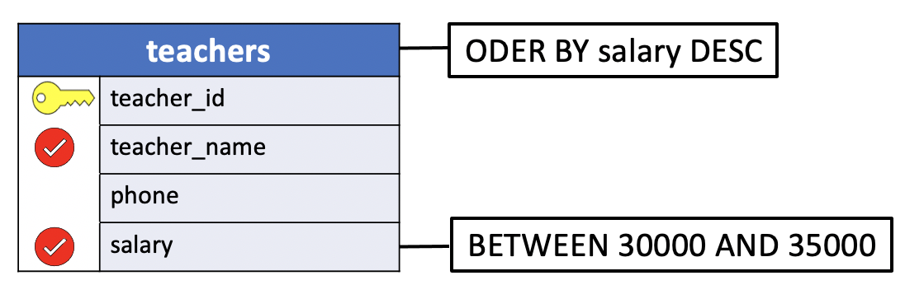

# Introduction to PostgreSQL BETWEEN and NOT BETWEEN operator

The `BETWEEN` operator is one of the logical operators in SQL. The `BETWEEN` operator **checks if a value is within a range of values**. The `NOT BETWEEN` operator **checks if a value is not within a range of values**.

|  Range  |BOOLEAN OPERATOR| BETWEEN | NOT BETWEEN|
|:--|:---------------:|:-------:|:-----------:|
|**[a , b]**| (`val` >= a) **AND** (`val` <= b) | `val` BETWEEN a AND b | |
|**(-inf, a) U (b, +inf)**| (`val` < a) **OR** (`val` > b) | |`val` NOT BETWEEN a AND b |


## BETWEEN

The syntax of the `BETWEEN` operator is as follows:

```SQL
expression BETWEEN low AND high;
```

In this syntax:

- **A)**: `low` and `high`

The `low` and `high` specify the **lower** and **upper** values of the range to test. The low and high values can be `literals` or `expressions`.

- **B)**: `expression`

Is the expression to test for in the range defined by `low` and `high`. To be able to compare, the **data types of expression**, low, and high **must be the same**.

- **C)**: `AND` operator

The `AND` operator acts as a placeholder to separate between `low` and `high`.

The `BETWEEN` operator returns **true** if the `expression` is greater than or equal to ( **>=**) the `low value` and less than or equal to (**<=**) the `high value`.

Technically, the BETWEEN is the equivalent to the following expression that uses the greater than or equal to (`>=`) and less than or equal to (`<=`) operators:

```SQL
expression >= low AND expression <= high; -- [low high]
expression BETWEEN low AND high;
```

To **compare a value with an exclusive range**, you need to use the comparison operators less than (`<`) and greater than (`>`).

```SQL
expression >= low AND expression <  high; -- [low high)  
expression >  low AND expression <= high; -- (low high]
expression >  low AND expression <  high; -- (low high)  
```

## NOT BETWEEN

To negate the result of the `BETWEEN` operator, you use the `NOT` operator:

```SQL
expression NOT BETWEEN low AND high;
```

The `NOT BETWEEN` returns **true** if the expression is less than low (`< low`) or greater than high `(> high)`; otherwise, it returns false.

Like the `BETWEEN` operator, you can rewrite the `NOT BETWEEN` operator using the less than (`<`) and greater than (`>`) operators with the `OR` operator as follows:

```SQL
expression < low OR expression > high;
```

In practice, you often use the `BETWEEN` and `NOT BETWEEN` operator in the `WHERE` clause of the SELECT to **select rows whose value of a column is within a specific range**.

**Note**: The `NOT BETWEEN` operator allows you to compare a value with an exclusive range of the form:

```SQL
expression < low OR expression > high; -- (-inf low) or (high +inf)
expression NOT BETWEEN low AND high;
```

However, the comparison of a value with other exclusive range intervals requires the use of the comparisons operators:

```SQL
expression <= low OR expression >  high; -- (-inf low] or (high +inf)
expression <  low OR expression >= high; -- (-inf low) or [high +inf)
expression <= low OR expression >= high; -- (-inf low] or [high +inf)
```

# BETWEEN and NOT BETWEEN

Using `>=` and `<=` and `AND`, it is possible to select records where values of a specific field in the record fall within a specified range.

In an earlier example, for instance, we listed the name and other information for all students with zip codes from 2000 to 29999 inclusive, (i.e. `(zip >= '20000' AND zip <= '29999')`).

This kind of query arises quite often, and so SQL provides a shorthand way of expressing it. By using `BETWEEN` and `NOT BETWEEN` in a `WHERE` clause, we can directly specify renges of values.

The general form is:

```SQL
SELECT <column name>
  FROM <table>
 WHERE <column name> BETWEEN <value1> AND <value2>;
```

Equivalent  `AND` form with comparison operators:

```SQL
SELECT <column name>
  FROM <table>
 WHERE <column name> >= <value1> AND
       <column name> <= <value2>;
```

In this case, only those records in which values in `<column name>` aree greater than or equal to `<value1>` and less than or equal to `<value2>` will be selected.

The negative form is also available, as in

```SQL
SELECT <column name>
  FROM <table>
 WHERE <column name> NOT BETWEEN <value1> AND <value2>;
```

Equivalent  `OR` form with comparison operators:

```SQL
SELECT <column name>
  FROM <table>
 WHERE <column name> < <value1> OR
       <column name> > <value2>;
```

In this case, only those records whose values are not within the specified range will be selected.

In both forms, `BETWEEN` and `NOT BETWEEN`, the two values are assumed to be specified in ascending order. In this case, for example, `<value1>` is less than `<value2>`. If you reverse the order of the values than the `BETWEEN` and `NOT BETWEEN` operators will never return a true value, although PostgreSQL does not warn you about this logical error.

The values specified in the `WHERE` clause can be of any type, but `<value1>` and `<value2>` must both be of a type comparable to that defined for `<column name>`.

For example, this basic example shows what happen when a comparison involves two different types:

```console
hr=# SELECT 'C' BETWEEN 0 AND 100;
ERROR:  invalid input syntax for integer: "C"
LINE 1: SELECT 'C' BETWEEN 0 AND 100;
               ^
hr=# SELECT 'C' BETWEEN 'B' AND 'F';
 ?column?
----------
 t
(1 row)
```

## UniY BETWEEN and NOT BETWEEN in a WHERE clause examples

We’ll use the `teachers` and `students` tables in the `uniy` sample database for the demonstration.

### Numerical examples

1. **Problem**: List the names and salaries of teachers who make between $30,000 and $35,000 a year. Sort the result by salary in descending order.

- **table**: teachers
- **columns**: teacher_name, salary
- **condition**: salary between 30,000 and 35,000 dollars.
- **sorting**: salary DESC.

**Table**
```console
uniy=# \d teachers
                    Table "public.teachers"
    Column    |     Type      | Collation | Nullable | Default
--------------+---------------+-----------+----------+---------
 teacher_id   | smallint      |           | not null |
 teacher_name | character(18) |           |          |
 phone        | character(10) |           |          |
 salary       | numeric(10,2) |           |          |
Indexes:
    "teachers_pkey" PRIMARY KEY, btree (teacher_id)
```

**Query Diagram**



**SQL**
```SQL
SELECT teacher_name,
       salaray
  FROM teachers
 WHERE salary BETWEEN 30000 AND 35000
 ORDER BY salary DESC;
```

In the SQL statement below I simply added two columns to indicate the salary boolean condition.


**SQL**
```SQL
SELECT teacher_name,
       salary,
       CASE WHEN salary >= 30000 THEN 'TRUE'
            ELSE 'FALSE'
       END AS "salary_>=_30000",
       CASE WHEN salary <= 35000 THEN 'TRUE'
            ELSE 'FALSE'
       END AS "salary_<=_35000"
  FROM teachers
 WHERE salary BETWEEN 30000 AND 35000
 ORDER BY salary DESC;
```


**Results**

|teacher_name    |  salary  | `salary_>=_30000` | `salary_<=_35000`|
|:--------------:|:--------:|:-----------------:|:----------------:|
|Dr. Wright         | 35000.00 | TRUE           | TRUE|
|Dr. Scango         | 32098.00 | TRUE           | TRUE|
|Dr. Olsen          | 31778.00 | TRUE           | TRUE|
|Dr. Lowe           | 31450.00 | TRUE           | TRUE|

As you can see both conditions are `TRUE` in the table above.

**Query**
```console
uniy=# SELECT teacher_name,
uniy-#        salary,
uniy-#        CASE WHEN salary >= 30000 THEN 'TRUE'
uniy-#             ELSE 'FALSE'
uniy-#        END AS "salary_>=_30000",
uniy-#        CASE WHEN salary <= 35000 THEN 'TRUE'
uniy-#             ELSE 'FALSE'
uniy-#        END AS "salary_<=_35000"
uniy-#   FROM teachers
uniy-#  WHERE salary BETWEEN 30000 AND 35000
uniy-#  ORDER BY salary DESC;
```

**Output**
```console
    teacher_name    |  salary  | salary_>=_30000 | salary_<=_35000
--------------------+----------+----------------+-----------------
 Dr. Wright         | 35000.00 | TRUE           | TRUE
 Dr. Scango         | 32098.00 | TRUE           | TRUE
 Dr. Olsen          | 31778.00 | TRUE           | TRUE
 Dr. Lowe           | 31450.00 | TRUE           | TRUE
(4 rows)
```

2. **Problem**: List the names and salaries of teachers who make less than $30,000 and more than $35,000 a year. Sort the result by salary in descending order.

- **table**: teachers
- **columns**: teacher_name, salary
- **condition**: salary less than 30,000 and more than 35,000 dollars.
- **sorting**: salary DESC.

**Table**
```console
uniy=# \d teachers
                    Table "public.teachers"
    Column    |     Type      | Collation | Nullable | Default
--------------+---------------+-----------+----------+---------
 teacher_id   | smallint      |           | not null |
 teacher_name | character(18) |           |          |
 phone        | character(10) |           |          |
 salary       | numeric(10,2) |           |          |
Indexes:
    "teachers_pkey" PRIMARY KEY, btree (teacher_id)
```

**SQL**
```SQL
SELECT teacher_name,
       salaray
  FROM teachers
 WHERE salary NOT BETWEEN 30000 AND 35000
 ORDER BY salary DESC;
```

In the SQL statement below I simply added two columns to indicate the salary boolean condition.

**SQL**
```SQL
SELECT teacher_name,
       salary,
       CASE WHEN salary < 30000 THEN 'TRUE'
            ELSE 'FALSE'
       END AS "salary_<_30000",
       CASE WHEN salary > 35000 THEN 'TRUE'
            ELSE 'FALSE'
       END AS "salary_>_35000"
  FROM teachers
 WHERE salary NOT BETWEEN 30000 AND 35000
 ORDER BY salary DESC;
```

**Results**

|teacher_name    |  salary  | `salary_<_30000` | `salary_>_35000`|
|:--------------:|:--------:|:--------------:|:-------------:|
|Dr. Engle          | 38200.00 | FALSE          | **TRUE**|
|Dr. Cooke          | 29560.00 | **TRUE**           | FALSE|
|Dr. Horn           | 27540.00 | **TRUE**           | FALSE|

As you can see only one condition is `TRUE` in the table above. The first record is in the range of values above the maximum value `35,000` and the remaining records are in the range of values below the minimum value `30,000`.

**Query**
```console
uniy=# SELECT teacher_name,
uniy-#        salary,
uniy-#        CASE WHEN salary < 30000 THEN 'TRUE'
uniy-#             ELSE 'FALSE'
uniy-#        END AS "salary_<_30000",
uniy-#        CASE WHEN salary > 35000 THEN 'TRUE'
uniy-#             ELSE 'FALSE'
uniy-#        END AS "salary_>_35000"
uniy-#   FROM teachers
uniy-#  WHERE salary NOT BETWEEN 30000 AND 35000
uniy-#  ORDER BY salary DESC;
```

**Output**
```console
    teacher_name    |  salary  | salary_<_30000 | salary_>_35000
--------------------+----------+----------------+----------------
 Dr. Engle          | 38200.00 | FALSE          | TRUE
 Dr. Cooke          | 29560.00 | TRUE           | FALSE
 Dr. Horn           | 27540.00 | TRUE           | FALSE
(3 rows)
```

### String example

**Problem**: List the names, cities, states and zip codes of students whose zip codes are not between 20000 and 29999. Sort the results by descing zip codes order.

- **table**: students
- **columns**: student_name, city, state, zip
- **condition**: zip codes below 20000 and above 29999.
- **sorting**: zip DESC.

**Table**
```console
uniy=# \d students
                    Table "public.students"
    Column    |     Type      | Collation | Nullable | Default
--------------+---------------+-----------+----------+---------
 student_id   | smallint      |           | not null |
 student_name | character(18) |           |          |
 address      | character(20) |           |          |
 city         | character(10) |           |          |
 state        | character(2)  |           |          |
 zip          | character(5)  |           |          |
 gender       | character(1)  |           |          |
Indexes:
    "students_pkey" PRIMARY KEY, btree (student_id)
```

**SQL**
```SQL
SELECT student_name,
       city,
       state,
       zip
  FROM students
 WHERE zip NOT BETWEEN '20000' AND '29999'
 ORDER BY zip DESC;
```

In the SQL statement below I simply added two columns to indicate the zip boolean condition.

**SQL**
```SQL
SELECT student_name,
       city,
       state,
       zip,
       CASE WHEN zip < '20000' THEN 'TRUE'
            ELSE 'FALSE'
       END AS "zip_<_20000",
       CASE WHEN zip > '29999' THEN 'TRUE'
            ELSE 'FALSE'
       END AS "zip_>_35000"
  FROM students
 WHERE zip NOT BETWEEN '20000' AND '29999'
 ORDER BY zip DESC;
```

**Results**

|student_name    |    city    | state |  zip  | `zip_<_20000` | `zip_>_35000`|
|:---------------:|:----------:|:----:|:-----:|:-----------:|:---------:|
|Bill Jones         | Newport    | CA    | 92660 | FALSE       | **TRUE**|
|Allen Thomas       | Chicago    | IL    | 60624 | FALSE       | **TRUE**|
|Val Shipp          | Chicago    | IL    | 60556 | FALSE       | **TRUE**|
|Joe Adams          | Newark     | DE    | 19702 | **TRUE**        | FALSE|
|Susan Powell       | Haverford  | PA    | 19041 | **TRUE**        | FALSE|
|Janet Ladd         | Pennsburg  | PA    | 18073 | **TRUE**        | FALSE|
|Janet Thomas       | Erie       | PA    | 16510 | **TRUE**        | FALSE|
|John Anderson      | New York   | NY    | 10008 | **TRUE**        | FALSE|
|Susan Pugh         | Hartford   | CT    | 06107 | **TRUE**        | FALSE|
|Bob Dawson         | Newport    | RI    | 02891 | **TRUE**        | FALSE|
|Carol Dean         | Boston     | MA    | 02169 | **TRUE**        | FALSE|


**Query**
```console
uniy=# SELECT student_name,
uniy-#        city,
uniy-#        state,
uniy-#        zip,
uniy-#        CASE WHEN zip < '20000' THEN 'TRUE'
uniy-#             ELSE 'FALSE'
uniy-#        END AS "zip_<_20000",
uniy-#        CASE WHEN zip > '29999' THEN 'TRUE'
uniy-#             ELSE 'FALSE'
uniy-#        END AS "zip_>_35000"
uniy-#   FROM students
uniy-#  WHERE zip NOT BETWEEN '20000' AND '29999'
uniy-#  ORDER BY zip DESC;
```

**Output**
```console
    student_name    |    city    | state |  zip  | zip_<_20000 | zip_>_35000
--------------------+------------+-------+-------+-------------+-------------
 Bill Jones         | Newport    | CA    | 92660 | FALSE       | TRUE
 Allen Thomas       | Chicago    | IL    | 60624 | FALSE       | TRUE
 Val Shipp          | Chicago    | IL    | 60556 | FALSE       | TRUE
 Joe Adams          | Newark     | DE    | 19702 | TRUE        | FALSE
 Susan Powell       | Haverford  | PA    | 19041 | TRUE        | FALSE
 Janet Ladd         | Pennsburg  | PA    | 18073 | TRUE        | FALSE
 Janet Thomas       | Erie       | PA    | 16510 | TRUE        | FALSE
 John Anderson      | New York   | NY    | 10008 | TRUE        | FALSE
 Susan Pugh         | Hartford   | CT    | 06107 | TRUE        | FALSE
 Bob Dawson         | Newport    | RI    | 02891 | TRUE        | FALSE
 Carol Dean         | Boston     | MA    | 02169 | TRUE        | FALSE
(11 rows)
```

## HR BETWEEN and NOT BETWEEN in a WHERE clause examples

We’ll use the `employees` table in the `hr` sample database for the demonstration.

### Numerical examples

1. **Problem**: List the names and salaries of employees who make a monthly salary in the following ranges of values:
  - `low salary`: less than or equal to  $2,500 or
  - `medium salary`: between $3,000 and $5,000  or
  - `high salary`: between $10,000 and $15,000 or
  - `big salary`: greater than or equal to $20,000.

Sort the result by salary in descending order.

- **table**: employees
- **columns**: employee_id, first_name, last_name, salary
- **condition**: salary in `low`, `medium`, `high` and `big` classes of range values.
- **sorting**: salary DESC.

**table**
```console
hr=# \d employees
                                            Table "public.employees"
    Column     |          Type          | Collation | Nullable |                    Default
---------------+------------------------+-----------+----------+------------------------------------------------
 employee_id   | integer                |           | not null | nextval('employees_employee_id_seq'::regclass)
 first_name    | character varying(20)  |           |          |
 last_name     | character varying(25)  |           | not null |
 email         | character varying(100) |           | not null |
 phone_number  | character varying(20)  |           |          |
 hire_date     | date                   |           | not null |
 job_id        | integer                |           | not null |
 salary        | numeric(8,2)           |           | not null |
 manager_id    | integer                |           |          |
 department_id | integer                |           |          |
Indexes:
    "employees_pkey" PRIMARY KEY, btree (employee_id)
```

We first give a verbose solution to the problem using the comparison operators and then a more convenient and readable solution that requires less typing witht the `BETWEEN` operator.


**SQL**
```SQL
SELECT employee_id,
       first_name,
       last_name,
       salary
  FROM employees
 WHERE (salary <= 2500) OR
       (salary >= 3000 AND salary <= 5000) OR
       (salary >= 10000 AND salary <= 15000) OR
       (salary >= 20000)
 ORDER BY salary DESC;
```

Solution using the `BETWEEN` operator.

**SQL**
```SQL
SELECT employee_id,
       first_name,
       last_name,
       salary
  FROM employees
 WHERE (salary <= 2500) OR
       (salary BETWEEN 3000 AND 5000) OR
       (salary BETWEEN 10000 AND 15000) OR
       (salary >= 20000)
 ORDER BY salary DESC;
```

In the SQL statement below I simply added a column to indicate the salary range class of the employee.

**SQL**
```SQL
SELECT employee_id,
       first_name,
       last_name,
       salary,
       CASE WHEN salary <= 2500 THEN 'Low'
            WHEN salary BETWEEN 3000 AND 5000 THEN 'Medium'
            WHEN salary BETWEEN 10000 AND 15000 THEN 'High'
            WHEN salary >= 20000 THEN 'Big'
            ELSE 'Unknown'
       END AS "salary_class"
  FROM employees
 WHERE (salary <= 2500) OR
       (salary BETWEEN 3000 AND 5000) OR
       (salary BETWEEN 10000 AND 15000) OR
       (salary >= 20000)
 ORDER BY salary DESC;
```

**Salary class**


|salary| s_range|
|:--:|:--|
|Big|`s` **>= 20000**|
|High|**10000 <=** `s` **<= 15000**|
|Medium|**3000 <=** `s` **<= 5000**|
|Low|`s`**<= 2500**|


**Results**

|employee_id | first_name | last_name  |  salary  | salary_class|
|:----------:|:----------:|:----------:|:--------:|:-----------:|
|100 | Steven     | King       | 24000.00 | Big|
|145 | John       | Russell    | 14000.00 | High|
|146 | Karen      | Partners   | 13500.00 | High|
|201 | Michael    | Hartstein  | 13000.00 | High|
|205 | Shelley    | Higgins    | 12000.00 | High|
|108 | Nancy      | Greenberg  | 12000.00 | High|
|114 | Den        | Raphaely   | 11000.00 | High|
|204 | Hermann    | Baer       | 10000.00 | High|
|106 | Valli      | Pataballa  |  4800.00 | Medium|
|105 | David      | Austin     |  4800.00 | Medium|
|200 | Jennifer   | Whalen     |  4400.00 | Medium|
|107 | Diana      | Lorentz    |  4200.00 | Medium|
|192 | Sarah      | Bell       |  4000.00 | Medium|
|193 | Britney    | Everett    |  3900.00 | Medium|
|115 | Alexander  | Khoo       |  3100.00 | Medium|
|119 | Karen      | Colmenares |  2500.00 | Low|


**Query**
```console
hr=# SELECT employee_id,
hr-#        first_name,
hr-#        last_name,
hr-#        salary,
hr-#        CASE WHEN salary <= 2500 THEN 'Low'
hr-#             WHEN salary BETWEEN 3000 AND 5000 THEN 'Medium'
hr-#             WHEN salary BETWEEN 10000 AND 15000 THEN 'High'
hr-#             WHEN salary >= 20000 THEN 'Big'
hr-#             ELSE 'Unknown'
hr-#        END AS "salary_class"
hr-#   FROM employees
hr-#  WHERE (salary <= 2500) OR
hr-#        (salary BETWEEN 3000 AND 5000) OR
hr-#        (salary BETWEEN 10000 AND 15000) OR
hr-#        (salary >= 20000)
hr-#  ORDER BY salary DESC;
```

**Output**
```console
 employee_id | first_name | last_name  |  salary  | salary_class
-------------+------------+------------+----------+--------------
         100 | Steven     | King       | 24000.00 | Big
         145 | John       | Russell    | 14000.00 | High
         146 | Karen      | Partners   | 13500.00 | High
         201 | Michael    | Hartstein  | 13000.00 | High
         205 | Shelley    | Higgins    | 12000.00 | High
         108 | Nancy      | Greenberg  | 12000.00 | High
         114 | Den        | Raphaely   | 11000.00 | High
         204 | Hermann    | Baer       | 10000.00 | High
         106 | Valli      | Pataballa  |  4800.00 | Medium
         105 | David      | Austin     |  4800.00 | Medium
         200 | Jennifer   | Whalen     |  4400.00 | Medium
         107 | Diana      | Lorentz    |  4200.00 | Medium
         192 | Sarah      | Bell       |  4000.00 | Medium
         193 | Britney    | Everett    |  3900.00 | Medium
         115 | Alexander  | Khoo       |  3100.00 | Medium
         119 | Karen      | Colmenares |  2500.00 | Low
(16 rows)
```

2. **Problem**: List the names and salaries of employees who make a monthly salary level in the following ranges of values:
  - `entry level`: above $2,500 and below $3,000 or
  - `professional level`: above $5,000 and below $10,000 or
  - `senior level`: above $15,000 and below $20,000.

Note the word `above` and `below` mean `greater than` and `less than`, respectively. Therefore, an `entry level` salary is a salary greater than $2,500 and less than $3,000.

Sort the result by salary in descending order.

- **table**: employees
- **columns**: employee_id, first_name, last_name, salary
- **condition**: salary in `entry`, `professional` and `senior` level job.
- **sorting**: salary DESC.

**table**
```console
hr=# \d employees
                                            Table "public.employees"
    Column     |          Type          | Collation | Nullable |                    Default
---------------+------------------------+-----------+----------+------------------------------------------------
 employee_id   | integer                |           | not null | nextval('employees_employee_id_seq'::regclass)
 first_name    | character varying(20)  |           |          |
 last_name     | character varying(25)  |           | not null |
 email         | character varying(100) |           | not null |
 phone_number  | character varying(20)  |           |          |
 hire_date     | date                   |           | not null |
 job_id        | integer                |           | not null |
 salary        | numeric(8,2)           |           | not null |
 manager_id    | integer                |           |          |
 department_id | integer                |           |          |
Indexes:
    "employees_pkey" PRIMARY KEY, btree (employee_id)
```


**SQL**
```SQL
SELECT employee_id,
       first_name,
       last_name,
       salary
  FROM employees
 WHERE NOT (
       (salary <= 2500) OR
       (salary BETWEEN 3000 AND 5000) OR
       (salary BETWEEN 10000 AND 15000) OR
       (salary >= 20000))
 ORDER BY salary DESC;
```


**Salary class**

|salary| s_range|
|:--:|:--|
|Big|`s` **>= 20000**|
|**Senior**|**15000 <** `s` **< 20000**|
|High|**10000 <=** `s` **<= 15000**|
|**Professional**|**5000 <** `s` **< 10000**|
|Medium|**3000 <=** `s` **<= 5000**|
|**Entry**|**2500 <**`s`**< 3000**|
|Low|`s`**<= 2500**|


We clearly see that the classes `Senior`, `Professional` and `Entry` level indicated in the salary column, identify the complementary intervals of the classes `Big`, `High`, `Medium` and `Low`. Therefore, the SQL query must return the records not included in the previous query. It follows that the SQL query can be easily obtained with the `NOT` operator that negates the result of the query in the earlier exercise.


In the SQL statement below I simply added a column to indicate the salary range class of the employee job experience level.


**SQL**
```SQL
SELECT employee_id,
       first_name,
       last_name,
       salary,
       CASE WHEN salary > 2500 AND salary < 3000 THEN 'Entry'
            WHEN salary > 5000 AND salary < 10000 THEN 'Professional'
            WHEN salary > 15000 AND salary < 20000 THEN 'Senior'
            ELSE 'other'
       END AS "salary_level"
  FROM employees
 WHERE NOT (
       (salary <= 2500) OR
       (salary BETWEEN 3000 AND 5000) OR
       (salary BETWEEN 10000 AND 15000) OR
       (salary >= 20000))
 ORDER BY salary DESC;
```

**Results**

|employee_id | first_name  |  last_name  |  salary  | salary_level|
|:----------:|:-----------:|:-----------:|:--------:|:-----------:|
|102 | Lex         | De Haan     | 17000.00 | Senior|
|101 | Neena       | Kochhar     | 17000.00 | Senior|
|103 | Alexander   | Hunold      |  9000.00 | Professional|
|109 | Daniel      | Faviet      |  9000.00 | Professional|
|176 | Jonathon    | Taylor      |  8600.00 | Professional|
|177 | Jack        | Livingston  |  8400.00 | Professional|
|206 | William     | Gietz       |  8300.00 | Professional|
|121 | Adam        | Fripp       |  8200.00 | Professional|
|110 | John        | Chen        |  8200.00 | Professional|
|120 | Matthew     | Weiss       |  8000.00 | Professional|
|122 | Payam       | Kaufling    |  7900.00 | Professional|
|112 | Jose Manuel | Urman       |  7800.00 | Professional|
|111 | Ismael      | Sciarra     |  7700.00 | Professional|
|178 | Kimberely   | Grant       |  7000.00 | Professional|
|113 | Luis        | Popp        |  6900.00 | Professional|
|123 | Shanta      | Vollman     |  6500.00 | Professional|
|203 | Susan       | Mavris      |  6500.00 | Professional|
|179 | Charles     | Johnson     |  6200.00 | Professional|
|202 | Pat         | Fay         |  6000.00 | Professional|
|104 | Bruce       | Ernst       |  6000.00 | Professional|
|116 | Shelli      | Baida       |  2900.00 | Entry|
|117 | Sigal       | Tobias      |  2800.00 | Entry|
|126 | Irene       | Mikkilineni |  2700.00 | Entry|
|118 | Guy         | Himuro      |  2600.00 | Entry|


**Query**
```console
hr=# SELECT employee_id,
hr-#        first_name,
hr-#        last_name,
hr-#        salary,
hr-#        CASE WHEN salary > 2500 AND salary < 3000 THEN 'Entry'
hr-#             WHEN salary > 5000 AND salary < 10000 THEN 'Professional'
hr-#             WHEN salary > 15000 AND salary < 20000 THEN 'Senior'
hr-#             ELSE 'other'
hr-#        END AS "salary_level"
hr-#   FROM employees
hr-#  WHERE NOT (
hr(#        (salary <= 2500) OR
hr(#        (salary BETWEEN 3000 AND 5000) OR
hr(#        (salary BETWEEN 10000 AND 15000) OR
hr(#        (salary >= 20000))
hr-#  ORDER BY salary DESC;
```

**Output**
```console
 employee_id | first_name  |  last_name  |  salary  | salary_level
-------------+-------------+-------------+----------+--------------
         102 | Lex         | De Haan     | 17000.00 | Senior
         101 | Neena       | Kochhar     | 17000.00 | Senior
         103 | Alexander   | Hunold      |  9000.00 | Professional
         109 | Daniel      | Faviet      |  9000.00 | Professional
         176 | Jonathon    | Taylor      |  8600.00 | Professional
         177 | Jack        | Livingston  |  8400.00 | Professional
         206 | William     | Gietz       |  8300.00 | Professional
         121 | Adam        | Fripp       |  8200.00 | Professional
         110 | John        | Chen        |  8200.00 | Professional
         120 | Matthew     | Weiss       |  8000.00 | Professional
         122 | Payam       | Kaufling    |  7900.00 | Professional
         112 | Jose Manuel | Urman       |  7800.00 | Professional
         111 | Ismael      | Sciarra     |  7700.00 | Professional
         178 | Kimberely   | Grant       |  7000.00 | Professional
         113 | Luis        | Popp        |  6900.00 | Professional
         123 | Shanta      | Vollman     |  6500.00 | Professional
         203 | Susan       | Mavris      |  6500.00 | Professional
         179 | Charles     | Johnson     |  6200.00 | Professional
         202 | Pat         | Fay         |  6000.00 | Professional
         104 | Bruce       | Ernst       |  6000.00 | Professional
         116 | Shelli      | Baida       |  2900.00 | Entry
         117 | Sigal       | Tobias      |  2800.00 | Entry
         126 | Irene       | Mikkilineni |  2700.00 | Entry
         118 | Guy         | Himuro      |  2600.00 | Entry
(24 rows)
```


3. **Problem**: List the names and salaries of employees who make a monthly salary in the following ranges of values:
  - `poor income`: below $2,800 or
  - `wealthy income`: between $5,000 and $10,000  or
  - `rich income`: above $15,000.

Sort the result by salary in descending order.

- **table**: employees
- **columns**: employee_id, first_name, last_name, salary
- **condition**: salary in `poor`, `wealthy` and `rich` income classes.
- **sorting**: salary DESC.

**table**
```console
hr=# \d employees
                                            Table "public.employees"
    Column     |          Type          | Collation | Nullable |                    Default
---------------+------------------------+-----------+----------+------------------------------------------------
 employee_id   | integer                |           | not null | nextval('employees_employee_id_seq'::regclass)
 first_name    | character varying(20)  |           |          |
 last_name     | character varying(25)  |           | not null |
 email         | character varying(100) |           | not null |
 phone_number  | character varying(20)  |           |          |
 hire_date     | date                   |           | not null |
 job_id        | integer                |           | not null |
 salary        | numeric(8,2)           |           | not null |
 manager_id    | integer                |           |          |
 department_id | integer                |           |          |
Indexes:
    "employees_pkey" PRIMARY KEY, btree (employee_id)
```

**SQL**
```SQL
SELECT employee_id,
       first_name,
       last_name,
       salary
  FROM employees
 WHERE salary NOT BETWEEN 2800 AND 15000 OR
       salary BETWEEN 5000 AND 15000
 ORDER BY salary DESC;
```


**SQL**
```SQL
SELECT employee_id,
       first_name,
       last_name,
       salary,
       CASE WHEN salary < 2800 THEN 'Poor'
            WHEN salary BETWEEN 5000 AND 15000 THEN 'Wealthy'
            WHEN salary > 15000 THEN 'Rich'
            ELSE 'Other'
       END AS "Income"
  FROM employees
 WHERE salary NOT BETWEEN 2800 AND 15000 OR
       salary BETWEEN 5000 AND 15000
 ORDER BY salary DESC;
```

**Results**

|employee_id | first_name  |  last_name  |  salary  | Income|
|:----------:|:-----------:|:-----------:|:--------:|:-----:|
|100 | Steven      | King        | 24000.00 | Rich|
|101 | Neena       | Kochhar     | 17000.00 | Rich|
|102 | Lex         | De Haan     | 17000.00 | Rich|
|145 | John        | Russell     | 14000.00 | Wealthy|
|146 | Karen       | Partners    | 13500.00 | Wealthy|
|201 | Michael     | Hartstein   | 13000.00 | Wealthy|
|205 | Shelley     | Higgins     | 12000.00 | Wealthy|
|108 | Nancy       | Greenberg   | 12000.00 | Wealthy|
|114 | Den         | Raphaely    | 11000.00 | Wealthy|
|204 | Hermann     | Baer        | 10000.00 | Wealthy|
|109 | Daniel      | Faviet      |  9000.00 | Wealthy|
|103 | Alexander   | Hunold      |  9000.00 | Wealthy|
|176 | Jonathon    | Taylor      |  8600.00 | Wealthy|
|177 | Jack        | Livingston  |  8400.00 | Wealthy|
|206 | William     | Gietz       |  8300.00 | Wealthy|
|121 | Adam        | Fripp       |  8200.00 | Wealthy|
|110 | John        | Chen        |  8200.00 | Wealthy|
|120 | Matthew     | Weiss       |  8000.00 | Wealthy|
|122 | Payam       | Kaufling    |  7900.00 | Wealthy|
|112 | Jose Manuel | Urman       |  7800.00 | Wealthy|
|111 | Ismael      | Sciarra     |  7700.00 | Wealthy|
|178 | Kimberely   | Grant       |  7000.00 | Wealthy|
|113 | Luis        | Popp        |  6900.00 | Wealthy|
|203 | Susan       | Mavris      |  6500.00 | Wealthy|
|123 | Shanta      | Vollman     |  6500.00 | Wealthy|
|179 | Charles     | Johnson     |  6200.00 | Wealthy|
|104 | Bruce       | Ernst       |  6000.00 | Wealthy|
|202 | Pat         | Fay         |  6000.00 | Wealthy|
|126 | Irene       | Mikkilineni |  2700.00 | Poor|
|118 | Guy         | Himuro      |  2600.00 | Poor|
|119 | Karen       | Colmenares  |  2500.00 | Poor|


**Query**
```console
hr=# SELECT employee_id,
hr-#        first_name,
hr-#        last_name,
hr-#        salary,
hr-#        CASE WHEN salary < 2800 THEN 'Poor'
hr-#             WHEN salary BETWEEN 5000 AND 15000 THEN 'Wealthy'
hr-#             WHEN salary > 15000 THEN 'Rich'
hr-#             ELSE 'Other'
hr-#        END AS "Income"
hr-#   FROM employees
hr-#  WHERE salary NOT BETWEEN 2800 AND 15000 OR
hr-#        salary BETWEEN 5000 AND 15000
hr-#  ORDER BY salary DESC;
```

**Output**
```console
 employee_id | first_name  |  last_name  |  salary  | Income
-------------+-------------+-------------+----------+---------
         100 | Steven      | King        | 24000.00 | Rich
         101 | Neena       | Kochhar     | 17000.00 | Rich
         102 | Lex         | De Haan     | 17000.00 | Rich
         145 | John        | Russell     | 14000.00 | Wealthy
         146 | Karen       | Partners    | 13500.00 | Wealthy
         201 | Michael     | Hartstein   | 13000.00 | Wealthy
         205 | Shelley     | Higgins     | 12000.00 | Wealthy
         108 | Nancy       | Greenberg   | 12000.00 | Wealthy
         114 | Den         | Raphaely    | 11000.00 | Wealthy
         204 | Hermann     | Baer        | 10000.00 | Wealthy
         109 | Daniel      | Faviet      |  9000.00 | Wealthy
         103 | Alexander   | Hunold      |  9000.00 | Wealthy
         176 | Jonathon    | Taylor      |  8600.00 | Wealthy
         177 | Jack        | Livingston  |  8400.00 | Wealthy
         206 | William     | Gietz       |  8300.00 | Wealthy
         121 | Adam        | Fripp       |  8200.00 | Wealthy
         110 | John        | Chen        |  8200.00 | Wealthy
         120 | Matthew     | Weiss       |  8000.00 | Wealthy
         122 | Payam       | Kaufling    |  7900.00 | Wealthy
         112 | Jose Manuel | Urman       |  7800.00 | Wealthy
         111 | Ismael      | Sciarra     |  7700.00 | Wealthy
         178 | Kimberely   | Grant       |  7000.00 | Wealthy
         113 | Luis        | Popp        |  6900.00 | Wealthy
         203 | Susan       | Mavris      |  6500.00 | Wealthy
         123 | Shanta      | Vollman     |  6500.00 | Wealthy
         179 | Charles     | Johnson     |  6200.00 | Wealthy
         104 | Bruce       | Ernst       |  6000.00 | Wealthy
         202 | Pat         | Fay         |  6000.00 | Wealthy
         126 | Irene       | Mikkilineni |  2700.00 | Poor
         118 | Guy         | Himuro      |  2600.00 | Poor
         119 | Karen       | Colmenares  |  2500.00 | Poor
(31 rows)
```

### Date Range Example

1. **Problem**: find all employees who joined the company between January 1, 1999, and December 31, 2000.

- **table**: employees
- **columns**: employee_id, first_name, last_name, hire_date
- **condition**: hire date between between January 1, 1999, and December 31, 2000.
- **sorting**: hire date DESC.

The problem is to find all employees hired in the years 1999 and 2000.

**table**
```console
hr=# \d employees
                                            Table "public.employees"
    Column     |          Type          | Collation | Nullable |                    Default
---------------+------------------------+-----------+----------+------------------------------------------------
 employee_id   | integer                |           | not null | nextval('employees_employee_id_seq'::regclass)
 first_name    | character varying(20)  |           |          |
 last_name     | character varying(25)  |           | not null |
 email         | character varying(100) |           | not null |
 phone_number  | character varying(20)  |           |          |
 hire_date     | date                   |           | not null |
 job_id        | integer                |           | not null |
 salary        | numeric(8,2)           |           | not null |
 manager_id    | integer                |           |          |
 department_id | integer                |           |          |
Indexes:
    "employees_pkey" PRIMARY KEY, btree (employee_id)
```

**SQL**
```SQL
SELECT employee_id,
       first_name,
       last_name,
       hire_date,
       EXTRACT (YEAR FROM hire_date) AS joined_year
  FROM employees
 WHERE hire_date BETWEEN '1999-01-01' AND '2000-12-31'
 ORDER BY hire_date DESC;
```

**Results**

|employee_id | first_name | last_name  | hire_date  | joined_year|
|:-----------|:----------:|:-----------:|:----------:|:---------:|
|179 | Charles    | Johnson    | 2000-01-04 |        2000|
|113 | Luis       | Popp       | 1999-12-07 |        1999|
|119 | Karen      | Colmenares | 1999-08-10 |        1999|
|178 | Kimberely  | Grant      | 1999-05-24 |        1999|
|107 | Diana      | Lorentz    | 1999-02-07 |        1999|

**Query**
```console
hr=# SELECT employee_id,
hr-#        first_name,
hr-#        last_name,
hr-#        hire_date,
hr-#        EXTRACT (YEAR FROM hire_date) AS joined_year
hr-#   FROM employees
hr-#  WHERE hire_date BETWEEN '1999-01-01' AND '2000-12-31'
hr-#  ORDER BY hire_date DESC;
```

**Output**
```console
 employee_id | first_name | last_name  | hire_date  | joined_year
-------------+------------+------------+------------+-------------
         179 | Charles    | Johnson    | 2000-01-04 |        2000
         113 | Luis       | Popp       | 1999-12-07 |        1999
         119 | Karen      | Colmenares | 1999-08-10 |        1999
         178 | Kimberely  | Grant      | 1999-05-24 |        1999
         107 | Diana      | Lorentz    | 1999-02-07 |        1999
(5 rows)
```

2. **Problem**: find all employees who joined the company before May and after July between 1997 and 1999.

- **table**: employees
- **columns**: employee_id, first_name, last_name, hire_date
- **condition**: hire date before May and after July between 1997 and 1999.
- **sorting**: hire date DESC.

The problem is basically to find all the employees not hired in May, June and July between 1997 and 1999.

**SQL**
```SQL
SELECT employee_id,
       first_name,
       last_name,
       hire_date,
       EXTRACT (YEAR FROM hire_date) AS joined_year,
       TO_CHAR (hire_date, 'MON') AS joined_month
  FROM employees
 WHERE (EXTRACT (YEAR FROM hire_date) BETWEEN 1997 AND 1999) AND
       (EXTRACT (MONTH FROM hire_date) NOT BETWEEN 5 AND 7)
 ORDER BY hire_date DESC;
```


**Result**

|employee_id | first_name  |  last_name  | hire_date  | joined_year | joined_month|
|:-----------|:------------:|:----------:|:----------:|:-----------:|:-----------:|
|113 | Luis        | Popp        | 1999-12-07 |        1999 | DECEMBER|
|119 | Karen       | Colmenares  | 1999-08-10 |        1999 | AUGUST|
|107 | Diana       | Lorentz     | 1999-02-07 |        1999 | FEBRUARY|
|118 | Guy         | Himuro      | 1998-11-15 |        1998 | NOVEMBER|
|126 | Irene       | Mikkilineni | 1998-09-28 |        1998 | SEPTEMBER|
|177 | Jack        | Livingston  | 1998-04-23 |        1998 | APRIL|
|176 | Jonathon    | Taylor      | 1998-03-24 |        1998 | MARCH|
|112 | Jose Manuel | Urman       | 1998-03-07 |        1998 | MARCH|
|106 | Valli       | Pataballa   | 1998-02-05 |        1998 | FEBRUARY|
|116 | Shelli      | Baida       | 1997-12-24 |        1997 | DECEMBER|
|123 | Shanta      | Vollman     | 1997-10-10 |        1997 | OCTOBER|
|111 | Ismael      | Sciarra     | 1997-09-30 |        1997 | SEPTEMBER|
|110 | John        | Chen        | 1997-09-28 |        1997 | SEPTEMBER|
|202 | Pat         | Fay         | 1997-08-17 |        1997 | AUGUST|
|121 | Adam        | Fripp       | 1997-04-10 |        1997 | APRIL|
|193 | Britney     | Everett     | 1997-03-03 |        1997 | MARCH|
|146 | Karen       | Partners    | 1997-01-05 |        1997 | JANUARY|


**Query**
```console
hr=# SELECT employee_id,
hr-#        first_name,
hr-#        last_name,
hr-#        hire_date,
hr-#        EXTRACT (YEAR FROM hire_date) AS joined_year,
hr-#        TO_CHAR (hire_date, 'MONTH') AS joined_month
hr-#   FROM employees
hr-#  WHERE (EXTRACT (YEAR FROM hire_date) BETWEEN 1997 AND 1999) AND
hr-#        (EXTRACT (MONTH FROM hire_date) NOT BETWEEN 5 AND 7)
hr-#  ORDER BY hire_date DESC;
```

**Output**
```console
 employee_id | first_name  |  last_name  | hire_date  | joined_year | joined_month
-------------+-------------+-------------+------------+-------------+--------------
         113 | Luis        | Popp        | 1999-12-07 |        1999 | DECEMBER
         119 | Karen       | Colmenares  | 1999-08-10 |        1999 | AUGUST
         107 | Diana       | Lorentz     | 1999-02-07 |        1999 | FEBRUARY
         118 | Guy         | Himuro      | 1998-11-15 |        1998 | NOVEMBER
         126 | Irene       | Mikkilineni | 1998-09-28 |        1998 | SEPTEMBER
         177 | Jack        | Livingston  | 1998-04-23 |        1998 | APRIL
         176 | Jonathon    | Taylor      | 1998-03-24 |        1998 | MARCH
         112 | Jose Manuel | Urman       | 1998-03-07 |        1998 | MARCH
         106 | Valli       | Pataballa   | 1998-02-05 |        1998 | FEBRUARY
         116 | Shelli      | Baida       | 1997-12-24 |        1997 | DECEMBER
         123 | Shanta      | Vollman     | 1997-10-10 |        1997 | OCTOBER
         111 | Ismael      | Sciarra     | 1997-09-30 |        1997 | SEPTEMBER
         110 | John        | Chen        | 1997-09-28 |        1997 | SEPTEMBER
         202 | Pat         | Fay         | 1997-08-17 |        1997 | AUGUST
         121 | Adam        | Fripp       | 1997-04-10 |        1997 | APRIL
         193 | Britney     | Everett     | 1997-03-03 |        1997 | MARCH
         146 | Karen       | Partners    | 1997-01-05 |        1997 | JANUARY
(17 rows)
```

## DVDRENTAL BETWEEN and NOT BETWEEN in a WHERE clause examples

We’ll use the `rental` table in the `dvdrental` sample database for the demonstration.

1. **Problem**: Find all customers who rented a dvd for more than 9 days in the weekends after 11 pm. Sort the result by day of the week and rental date time of the day (hours).

- **table**: employees
- **columns**: employee_id, rental_date
- **condition**: rented a dvd for more than 9 days in the weekends after 11 pm.
- **sorting**: day of the week ASC, hours ASC.


**Table**
```console
dvdrental=# \d rental
                                             Table "public.rental"
    Column    |            Type             | Collation | Nullable |                  Default
--------------+-----------------------------+-----------+----------+-------------------------------------------
 rental_id    | integer                     |           | not null | nextval('rental_rental_id_seq'::regclass)
 rental_date  | timestamp without time zone |           | not null |
 inventory_id | integer                     |           | not null |
 customer_id  | smallint                    |           | not null |
 return_date  | timestamp without time zone |           |          |
 staff_id     | smallint                    |           | not null |
 last_update  | timestamp without time zone |           | not null | now()
Indexes:
    "rental_pkey" PRIMARY KEY, btree (rental_id)
```

**SQL**
```SQL
SELECT customer_id,
       rental_date,
       CASE WHEN EXTRACT (DOW FROM rental_date) = 0 THEN 'Sunday'
            WHEN EXTRACT (DOW FROM rental_date) = 6 THEN 'Saturday'
            ELSE 'Other'
       END AS "dow",
       EXTRACT (HOUR FROM rental_date) AS "hour"
  FROM rental
 WHERE EXTRACT (YEAR FROM (return_date - rental_date)) < 1 AND
       EXTRACT (DAY FROM (return_date - rental_date)) >= 9 AND
       EXTRACT (DOW FROM rental_date) NOT BETWEEN 1 AND 5 AND
       EXTRACT (HOUR FROM rental_date) BETWEEN 22 AND 23
 ORDER BY dow, hour;
```

We used the function `EXTRACT` to convert the number of days in the timeinterval `(return_date - rental_date)` and the `DOW` for the day of the week.

**Results**

|customer_id |     rental_date     |   dow    | hour|
|:-------------|:------------------:|:-------:|:----:|
|106 | 2005-07-09 22:24:11 | Saturday |   22|
|430 | 2005-08-20 22:24:35 | Saturday |   22|
|197 | 2005-08-20 22:51:25 | Saturday |   22|
|269 | 2005-06-18 22:12:09 | Saturday |   22|
|192 | 2005-07-30 22:30:44 | Saturday |   22|
|201 | 2005-05-28 22:04:03 | Saturday |   22|
|593 | 2005-07-30 23:31:31 | Saturday |   23|
| 51 | 2005-07-09 23:19:11 | Saturday |   23|
|403 | 2005-07-30 23:35:42 | Saturday |   23|
|362 | 2005-08-21 23:28:58 | Sunday   |   23|
|116 | 2005-08-21 23:34:00 | Sunday   |   23|


**Query**
```console
dvdrental=# SELECT customer_id,
dvdrental-#        rental_date,
dvdrental-#        CASE WHEN EXTRACT (DOW FROM rental_date) = 0 THEN 'Sunday'
dvdrental-#             WHEN EXTRACT (DOW FROM rental_date) = 6 THEN 'Saturday'
dvdrental-#             ELSE 'Other'
dvdrental-#        END AS "dow",
dvdrental-#        EXTRACT (HOUR FROM rental_date) AS "hour"
dvdrental-#   FROM rental
dvdrental-#  WHERE EXTRACT (YEAR FROM (return_date - rental_date)) < 1 AND
dvdrental-#        EXTRACT (DAY FROM (return_date - rental_date)) >= 9 AND
dvdrental-#        EXTRACT (DOW FROM rental_date) NOT BETWEEN 1 AND 5 AND
dvdrental-#        EXTRACT (HOUR FROM rental_date) BETWEEN 22 AND 23
dvdrental-#  ORDER BY dow, hour;
```

**Output**
```console
 customer_id |     rental_date     |   dow    | hour
-------------+---------------------+----------+------
         106 | 2005-07-09 22:24:11 | Saturday |   22
         430 | 2005-08-20 22:24:35 | Saturday |   22
         197 | 2005-08-20 22:51:25 | Saturday |   22
         269 | 2005-06-18 22:12:09 | Saturday |   22
         192 | 2005-07-30 22:30:44 | Saturday |   22
         201 | 2005-05-28 22:04:03 | Saturday |   22
         593 | 2005-07-30 23:31:31 | Saturday |   23
          51 | 2005-07-09 23:19:11 | Saturday |   23
         403 | 2005-07-30 23:35:42 | Saturday |   23
         362 | 2005-08-21 23:28:58 | Sunday   |   23
         116 | 2005-08-21 23:34:00 | Sunday   |   23
(11 rows)
```
