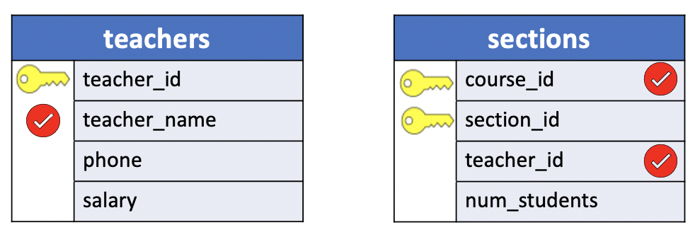
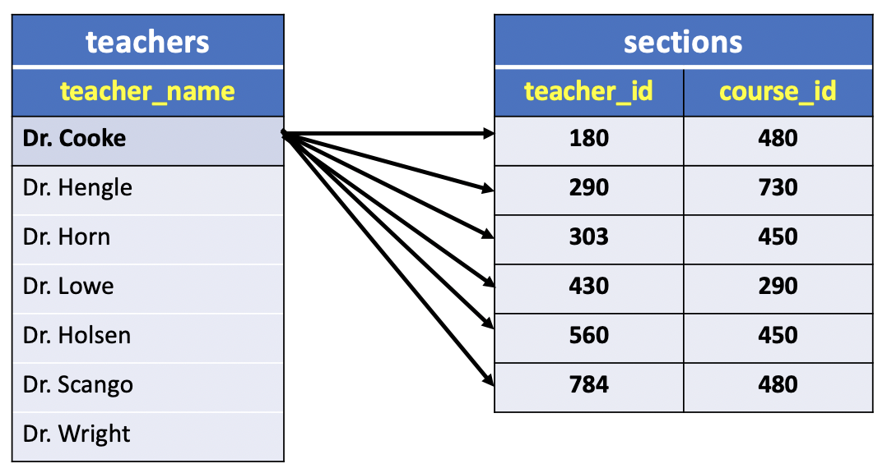
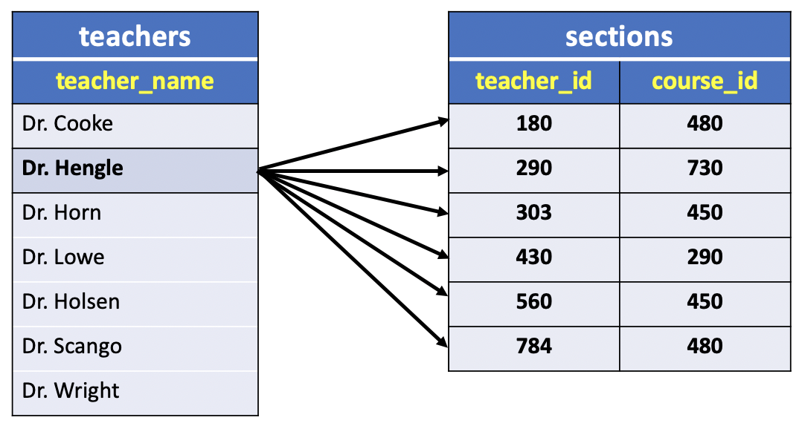

# What is a Join?

In the previous section, we introduced the notion of `qualified names` as a way to reference a table in a `SELECT` statement. We used this concept to formulate the following query:

**SQL**
```SQL
SELECT teacher_name,
       sections.teacher_id,
       course_id
  FROM teachers, sections;
```

Before executing the query, let's run the following two queries:

**SQL1**
```SQL
SELECT teacher_name
  FROM teachers
 ORDER BY teacher_name;
```

**SQL2**
```SQL
SELECT teacher_id,
       course_id
  FROM sections;
```


**Result1**

|teacher_name|
|:-----------:|
|Dr. Cooke|
|Dr. Engle|
|Dr. Horn|
|Dr. Lowe|
|Dr. Olsen|
|Dr. Scango|
|Dr. Wright|

(7 rows)

**Result2**

| teacher_id | course_id|
|:----------:|:--------:|
|        180 |       480|
|        290 |       730|
|        303 |       450|
|        430 |       290|
|        560 |       450|
|        784 |       480|

(6 rows)

In the previous two queries we did not limited the number of rows in the result since there is no `WHERE` clause condition in the `SELECT` statement. The results, therefore, return the number of rows or records in the **teachers** and **sections** tables, that is `7` and `6` rows respectively. So if you issue the query:

**SQL**
```SQL
SELECT teacher_name,
       sections.teacher_id,
       course_id
  FROM teachers, sections
 ORDER BY teacher_name, sections.teacher_id, course_id;
```

what will come back in return?

**Query Diagram**


- **tables**: teachers, sections
- **columns**: `teacher_name`, **sections**.`teacher_id`, `course_id`


Obviously, the result will have three columns. But

- What values will be contained in those three columns?
- How many rows will be in the Output?

The query does not have any condition to limit the number of rows in the output and, therefore, the values in the `teacher_name` column of **teachers** table must appear in the output as well as the values in the `teacher_id` and `course_id` columns of **section** table.

Hence, we'd expect to see each value for `teacher_name` from **teachers** along with each possible value for `teacher_id` and `course_id` from **sections**.

**Query**
```console
uniy=# SELECT teacher_name,
uniy-#        sections.teacher_id,
uniy-#        course_id
uniy-#   FROM teachers, sections
uniy-#  ORDER BY teacher_name, sections.teacher_id, course_id;
```

To carry out this query, SQL will list values from each record of both tables (:warning: for convenience I included the `ORDER BY` clause to sort the results for a better understanding of the output).

**Results**

|    teacher_name    | teacher_id | course_id|
|:------------------:|:----------:|:--------:|
| Dr. Cooke          |        180 |       480|
| Dr. Cooke          |        290 |       730|
| Dr. Cooke          |        303 |       450|
| Dr. Cooke          |        430 |       290|
| Dr. Cooke          |        560 |       450|
| Dr. Cooke          |        784 |       480|
| **Dr. Engle**          |        **180** |      **480**|
| **Dr. Engle**          |        **290**|       **730**|
| **Dr. Engle**          |        **303** |      **450**|
| **Dr. Engle**          |        **430** |      **290**|
| **Dr. Engle**          |        **560** |      **450**|
| **Dr. Engle**          |        **784** |      **480**|
| Dr. Horn           |        180 |       480|
| Dr. Horn           |        290 |       730|
| Dr. Horn           |        303 |       450|
| Dr. Horn           |        430 |       290|
| Dr. Horn           |        560 |       450|
| Dr. Horn           |        784 |       480|
| **Dr. Lowe**           |        **180** |       **480**|
| **Dr. Lowe**           |        **290** |       **730**|
| **Dr. Lowe**           |        **303** |       **450**|
| **Dr. Lowe**           |        **430** |       **290**|
| **Dr. Lowe**           |        **560** |       **450**|
| **Dr. Lowe**           |        **784** |       **480**|
| Dr. Olsen          |        180 |       480|
| Dr. Olsen          |        290 |       730|
| Dr. Olsen          |        303 |       450|
| Dr. Olsen          |        430 |       290|
| Dr. Olsen          |        560 |       450|
| Dr. Olsen          |        784 |       480|
| **Dr. Scango**         |        **180** |       **480**|
| **Dr. Scango**         |        **290** |       **730**|
| **Dr. Scango**         |        **303** |       **450**|
| **Dr. Scango**         |        **430** |       **290**|
| **Dr. Scango**         |        **560** |       **450**|
| **Dr. Scango**         |        **784** |       **480**|
| Dr. Wright         |        180 |       480|
| Dr. Wright         |        290 |       730|
| Dr. Wright         |        303 |       450|
| Dr. Wright         |        430 |       290|
| Dr. Wright         |        560 |       450|
| Dr. Wright         |        784 |       480|

- `7 * 6` = (**42 rows**)

In fact, the output shows all possible combinations of the selected columns from all records in the two tables.



In other words, the results begin with a line containing the value of `teacher_name` from the first record in **teachers** table,`Dr. Cook`, matched with the values of `teacher_id` and `course_id` from the first record in the **courses** table, `(180, 480)`. Next, comes a line matching the next `teacher_id` and `course_id` values, `(280, 790)`, with the selected value from the first record in the **teachers** table, and so one, until each records in the **sections** table has been matched with the first **teachers** record.



Next, the results contain a series of lines that match the selected value from the second record in the **teachers** table, `Dr. Hengle`, with the `teacher_id` and `course_id` values from every record in the **sections** table, and so on.

The result of this seemingly simple query is a long list of combinations, each consisting of a value from a record in **teachers** paired with two values from a record in **sections**.

In relational database theory, this long list of combinations is called a **cross join**, or even more technically a **Cartesian product**.

**Cross joins** are used fairly rarely, but they can be useful in some situations for testing results or other tasks. (Most often, however, they're produced by accident :smile:)

We illustrate the use of the **CROSS JOIN** operator in the next lesson.
