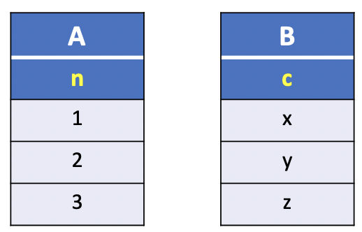
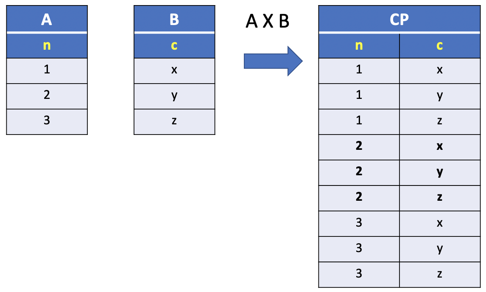
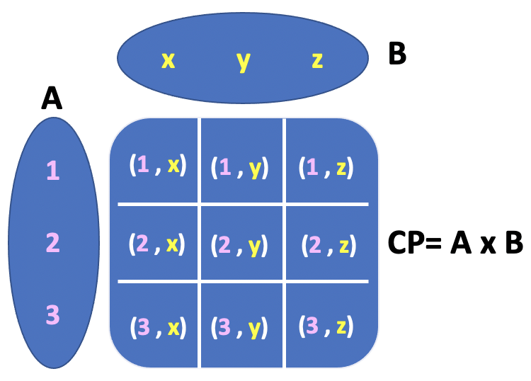

# CROSS JOIN clause

In the previous lesson we illustrated how to get all the possible combination of rows between two tables using a `SELECT` statement and `FROM` clause.

The general form is:

**SQL**
```SQL
SELECT <column names>
  FROM A, B;
```

where `<column names>` is replaced by the names of the desired columns available in the [column scope](./02_qualified_names.md) specified by the `A` and `B` tables in the `FROM` clause.

In relational database theory, this query is called a **cross join**, or even more technically a **Cartesian product**.

To produce a **Cartesian Product**, there is an equivalent form that uses the **CROSS JOIN** clause. The syntax is as follows:

**SQL**
```SQL
SELECT <column names>
  FROM A
 CROSS JOIN B;
```

## CROSS JOIN example

Suppose we have two tables **A** and **B** with a single column, `n` and `c`, as illustrated in the picture below:



The following two queries:

**SQL1**
```SQL
SELECT n, c
  FROM A, B;
```

**SQL2**
```SQL
SELECT n, c
  FROM A
 CROSS JOIN B;
```

**Results**

|n | c|
|:-:|:-:|
|1 | x|
|1 | y|
|1 | z|
|**2** | **x**|
|**2** | **y**|
|**2** | **z**|
|3 | x|
|3 | y|
|3 | z|




will return the **Cartesian Product** of tables **A** and **B**. Let's indicate the resulting table as **CP**.

The following statements create the **A** and **B** tables:

```console
uniy=# CREATE TABLE A (
uniy(#      n INT PRIMARY KEY
uniy(# );
CREATE TABLE
uniy=# CREATE TABLE B (
uniy(#      c CHAR (1) PRIMARY KEY
uniy(# );
CREATE TABLE
```
The following statements inserts records into the **A** and **B** tables:

```console
uniy=# INSERT INTO A
uniy-#        (n)
uniy-# VALUES (1),(2),(3);
INSERT 0 3
uniy=# INSERT INTO B
uniy-#        (c)
uniy-# VALUES ('x'),('y'),('z');
INSERT 0 3
```

**Query**
```console
uniy=# SELECT n, c
uniy-#   FROM A
uniy-#  CROSS JOIN B;
```

**Output**
```console
 n | c
---+---
 1 | x
 1 | y
 1 | z
 2 | x
 2 | y
 2 | z
 3 | x
 3 | y
 3 | z
(9 rows)
```

## CROSS JOIN Visual Diagram

In SQL the **CROSS JOIN** returns the **Cartesian Product** of two tables.

In Math, a **Cartesian Product** is a mathematical operation that returns a *product set* of multiple sets.

In the case of a `FROM` clause that includes two tables, the **Cartesian Product** returns a product set of two sets.

For example, the mathematical notation for the following query:

**SQL2**
```SQL
SELECT n, c
  FROM A
 CROSS JOIN B;
```


is as follow:

Given two sets:

- **sets**:
  - **A** = {**1**`,`**2**`,`**3**}
  - **B** = {**x**`,`**y**`,`**z**}

In this notation, we notice that each element in sets **A** and **B**, indicated as a list of comma separated values, represents a row in the corresponding **A** and **B** tables. For example, the element **1** of set **A** corresponds to the first raw in table **A**.

It follows that the number of elements or `cardinality` in sets **A** and **B** is also the number of rows in the corresponding tables **A** and **B**. The `cardinality` of sets **A** and **B** is indicated as `|`**A**`|` and `|`**B**`|`.

In this example, `|`**A** `|` = 3 and `|` **B** `|` = 3.  

The **Cartesian Product** is:

- **CP = A x B**:
  - { **(1,x)**`,`**(1,y)**`,`**(1,z)** } **U**
  - { **(2,x)**`,`**(2,y)**`,`**(2,z)** } **U**
  - { **(3,x)**`,`**(3,y)**`,`**(3,z)** }.

Similarly, each element in the Cartesian Product, indicated as a set of comma separated values enclosed in parentheses, represents a row in the **CROSS JOIN** resulting table (There is a kind of similarity with the `INSERT INTO` command :smile:).

For instance, the element **(1,x)** corresponds to the first record of table **CP** illustrated in the picture above.

Keeps in mind that the **Cartesian Product** of **A x B** is the set of all **ordered pair** `(a,b)`, which `a` belongs to **A** and `b` belongs to **B**. Hence, the subtle difference with a **CROSS JOIN** is that the order depends on the listing order of the columns in the `SELECT` statement. If the columns order in the `SELECT` statement follows the order of the **Cartesian Product** set definitions, than the **CROSS JOIN** will be rigorously equivalent to the **Cartesian Product**, otherwise is similar to the **Cartesian Product**. However, this difference is not relevant as we deal with sets and, therefore, the elements order is not important.

The **Cartesian Product** `cardinality` is given by the cardinality of **A** times the cardinality of **B**, (i.e.`|`**A X B** `|` = `|` **A** `|` * `|` **B** `|`).

It follows that the **CROSS JOIN** of two tables, **A** and **B**, is a table **CP** of  `n * m` rows, where `n` and `m` are the number of rows in the first and second table, respectively.

In the **CROSS JOIN** example, the total number of rows in the resulting table **CP** is given by the following product: `|` **A** `|` * `|` **B** `|` = `3` * `3` = **9**.

The following picture illustrates the **Cartesian Product**:



The picture above is a standard representation of a **Cartesian Product**. However, this representation is not helpful to visualize a **JOIN** as rows and tables.

Hence, we propose a more informative picture including labels to indicate `rows` and `tables`, and emphasize the relationship between those objects and elements of a **Cartesian Product**.

The picture below shows an alternative representation of the **Cartesian Product** for the **CROSS JOIN** example.


In this diagram each **dot**, indicated as the intersection of a pair of dotted lines linked to each row, represents an **element** of the **Cartesian Product**. It follows that the number of dots in the picture is the total number of rows in the **CROSS JOIN** table. For each row in Table A there are a number of dots equivalent to the number of elements in Table B, so the formula to compute the cardinality of the Cartesian Product is basically a product of the number rows in Table A and Table B.

You may have noticed that the diagram does not show the values listed in the Cartesian Product as in the first picture. This choice is made on purpose as the order of the columns in the **CROSS JOIN** table is not relevant. This means that the following `SELECT n, z` statement is equivalent to `SELECT z, n` in the diagram.

This representation can be easily extended to two or more columns as it will be shown in further examples in the following lessons.

It's worth noting that the **CROSS JOIN** clause `does not have filtering conditions about the rows to be selected`. When you perform a **CROSS JOIN** of two tables the relationship between tables is not relevant. However, the power of a Relational Database Model resides with the ability to combine information amongst tables by linking primary and foreign keys columns.

In the next lesson we extend this visual representation with a diagram proposed by Hadley Wicham in the book `R for Data Science`, chapter [13. Relational Data](https://r4ds.had.co.nz/relational-data.html).

The augmented diagram serves as a basis to explain how join works and more importantly to illustrate the type of joins, `inner` and `outer` joins, based on the tables keys relationships.

Also, you can use an **INNER JOIN** clause with a condition that always evaluates to true to simulate a **CROSS JOIN**. The **INNER JOIN** is described in the next lesson.  

In the following section of this lesson, we'll show how to generate plenty of rows for testing using the **CROSS JOIN** clause.

## CROSS JOIN Testing rows generation

In this section we present two basic examples to show how the **CROSS JOIN** clause can be used to populate tables in a database. We illustrate two cases:

1. In the first example the **CROSS JOIN** returns a table consisting of a primary key resulted by a combination of the columns in the parent tables.
2. In the second example the **CROSS JOIN** returns a table consisting of a primary key resulted by a combination of the columns in the parent tables and an additional column in the child table.

## 1. Example CROSS JOIN

In this example, we create three tables named **inventories**, **products** and **wharehouses**.

- table: **inventories**
- columns: `product_id`, `warehouse_id`, `quantity`


Suppose that the **products** and **wharehouses** tables have the following records:

**products**

|product_id|
|:---------:|
|1|
|2|
|3|

**wharehouses**

|wharehouse_id|
|:-----------:|
|100|
|200|
|300|
|400|

Each row in the **inventories** table requires data for `product_id`, `wharehouse_id` and `quantity`. It's worth noting the `product_id` and `wharehouse_id`  columns forms the primary key of the **inventories** table.

To generate the test data for inserting rows into the **inventories** table, you can use the **CROSS JOIN** clause as shown in the following statement:

**SQL**
```SQL
INSERT INTO inventories
       (product_id, wharehouse_id, quantity)
SELECT product_id,
       wharehouse_id,
       floor(random()*10 + 1)::int
  FROM products
 CROSS JOIN wharehouses;
```

In the SQL statement we used the following function:

- `floor(random()*(10) + 1)::int`

To generate a random integer number between `1` and `10`.


- **Populating inventories table**

**Results**

|product_id | wharehouse_id | quantity|
|:---------:|:-------------:|:-------:|
|         1 |           100 |        6|
|         1 |           200 |        8|
|         1 |           300 |       10|
|         1 |           400 |        8|
|         2 |           100 |        2|
|         2 |           200 |        3|
|         2 |           300 |       10|
|         2 |           400 |        2|
|         3 |           100 |        8|
|         3 |           200 |        6|
|         3 |           300 |        9|
|         3 |           400 |        5|


In the **Results** each row is uniquely identified by the primary key columns of both tables, that is `product_id` and `wharehouse_id` columns. Therefore, the primary key in the inventories table is the combination of the primary key columns of the parent tables.


**Create tables: products, wharehouses**
```console
uniy=# CREATE TABLE products (
uniy(#   product_id SMALLINT PRIMARY KEY
uniy(# );
CREATE TABLE
uniy=# CREATE TABLE wharehouses (
uniy(#   wharehouse_id SMALLINT PRIMARY KEY
uniy(# );
```

**Create table: inventories**
```console
uniy=# CREATE TABLE inventories (
uniy(#    product_id SMALLINT,
uniy(#    wharehouse_id SMALLINT,
uniy(#    quantity SMALLINT DEFAULT 0,
uniy(#    PRIMARY KEY (product_id, wharehouse_id),
uniy(#    CONSTRAINT inventories_fkey_product
uniy(#       FOREIGN KEY (product_id)
uniy(#       REFERENCES products (product_id)
uniy(#       ON DELETE CASCADE,
uniy(#    CONSTRAINT inventories_fkey_wharehouse
uniy(#       FOREIGN KEY (wharehouse_id)
uniy(#       REFERENCES wharehouses (wharehouse_id)
uniy(#       ON DELETE CASCADE
uniy(# );
CREATE TABLE
```

In the creation statement we included the foreign key constraints that link the **inventories** table to the **products** and **wharehouses** tables.

**table: inventories**
```console
uniy=# \d inventories
                Table "public.inventories"
    Column     |   Type   | Collation | Nullable | Default
---------------+----------+-----------+----------+---------
 product_id    | smallint |           | not null |
 wharehouse_id | smallint |           | not null |
 quantity      | smallint |           |          | 0
Indexes:
    "inventories_pkey" PRIMARY KEY, btree (product_id, wharehouse_id)
Foreign-key constraints:
    "inventories_fkey_product" FOREIGN KEY (product_id) REFERENCES products(product_id) ON DELETE CASCADE
    "inventories_fkey_wharehouse" FOREIGN KEY (wharehouse_id) REFERENCES wharehouses(wharehouse_id) ON DELETE CASCADE
```

`Populating` the **products** and **wharehouses** tables.

```console
uniy=# INSERT INTO products
uniy-#        (product_id)
uniy-# VALUES (1), (2), (3);
INSERT 0 3
uniy=# INSERT INTO wharehouses
uniy-#        (wharehouse_id)
uniy-# VALUES (100), (200), (300), (400);
INSERT 0 4
```

**CROSS JOIN QUERY** to generate testing rows fo the `child table` **inventories**.

**QUERY**
```console
uniy=# INSERT INTO inventories
uniy-#        (product_id, wharehouse_id, quantity)
uniy-# SELECT product_id,
uniy-#        wharehouse_id,
uniy-#        floor(random()*10 + 1)::int
uniy-#   FROM products
uniy-#  CROSS JOIN wharehouses;
INSERT 0 12
```

**Output**
```console
uniy=# SELECT *
uniy-#   FROM inventories;
 product_id | wharehouse_id | quantity
------------+---------------+----------
          1 |           100 |        6
          1 |           200 |        8
          1 |           300 |       10
          1 |           400 |        8
          2 |           100 |        2
          2 |           200 |        3
          2 |           300 |       10
          2 |           400 |        2
          3 |           100 |        8
          3 |           200 |        6
          3 |           300 |        9
          3 |           400 |        5
(12 rows)
```

## 2. Example CROSS JOIN

In this example, we create three tables named **courses**, **teachers** and **sections**.

- table: **sections**
- columns: `course_id`, `section_id`, `teacher_id`,`num_students`


Suppose that the **courses** and **teachers** tables have the following records:

**courses**

|id|
|:---------:|
|1|
|2|
|3|

**teachers**

|id|
|:-----------:|
|100|
|200|
|300|
|400|

Each row in the **sections** table requires data for `course_id`, `section_id`, `teacher_id` and `num_students`. It's worth noting the `course_id` and `section_id`  columns forms the primary key of the **sections** table. However, the `section_id` is not a column of **courses** and **teachers** table. Hence, we define a surrogate sequential type to generate automatically the value for the `section_id` column.

To generate the test data for inserting rows into the **sections** table, you can use the **CROSS JOIN** clause as shown in the following statement:

**SQL**
```SQL
INSERT INTO sections
       (course_id, teacher_id, num_students)
 SELECT courses.id,
        teachers.id,
        floor(random()*10 + 1)::int
   FROM courses
  CROSS JOIN teachers;
```

**Results**

|course_id | section_id | teacher_id | num_students|
|:--------:|:----------:|:----------:|:-----------:|
|        1 |          1 |        100 |            1|
|        1 |          2 |        200 |            8|
|        1 |          3 |        300 |            1|
|        1 |          4 |        400 |            2|
|        2 |          5 |        100 |           10|
|        2 |          6 |        200 |            7|
|        2 |          7 |        300 |            1|
|        2 |          8 |        400 |            5|
|        3 |          9 |        100 |            1|
|        3 |         10 |        200 |            1|
|        3 |         11 |        300 |            5|
|        3 |         12 |        400 |            6|


**Creating parent tables: courses and teachers**
```console
hr=# CREATE TABLE courses (
hr(#     id SMALLINT PRIMARY KEY
hr(# );
CREATE TABLE
hr=# CREATE TABLE teachers (
hr(#     id SMALLINT PRIMARY KEY
hr(# );
```
**Creating child table: sections**
```console
CREATE TABLE
hr=# CREATE TABLE sections (
hr(#     course_id SMALLINT,
hr(#     section_id SERIAL,
hr(#     teacher_id SMALLINT,
hr(#     num_students SMALLINT DEFAULT 0,
hr(#     PRIMARY KEY (course_id, section_id),
hr(#     CONSTRAINT sections_fkey_course
hr(#        FOREIGN KEY (course_id)
hr(#        REFERENCES courses (id)
hr(#        ON DELETE CASCADE,
hr(#     CONSTRAINT sections_fkey_teachers
hr(#        FOREIGN KEY (teacher_id)
hr(#        REFERENCES teachers (id)
hr(#        ON DELETE SET NULL
hr(# );
CREATE TABLE
```

**Popualating parent tables**
```console
hr=# INSERT INTO courses
hr-#        (id)
hr-# VALUES (1), (2), (3);
INSERT 0 3
hr=# INSERT INTO teachers
hr-#        (id)
hr-# VALUES (100), (200), (300), (400);
INSERT 0 4
```

**Populating child table**
```console
hr=# INSERT INTO sections
hr-#        (course_id, teacher_id, num_students)
hr-#  SELECT courses.id,
hr-#         teachers.id,
hr-#         floor(random()*10 + 1)::int
hr-#    FROM courses
hr-#   CROSS JOIN teachers;
INSERT 0 12
```

**Output**
```console
hr=# SELECT *
hr-#   FROM sections;
 course_id | section_id | teacher_id | num_students
-----------+------------+------------+--------------
         1 |          1 |        100 |            1
         1 |          2 |        200 |            8
         1 |          3 |        300 |            1
         1 |          4 |        400 |            2
         2 |          5 |        100 |           10
         2 |          6 |        200 |            7
         2 |          7 |        300 |            1
         2 |          8 |        400 |            5
         3 |          9 |        100 |            1
         3 |         10 |        200 |            1
         3 |         11 |        300 |            5
         3 |         12 |        400 |            6
(12 rows)
```
