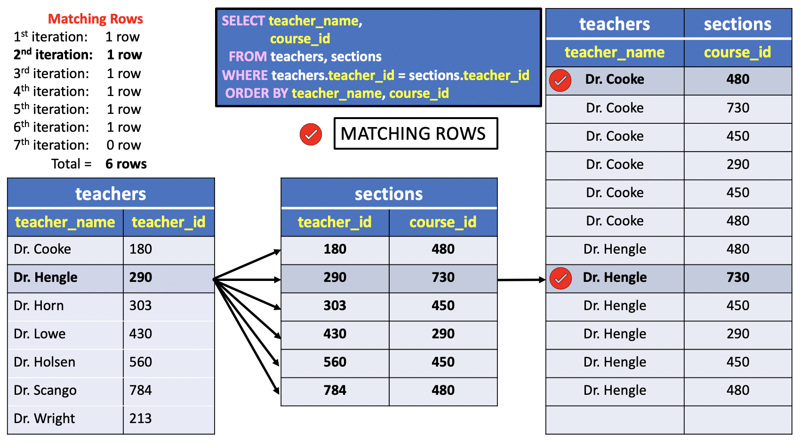

# Restricting the Results of a Join

In the previous lesson we introduced the **CROSS JOIN** clause to combine all the possible rows of two tables into a single table. However, not all the information contained in the resulting table is often useful.

In this lesson, we'll show you how to restrict the results of a Join and filter the relevant information to our problem.

## Join: the WHERE clause

What happens if, in a query accessing two tables with columns of the same name, we specify the same column name twice, once for each table?

Doing this requires that we give the qualified name for each column.


For example, in the `uniy` sample database the **sections** table references the **teachers** table using the common `teacher_id` column.

This means that `the values in the teacher_id` **foreign key column** `are drawn from the` **primary key column** `of the same name in the teachers table`.

**To have a feeling of what this really means** :smile:, let's run the same query example of the **Cartesian product** between **teachers** and **sections** tables given in the previous [lesson](./03_what_is_a_join).

This time, however, we include the `teacher_id` column of both tables and use the `teacher_id_fk` and `teacher_id_pk` aliases to discriminate the columns of the **teachers** and **sections** tables in the query's output. We also sort the result by foreign and primary key values to better explain the relationship between tables values.

```SQL
SELECT teacher_name,
       teachers.teacher_id AS teacher_id_fk,
       sections.teacher_id AS teacher_id_pk,
       course_id
  FROM teachers, sections
 ORDER BY teacher_name, teachers.teacher_id, sections.teacher_id;
```

The results are like those previously specified - `a list of all possible combinations of the selected columns from the two tables` - **except that the column called** `teacher_id` appears twice. The results of this query are as follows:

**Results**

|teacher_name    | teacher_id_fk | teacher_id_pk |    course_id|
|:--------------:|:-------------:|:-------------:|:-----------:|
|:heavy_multiplication_x:`Dr. Cooke`          |           **180** |           **180** |       `480`|
|Dr. Cooke          |           180 |           290 |       730|
|Dr. Cooke          |           180 |           303 |       450|
|Dr. Cooke          |           180 |           430 |       290|
|Dr. Cooke          |           180 |           560 |       450|
|Dr. Cooke          |           180 |           784 |       480|
|Dr. Engle          |           430 |           180 |       480|
|Dr. Engle          |           430 |           290 |       730|
|Dr. Engle          |           430 |           303 |       450|
|:heavy_multiplication_x:`Dr. Engle`          |           **430** |           **430** |       `290`|
|Dr. Engle          |           430 |           560 |       450|
|Dr. Engle          |           430 |           784 |       480|
|Dr. Horn           |           303 |           180 |       480|
|Dr. Horn           |           303 |           290 |       730|
|:heavy_multiplication_x:`Dr. Horn`           |           **303** |           **303** |       `450`|
|Dr. Horn           |           303 |           430 |       290|
|Dr. Horn           |           303 |           560 |       450|
|Dr. Horn           |           303 |           784 |       480|
|Dr. Lowe           |           290 |           180 |       480|
|:heavy_multiplication_x:`Dr. Lowe`           |           **290** |           **290** |       `730`|
|Dr. Lowe           |           290 |           303 |       450|
|Dr. Lowe           |           290 |           430 |       290|
|Dr. Lowe           |           290 |           560 |       450|
|Dr. Lowe           |           290 |           784 |       480|
|Dr. Olsen          |           560 |           180 |       480|
|Dr. Olsen          |           560 |           290 |       730|
|Dr. Olsen          |           560 |           303 |       450|
|Dr. Olsen          |           560 |           430 |       290|
|:heavy_multiplication_x:`Dr. Olsen`          |           **560** |           **560** |       `450`|
|Dr. Olsen          |           560 |           784 |       480|
|Dr. Scango         |           784 |           180 |       480|
|Dr. Scango         |           784 |           290 |       730|
|Dr. Scango         |           784 |           303 |       450|
|Dr. Scango         |           784 |           430 |       290|
|Dr. Scango         |           784 |           560 |       450|
|:heavy_multiplication_x:`Dr. Scango`         |           **784** |           **784** |       `480`|
|Dr. Wright         |           213 |           180 |       480|
|Dr. Wright         |           213 |           290 |       730|
|Dr. Wright         |           213 |           303 |       450|
|Dr. Wright         |           213 |           430 |       290|
|Dr. Wright         |           213 |           560 |       450|
|Dr. Wright         |           213 |           784 |       480|

The `teacher_id_fk` and `teacher_id_pk` columns contain all possible combinations of values for `teacher_id` from the two tables. Each combination row is a **concatenation** of four columns: the first and last two columns identify a record in the **teachers** and **sections** tables, respectively.

 Not all rows, however, are meaningful in the Cartesian Product. To see which row is not informative, look through the results.
 Note that whenever the value of `teacher_id_fk` is not equal to `teacher_id_pk`, the values in the `teacher_name` and `course_id` columns are not related in the `uniy` relational database.  

 To better illustrate those rows, all the records in the **Results**  have no icons :heavy_multiplication_x: in the first field.

For instance, take the second row in the **Results**:

|teacher_name    | teacher_id_fk | teacher_id_pk |    course_id|
|:--------------:|:-------------:|:-------------:|:-----------:|
|Dr. Cooke|**180**|**290**|730|

The first impression is that `Dr. Cooke` is the teacher of course number `730`.
In this record, however, the values `Dr. Cooke`, (**180**), and `730` are not related. To see why this is the case, take a look at the **sections** table:

**sections** table:

|course_id | section_id | teacher_id | num_students|
|:---------|:----------:|:----------:|:-----------:|
|450       |          1 |        303 |            2|
|730       |          1 |        290 |            6|
|290       |          1 |        430 |            3|
|**480**       |          1 |        **180** |            3|
|450       |          2 |        560 |            2|
|480       |          2 |        784 |            2|

The only `course_id` value related to `Dr. Cooke` is `480`.

Usually, general results such as these are not very useful. Generally you want to answer one of the following questions:

1. the courses **where** `Dr. Cooke` is not the teacher or
2. the courses **where** `Dr. Cooke` is the teacher.

To put it in another way, the column name `course_id` in the resulting table is misleading. Does it refer to the `teaching courses` or `not teaching courses`. Obviously, this column cannot contain both values.

In the Cartesian Product, therefore, too much information is given, and it is difficult to pick out what is interesting.

To reduce the size of the results and thereby zero in on the answer to some particular question, we can add a `WHERE` clause to the previous query.

We might wish to know for example, `which teachers are teaching which courses`. Further, we might wish to identify those teachers by `name`, not just by their teacher numbers. This information is available in the **results** of the previous query, but it's not a very concise or usable form. **By adding a** `WHERE clause`, **we can retrieve only those results of the join in which we are interested**.

To see `which teachers teach which courses`, look through the results just given. Note that whenever the value of `teacher_id` from the **teachers** table, indicated as `teacher_id_fk` column, is equal to the value of `teacher_id` from the **sections** table, indicated as `teacher_id_pk` column, the **course** that appears in that record is one that is taught by that teacher.

This result is better illustrated in the table below that contains only the **rows where the foreign and primary keys values are equal**.

**Output**

|teacher_name    | teacher_id_fk | teacher_id_pk |    course_id|
|:--------------:|:-------------:|:-------------:|:-----------:|
|:heavy_multiplication_x:`Dr. Cooke`          |           **180** |           **180** |       `480`|
|:heavy_multiplication_x:`Dr. Engle`          |           **430** |           **430** |       `290`|
|:heavy_multiplication_x:`Dr. Horn`           |           **303** |           **303** |       `450`|
|:heavy_multiplication_x:`Dr. Lowe`           |           **290** |           **290** |       `730`|
|:heavy_multiplication_x:`Dr. Olsen`          |           **560** |           **560** |       `450`|
|:heavy_multiplication_x:`Dr. Scango`         |           **784** |           **784** |       `480`|

For a quick reference we show the **teachers** and **sections** tables below. The tables' records are sorted by `teacher_id`.

**teachers** table

|teacher_id |    teacher_name    |   phone    |  salary|
|:---------:|:------------------:|:----------:|:-------:|
|       180 | Dr. Cooke          | 257-8088   | 29560.00|
|       430 | Dr. Engle          | 256-4621   | 38200.00|
|       303 | Dr. Horn           | 257-3049   | 27540.00|
|       290 | Dr. Lowe           | 257-2390   | 31450.00|
|       560 | Dr. Olsen          | 257-8086   | 31778.00|
|       784 | Dr. Scango         | 257-3046   | 32098.00|
|       **213** | **Dr. Wright**         | 257-3393   | 35000.00|


**sections** table:

|course_id | section_id | teacher_id | num_students|
|:--------:|:----------:|:----------:|:-----------:|
|      480 |          1 |        180 |            3|
|      730 |          1 |        290 |            6|
|      450 |          1 |        303 |            2|
|      290 |          1 |        430 |            3|
|      450 |          2 |        560 |            2|
|      480 |          2 |        784 |            2|

On the other hand, whenever the value of `teacher_id` from the **teachers** table, indicated as `teacher_id_fk` column, **is not equal** to the value of `teacher_id` from the **sections** table, indicated as `teacher_id_pk` column, the **course** that appears in that record is one that is **not taught by that teacher**.

|teacher_name    | teacher_id_fk | teacher_id_pk |    course_id|
|:--------------:|:-------------:|:-------------:|:-----------:|
|Dr. Wright         |           213 |           180 |       480|
|Dr. Wright         |           213 |           290 |       730|
|Dr. Wright         |           213 |           303 |       450|
|Dr. Wright         |           213 |           430 |       290|
|Dr. Wright         |           213 |           560 |       450|
|Dr. Wright         |           213 |           784 |       480|

For example, the number of courses not taught by `Dr. Wright` are 7. Note that 7 is also the number of rows in the **sections** table. This means that `Dr. Wright` does not teach courses listed in the sections table. This result has an important implication as we'll show soon.

This example shows the simplicity and power of the Relational model and the importance in the keys definition of a database. The `primary` and `foreign keys` are sometimes called **join columns** for the way tables' rows are **joined** in the results. The information stored in these join columns gives us a very powerful tool for accessing the stored data.

The reason the `primary` and `foreign` keys are called **join columns** is obvious if you imagined a database with a single table containing the information of all tables. For instance, in the last example the **teachers** and **sections** table could be joined in a single table, **teachers_sections**, as follows:


|    teacher_name    |   phone    |  salary |teacher_id |course_id | section_id | num_students|
|:------------------:|:----------:|--------:|:----------|:---------|:----------:|:-----------:|
| Dr. Horn           | 257-3049   | 27540.00|**303**    |450       |          1 |            2|
| Dr. Lowe           | 257-2390   | 31450.00|**290**    |730       |          1 |            6|
| Dr. Engle          | 256-4621   | 38200.00|**430**    |290       |          1 |            3|
| Dr. Cooke          | 257-8088   | 29560.00|**180**    |480       |          1 |            3|
| Dr. Olsen          | 257-8086   | 31778.00|**560**    |450       |          2 |            2|
| Dr. Scango         | 257-3046   | 32098.00|**784**    |480       |          2 |            2|
| **Dr. Wright** | **257-3393**   | **35000.00**|**213**| **NULL** | **NULL**   | **NULL**|

In this table the first and last three columns belong to the **teachers** and **sections** tables, respectively. The `teacher_id` column in the middle is the `join column`.

You may have noticed that a row in this table contains `NULL` values in the **sections** table columns. The last record identifies the only teacher, `Dr. Wright`, that does not teach courses, as we discussed in the last example; This means that the value `213` in the `teacher_id` column of **teachers** `parent` table does not have any matching rows in the **sections** table. In other words, the number `213` does not appear in the `teacher_id` column of the **sections** `child` table. In relational database theory this kind of rows are often called **dangling** rows. A **dangling row** is a row in the `parent` table with no matching row in the `child` table, (i.e. the primary key is not paired with any foreign key value).

We'll show later in this chapter how to pull out this record from the database using the `OUTER JOIN` clause. For the moment this record can be ignored. This example, however, shows the importance to split data into separate tables, as discussed at the beginning of this [chapter](./01_why_split_data.md),. We could have many records like the last one in the **teachers** table. As a consequence, the table would have additional fields with NULL values and larger data storage overhead.


## UniY JOIN WHERE clause: keep observation of both tables


Back to the original question:

- `Which teachers teach which classes?`

The SQL query should not be a surprise!

Reminding that the `WHERE` clause indicates the conditions every row should satisfy in the result, it must be straightforward to guess the solution to this problem.

To select just those records from the mass of information given previously, one could type:

**SQL**
```SQL
SELECT teacher_name,
       sections.teacher_id,
       course_id
  FROM teachers, sections
 WHERE teachers.teacher_id = sections.teacher_id
 ORDER BY teacher_id, course_id;   
```

The results are only those records that meet the condition specified in the `WHERE` clause: Those where the two `teacher_id` values are equal. We can now see easily which courses are taught by each teacher, and the teachers are identified by name:

**Results**

|teacher_name    | teacher_id | course_id|
|:--------------:|:----------:|:--------:|
|Dr. Cooke          |        180 |       480|
|Dr. Lowe           |        290 |       730|
|Dr. Horn           |        303 |       450|
|Dr. Engle          |        430 |       290|
|Dr. Olsen          |        560 |       450|
|Dr. Scango         |        784 |       480|

**Query**
```console
uniy=# SELECT teacher_name,
uniy-#        sections.teacher_id,
uniy-#        course_id
uniy-#   FROM teachers, sections
uniy-#  WHERE teachers.teacher_id = sections.teacher_id
uniy-#  ORDER BY teacher_id, course_id;
```
**Output**

```console
teacher_name    | teacher_id | course_id
--------------------+------------+-----------
Dr. Cooke          |        180 |       480
Dr. Lowe           |        290 |       730
Dr. Horn           |        303 |       450
Dr. Engle          |        430 |       290
Dr. Olsen          |        560 |       450
Dr. Scango         |        784 |       480
(6 rows)
```

Even though they are used in the `WHERE` clause, the values for `teacher_id` need not be selected by the query. If we were interested in seeing only teachers' names and the numbers of courses they teach, we would have used:

```SQL
SELECT teacher_name,
       course_id
  FROM teachers, sections
 WHERE teachers.teacher_id = sections.teacher_id
 ORDER BY teacher_name, course_id;
```

This time, the results include only the `teacher_name` and `course_id` values for those records that meet the `WHERE` clause's condition; that is, a list of teachers and the courses taught by each.



The picture above shows the filtered rows matching the condition of the `WHERE` clause. Each row in the **teachers** table could match with zero, one or more rows in the **sections** table. For this particular database instance, the rows in the **teachers** table have one matching except the last row with `teacher_id` equal to `213`, as confirmed by the output of the following query:

**Query**
```console
uniy=# SELECT teacher_name,
uniy-#        course_id
uniy-#   FROM teachers, sections
uniy-#  WHERE teachers.teacher_id = sections.teacher_id AND
uniy-#        teachers.teacher_id = 213;
```
**Output**
```console
 teacher_name | course_id
--------------+-----------
(0 rows)
```

Moreover, the **sections** table referential integrity constraint guarantees that the total number of matching rows is equal to the number of rows in the sections table, that is 6.

## Semi-join: Keep all observations of a single table that have a match

Because the **sections** table contains records only for currently offered sections, we could see only the **names of those teachers who are currently teaching some section** with

```SQL
SELECT teacher_name
  FROM teachers, sections
 WHERE teachers.teacher_id = sections.teacher_id;
```

The **important thing about this example** is its `FROM` clause: Despite the fact no values from the **sections** table are selected, that table must still appear in the `FROM` clause because a value from **sections** is referenced in the `WHERE` clause.

Keep in mind that the order PostgreSQL processes the query is:

`FROM` **->** `WHERE` **->** `SELECT`

In other words, the variable scope of the `SELECT` clause in not visible in the `WHERE` clause.

## Anti-join: drop all observations of a single table that have a match

We could also  
