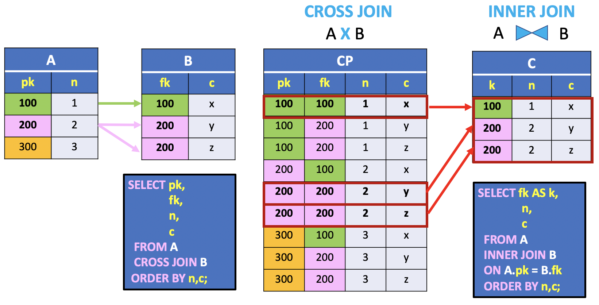
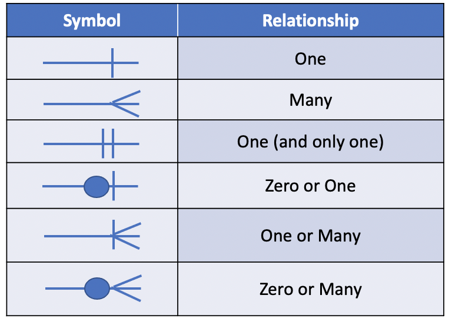
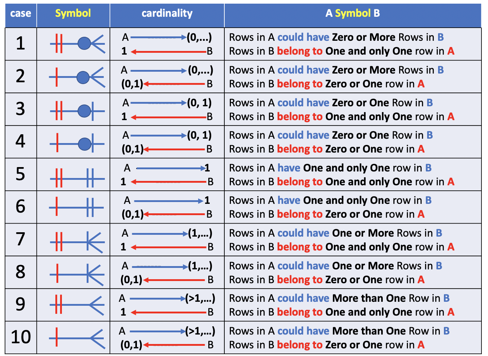
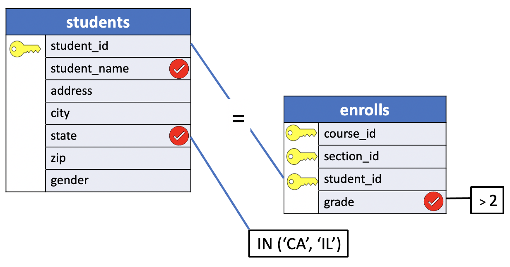
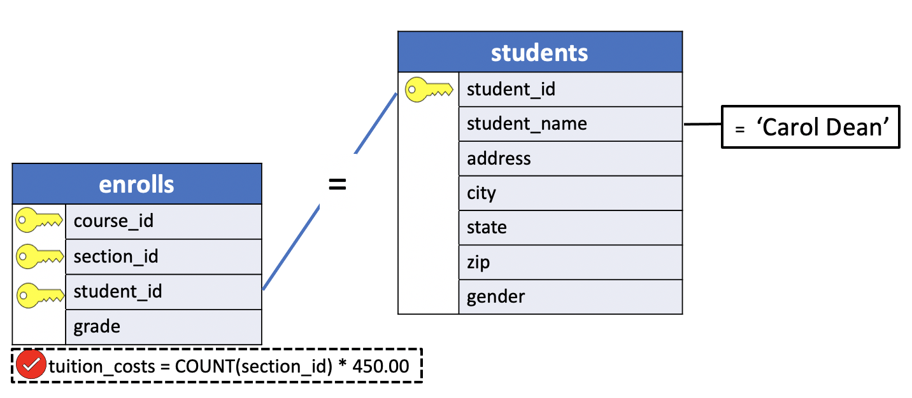

# Joining Tables Using the JOIN Operator

In the inital versions of the SQL language, joins could only be created using the `WHERE` clause, and this syntax is still supported in SQL-92. This newer version, however, also introduces a new explicit **JOIN** `operator`.


## PostgreSQL joins

PostgreSQL join is used to combine columns from one (`self-join`) or more tables based on the values of the common columns between related tables. The common columns are typically the primary key columns of the first table and foreign key columns of the second table.

PostgreSQL supports `inner join`, `left join`, `right join`, `full outer join`, `cross join`, `natural join`, and a special kind of join called `self-join`.

In this lesson we introduce the **INNER JOIN** clause.


## PostgreSQL INNER JOIN

To query data from two or more related tables, you use the **INNER JOIN** clause. The following statement illustrates how to join two tables `T1` and `T2`.

```SQL
SELECT *
FROM T1 INNER JOIN T2
ON join_predicate;
```

Let’s examine the statement above in detail:

- First, specify the main table in the `FROM` clause, `T1` in this case.
- Second, specify the joined table in the `INNER JOIN` clause followed by the `ON` keyword. The joined table is `T2` in the above statement.
- Third, a `join predicate` specifies the condition for joining tables. **Only rows that satisfy the join predicate are included in the result set**.

The query returns a result set by combining column values of both tables `T1` and `T2` **based on the join predicate**.

It compares each row of table `T1` with rows of table `T2` to find all pairs of rows that satisfy the join predicate. Whenever the **join predicate is satisfied by matching** `non-NULL values`, column values for each matching pair of rows of `T1` and `T2` tables are combined into a row in the result set.

Since the `INNER JOIN` is commutative, the previous query is equivalent to:

```SQL
SELECT *
FROM T2 INNER JOIN T1
ON join_predicate;
```


Compare the previous query to the syntax using the `WHERE` clause:

```SQL
SELECT *
  FROM T2, T1
 WHERE join_predicate;
```

The two tables in the example are combined with the operator **INNER JOIN**, and the `WHERE` clause is replaced by an `ON` clause. An **INNER JOIN** is the most common type of join. It returns only those records from each table that match the criteria specified in the `ON` clause.

> Note: In the following the terms `column` and `variable` have the same meaning. A `column` and a `variable` is a set of values.


## Understanding INNER JOIN

In lesson [5](.05_where_join.md), we introduced the **INNER JOIN** operator as a way to select a `subset of rows` in the **CROSS JOIN** resulting table.

To help you learn how inner join works, I'm going to use the tables of the `CROSS JOIN` example presented in lesson [4](./04_cross_join.md). This time, however, we include two additional columns for the primary and foreign keys of the parent and child tables, respectively.



In this picture, the first column in the A and B tables represents the "**primary key**" (**pk**) and "**foreign key**" (**fk**) variables. These variables are used to **match** the rows between the tables.

To help you visualize a match between tables each distinct value in these columns have a colour (**100** = `green`, **200** = `pink`, **300** = `orange`). On the other hand, the grey colour is used to represent the values in the other column that is carried along for the ride. This example uses a table with a single key and column but it can be easily generalized to composite keys and multiple column values.

In this example,
- the **fk** column in table `B` references the `A` table using the **pk** column.
- the **pk** column or variable uniquely identifies a row in table `A` and
- the **fk** column or variable uniquely identifies a row in table `A`. In other words, the values in this column are a subset of the values in the **pk** column.


## ERD Revisited

In the definitions of the previous example emerge an important connection between the values of the primary and foreign key variables. This connection or **join** is basically a **mapping** between a **primary key value** or **row** (a row is uniquely identified by it's primary key value) in the `A` table to `zero`, `one` or `more` **rows** in the `B` table, depending on the `foreign key value`.

For example, the primary key values in column `pk` of table A:

- **100** is mapped to `one` row in table `B`
- **200** is mapped to `two` rows in table `B`
- **300** is mapped to `zero` rows in table `B`.  

Lastly, assuming that the foreign key column dose not allow `NULL` values, the referential integrity constraint enforces each record in the child table `B` to have a matching row in the parent table `A`. Consequently, the values of the `fk` columns will be in the results of the `INNER JOIN`.

There are, therefore, three types of `primary-foreign` keys mapping:

| A-B Mapping| Meaning |
|:----------:|:-------:|
|`one`-TO-**zero**| A row in the parent table A does not have a matching row (`zero`) in the child table B|
|`one`-TO-**one**| A row in the parent table A has `one` matching row in the child table B|
|`one`-TO-**many**| A row in the parent table A has two or `more` matching rows in the child table B|


There are, therefore, 5 basic relationships that indicate the cardinality between tables in an ERD. In the picture below the `One` and `Zero or One` can be grouped together in `Zero or One` for simplicity. The symbols in the diagram can be used interchangeably.

**Note**: In mathematical logic, it's often desirable to make a distinction between `Zero or One` and `exactly One`. In that situation `One(and only one)` is used to indicate that the count cannot be less than one or more than one.




To better understand the **referential integrity constraint mapping**, we included a surrogate primary key column (`id`) in table `B`.

There is often confusion in the meaning and interpretation of the crow's foot symbols indicated in an ERD of a database.

For a quick reference, the table below illustrates the ten cases for an `ERD` relationship between the primary and foreign key values in two tables, `A` (parent table) and `B` (child table).



For now, we discuss only the first 4 cases. The cases `4` to `8` require to set up a `trigger` on the parent table that automatically insert a row into the child table whenever a parent row is inserted. The remaining cases, `9` and `10`, require the insertion of at least two or more rows. The notion of `Trigger` is introduced later in the course.

The creation of table `A` does not need any particular needs.

**SQL**
```SQL
CREATE TABLE a (
  pk SMALLINT PRIMARY KEY,
  n SMALLINT
);
```

On the other hand, the creation of the child table `B` depends on the specific **relational integrity constraint**.

To better understand the **referential integrity constraint mapping**, we included a surrogate primary key column (`id`) in table `B`.

- **CASE**: `1`

**SQL**
```SQL
CREATE TABLE b (
  id SMALLINT PRIMARY KEY,
  c CHAR,
  fk SMALLINT NOT NULL
  CONSTRAINT b_fkey_a
     FOREIGN KEY (fk)
     REFERENCES A (pk)
     ON DELETE CASCADE
);
```

The referential integrity constraint enforces table B to have values in column `fk` that exist in column `pk` of table A. Moreover, the constraint `NOT NULL` for the `fk` column enforces each row in table B to have one and only one matching row in table A.

On the other hand, table A could have one or more unmatched rows in table B. Lastly, the `ON DELETE CASCADE` option delete a row in the child table whenever the corresponding matched row in table A is deleted.

- **CASE**: `2`

**SQL**
```SQL
CREATE TABLE b (
  id SMALLINT PRIMARY KEY,
  c CHAR,
  fk SMALLINT
  CONSTRAINT b_fkey_a
     FOREIGN KEY (fk)
     REFERENCES A (pk)
     ON DELETE SET NULL
);
```

The second case allows `NULL` values for the `fk` column. The insertion of a new row in table B, therefore, does not need any requirement for the `fk` column. Consequently, the number of unmatched rows in table B is equivalent to the number of `NULL` values in the `fk` column. Lastly, the `ON DELETE SET NULL` option set to `NULL` the `fk` column value for a row in the child table whenever the corresponding matched row in table A is deleted.

- **CASE**: `3`

**SQL**
```SQL
CREATE TABLE b (
  -- id SMALLINT PRIMARY KEY,
  c CHAR,
  fk SMALLINT NOT NULL
  UNIQUE(fk)
  CONSTRAINT b_fkey_a
     FOREIGN KEY (fk)
     REFERENCES A (pk)
     ON DELETE CASCADE
)
```

The third case requests Table `B` to have at most One row for each matched row in Table `A`. The definition of this constraint is easily obtained with the option `UNIQUE` for the `fk` column. Moreover, the constraint `NOT NULL` for the `fk` column enforces each row in table B to have one and only one matching row in table A. In other words, the `fk` column is also a primary key for table b.

- **CASE**: `4`

**SQL**
```SQL
CREATE TABLE b (
  id SMALLINT PRIMARY KEY,
  c CHAR,
  fk SMALLINT UNIQUE
  CONSTRAINT b_fkey_a
     FOREIGN KEY (fk)
     REFERENCES A (pk)
     ON DELETE CASCADE
)
```

Similarly, case `4` is basically a variation of case `3` without the `NULL` constraint on column `fk`.

## Referential integrity constraint as a function

You may have noticed that the relationships between two table do not include the `Many-To-Many` cardinality. A `Many-To-Many` relationship is often implemented with a `bridge` table  that creates two `One-To-Many` relationships with the `parent` and `child` tables.

You may be wondering: `Why Do I need a bridge table to implement a Many-To-Many relationship`?

The answer is obvious for the case both tables require a mandatory constraints for the existence of a record in the child table for each created record in the parent table. Suppose you insert a row  in the `A` table and automatically a trigger is executed to insert a row in the child table. The child table, however, will activate another trigger to insert a row in table `A`. This process will never terminate.

The other cases will set to `NULL` or even delete all the records in both tables. To understand why, let's describe the mapping of two tables as a function.

Each mapping establishes an implicit function between two sets, `A`and `B`. The function `B`**->**`A` is a mapping between the primary key values in the `B` table and the primary key values in the `A` table, based on the foreign key values.

The relationships can be summarized in four types of function:

|Relationship|function|
|:----------:|:------:|
|One(and only one)| bijective, (injective and surjective)|
|Zero or One| injective|
|One or Many, Many| surjective|
|Zero or Many| Not injective and Not surjective|


## PostgreSQL INNER JOIN examples


### Problem 1

1. **Problem**: Which teachers teach which courses? (List the teachers by name and course_id)


- **Tables**: teachers, sections
- **Columns**: teacher_name, course_id
- **Condition**: `teachers.teacher_id = sections.teacher_id`
- **Sorting**: teacher_name, course_id

```console
uniy=# \d sections
                 Table "public.sections"
    Column    |   Type   | Collation | Nullable | Default
--------------+----------+-----------+----------+---------
 course_id    | smallint |           | not null |
 section_id   | smallint |           | not null |
 teacher_id   | smallint |           |          |
 num_students | smallint |           |          |
Indexes:
    "sections_pkey" PRIMARY KEY, btree (course_id, section_id)
Foreign-key constraints:
    "sections_fkey_course" FOREIGN KEY (course_id) REFERENCES courses(course_id) ON DELETE CASCADE
    "sections_fkey_teacher" FOREIGN KEY (teacher_id) REFERENCES teachers(teacher_id) ON DELETE SET NULL
Referenced by:
    TABLE "enrolls" CONSTRAINT "enrolls_fkey_section" FOREIGN KEY (course_id, section_id) REFERENCES sections(course_id, section_id) ON DELETE CASCADE
```

**Query Diagram Join**  


**SQL**
```SQL
SELECT teacher_name,
       course_id
  FROM teachers INNER JOIN sections
    ON teachers.teacher_id = sections.teacher_id
 ORDER BY teacher_name, course_id;
```

**Results**

|teacher_name    | course_id|
|:--------------:|:---------:|
|Dr. Cooke          |       480|
|Dr. Engle          |       290|
|Dr. Horn           |       450|
|Dr. Lowe           |       730|
|Dr. Olsen          |       450|
|Dr. Scango         |       480|

**Query**

```console
uniy=# SELECT teacher_name,
uniy-#        course_id
uniy-#   FROM teachers INNER JOIN sections
uniy-#     ON teachers.teacher_id = sections.teacher_id
uniy-#  ORDER BY teacher_name, course_id;
```

**Output**
```console
    teacher_name    | course_id
--------------------+-----------
 Dr. Cooke          |       480
 Dr. Engle          |       290
 Dr. Horn           |       450
 Dr. Lowe           |       730
 Dr. Olsen          |       450
 Dr. Scango         |       480
(6 rows)
```


### Problem 2

2. **Problem**: Which students from California or Illinois got As or Bs?

- **Tables**: students, enrolls
- **Columns**: student_name, state, grade
- **Condition**:
  - (join) `students.student_id = enrolls.students_id`
  - students from California or Illinois
  - got grade As or Bs

```console
uniy=# \d enrolls
                 Table "public.enrolls"
   Column   |   Type   | Collation | Nullable | Default
------------+----------+-----------+----------+---------
 course_id  | smallint |           | not null |
 section_id | smallint |           | not null |
 student_id | smallint |           | not null |
 grade      | smallint |           |          |
Indexes:
    "enrolls_pkey" PRIMARY KEY, btree (course_id, section_id, student_id)
Foreign-key constraints:
    "enrolls_fkey_course" FOREIGN KEY (course_id) REFERENCES courses(course_id) ON DELETE CASCADE
    "enrolls_fkey_section" FOREIGN KEY (course_id, section_id) REFERENCES sections(course_id, section_id) ON DELETE CASCADE
    "enrolls_fkey_student" FOREIGN KEY (student_id) REFERENCES students(student_id) ON DELETE CASCADE
```

**Query Diagram**


**SQL**

```SQL
SELECT student_name,
       state,
       grade
  FROM students INNER JOIN enrolls
    ON students.student_id = enrolls.student_id
 WHERE state IN ('CA', 'IL') AND
       grade > 2;
```

**Results**

|student_name    | state | grade|
|:--------------:|:-----:|:-----:|
|Val Shipp          | IL    |     3|


**Query**

```console
uniy=# SELECT student_name,
uniy-#        state,
uniy-#        grade
uniy-#   FROM students INNER JOIN enrolls
uniy-#     ON students.student_id = enrolls.student_id
uniy-#  WHERE state IN ('CA', 'IL') AND
uniy-#        grade > 2;
```

**Output**

```console
    student_name    | state | grade
--------------------+-------+-------
 Val Shipp          | IL    |     3
(1 row)
```

### Problem 3

3. **Problem**: Assuming that tuition is $450 per course, what is Carol Dean's total tuition bill?

- **Tables**: students, enrolls
- **Columns**: `tuition_costs` -> number of courses x $450
- **Condition**:
  - (join) `students.student_id = enrolls.students_id`
  - student's name Carol Dean

```console
uniy=# \d enrolls
                 Table "public.enrolls"
   Column   |   Type   | Collation | Nullable | Default
------------+----------+-----------+----------+---------
 course_id  | smallint |           | not null |
 section_id | smallint |           | not null |
 student_id | smallint |           | not null |
 grade      | smallint |           |          |
Indexes:
    "enrolls_pkey" PRIMARY KEY, btree (course_id, section_id, student_id)
Foreign-key constraints:
    "enrolls_fkey_course" FOREIGN KEY (course_id) REFERENCES courses(course_id) ON DELETE CASCADE
    "enrolls_fkey_section" FOREIGN KEY (course_id, section_id) REFERENCES sections(course_id, section_id) ON DELETE CASCADE
    "enrolls_fkey_student" FOREIGN KEY (student_id) REFERENCES students(student_id) ON DELETE CASCADE
```

**Query Diagram**



**SQL**

```SQL
SELECT COUNT(section_id) * 450.00 AS tuition_costs
  FROM enrolls INNER JOIN students
    ON enrolls.student_id = students.student_id
 WHERE student_name = 'Carol Dean';
```

**Results**

|tuition_costs|
|:------------:|
|      1350.00|


**Query**
```console
uniy=# SELECT COUNT(section_id) * 450.00 AS tuition_costs
uniy-#   FROM enrolls INNER JOIN students
uniy-#     ON enrolls.student_id = students.student_id
uniy-#  WHERE student_name = 'Carol Dean';
```

**Output**
```console
 tuition_costs
---------------
       1350.00
(1 row)
```
