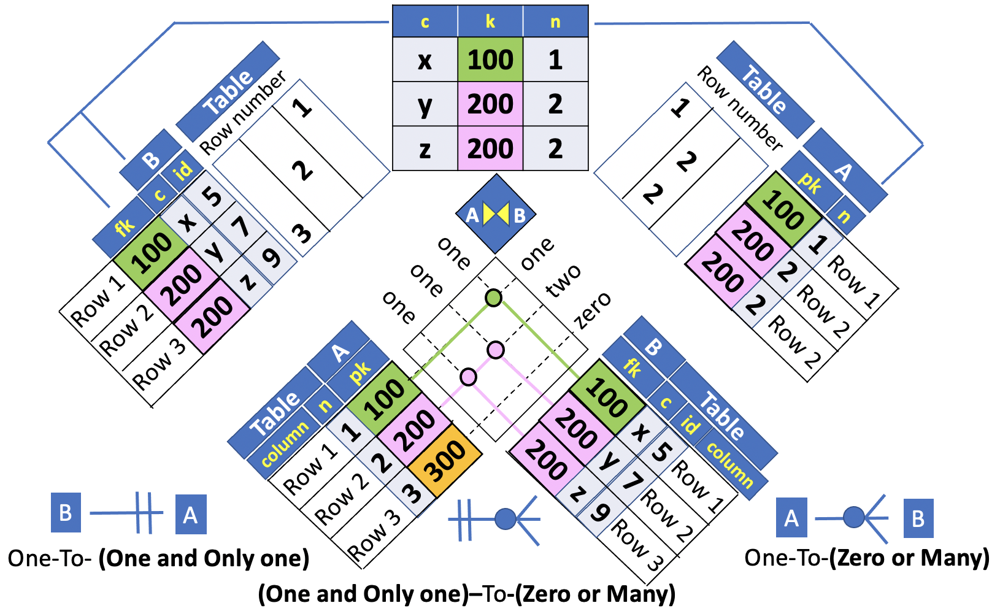

# JOIN Visual Diagram

In lesson [4](./04_cross_join.md) of this chapter, we proposed an alternative and more informative representation of the **Cartesian Product** for the **CROSS JOIN** of two tables. The picture below illustrates the **CROSS JOIN** example presented in lesson [4](./04_cross_join.md). For an in depth discussion please refer to [04_cross_join.md](./04_cross_join.md).


Moreover, we introduced the **INNER JOIN** operator as a way to select a `subset of rows` in the **CROSS JOIN** resulting table.

In the next sections, we extend this visual representation by including the tables **keys** values and the **relationship** between those values. This visual representation is helpful to understand the different types of join: `inner join`, `left join`, `right join`, `full outer join`, `cross join`, `natural join`.

In this lesson we discuss the **INNER JOIN** type.

Fasten your seat belt and stay tuned :smile:

> Note: In the following the terms `column` and `variable` have the same meaning. A `column` and a `variable` is a set of values.

## JOIN Visual Diagram Representation

In the preceding sections and chapters of this course, we have seen that a Relational Database is essentially a Model **based on the values of the common columns** between `related tables`.

The common columns, used to connect each pair of tables are typically the **primary key** columns of the first table and the **foreign key** columns of the second table.

To help you learn how join works, I'm going to use a visual representation similar to the one used for the example of lesson [4](./04_cross_join.md). This time, however, we include two additional columns for the primary and foreign keys of the parent and child tables, respectively.

The example tables that will be used to illustrate the visual representation of a join are borrowed from the `INNER JOIN` example discussed in the previous lesson [inner join](./07_inner_join). For a quick reference, the example tables and the `INNER JOIN` results are illustrated below. For an in depth discussion please refer to lesson [inner join](./07_inner_join).


In this picture each row in table `A` is matched with `zero`, `one` or `more` rows in table `B` based on the values of the primary and foreign key columns.

The following diagram shows each `potential match` as an `intersection of pair dotted lines`.


If you look closely, you might notice that we've switched the order of the primary key `pk` and `n` columns in table **A**. This is to emphasise that **joins match based on the key**; the values in the other columns are just carried along for the ride.


In this diagram each dot, indicated as the intersection of a pair of coloured lines linked to each row, represents a match. To be precise, in this example the keys are the `primary` and `foreign` key columns in `A` and `B` tables, indicated as **pk** and **fk** in the picture above. The number of dots in the picture, therefore, is basically the number of matches.


## INNER JOIN Visual Diagram


An **INNER JOIN** matches pairs of rows or observations whenever their key are equal. To be precise, this is an **equi-join** (definition borrowed by relational algebra) because the keys are matched using the equality operator.

**SQL**
```SQL
SELECT fk as k,
       n,
       c
  FROM A INNER JOIN B
    ON A.pk = B.fk
 ORDER BY n,c;
```

In this example, the keys are the `primary` and `foreign` key columns in `A` and `B` tables, indicated as **pk** and **fk** in the SQL query.



To better understand the **referential integrity constraint mapping**, we included a surrogate primary key column (`id`) in table `B`.
