# JOIN Visual Diagram

In lesson [4](./04_cross_join.md) of this chapter, we proposed an alternative and more informative representation of the **Cartesian Product** for the **CROSS JOIN** of two tables. The picture below illustrates the **CROSS JOIN** example presented in lesson [4](./04_cross_join.md). For an in depth discussion please refer to [04_cross_join.md](./04_cross_join.md).

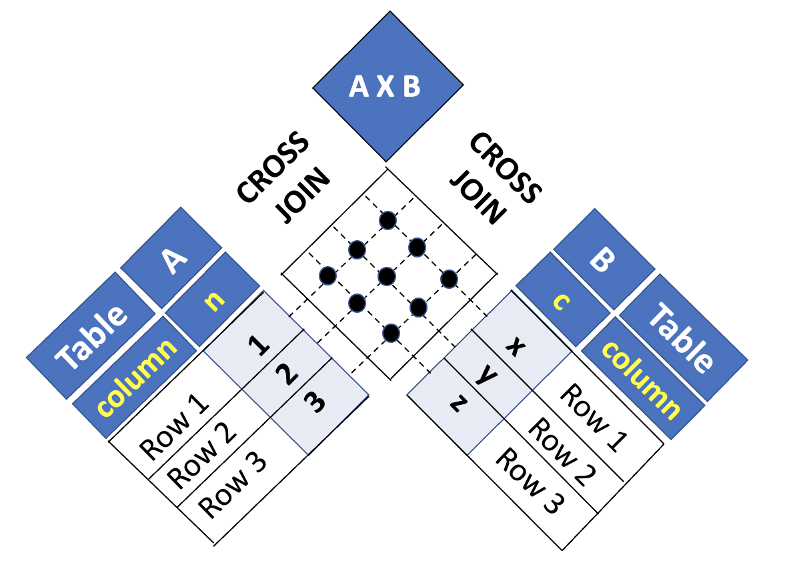

Moreover, we introduced the **INNER JOIN** operator as a way to select a `subset of rows` in the **CROSS JOIN** resulting table.

In the next sections, we extend this visual representation by including the tables **keys** values and the **relationship** between those values. This visual representation is helpful to understand the different types of join: `inner join`, `left join`, `right join`, `full outer join`, `cross join`, `natural join`.

In this lesson we discuss the **INNER JOIN** type.

Fasten your seat belt and stay tuned :smile:

> Note: In the following the terms `column` and `variable` have the same meaning. A `column` and a `variable` is a set of values.

## JOIN Visual Diagram Representation

In the preceding sections and chapters of this course, we have seen that a Relational Database is essentially a Model **based on the values of the common columns** between `related tables`.

The common columns, used to connect each pair of tables are typically the **primary key** columns of the first table and the **foreign key** columns of the second table.

To help you learn how join works, I'm going to use a visual representation similar to the one used for the example of lesson [4](./04_cross_join.md). This time, however, we include two additional columns for the primary and foreign keys of the parent and child tables, respectively.

The example tables that will be used to illustrate the visual representation of a join are borrowed from the `INNER JOIN` example discussed in the previous lesson [inner join](./07_inner_join). For a quick reference, the example tables and the `INNER JOIN` results are illustrated below. For an in depth discussion please refer to lesson [inner join](./07_inner_join).


In this picture each row in table `A` is matched with `zero`, `one` or `more` rows in table `B` based on the values of the primary and foreign key columns.

The following diagram shows each `potential match` as an `intersection of pair dotted lines`.

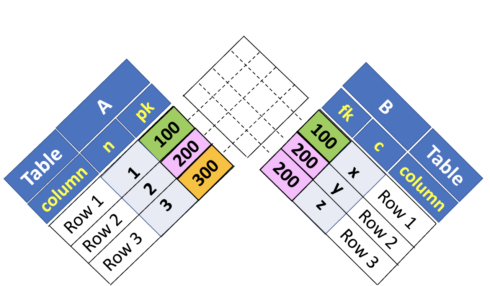

If you look closely, you might notice that we've switched the order of the primary key `pk` and `n` columns in table **A**. This is to emphasise that **joins match based on the key**; the values in the other columns are just carried along for the ride.


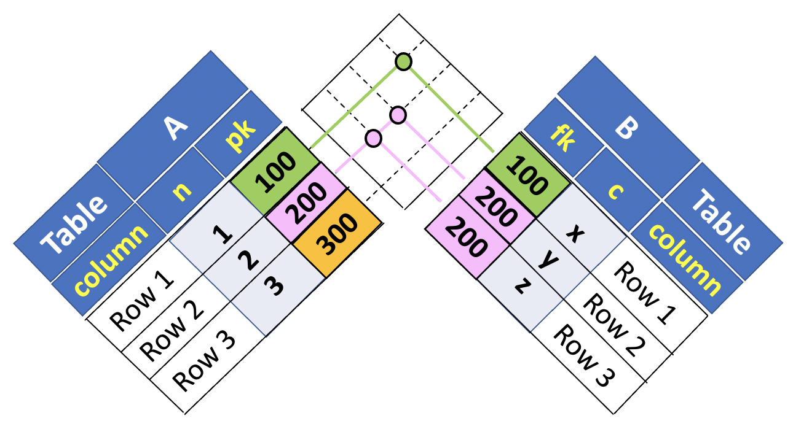

In this diagram each dot, indicated as the intersection of a pair of coloured lines linked to each row, represents a match. To be precise, in this example the keys are the `primary` and `foreign` key columns in `A` and `B` tables, indicated as **pk** and **fk** in the picture above. The number of dots in the picture, therefore, is basically the number of matches.


## INNER JOIN Visual Diagram


An **INNER JOIN** matches pairs of rows or observations whenever their key are equal. To be precise, this is an **equi-join** (definition borrowed by relational algebra) because the keys are matched using the equality operator.

**SQL**
```SQL
SELECT n,
       fk as k,
       c
  FROM A INNER JOIN B
    ON A.pk = B.fk
 ORDER BY n,c;
```

In this example, the keys are the `primary` and `foreign` key columns in `A` and `B` tables, indicated as **pk** and **fk** in the SQL query.


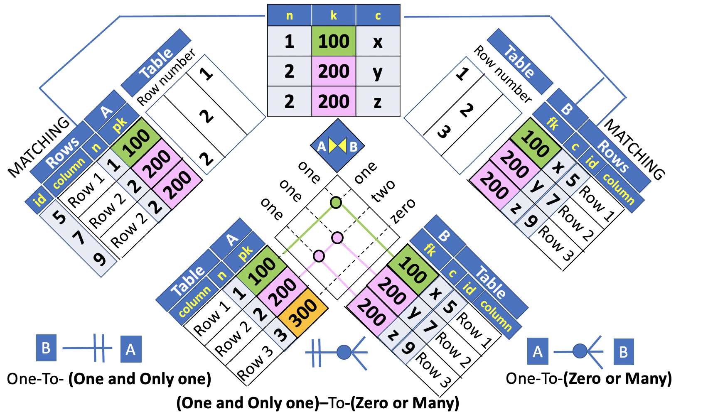

Note that I’ve put the key column in the middle position in the output. This reflects that **joins match based on the key**; the values in the other columns are just carried along for the ride.

To better understand the **referential integrity constraint mapping**, we included a surrogate primary key column (`id`) in table `B`. Each row in table `B` is, therefore, uniquely identified by the `id` column values. Similarly, each row in table `A` is uniquely identified by the `pk` column values.

For example, the primary key values in column `id` of table B:

- **5** uniquely identifies `ROW 1`.
- **7** uniquely identifies `ROW 2`.
- **9** uniquely identifies `ROW 3`.

And the primary key values in column `pk` of table A:

- **100** uniquely identifies `ROW 1`.
- **200** uniquely identifies `ROW 2`.
- **300** uniquely identifies `ROW 3`.

> Note: In the tables illustrated in the picture above, the `ROW` number is used only for **visualization purposes** and to emphasize that a **primary key value uniquely identifies a record**. We can then remind that a table does not have a defined order between the rows. Hence, the row number is used to visualize a particular table instance and there is no obviously a *presentation* order since two tables with the same rows, but in different order, represent the same table. Consequently, the example can be **generalized to any row permutation order**. What really matters is that the values in the **primary key column** are distinct one from another and, therefore, they constitute a **SET OF VALUES**. It follows that for each instance table, the terms `ROW #`, where the symbol `#` indicates a whole number, and the corresponding primary key value are equivalent. **It's basically a mapping of the primary key values in a Table to the set of Natural numbers**.

In the picture above, the values in the `pk` column of table `A` are mapped to `zero`, `one` and `more` rows in the `B` table, depending on the foreign key value.

The following diagrams show the mapping relation as connecting arrows between the elements of two sets, indicated as two parallel columns of dots contained in circle shapes. The arrows indicate the relation direction that connects the elements in the *set of departure* or **domain of the relation** to the *set of destination* or **codomain of the relation**.


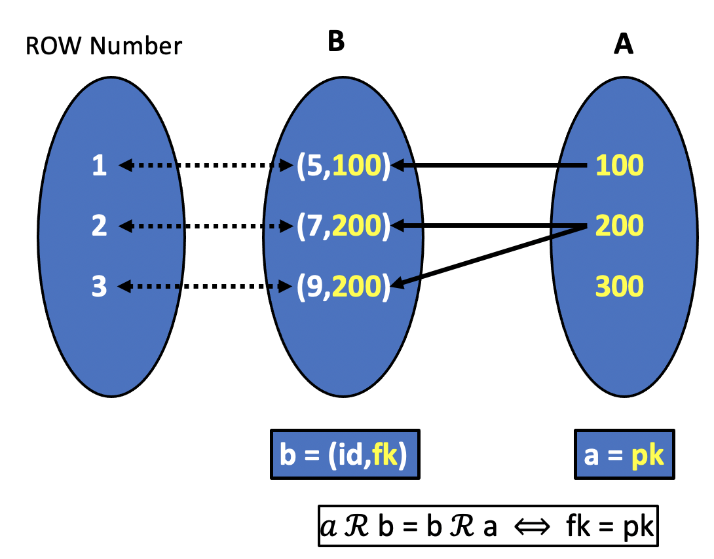

For example, in this diagram the set of departure is the set of primary key values in column `pk` of table A, illustrated inside the blue circle on the right hand side of the picture above, indicated as `a = pk`, and the codomain is the set of primary key values in table B, illustrated inside the middle circle and indicated as `b = (id,fk)`. The `fk` column is carried to illustrate the relation between the primary and foreign key values. Lastly, the dotted bidirectional arrows connecting the the left hand side and middle circles show the corresponding row for each primary key value. Bear in mind that this correspondence is only for visual representation, there is no relation order between rows in a table. As mentioned earlier, *it's basically a mapping of the primary key values in a Table to the set of Natural numbers*. This representation is helpful to visualize the relation in the Cartesian plane, as it will be shown soon in this lesson. In this mapping the primary values in table A appears in the second position of the tuple `b = (id, fk)` and therefore it can be easily substitute with `(id, fk=pk)`. It follows that the values:

- **100**, (`5`,**100**), is mapped to `one` row in table `B`, `ROW 1` or **5**.
- **200**, (`7`,**200**), is mapped to `two` rows in table `B`, `ROW 2` and `ROW 3`,or **7** and **9**.
- **300**, `NO Mapping`, is mapped to `zero` rows in table `B`. No ROWS.

You might have noticed that not all elements in the domain are mapped to the codomain. This type of mapping is usually called a *partial mapping*. In this case the *domain** is called **domain definition of the instance relation** just to make a distinction with the general case of not matching rows in a set.

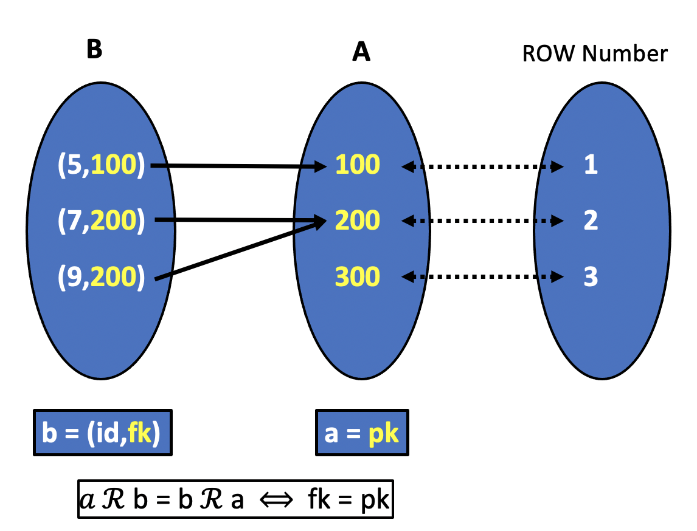


Consequently, the primary key values in column `id` of table B:

- **5** is mapped to **100**, `ROW 1` in table A
- **7** is mapped to **200**, `ROW 2` in table A
- **9** is mapped to **200**, `ROW 2` in table A

On the other hand, this mapping includes all the elements in the domain and, therefore, is a *complete mapping*.

This simple example gives a visual representation of the meaning for a **referential integrity constraint mapping** in a relationship between tables. The values in the `fk` columns is a **subset of the values** in the primary key column, (`pk`), in table A. Hence, **the combination of the primary and foreign key values in the parent and child table B uniquely identifies the matching rows in both tables**.

The **uniqueness of the joining table rows can even be determined by the primary key values in the child table **!**, as we'll see soon.

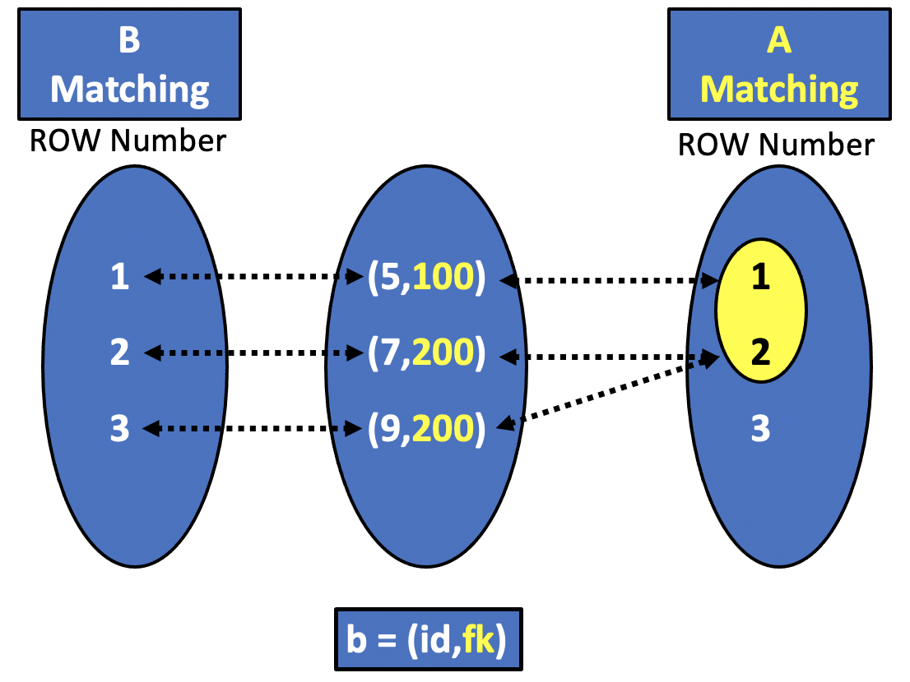

In this picture, the set of tuples in the middle are the primary and foreign key columns in table `B`. The combination of the `id` and `fk` fields of each record uniquely determines the matching rows in both tables.

For example, the tuple `(5,100)` uniquely determines the mapping between the first rows in both tables. Next, the tuples `(7,200)` and `(9,200)` determine the mapping of the second and third row in table `B` with the second row in table `A`.


As a result, all the rows in table `B` will be in the inner join resulting table, indicated as `Matching Rows Table B` on the top right hand side of the picture. It follows that **the values in the** `id` **column of table** `B` **uniquely identify each matching row in the inner join resulting table**.

It follows that the set of `Matching Rows in Table A`, indicated on the top left hand side of the picture, is also defined in terms of the values in the `id` column of table `B`, indicated on the left hand side.

Note that I’ve put the `id` key column in a slightly different position in the `Matching Rows Table A`. This reflects that the key is a `primary key` in `B` and the primary key `pk` is  the first column  starting from the right. For instance, the value **5** identifies the first matching row of table `A` linked to the value **100** in the pk column and the values **7** and **9** identify the second matching row linked to the value **200**.

As a result, the `INNER JOIN` of two tables, determines `two implicit mappings` between two finite sets:

- **B<sub>R</sub>** = {1, ... , `|B|`}: represents the set of rows in table `B`.
- **A<sub>R</sub>** = {1, ... , `|A|`}: represents the set of rows in table `A`.

As usual, the notation `|B|` and `|A|` indicates the total number of rows in table `B` and `A`, respectively. Hence, **B<sub>R</sub>** and **A<sub>R</sub>** are subsets of the Natural numbers. It follows that the `INNER JOIN` resulting table is a correspondence between the following two sets:

- **B<sub>MR</sub>** = {1, ... ,`p <= |B|`}: represents the set of matching rows in table `B`.
- **A<sub>MR</sub>** = {1, ... ,`q <= |A|`}: represents the set of matching rows in table `A`.

It's worth noting that the number of matching rows in **B<sub>MR</sub>** is exactly equal to `|B|`, `p = |B|`, if and only if the foreign key column does not contain `NULL` values. In this section we illustrate the case `p = B`, later in this lesson we discuss the existence of `NULL` values in the foreign key column.


The first mapping, **B<sub>R</sub>** `->` **A<sub>R</sub>**:
- Assigns to each row number in table `B`, the corresponding matching row number in table `A`. It's worth noting that the **matching rows** in table `A`, indicated as **A<sub>MR</sub>**, is a proper subset of **A<sub>R</sub>**.  

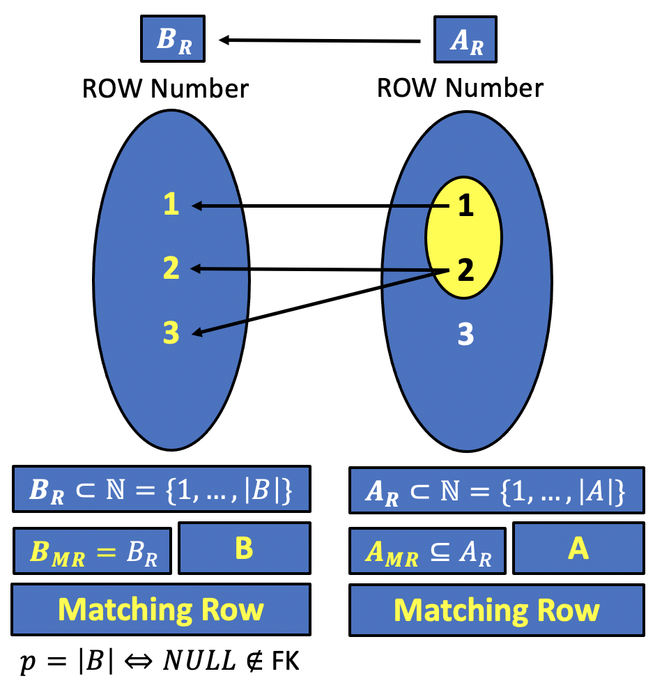

The second mapping, **A<sub>R</sub>** `->` **B<sub>R</sub>**:
- Assigns to each row number in **A<sub>MR</sub>**, the corresponding matching row number in table `B`. It's worth noting that the mapping notation in the picture is **A<sub>R</sub>** `->` **B<sub>R</sub>**, although this notation is not formally correct, we keep the whole set of primary key values to make a distinction between a partial and complete mapping. This distinction is helpful to understand the `OUTER JOIN` operator, as it will be shown later in this course.  

The implicit mappings described earlier can be visualized in a Cartesian plane, since the row number implicitly defines a relation order between rows.

Assuming there is a correspondence between the set of *Natural numbers*, **N**, and the rows in a table, **it's possible to access the values in the columns using a positional index**, as follow:

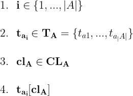

In this notation:

1. The positional index is **i** and the range is between `1` and the number of rows in table A, `|A|`.
2. **t<sub>a<sub>i</sub></sub>** and **T<sub>A</sub>** denote the row in position `i` and the sequence of rows in table A. For example, **t<sub>a<sub>1</sub></sub>** denotes the row in position `1` and, therefore, is the first element in the **T<sub>A</sub>** sequence.
3. **cl<sub>A</sub>** and **CL<sub>A</sub>** denote a table's column and the set of columns in table A.
4. **t<sub>a<sub>i</sub></sub>[cl<sub>A</sub>]** is, therefore, the value of column **cl<sub>A</sub>** in row `i`.

This notation might be helpful to formulate the referential integrity constraint mapping in the Carrtesian plane. I cannot stress enough that this notation is based on the assumption of natural ordering between rows in a table. This assumption is not valid in the Relational Model, however we'll show how to overcome this issue later in this lesson.

Later in the course, we also propose a formulation based on `Set theory` **more appropriate** for a definition of the `JOIN` operator in the `Relational Model`. Lastly, we illustrate a `set representation` using `Venn Diagrams`.

### The Positional Representation of a Table

In the previous section we introduced a formalism to describe a table using a positional notation. In this section, we show how to apply the notation to a specific instance table and illustrate how to generalize the positional representation for any instance table in the relational model.

Let us look a simple example.

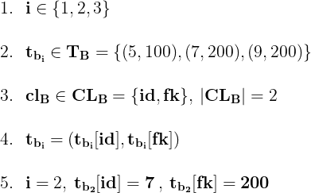

In the example illustrated above, the positional index **i** ranges between `1` and `3` and the cardinality of table B is, **|CL<sub>B</sub>| =** `2`. It follows that table B has 3 rows and two columns, indicated with the identifiers `id` and `fk`. A generic row in the table can be easily acessed with the positional index `i` and the column **cl<sub>B</sub>** belonging to the set **CL<sub>B</sub>**.

For example, the second row, `i=2`, is defined as follow:

- **t<sub>b</sub><sub>2</sub>** = (**t<sub>b</sub><sub>2</sub>[id]**,**t<sub>b</sub><sub>2</sub>[fk]**) = **(7,200)**.

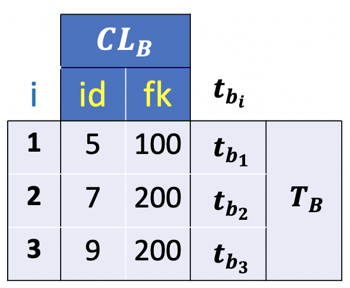

In this example, we illustrated how to use the positional index to described the tabular representation of an instance table. This notation assumes a Natural order between rows in a table.

This, however, begs the question: `What does it mean to be in order and how do we specify that?`

A deceptively obvious answer is that the output must respect the ordering relation of a Total Order on their respective primary keys. This choice actually depends on the table involved in the `JOIN` operation, as we'll show in the next section.

In this problem, the elements to be sorted are the rows in the table and each row **R<sub>j</sub>** has a primary key, `pk` or `id`, which governs the sorting process.

The sorting algorithm transforms the input sequence into a rearranged sequence containing the same elements. The output sequence is a permutation such that an order relation, `(`**<=**`)` or `(`**>=**`)`, criterion on the primary keys is satisfied.

For the example discussed earlier, the group of permutation for 3 rows is illustrated below.

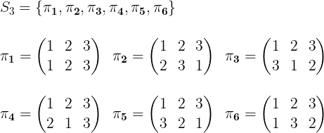

In this example, each row number in the current table is mapped to a row number in the same range of values, (i.e. `1`,`2`,`3`). For example, the first permutation maps each row number to the same position and, therefore, the primary keys keeps the same mapping. This permutation is called the identical permutation since the table before and after the permutation remains the same.

In the following examples, the rows will be sorted in `ASCENDING` order of the `primary` and `foreign` key values in the parent and child table.

In other words, the criterion to be satisfied in the parent and child table is:

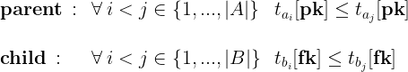


For the example discussed earlier, the B table is already sorted in ascending order of the primary key values. We also notice that the foreign key values follow the same order as the primary key column.

Let's discuss the **parent table** case first.

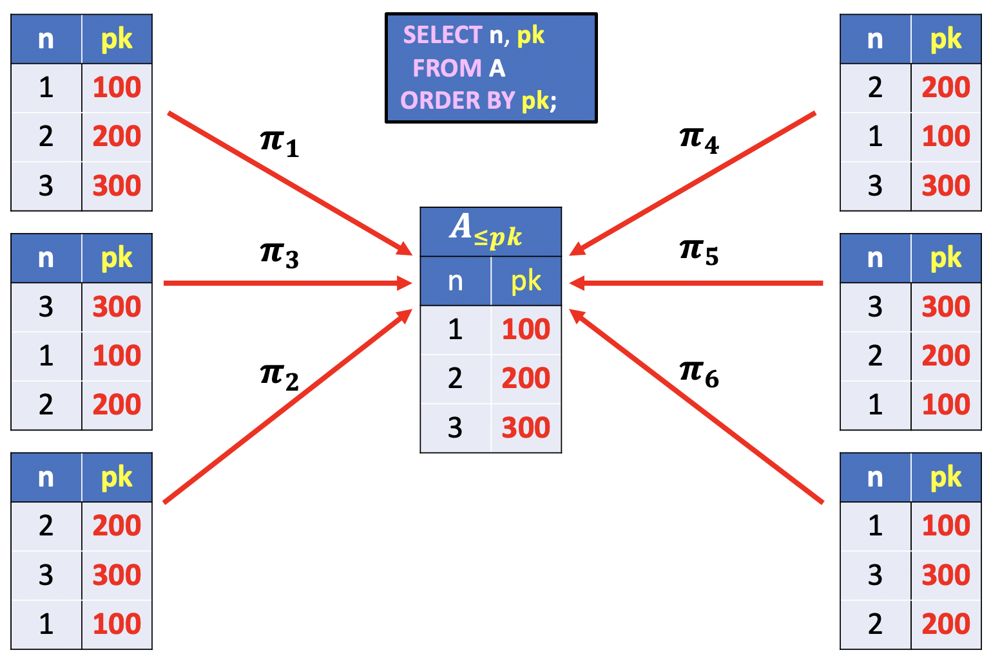

It's clear that the group of permutation **S<sub>3</sub>** gives 6 possible configurations only in the case we sort distinct values. It follows that **there is one and only one configuration for the sorted primary key parent table** and , therefore, for each initial configuration there has to be one and only one permutation. It follows that, there is `only one mapping between the primary key values and the Natural numbers`.

The table representing this mapping is indicated as **A<sub><=pk</sub>**, denoting the equivalence class of all `3` rows matrices. In other words, given any instance table in the space of any matrices of `3` rows, the **A<sub><=pk</sub>** gives the same visual representation in the Cartesian plane and there is no ambiguity for the `INNER` join resulting table.

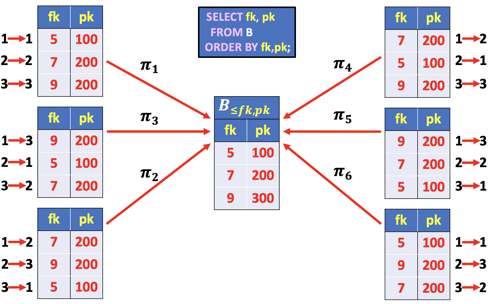

On the other hand, there might be more than a single configuration in the foreign key child table in case of duplicates or multiple values. As a result, it's necessary to use a different criterion to sort the child table records. A simple idea that comes in mind is that for each foreign key value there will be always distinct primary key values. Consequently, a solution is to sort the records by foreign key values first and then sort the corresponding primary key values. This solution uniquely determines the equivalence class matrix **B<sub><=fk,pk</sub>**.

### Postional representation of a JOIN


As a result, those values are implicitly mapped to the primary key values of the `A` table. This implicit mapping defines a **function**.

This implicit mapping was first mentioned in the previous [lesson](./07_inner_join.md) and classified in 4 different functions.

|Relationship|function|
|:----------:|:------:|
|One(and only one)| bijective, (injective and surjective)|
|Zero or One| injective|
|One or Many, Many| surjective|
|Zero or Many| Not injective and Not surjective|

The following picture illustrates the different categories. For a quick reference see the definitions in this [link](https://en.wikipedia.org/wiki/Bijection,_injection_and_surjection).

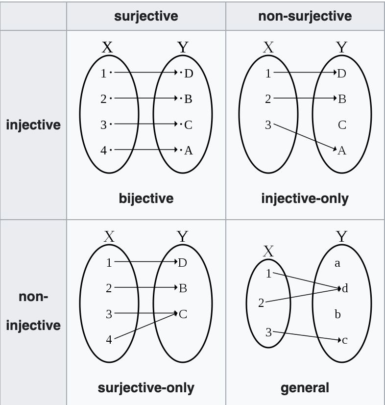

In the next section we discuss the 4 types of functions and illustrate the corresponding visual diagram of the `INNER JOIN` resulting tables.

At this point, you might be asking yourself:

- What is the number of rows in the resulting table of an `INNER JOIN`?

The answer is straightforward if one of the two tables has a **referential integrity constraint**. In this case the common columns, used to connect each pair of tables, are the **primary** and **foreign** columns of the parent and child table. The values in the foreign key column are drawn from the primary key column and, therefore, for each row in the child table there is one and only one matching row in the parent table. Consequently, the number of rows in the `INNER JOIN` is exactly equal to the number of** `NOT NULL`**values in the foreign key column of the child table**. It follows that the number of rows will correspond to the number of records in the child table if the foreign key column does not contain `NULL` values.

In the remaining sections of this lesson we discuss a number of examples to explain the various types of relationships in a Relational Database and illustrate the corresponding visual diagram to better understand how an `INNER JOIN` works; and more importantly why a relationship between tables is essential in a Database.

Lastly, we discuss the case an `INNER JOIN` is performed with not related tables.

## INNER JOIN RELATIONSHIPS

For the sake of clarity we remind the definition of function between two sets. This trivial introduction, (might be boring for somebody :smile:), is essential for understanding the relational model mapping.

A **function** between two sets is a **rule** that assigns to each member in the first set (called the *domain*) **ONE AND ONLY ONE** member in the second set (called the *range*). Intuitively, a function is an operation that takes an `INPUT` and produces an `OUTPUT` based on the input.

In relational algebra or Relational Database, the functions we are interested are functions that take primary key values in the child table as `INPUT`, and gives primary key values in the parent table as `OUTPUT`.

### (One and Only One) TO (Zero or Many): General function


An example of a simple function for the `INNER JOIN` between tables `B` (**INPUT**) and `A` (**OUTPUT**) illustrated in the picture above is given below.

- **f**: `B`**->**`A`

|INPUT|OUTPUT|
|:---:|:----:|
|5|100|
|7|200|
|9|200|

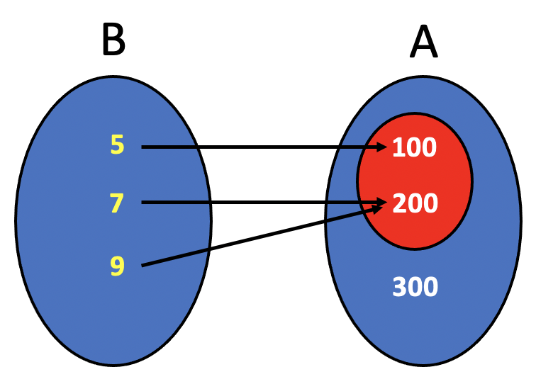

In this example, the domain of **f** is the set `B` **=** `{5, 7, 9}` and the range of **f** is the set `f(B)`**=** `{100,200}`. Moreover, for each value in set `B` there is **one and only one** value in set `A`. This function falls in the general case.

In order for an operator to be a valid function, each input must produces one and only one output. However, it is valid for a function to produce the same output with different inputs. Notice in the above example that **f** gives `200` as output for both the inputs `7` and `9` which still makes **f** a function. This result excludes the possibility of **f** to be an `injective` function. We also notice that **f** does not map any value in `B` to `300` in `A`. This excludes the possibility of **f** to be a `surjective` function. It follows that **f** falls in the general case.

On the other hand, the mapping between the primary key `A` and `B` is not a function.

- **r**: `A`**->**`B`

|INPUT|OUTPUT|
|:---:|:----:|
|100|5|
|200|7|
|200|9|
|300|NULL|

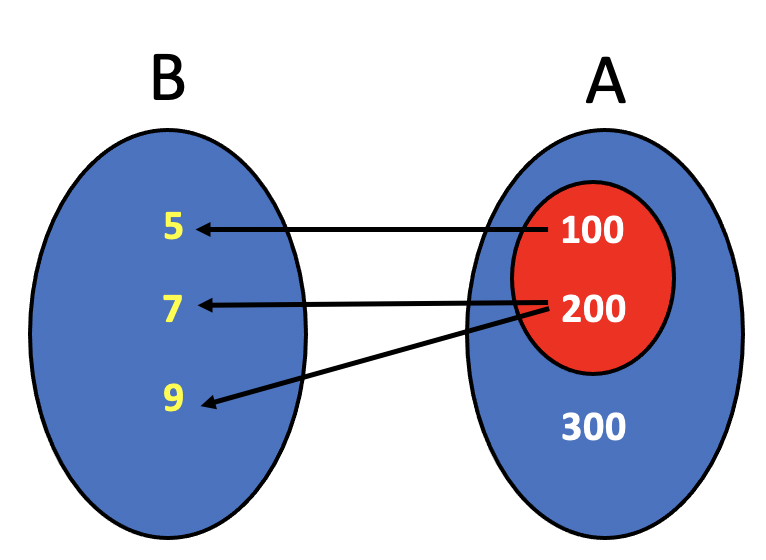


In this example, the input `200` has two outputs, `7` and `9`. We clearly see that this table defines a **Zero or Many** mapping.

Following the definition of table `B` given in the previous lesson:

**SQL**
```SQL
CREATE TABLE b (
  id SMALLINT PRIMARY KEY,
  c CHAR,
  fk SMALLINT NOT NULL
  CONSTRAINT b_fkey_a
     FOREIGN KEY (fk)
     REFERENCES A (pk)
     ON DELETE CASCADE
);
```

It's straightforward to tell the number of rows for the `INNER JOIN` operation. We notice that the `fk` column does not allow `NULL` values and therefore all the rows of `B` will be in the output.

|rows in A| NOT NULL rows in B| NULL rows in B| A -> B| B -> A| function| rows in Inner Join(A,B)|
|:-------:|:--------:|:-----:|:----:|:-----:|:-----:|:---:|
|n|m|0|Zero or Many|One and only One|general|m|

It follows that an `INNER JOIN` between the parent and child tables, `A` and `B`, returns a number of rows equal to the number of rows in the child table `B`.

The **Zero or Many** and **One and only One** mapping, indicated as `A->B` and `B->A` in the table above, define a `general` function. It follows that an `INNER JOIN` between the parent and child tables and a **One and only One** `To` **Zero or Many** relationship returns a number of rows equal to the number of rows in the child table `B`.

### (Zero Or One) TO (Zero or Many): General function

In this section we examine the case a child table `B` allows `NULL` values in the foreign key column.

**SQL**
```SQL
CREATE TABLE b (
  id SMALLINT PRIMARY KEY,
  c CHAR,
  fk SMALLINT
  CONSTRAINT b_fkey_a
     FOREIGN KEY (fk)
     REFERENCES A (pk)
     ON DELETE CASCADE
);
```

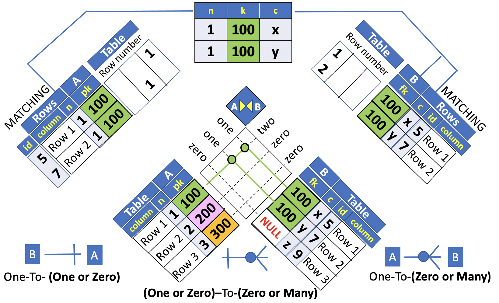

> In the picture the Row label for the second record in the table on the top left hand side is Row 1.

In this example the function for the `INNER JOIN` between tables `B` (**INPUT**) and `A` (**OUTPUT**) is given below.

- **f**: `B`**->**`A`

|INPUT|OUTPUT|
|:---:|:----:|
|5|100|
|7|100|
|9|NULL|

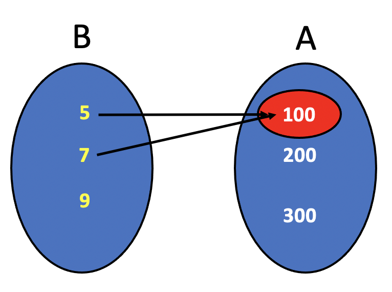

In this example, the domain of **f** is the set `B` **=** `{5, 7, 9}` and the range of **f** is the set `f(B)`**=** `{100,100,NULL}`.

What is `NULL` for a function?

The definition of `NULL` in a relational database is `undefined` or `missing` value. Similarly, in mathematics the notion of `NULL` is equivalent to `NAN`, standing for Not A Number. NAN is a **member** of a numeric data type that can be interpreted as a value that is undefined or to represent missing values in computations.

In this example, the value `9` in set `B` is assigned to `NULL`. The value `9` is, therefore, not assigned to anything. You could say that there is a **zero or one** mapping for the function f. We also notice that **f** gives `100` as output for both the inputs `5` and `7`. This result excludes the possibility of **f** to be an `injective` function. We also notice that **f** does not map any value in `B` to `200` and `300` in `A`. This excludes the possibility of **f** to be a `surjective` function. It follows that **f** falls in the general case.

Since the `NULL` value cannot be matched to any value, the number of matching rows is equal to the number of `NOT NULL` rows in the child table.

|rows in A| NOT NULL rows in B| NULL rows in B| A -> B| B -> A| function| rows in Inner Join(A,B)|
|:-------:|:--------:|:-----:|:----:|:-----:|:-----:|:---:|
|n|m|k|Zero or One|One and only One|general|m|

It follows that an `INNER JOIN` between the parent and child tables, `A` and `B`, returns a number of rows equal to the number of `NOT NULL` rows in the child table `B`.

The **Zero or Many** and **Zero or One** mapping, indicated as `A->B` and `B->A` in the table above, define a `general` function. It follows that an `INNER JOIN` between the parent and child tables and a **Zero or One** `To` **Zero or Many** relationship returns a number of rows equal to the number of `NOT NULL` rows in the child table `B`.

### (Zero or One) TO (Zero or One): Injective function

In this section we examine the case a child table `B` allows `NULL` values in the foreign key column and dose not allow duplicates.

**SQL**
```SQL
CREATE TABLE b (
  id SMALLINT PRIMARY KEY,
  c CHAR,
  fk SMALLINT UNIQUE
  CONSTRAINT b_fkey_a
     FOREIGN KEY (fk)
     REFERENCES A (pk)
     ON DELETE CASCADE
)
```


In this example the function for the `INNER JOIN` between tables `B` (**INPUT**) and `A` (**OUTPUT**) is given below.

- **f**: `B`**->**`A`

|INPUT|OUTPUT|
|:---:|:----:|
|5|100|
|7|200|
|9|NULL|

In this example, the value `9` in set `B` is assigned to `NULL`. The value `9` is, therefore, not assigned to anything. You could say that there is a **zero or one** mapping for the function f. We also notice that distinct values in `B` are mapped to distinct values in `A`. It follows that **f** is an `injective` function. We also notice that **f** does not map any value in `B` to `300` in `A`. This excludes the possibility of **f** to be a `surjective` function. It follows that **f** falls in the `injective` case.

|rows in A| NOT NULL rows in B| NULL rows in B| A -> B| B -> A| function| rows in Inner Join(A,B)|
|:-------:|:--------:|:-----:|:----:|:-----:|:-----:|:---:|
|n|m|k|Zero or One|Zero or One|injective|m|


## Relationship cardinality table


The analysis of the previous cases can be easily extended to the other relationships. The table below gives a summary of the `INNER JOIN` cardinality of two tables.

|rows in A| NOT NULL rows in B| NULL rows in B| A -> B| B -> A| function| rows in Inner Join(A,B)|
|:-------:|:--------:|:-----:|:----:|:-----:|:-----:|:---:|
|n|**m**|0|Zero or Many|One and only One|general|      **m**|
|n|**m**|k|Zero or Many|Zero or One|general|           **m**|
|n|**m**|0|Zero or One|One and only One|injective|     **m**|
|n|**m**|k|Zero or One|Zero or One|injective|          **m**|
|n|**m**|0|One and only One|One and only One|bijective|**m**=**n**|
|n|**m**|k|One and only One|Zero or One|injective|     **m**|
|n|**m**|0|One or Many|One and only One|surjective|    **m**|
|n|**m**|k|One or Many|Zero or One|general|            **m**|
|n|**m**|0|Many|One and only One|surjective|           **m**|
|n|**m**|k|Many|Zero or One|general|                   **m**|


The table above shows that the number of rows in an `INNER JOIN` based on the `primary-foreign key relationship` of tables in a Relational database, **is exactly equal to the number of** `NOT NULL` **values in the foreign key column in the child table**.


## Complete and Incomplete JOIN: No relationship tables

So far all the diagrams have assumed the existence of a primary and foreign keys. But that's not always the case. This section explains what happens when there is no correspondence between rows of the two tables.

Let us look at some different examples of join, in order to highlight some important points.

### Complete JOIN

In the previous section we proof that joining related tables returns a table with a number of rows **exactly equal to the number of** `NOT NULL`**values in the foreign key column of the child table**. Consequently, this number will correspond to the total number of rows in the child table if there is no `NULL` values in the foreign key column. This is true for all the surjective functions that map each record in the child table to one and only one record in the parent table. Consequently, All the rows in the parent table are matched with at least one row in the child table.

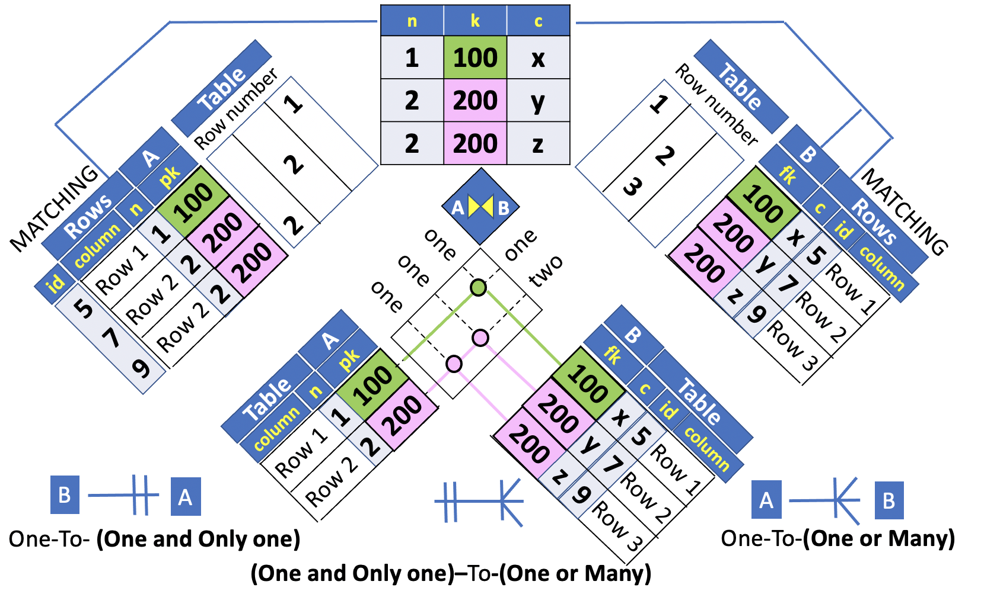

For instance, in the example illustrated in the picture above we can say that each of the tables contributes to at least one row of the result. In this case, the **JOIN** is said to be **Complete**. In the diagram illustrated above, each row in the `A` table have at least one matching row in the `B` table and similarly for rows in the `B` table. In this case, each row in the `B` table has **exactly one matching row** in the `A` table. The number of rows in the joining table is, therefore, equal to the number of rows in the `B` table. This property does not hold in general, because **it requires a correspondence between the rows of the two tables**. As discussed in the previous section, the `primary-foreign key` **mapping** `B` **->** `A` can be only of two types:

- `Zero or One`
- `One`

It follows that a **Complete** `JOIN` of two related tables will always return a number of rows equal to the number of records in the child table.

In the case table `B` **has more than one matching row**, the joining column is not a primary key in the `A` table and there is no mapping function `B`**->**`A`. In other words, there is no correspondence between the rows of the two tables.

In this scenario, we would like to answer the following two questions:

1. What is the `minimum` number of rows a complete `INNER JOIN` returns in the case there is no correspondence between the rows of the two tables?

2. What is the `maximum` number of rows a **Complete** `INNER JOIN` might have?

The answer to the first question is obvious. Since each row in both tables contributes to at least one row in the result, we expect the `INNER JOIN` to return a table with a number of rows `at least` equal to the maximum of the number of rows in the first and second table. In terms of a formal notation, the number of rows `p` is given by `p = max(|A|,|B|)`, where `|A|` and `|B|` are the number of rows (aka cardinalities) in the A and B tables, respectively.

The next question is:

What is the maximum number of rows a **Complete** `INNER JOIN` might have?

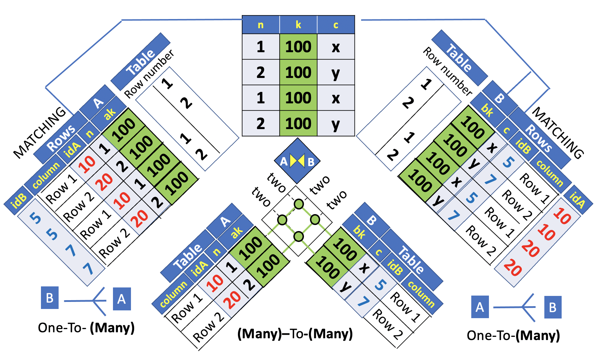

**SQL**
```SQL
SELECT n,
       fk as k,
       c
  FROM A INNER JOIN B
    ON A.ak = B.bk;
```


The example illustrated in the picture above shows the `INNER JOIN` of two tables, `A` and `B`. You may have noticed that the joining columns are indicated as `ak` and `bk` for tables `A` and `B`. This is to emphasize that those columns are not related to each other except for the same numeric data type required in the comparison clause of the `INNER JOIN`.

The important point of this example is that both tables have duplicate values in the joining columns (the number of `100` in this case). This is usually an `error` **because in neither table do the join columns uniquely identify an observation**. In order to understand how a JOIN works in the general case is useful to add a surrogate primary key for both tables, `A` and `B`, indicated as `idA` and `idB` in the columns of the diagram example.

For instance, the numbers `10` and `20` in the picture uniquely identify the first and second record of table `A`, while the numbers `5` and `7` are the identifiers of the first two records in table `B`.

When you join duplicate keys, each row of each table can be combine with all the rows of the other, as shown in the figure. In other word, you get all possible combinations. In this case, the result contains a number of rows equal to the product of the cardinalities of the tables and thus, `|A|x|B|` rows.

This is not a surprising result since the `INNER JOIN` table is a subset of the **Cartesian Product** or `CROSS JOIN` table. The diagram example should be already familiar to you since we discussed the `CROSS JOIN` operation in [lesson](./04_cross_join.md).


## Veen Diagram: An alternative representation  
