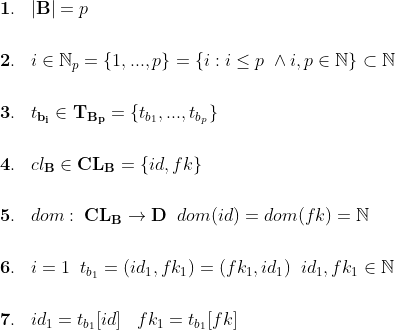
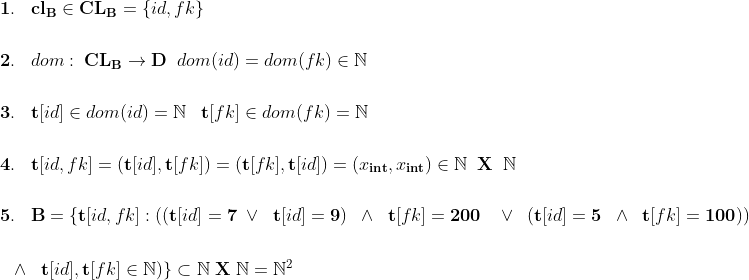
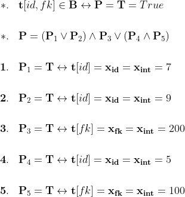
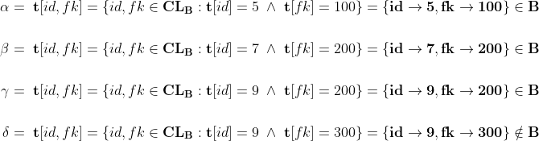
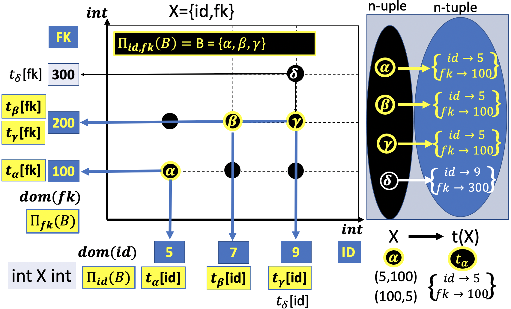
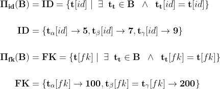
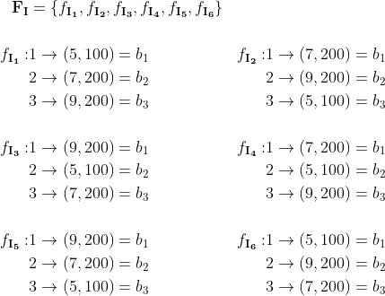
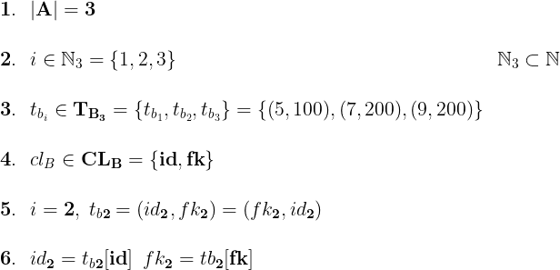
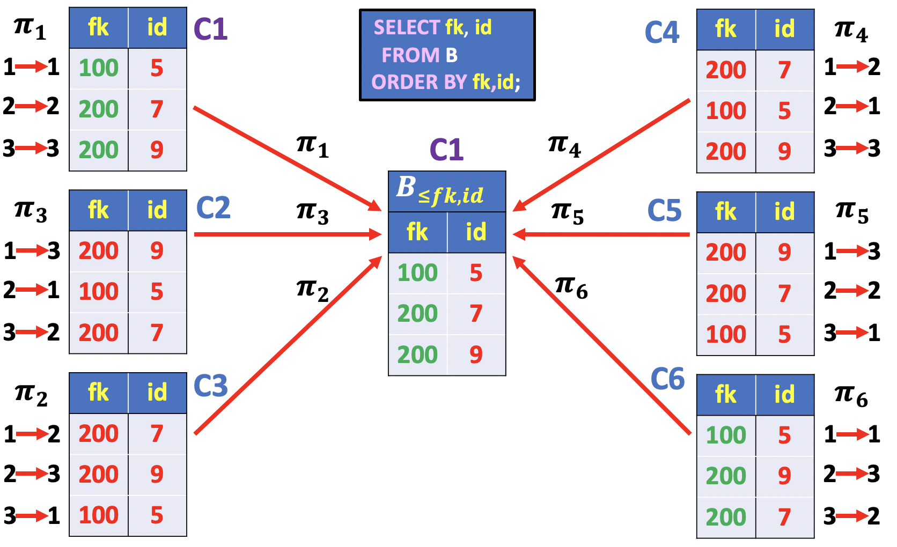
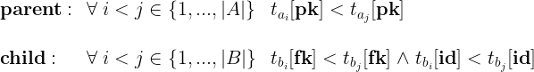

# JOIN Visual Diagram

In lesson [4](./04_cross_join.md) of this chapter, we proposed an alternative and more informative representation of the **Cartesian Product** for the **CROSS JOIN** of two tables. The picture below illustrates the **CROSS JOIN** example presented in lesson [4](./04_cross_join.md). For an in depth discussion please refer to [04_cross_join.md](./04_cross_join.md).


Moreover, we introduced the **INNER JOIN** operator as a way to select a `subset of rows` in the **CROSS JOIN** resulting table.

In the next sections, we extend this visual representation by including the tables **keys** values and the **relationship** between those values. This visual representation is helpful to understand the different types of join: `inner join`, `left join`, `right join`, `full outer join`, `cross join`, `natural join`.

In this lesson we discuss the **INNER JOIN** type.

Fasten your seat belt and stay tuned :smile:

> Note: In the following the terms `column` and `variable` have the same meaning. A `column` and a `variable` is a set of values.

## JOIN Visual Diagram Representation

In the preceding sections and chapters of this course, we have seen that a Relational Database is essentially a Model **based on the values of the common columns** between `related tables`.

The common columns, used to connect each pair of tables are typically the **primary key** columns of the first table and the **foreign key** columns of the second table.

To help you learn how join works, I'm going to use a visual representation similar to the one used for the example of lesson [4](./04_cross_join.md). This time, however, we include two additional columns for the primary and foreign keys of the parent and child tables, respectively.

The example tables that will be used to illustrate the visual representation of a join are borrowed from the `INNER JOIN` example discussed in the previous lesson [inner join](./07_inner_join). For a quick reference, the example tables and the `INNER JOIN` results are illustrated below. For an in depth discussion please refer to lesson [inner join](./07_inner_join).


In this picture each row in table `A` is matched with `zero`, `one` or `more` rows in table `B` based on the values of the primary and foreign key columns.

The following diagram shows each `potential match` as an `intersection of pair dotted lines`.


If you look closely, you might notice that we've switched the order of the primary key `pk` and `n` columns in table **A**. This is to emphasise that **joins match based on the key**; the values in the other columns are just carried along for the ride.


In this diagram each dot, indicated as the intersection of a pair of coloured lines linked to each row, represents a match. To be precise, in this example the keys are the `primary` and `foreign` key columns in `A` and `B` tables, indicated as **pk** and **fk** in the picture above. The number of dots in the picture, therefore, is basically the number of matches.


## INNER JOIN Visual Diagram


An **INNER JOIN** matches pairs of rows or observations whenever their key are equal. To be precise, this is an **equi-join** (definition borrowed by relational algebra) because the keys are matched using the equality operator.

**SQL**
```SQL
SELECT n,
       fk as k,
       c
  FROM A INNER JOIN B
    ON A.pk = B.fk
 ORDER BY n,c;
```

In this example, the keys are the `primary` and `foreign` key columns in `A` and `B` tables, indicated as **pk** and **fk** in the SQL query.


Note that I’ve put the key column in the middle position in the output. This reflects that **joins match based on the key**; the values in the other columns are just carried along for the ride.

To better understand the **referential integrity constraint mapping**, we included a surrogate primary key column (`id`) in table `B`. Each row in table `B` is, therefore, uniquely identified by the `id` column values. Similarly, each row in table `A` is uniquely identified by the `pk` column values.

For example, the primary key values in column `id` of table B:

- **5** uniquely identifies `ROW 1`.
- **7** uniquely identifies `ROW 2`.
- **9** uniquely identifies `ROW 3`.

And the primary key values in column `pk` of table A:

- **100** uniquely identifies `ROW 1`.
- **200** uniquely identifies `ROW 2`.
- **300** uniquely identifies `ROW 3`.

> Note: In the tables illustrated in the picture above, the `ROW` number is used only for **visualization purposes** and to emphasize that a **primary key value uniquely identifies a record**. We can then remind that a table does not have a defined order between the rows. Hence, the row number is used to visualize a particular table instance and there is no obviously a *presentation* order since two tables with the same rows, but in different order, represent the same table. Consequently, the example can be **generalized to any row permutation order**. What really matters is that the values in the **primary key column** are distinct one from another and, therefore, they constitute a **SET OF VALUES**. It follows that for each instance table, the terms `ROW #`, where the symbol `#` indicates a whole number, and the corresponding primary key value are equivalent. **It's basically a mapping of the primary key values in a Table to the set of Natural numbers**.

In the picture above, the values in the `pk` column of table `A` are mapped to `zero`, `one` and `more` rows in the `B` table, depending on the foreign key value.

The following diagrams show the mapping relation as connecting arrows between the elements of two sets, indicated as two parallel columns of dots contained in circle shapes. The arrows indicate the relation direction that connects the elements in the *set of departure* or **domain of the relation** to the *set of destination* or **codomain of the relation**.


For example, in this diagram the set of departure is the set of primary key values in column `pk` of table A, illustrated inside the blue circle on the right hand side of the picture above, indicated as `a = pk`, and the codomain is the set of primary key values in table B, illustrated inside the middle circle and indicated as `b = (id,fk)`. The `fk` column is carried to illustrate the relation between the primary and foreign key values. Lastly, the dotted bidirectional arrows connecting the the left hand side and middle circles show the corresponding row for each primary key value. Bear in mind that this correspondence is only for visual representation, there is no relation order between rows in a table. As mentioned earlier, *it's basically a mapping of the primary key values in a Table to the set of Natural numbers*. This representation is helpful to visualize the relation in the Cartesian plane, as it will be shown soon in this lesson. In this mapping the primary values in table A appears in the second position of the tuple `b = (id, fk)` and therefore it can be easily substitute with `(id, fk=pk)`. It follows that the values:

- **100**, (`5`,**100**), is mapped to `one` row in table `B`, `ROW 1` or **5**.
- **200**, (`7`,**200**), is mapped to `two` rows in table `B`, `ROW 2` and `ROW 3`,or **7** and **9**.
- **300**, `NO Mapping`, is mapped to `zero` rows in table `B`. No ROWS.

You might have noticed that not all elements in the domain are mapped to the codomain. This type of mapping is usually called a *partial mapping*. In this case the *domain** is called **domain definition of the instance relation** just to make a distinction with the general case of not matching rows in a set.


Consequently, the primary key values in column `id` of table B:

- **5** is mapped to **100**, `ROW 1` in table A
- **7** is mapped to **200**, `ROW 2` in table A
- **9** is mapped to **200**, `ROW 2` in table A

On the other hand, this mapping includes all the elements in the domain and, therefore, is a *complete mapping*.

This simple example gives a visual representation of the meaning for a **referential integrity constraint mapping** in a relationship between tables. The values in the `fk` columns is a **subset of the values** in the primary key column, (`pk`), in table A. Hence, **the combination of the primary and foreign key values in the parent and child table B uniquely identifies the matching rows in both tables**.

The **uniqueness of the joining table rows can even be determined by the primary key values in the child table **!**, as we'll see soon.


In this picture, the set of tuples in the middle are the primary and foreign key columns in table `B`. The combination of the `id` and `fk` fields of each record uniquely determines the matching rows in both tables.

For example, the tuple `(5,100)` uniquely determines the mapping between the first rows in both tables. Next, the tuples `(7,200)` and `(9,200)` determine the mapping of the second and third row in table `B` with the second row in table `A`.


As a result, all the rows in table `B` will be in the inner join resulting table, indicated as `Matching Rows Table B` on the top right hand side of the picture. It follows that **the values in the** `id` **column of table** `B` **uniquely identify each matching row in the inner join resulting table**.

It follows that the set of `Matching Rows in Table A`, indicated on the top left hand side of the picture, is also defined in terms of the values in the `id` column of table `B`, indicated on the left hand side.

Note that I’ve put the `id` key column in a slightly different position in the `Matching Rows Table A`. This reflects that the key is a `primary key` in `B` and the primary key `pk` is  the first column  starting from the right. For instance, the value **5** identifies the first matching row of table `A` linked to the value **100** in the pk column and the values **7** and **9** identify the second matching row linked to the value **200**.

As a result, the `INNER JOIN` of two tables, determines `two implicit mappings` between two finite sets:

- **B<sub>R</sub>** = {1, ... , `|B|`}: represents the set of rows in table `B`.
- **A<sub>R</sub>** = {1, ... , `|A|`}: represents the set of rows in table `A`.

As usual, the notation `|B|` and `|A|` indicates the total number of rows in table `B` and `A`, respectively. Hence, **B<sub>R</sub>** and **A<sub>R</sub>** are subsets of the Natural numbers. It follows that the `INNER JOIN` resulting table is a correspondence between the following two sets:

- **B<sub>MR</sub>** = {1, ... ,`p <= |B|`}: represents the set of matching rows in table `B`.
- **A<sub>MR</sub>** = {1, ... ,`q <= |A|`}: represents the set of matching rows in table `A`.

It's worth noting that the number of matching rows in **B<sub>MR</sub>** is exactly equal to `|B|`, `p = |B|`, if and only if the foreign key column does not contain `NULL` values. In this section we illustrate the case `p = B`, later in this lesson we discuss the existence of `NULL` values in the foreign key column.


The first mapping, **B<sub>R</sub>** `->` **A<sub>R</sub>**:
- Assigns to each row number in table `B`, the corresponding matching row number in table `A`. It's worth noting that the **matching rows** in table `A`, indicated as **A<sub>MR</sub>**, is a proper subset of **A<sub>R</sub>**.  


The second mapping, **A<sub>R</sub>** `->` **B<sub>R</sub>**:
- Assigns to each row number in **A<sub>MR</sub>**, the corresponding matching row number in table `B`. It's worth noting that the mapping notation in the picture is **A<sub>R</sub>** `->` **B<sub>R</sub>**, although this notation is not formally correct, we keep the whole set of primary key values to make a distinction between a partial and complete mapping. This distinction is helpful to understand the `OUTER JOIN` operator, as it will be shown later in this course.  

The implicit mappings described earlier can be visualized in a Cartesian plane, since the row number implicitly defines a relation order between rows.

Assuming there is a correspondence between the set of *Natural numbers*, **N**, and the rows in a table, **it's possible to access the values in the columns using a positional index**, as follow:


In this notation:

1. The positional index is **i** and the range is between `1` and the number of rows in table A, `|A|`.
2. **t<sub>a<sub>i</sub></sub>** and **T<sub>A</sub>** denote the row or tuple in position `i` and the sequence of rows in table A. For example, **t<sub>a<sub>1</sub></sub>** denotes the row in position `1` and, therefore, is the first element in the **T<sub>A</sub>** sequence.
3. **cl<sub>A</sub>** and **CL<sub>A</sub>** denote a table's column and the set of columns in table A.
4. **t<sub>a<sub>i</sub></sub>[cl<sub>A</sub>]** is, therefore, the value of column **cl<sub>A</sub>** in row `i`.

This notation does not include the column position in table A, since it is not relevant for the representation of a relationship in the cartesian plane, as it will be shown later in this section. It follows that column **cl<sub>A</sub>** represents any column in the `unordered set` of columns indicated as **CL<sub>A</sub>**. On the other hand, **T<sub>A</sub>** indicates a sequence of rows and therefore is an **ordered set of objects** since each row in a table is unique. This distinction between `ordered` and `unordered` sets is intentionally indicated with a small and capital case subscript letter in the set elements t<sub>**a**<sub>i</sub></sub> and cl<sub>**A**</sub>.   

This basic idea is essential to establish a correspondence between the coordinates on a cartesian axis and the ordered set **T<sub>A</sub>**. Hence, there is a bijiection between a **sequence or ordered set of** `p` **positive integers** on a cartesian axis, indicated as **N<sub>p</sub> = {1,2,..,p}**, and a table with `p` rows.  

This positional notation is fundamental to formulate the referential integrity constraint mapping in the Cartesian plane. I cannot stress enough that this notation is based on the assumption of natural ordering between rows in a table. This assumption is not valid in the Relational Model, however we'll show how to overcome this issue later in this lesson.

Later in this course, we also propose a formulation based on `Set theory` **more appropriate** for a definition of the `JOIN` operator in the `Relational Model`. Lastly, we illustrate a `set representation` using `Venn Diagrams`.

### The Positional Notation of a Table

In the previous section we introduced a formalism to describe a table using a positional notation. In this section, we show how to apply the notation to a specific instance table and illustrate how to generalize the positional representation for any instance table in the relational model.

Before looking at a specific example, let us generalise the notion illustrated in the previous section for a two columns table B.



This extended notation includes the **sequence or ordered set of** `p` **positive integers**, indicated as **N<sub>p</sub> = {1,2,..,p}**. Moreover, we establish a correspondence between columns identifiers and domains (the set of values in a column or data type) by means of a function *dom*. This function returns for each identifier in the table header **CL<sub>B</sub>**, (`id`,`fk`), or set of columns in table B a domain of values. For instance, the columns with identifiers `id` and `fk` contain natural integers. It's worth noting that `id` and `fk` are just labels that indicate the meaning of a table's column. In this simple example, `id` is a surrogate primary key of table B and `fk` is a generic foreign key.

Lastly, the inclusion of a subscript `p` to the symbol T<sub>B</sub>, **T<sub>B<sub>p</sub></sub>**. This additional change is to still make a distinction between an ordered and unordered set, such as a generic table **B** or the columns set **CL<sub>B</sub>**.

To formalize the concepts and understand the difference between a table positional notation for an ordered set of records, indicated with the symbol **B<sub>p</sub>**, and an unordered set, indicated with the symbol **B**, let us show a simple example.

We start with a **non positional representation** of a relation or table `B` defined on two columns or attributes `id` and `fk`.

### Example: Not positional notation of a Table





As usual, the first two listing points indicate that table B has two integer columns, `id` and `fk`.

The next point in the list introduces a notation to indicate any value in the domains of these column identifiers, `id` and `fk`. For instance, **t**[`id`] is a **partial function** *t*, which associates with the column `id` a *value* of the domain *dom(id)=N*. Similarly, **t**[`fk`] returns a *value* for the column identifier `fk`. The usefulness of this notation is clear in the case there is more than a single column value. For example, the notation **t**[`id`,`fk`] indicates **any ordered couple** of *values* or **permutation** of *values* in the columns `id` and `fk`, as indicated in the second last point of the list.

The notion of tuple, therefore, formalizes the notion of row or record in a table:

- **Tuple**: is a **partial function from attribute names to atomic values**. It's a partial function because of the possible presence of NULL values in atomic formulae. Consequently, the domain of the tuple function, **t**`[`..`]`, is a finite subset since any table has a finite number of elements. The function **t** maps a `n-tuple` from 1 up to n to the set of domain values.

- **Header**: is a finite set of `n` attribute names for an `n-tuple`.

In this notation the position of a column is not relevant. The values in a column are *independent* to the `position` of the values in the other columns. To better understand this difference we also use a mathematical notation for a single column value as **x<sub>dom(cl<sub>b</sub>)</sub>**. For example, **x<sub>int</sub>** references any value in the set of values in the domain *dom(id)=N* or positive integer numbers.

For example the following relation contains the data relating to the results of a set of soccer matches between European and South American teams, indicated as `E_Team` and `SA_Team` in the table below.

|E_Team| SA_Team| Home_Goals | Visitor_Goals |
|:-----:|:-----:|:-------:|:--------:|
|Italy| Brazil| 2|1|
|Spain|Argentina|3|0|

It's defined with reference to two domains *integers* or **N** and *string*, each of which appears twice. the relation is in fact a subset of the cartesian product:

- **String** `X` **String** `X` **Integers** `X` **Integers**

A generic element in this subset is:

- (**x<sub>Str</sub>**,**x<sub>Str</sub>**,**x<sub>Int<sub>**,**x<sub>Int</sub>**)

It follows that **x<sub>Integers</sub>** belongs to the set of positive integer values  `Int` and **x<sub>String</sub>** belongs to the set of alphanumeric strings `Str`. If the columns position in the table have a meaning then the first `n-tuple` in the example table:

- `(Italy,Brazil,2,1)` : indicates that the result match between `Italy` and `Brazil` is `2-1` and `Italy` is the `Home Team`.

If we were to swap the first and second components around in the relation, it would completely change the meaning of our relation, in that the results of the matches would be inverted.

|SA_Team| E_Team| Home_Goals | Visitor_Goals |
|:-----:|:-----:|:-------:|:--------:|
|Brazil| Italy| 2|1|
|Argentina|Spain|3|0|


- `(Brazil,Italy,2,1)` : indicates that the result match between `Brazil` and `Italy` is `2-1` and `Brazil` is the `Home Team`.

It's worth noting that the domain cartesian product is still the same but the meaning of the tuple is different.

- **String** `X` **String** `X` **Integers** `X` **Integers**
- `(Italy,Brazil,2,1)` **is not equal to** `(Brazil,Italy,2,1)`.

This happens because each of the two domains integer and string appears twice in the relation, and the two occurrences are distinguished on the basis of their positions: the first appearance of the domain string refers to the home team, and the second to the visiting team.

For this reason, we introduce a `non-positional` notation, by associating names with the domains in a relation, referred to as attributes, which describe the `roles` played by the domains. For example, for the relation concerning the matches, we can use names such as `Home_Team`, `Visiting_Team`, `Home_Goals`, `Visitor_Goals` and two additional columns `Home_Continent` and `Visitor_Continent` (it's not the best solution in terms of database design, it's only for teaching purposes); in the tabular representation, we use the attributes as column headings.

**Given the necessity of identifying the components unambiguously**, **the attributes of a relation** (and therefore the `column headings`) must be

- `different from each other` and
- must have `identifiers with unambiguous meaning`. In other words, there must be a logical connection between the columns names that establishes a relation based only on the column headings.

|Home_Continent|Visitng_Continent|Home_Team| Visiting_Team| Home_Goals | Visitor_Goals |
|:--:|:--:|:-----:|:-----:|:-------:|:--------:|
|South America|Europe|Brazil| Italy| 2|1|
|South America|Europe|Argentina|Spain|3|0|

By modifying the definition of relation with the introduction of attributes, and still before giving the formal definition, we can see that the ordering of attributes (and of the columns in the tabular representation) is irrelevant: it is no longer necessary to speak of first domain, second domain, and so on; it is sufficient to refer to the attributes.

A naive representation of a relation is a dictionary data structure that stores mappings of unique identifiers to values. For the soccer matches example an implementation in the Python language is given below:

```python
Matches = { "alpha": {"Home_Continent": "South America",
                      "Visiting_Continent": "Europe",
                      "Home_Team": "Brazil",
                      "Visiting_Team": "Italy",
                      "Home_Goals": 2,
                      "Visitor_Goals": 1},
             "beta": {"Home_Continent": "South America",
                      "Visiting_Continent": "Europe",
                      "Home_Team": "Argentina",
                      "Visiting_Team": "Spain",
                      "Home_Goals": 3,
                      "Visitor_Goals": 0}}
```

In this data structure:

- There is no defined order between the `alpha` and `beta` tuples.
- The `alpha` and `beta` tuples are distinct one from the other, since among elements of a set there cannot be two identical elements; therefore the rows are different from one another. Keep in mind that the insert method must check equality in the data structure.

This data structure allows reference to the fields of a record by means of symbolic names:

```python
print(Matches['beta']['Home_Team'] + " " + Matches['beta']['Visitng_Team'])
Argentina Spain
```

The relation or table **Matches** is a set of `homogeneous` tuples, indicated as `alpha` and `beta`, defined on the domain of the attributes or column headings,

- H = {`Home_Continent`,`Visiting_Continent`,`Home_Team`,`Visiting_Team`,`Home_Goals`,`Visitor_Goals`}.

The application of the `non-positional` notation to the `alpha` tuple is given below:

```console
alpha = {t[H]: t[Home_Continent] = South America AND
               t[Visitng_Continent] = Europe AND
               t[Home_Team] = Brazil AND
               t[Visitng_Team] = Italy AND
               t[Home_Goals] = 2 AND
               t[Visitng_Goals] = 1 AND
               dom(Home_Continent) = dom(Visitng_Continent) = dom(Home_Team) = dom(Visitng_Team = STRING AND
               dom(Home_Goals) = dom(Visitor_Goals)=INTEGER)}
```

Abusing the notation for the sake of simplicity the set representation of a tuple is given below:

```console
# tuple function
(Str, Str, Str, Str, Str, Str) -> (Str, Str, Str, Str, Int, Int)

# tuple alpha
alpha = {    Home_Continent -> South America,
         Visiting_Continent -> Europe,
                  Home_Team -> Brazil,
               Visitng_Team -> Italy,
                 Home_Goals -> 2,
              Visitng_Goals -> 1}

# tuple beta
beta = {    Home_Continent -> South America,
        Visiting_Continent -> Europe,
                 Home_Team -> Argentina,
              Visitng_Team -> Spain,
                Home_Goals -> 3,
             Visitng_Goals -> 0}

# Matches table
Matches = {alpha, beta}
```
The curly braces in this example indicates that the order in the tuple is not important and, therefore, it represents any permutation of the cartesian product components.

It follows that the Matches table is a set of two tuples: **Matches**={`alpha`,`beta`}.

Now, we are ready to give a formal definition for the example introduced at the beginning of this section.

Then, let us say that a tuple on a set of attributes or columns names in a table B, **CL<sub>B</sub>**, is a function **t**, which associates with each attribute **cl<sub>B</sub>** in the set **CL<sub>B</sub>** a value of the domain *dom(cl<sub>B</sub>)*. We can therefore give the definition of a **relation**:

- A **relation B** on **CL<sub>B</sub>** is **a set of tuples** on **CL<sub>B</sub>**.

The next definition defines relation that formalizes the contents of a table as it is defined in the relational model.

- A relation is a tuple **(H, B)** with `H`, the header, and `B`, the body, **a set of tuples that all have the domain** `H`.


It follows that **B** represents a table or **unordered set** of 3 records and two columns, that can be represented as any permutation of the columns in the Cartesian plane. For now, we assigned to the identifiers `id` and `fk` the first and second component of the Cartesian coordinates. Later, we give a rule to order the columns in a relationship and illustrate a visual diagram. The principle is to be consistent and avoid any ambiguity in the presentation of the results.


You may have noticed that the definition of set **B** does not have a listing of elements neither a positional index. Instead, the elements definition is based on a **proposition**. We then remind the `AND` and `OR` boolean binary operator definition:

- **(P<sub>i</sub>** `AND` **P<sub>j</sub>)** = `T` **<->** **P<sub>i</sub>** = **P<sub>j</sub>**, otherwise `F`

- **(P<sub>i</sub>** `OR` **P<sub>j</sub>)** = `F` **<->** **P<sub>i</sub>** = **P<sub>j</sub>**, otherwise `T`

The application of the boolean operator `AND` returns true if and only if both Propositions are True, otherwise the result is False. On the other hand, the `OR` operator returns False only when both Propositions are False.

It follows that an element or tuple belongs to set B if the following proposition is True:



The Boolean table for a set of input elements is represented below:


The example illustrated above shows that three tuples, indicated with the greek letters `alpha`, `beta` and `gamma`,  belong to the relation `B`. On the other hand the last input does not belong to set B.



Table `B` can be represented in the Cartesian Plane. After all a table is a Relation on its attributes and a Relation is a subset of the Cartesian product.



In this picture, the table heading is indicated with the capital letter `X`. The set `X` includes two identifiers, `id` and `fk`. The tuple function is a kind of mapping between the coordinated of the cartesian plane and the column labels.

For example, the tuple t<sub>alpha</sub> row indicates that column `id` and `fk` have values `5` and `100`. Thus, without loss of generality any permutation of these values can be represented by t<sub>alpha</sub>.

Moreover, the components of tuple `alpha`, (5,100), are projected on the respective columns' axis. This operation is executed for each tuple in table B, indicated with the yellow circle dot in the picture. The result is a decomposition of relation B in two sets.

The set `ID` contains all the **distinct** values in column `ID`. Similarly, the set `FK` contains all the distinct values in column `FK` in table B.

|id|fk|
|:-:|:-:|
|5|100|
|7|200|
|9|200|


This operation is equivalent to the following SQL statements:

```SQL
SELECT DISTINCT id
  FROM B;
```

|id|
|:-:|
|5|
|7|
|9|

The projection allows the vertical decomposition of relations: the result of the projection contains in this case as many tuples as its operand, defined however only on some of the attributes.

And for column `FK`:

```SQL
SELECT DISTINCT fk
  FROM B;
```

|fk|
|:-:|
|100|
|200|


We note a different situation. The result contains fewer tuples than the operand, because all the tuples in the operand that have equal values on all the attributes of the projection give the same contribution to the projection itself. As relations are defined as sets, they are not allowed to have tuples with the same values: equal contributions ‘collapse’ into a single tuple.

This mathematical operator has a specific name in relational algebra: The `projection` operator and is indicated with the greek letter pi.



### Example: positional representation of a Table

We now turn our attention to the representation of a Relation on a Cartesian axis based on a positional notation.


In the previous section, we visualized a binary Relation `B` of two positive integers sets, linked to the columns `id` and `fk`, in the Cartesian plane. Consequently, there is a natural ordering in columns' values that can be easily represented on the Cartesian axises. Thus, table `B` is a set of bidimensional tuples represented in the Cartesian plane.

Obviously, a Cartresian plane cannot visualize a Relation that includes three or more attributes and, therefore, is not appropriate to represent a `JOIN` between tables of multiple columns.

Thus, a natural question would be:

- `What criteria should be used to represent a Relation of two or more columns on a Cartesian axis?`

It's obvious that a set of bidimensional or multidimensional tuples do not have a natural order and, therefore, there is no definitive rule for ordering the elements in a table.

We understand that a table with `p` rows is any finite collection of certain distinct tuples into a whole. It's, therefore, possible to assign a sequence of `p` positive integers, indicated as **N<sub>p</sub>**, to a set of `p` rows.

Let's indicate this assignment as follow:


In this notation, `f`**<sub>I</sub>** is an `Indexed function` and **B<sub>p</sub>** is an `Indexed set of p elements`. In the case `p=3` there are `6`,(3!), possible assingments of **N<sub>3</sub>={1,2,3}** to the elements in set **B={alpha,beta,gamma}**.

For example, the relation B:

```console
alpha = {id -> 5, fk -> 100}
beta = {id -> 7, fk -> 200}
gamma = { id -> 9, fk -> 200}

B = { alpha, beta, gamma}
```

is a set of three tuples that can be indexed in 6 possible ways. For the sake of simplicity and avoid verbose mathematical notation let's assume columns `id` and `fk` correspond to the first and second component of a bidimensional vector. Then set B is indicated as follow:

```console
B = {(5,100),(7,200),(9,200)}
```

The `Family of Indexed Functions`, indicated as **F<sub>I</sub>**, and the corresponding 6 assignment functions are given below.



The `Family of Indexed Functions`, **F<sub>I</sub>**, returns a `Family of Indexed Sets`, indicated as:


Indexed family




In the example illustrated above, the positional index **i** ranges between `1` and `3` and the cardinality of table B is, **|CL<sub>B</sub>| =** `2`. It follows that table B has 3 rows and two columns, indicated with the identifiers `id` and `fk`. A generic row in the table can be easily acessed with the positional index `i` and the column **cl<sub>B</sub>** belonging to the set **CL<sub>B</sub>**.

For example, the second row, `i=2`, is defined as follow:

- **t<sub>b</sub><sub>2</sub>** = (**t<sub>b</sub><sub>2</sub>[id]**,**t<sub>b</sub><sub>2</sub>[fk]**) = **(7,200)**.


In this example, we illustrated how to use the positional index to describe the tabular representation of an instance table. This notation assumes a Natural order between rows in a table.

This, however, begs the question: `What does it mean to be in order and how do we specify that?`

A deceptively obvious answer is that the output must respect the ordering relation of a Total Order on their respective primary keys. This choice actually depends on the table involved in the `JOIN` operation, as we'll show in the next section.

In this problem, the elements to be sorted are the rows in the table and each row **R<sub>j</sub>** has a primary key, `pk` or `id`, which governs the sorting process.

The sorting algorithm transforms the input sequence into a rearranged sequence containing the same elements. The output sequence is a permutation such that an order relation, `(`**<=**`)` or `(`**>=**`)`, criterion on the primary keys is satisfied.

For the example discussed earlier, the group of permutation for 3 rows is illustrated below.


In this example, each row number in the current table is mapped to a row number in the same range of values, (i.e. `1`,`2`,`3`). For example, the first permutation maps each row number to the same position and, therefore, the primary keys keeps the same mapping. This permutation is called the identical permutation since the table before and after the permutation remains the same.

In the following examples, the rows will be sorted in `ASCENDING` order of the `primary` and `foreign` key values in the parent and child table. This choice is only a preliminary attempt, the definitive criterion is given at the end of this section.

In other words, the criterion to be satisfied in the parent and child table is:


For the example discussed earlier, table B is already sorted in ascending order of the primary key values. We also notice that the foreign key values follow the same order as the primary key column. The sorting algorithm output is, therefore, the identical permutation.

Let's discuss the **parent table** case first.


It's clear that the group of permutations **S<sub>3</sub>** gives 6 possible configurations only for tables with distinct values. There is, therefore, **one and only one configuration for the sorted primary key parent table**. Consequently, the permutation that transforms each table to a sorted table is unique. In other words, each inital configuration has one and only one sorting permutation.

In the picture above, a set of 3 distinct primary key values (`100`,`200`,`300`) can be arranged in 6 possible ways and, therefore, `6 different tables`, (illustrated on the left and right hand side of the picture). It follows that only one table or configuration respects the ascending order relation on the primary keys. The sequence (`100`,`200`,`300`) appears only in the column of the first table on the top left hand side.

Hence, each table has one and only one sorting permutation. For instance, the permutation (`1` **->** `3`,`2` **->** `1`, `3` **->** `2`)  transforms the sequence of primary key values (`300`,`100`,`200`) that appears in the second table on the left hand side of the picture, to the sorted sequence (`100`,`200`,`300`).

It follows that, there is `only one mapping between the primary key values and the Natural numbers`. In this example, the mapping is:

- `100` **->** `1`
- `200` **->** `2`
- `300` **->** `3`

The sorted table representing this mapping is indicated as **A<sub>>=pk</sub>**, denoting the representative table of the `3` rows tables equivalence class. In other words, the visual representation of the 6 tables in the Cartesian plane is illustrated by the **A<sub><=pk</sub>** and there is no ambiguity for the `INNER` join resulting table. We then remind that a Cartesian plane requires a relation order for its elements.



On the other hand, the existence of duplicates values in the foreign key column has more than a single configuration with sorted records.

For example, in the picture above the sequence (`100`,`200`,`200`) appears in the foreign key column of two tables, illustrated on the top left and bottom right corners.

As a result, it's necessary to use a different criterion to sort the child table records. A natural way to uniquely identify each record in a table is the choice of a column with distinct values.

The answer is obviously: `The primary key column`. The reason is that for each foreign key value there will be always distinct primary key values. Consequently, a solution is to sort the records by foreign key values first and then sort the corresponding primary key values. This solution uniquely determines the equivalence class matrix **B<sub>>=fk,pk</sub>**.

It follows that the definitive sorting criterion for the parent and child tables is:




It's worth noting that the sorting criterion is not unique in the case of composite primary keys since it depends on the order the primary key columns values are sorted. This limitation can be ignored if we follow the rule to sort the values in the columns respecting the alphabetical order of the columns' name. For instance if the primary key is (`course_id, student_id`), the primary key columns values are sorted following the order `course_id` and `student_id`. It's an arbitrary choice, the point is to be consistent and avoid any ambiguity. In this way, we provide a general rule to represent both tables in the Cartesian plane.  
