## Positional representation of a CROSS JOIN

The previous section determined a general sorting criterion to uniquely represent any instance table and overcome the ambiguity to interpret the result of an `INNER JOIN` between tables in a cartesian Plane.

The sorting criterion must respect an ascending strict order relation on the primary key values in the parent table and a foreign-primary keys combination in the child table.

The sorted table is a bijection between the Natural numbers and the values in the selected column keys that uniquely identifies each record in a table. The set of Natural numbers, `N`, is a total ordered set and, therefore, there is a correspondence between the Cartesian Product `N x N` and the `CROSS JOIN` operator.

Following the positional notation introduced in the previous section we define the following Cartesian product of Natural integers:

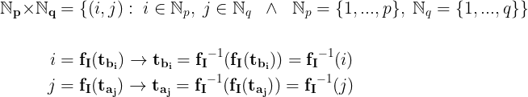

The corresponding positional notation for relation `A` and `B` is:

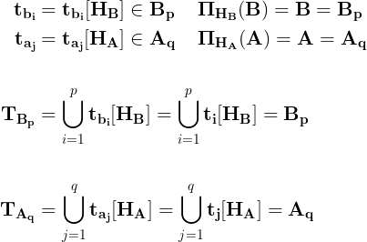

In this notation **HB** and **HA** are the column headings in tables `B` and `A`.

It follows that the `CROSS JOIN` operator is defined as follow:

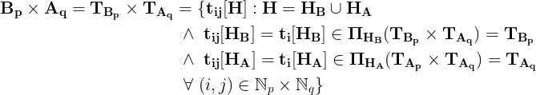

In this notation, the set of columns in the `CROSS JOIN` table, **H**, is the Union of the column headings in relation `B` and  `A`, indicated as **HB** and **HA**.

For each ordered tuple `(i,j)`,in the Cartesian Plane, there is a corresponding `CROSS JOIN` tuple **tij** defined on the column headings **H**.

The tuple's components consists of the projection on the subset columns **HB** and **HA** of the `CROSS JOIN` tuple. The projections return the attributes values in relation `B` and `A`.

The simplicity of this notation is better illustrated with an example:

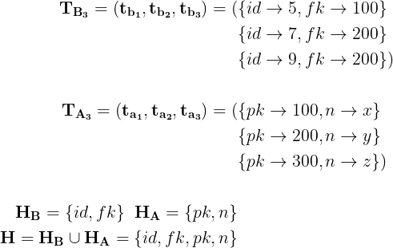

In this example, the two relations `A` and `B` have three rows and two columns. The resulting `CROSS JOIN` table will have four columns and 9 rows, `3 x 3`.

For instance, the `CROSS JOIN` of the example tables, `A` and `B` is:

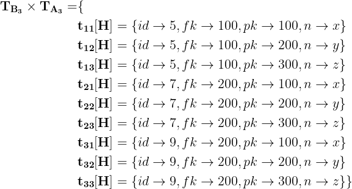

The picture below shows the `CROSS PRODUCT` in the Cartesian Plane.

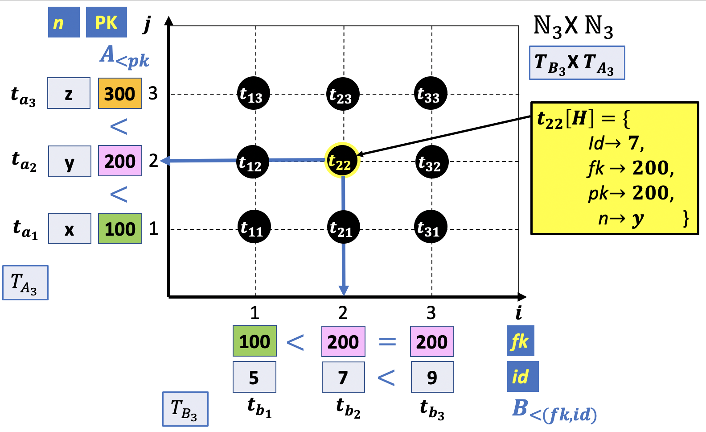

You may have noticed that an element in the Cartesian Product is a combination of the child and parent tables records, where the first and second elements are the rows in position `i` and `j`.

- `(i,j)`
- **i**: row in position i in the child table
- **j**: row in position j in the parent table

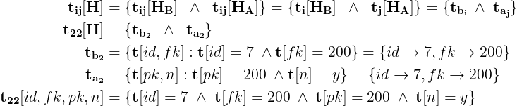

A tuple in the `CROSS JOIN` is a combination of Logic AND's conditions in relations B and A.

In a Relational database the columns order is not relevant and, therefore, the `CROSS JOIN` of two tables can be generalized to any columns permutation.

## Non Positional representation of a CROSS JOIN

In the previous section we illustrated the positional representation of the `CROSS JOIN` operator in the Cartesian Plane. The positional indices establish a correspondence between the Cartesian Product **Np** **X** **Nq** and the `CROSS JOIN` tuples.

The Relational Model, however, is represented as a non positional tabular form. Hence, the operators between Relations must be defined only in terms of set operators and columns identifiers.

Following the non-positional notation introduced in the previous lesson, we define the `CROSS JOIN` of two tables `B` and `A` as follow:

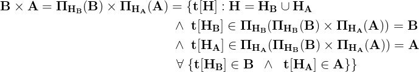

A tuple in the `CROSS JOIN` is a combination of Logic AND's conditions in relation `B` and `A`, likewise the positional notation. In this notation, however, the definition of a tuple is based on an unordered pair of tuples as indicated in the last logic condition wrapped in curly braces.

This notation is better illustrated with an example:

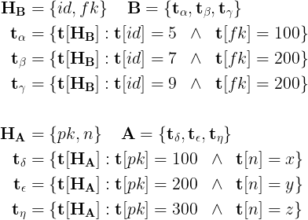

The `CROSS JOIN` resulting table is given below:

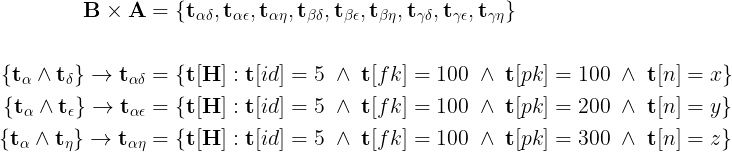

The first set of unordered couples of `B` and `A` elements.

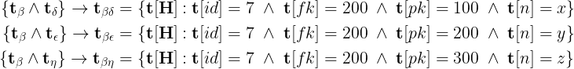

The second set of unordered couples.

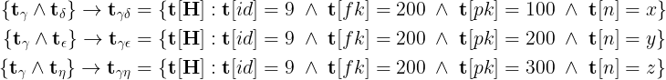

The last set of unordered couples.

The non-positional representation of the `CROSS JOIN` is given below.

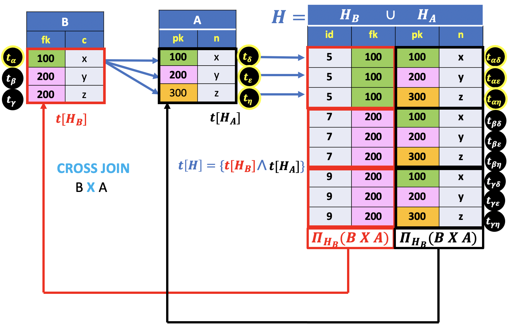
