# VISUAL REPRESENTATION OF AN INNER JOIN

In the previous lesson we introduced the positional and non-positional notation to represent the `CROSS JOIN` operator between relations or Tables. It's obvious that a `CROSS JOIN` (Cartesian Product) is, in general, of very little use, because it combines tuples in a way that is not necessarily significant.

In fact, the `CROSS JOIN` resulting table is a list of all possible combinations on the selected columns from both tables. Consequently, each combination row is a concatenation of tuples from the first and second tables in the `CROSS JOIN` operator.

Thus, we need a condition which preserves the combined tuples that are meaningful in the `CROSS JOIN` table. **The specified condition is a requirement to be satisfied by a combination row that indicates whether or not the tuples in both tables are related to each other**.

In a Relational Database the condition typically used to filter the tuples in a `CROSS JOIN` table is essentially an **equality comparison** between the values in the foreign and primary keys columns of the child and parent tables.

For the way the joining condition selects each row in a `CROSS JOIN` table, the resulting relation is sometimes referred to as `EQUI-JOIN`. Thus, an `EQUI-JOIN` is essentially a `CARTESIAN PRODUCT` followed by a `selection`.

More precisely, a `selection` is a relation algebra operator that allows to filter tuples in a Relation. The `filtering condition` can be a

- comparison between attributes or
- between attributes and constants.

Before going into details, let's first give a formal definition of the `selection` operator, as we did for the `projection` operator in the previous lessons.

Given a relation `R` defined on a set of columns or attributes `X`, **R(X)**, a `propositional formula` **F** on `X`, formula obtained combining atomic conditions of the type (`XA` **OP** `XB`) or (`XA` **OP** `c`), with the connectives `AND`, `OR` and `NOT`, where:

- **OP** is comparison operator (`<`,`>`,`=`,`<=`,`>=`);
- `XA` and `XB` are attributes in `X` that are compatible (that is the comparison operator **OP** is meaningful on the values of their domains).
- `c` is a constant compatible with the values of the domain in `XA`.

Given a formula `F` and a tuple `t`, a `truth` value is defined for `F` on `t`:

- (`XA` **OP** `XB`) is true on `t` if and only if **t[A]** `is in relation` **OP** `with` **t[B]** (for
example, `A = B` is `true` on `t` if and only if `t[A] = t[B]` );
- (`XA` **OP** `c`) is true on `t` if and only if **t[A]** `is in relation` **OP** `with` **c**;

At this point we can complete the definition:

- the selection **σF(R)** produces a relation on the same attributes as **R** that
contains the tuples of **R** for which `F` is true.

It follows that an `EQUI-JOIN` is indicated with the following notation:

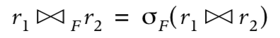

where **r1** and **r2** are two relations or tables.

In the following sections of this lesson we introduce the notation for an `EQUI JOIN` between relation for a positional and non-positional representation.

## Positional representation of an EQUI JOIN

Following the notation introduced in the previous lesson for the `CROSS JOIN` operator and the `selection` operator definition, it is straightforward to formulate the `INNER JOIN` between tables. Assuming there is no columns' heading identifier common to both tables and the comparison between columns is meaningful on the values of their domains, the `EQUI JOIN` definition is:

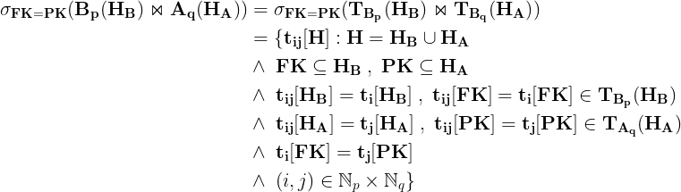

In this notation **FK** and **PK** are the foreign and primary keys columns in the child and parent tables. It's obvious that the **FK** and **PK** are proper subsets of the column headings **HB** and **HA** in relation **B** and **A**, respectively. In general, however, the columns to be compared do not need to be the foreign and primary key columns as far as the values in those columns are comparable.

This notation is better illustrated with an example:

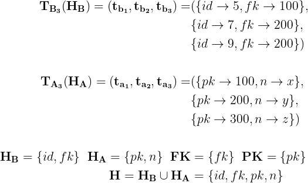

In this example the foreign and primary keys consist of a single column identifier, *fk* and *pk*. Sometimes, however, the foreign and primary keys may consist of two or more columns, in such cases the **FK** and **PK** sets are indicated as a sequence of identifiers and the comparisons are performed according to the sequence order.

The child and parent tables have three rows. The foreign key values in the child table are a subset of the primary key values in the parent table. It's not difficult to identify the tuples that are related to each other. The foreign key values in the child table appears only in the first and second tuples of the parent table `A`. Consequently, the `EQUI JOIN` resulting table has **6** rows (`3 x 2`).

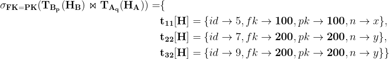

The first two tuples are related to each other and the two remaining tuples in the child table are related to the second tuple in the parent table. This relation is better illustrated in the figure below.

In this picture the tuple **ta3** is not related to any tuple in the child table and, therefore, it is not related to relation `B`. On the other hand, each tuple in the child table is related to one tuple in the parent table.

## Non Positional representation of an EQUI JOIN

In the previous section we introduced the definition of the `EQUI JOIN` operator using a positional notation. In this section we illustrates the equivalent definition for a non-positional notation.

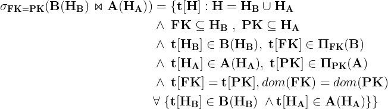

This notation is better illustrated with an example:

The `Equi Join` resulting table is given below:

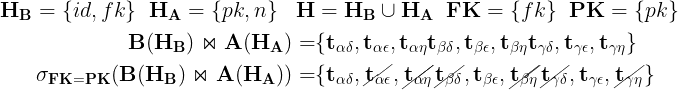

The resulting table is a subset of the `CROSS JOIN` table. The corresponding tuples are given below:

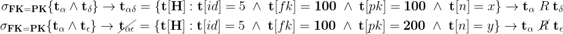
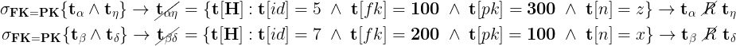
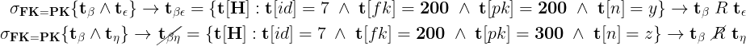
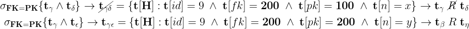
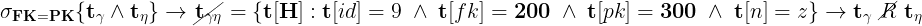

The non-positional representation of the `EQUI JOIN` table is given below:

In this picture the table on the left is the resulting relation of the `CROSS JOIN` operator between tables `B` and `A`. The condition specified in the `selection` operator is an equality comparison between the foreign and primary keys columns' values in the child and parent tables.

There are only three tuples satisfying the membership requirement condition of the `INNER JOIN` relation. In these tuples the values in the `fk` and `pk` columns are equal.

Since the `CROSS JOIN` table is a list of all possible combinations between rows in tables B and A, the projection of the `fk` and `pk` columns corresponds to the set of values in the foreign and primary columns of the child and parent tables. Consequently, the common values in those columns belong to the intersection of the set of values in the joining columns `fk` and `pk`.

In the case the joining columns are the foreign and primary keys, the set of values in the joining columns of the child table is a subset of the values in the joining column of the parent table. In general, the joining condition might involve any columns and, therefore, this property is not always satisfied. A basic Veen Diagram, indicated on the bottom of the picture, illustrates the set inclusion of these attributes.

Lastly, the `fk` and `pk` columns in the resulting table convey the same information and, therefore, a final table with a renamed column (`k`), replaces both columns in the last relation `C`. The projection of the `k` column confirms that the set of values in the `INNER JOIN` joining columns is basically the intersection of the set of values in the joining columns `fk` and `pk`. This trivial but important result is the basis for understanding the `Natural JOIN` and the other JOIN operators that will be introduced in the following lessons. 
