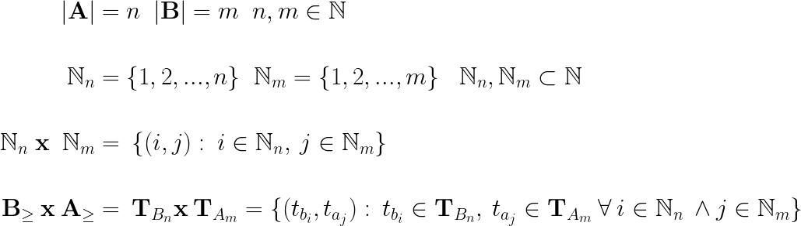
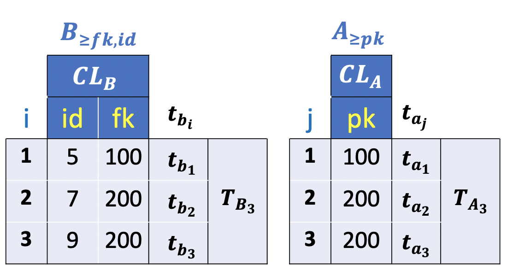
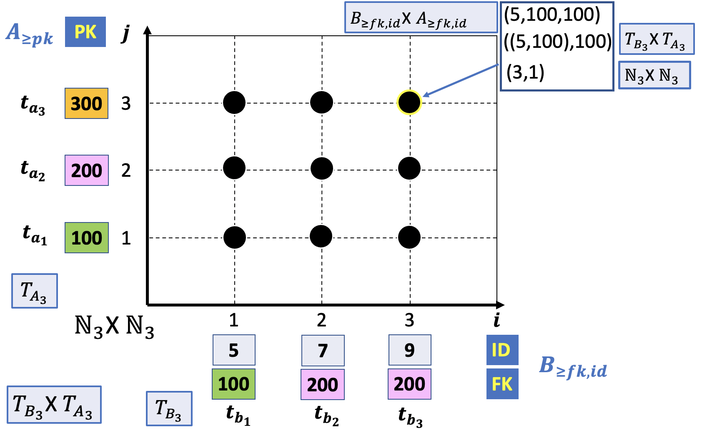

### Positional representation of a JOIN

The previous section determined a general sorting criterion to uniquely represent any instance table and overcome the ambiguity to interpret the result of an `INNER JOIN` between tables in a cartesian Plane.

The sorting criterion must respect an ascending order relation on the primary key values in the parent table and a foreign-primary keys combination in the child table.

The sorted table is a bijection between the Natural numbers and the values in the selected column keys that uniquely identifies each record in a table. The set of Natural numbers, `N`, is a total ordered set and, therefore, there is a correspondence between the Cartesian Product `N x N` and the `CROSS JOIN` operator.

Following the notation introduced in the previous section we define the `CROSS JOIN` operator as follow:



You may have noticed that an element in the Cartesian Product is a combination of the child and parent tables records, where the first and second elements are the rows in position `i` and `j`.

- `(i,j)`
- **i**: row in position i in the child table
- **j**: row in position j in the parent table

The resulting table in a `CROSS JOIN` is, however, a tuple of values and not a tuple of records. In a Relational database the columns order is not relevant and, therefore, the `CROSS JOIN` of two tables can be generalized to any columns permutation. For the sake of clarity and to be consistent in the visualization of the results, the columns in the parent and child tables will have the primary key in the first position whilst the foreign key is in the last position.

The simplicity of this notation is better illustrated with an example. For instance, the Cross Join of the tables illustrated in the picture below:



is represented in the Cartesian Plane below:



As a result, those values are implicitly mapped to the primary key values of the `A` table. This implicit mapping defines a **function**.

This implicit mapping was first mentioned in the previous [lesson](./07_inner_join.md) and classified in 4 different functions.

|Relationship|function|
|:----------:|:------:|
|One(and only one)| bijective, (injective and surjective)|
|Zero or One| injective|
|One or Many, Many| surjective|
|Zero or Many| Not injective and Not surjective|

The following picture illustrates the different categories. For a quick reference see the definitions in this [link](https://en.wikipedia.org/wiki/Bijection,_injection_and_surjection).


In the next section we discuss the 4 types of functions and illustrate the corresponding visual diagram of the `INNER JOIN` resulting tables.

At this point, you might be asking yourself:

- What is the number of rows in the resulting table of an `INNER JOIN`?

The answer is straightforward if one of the two tables has a **referential integrity constraint**. In this case the common columns, used to connect each pair of tables, are the **primary** and **foreign** columns of the parent and child table. The values in the foreign key column are drawn from the primary key column and, therefore, for each row in the child table there is one and only one matching row in the parent table. Consequently, the number of rows in the `INNER JOIN` is exactly equal to the number of** `NOT NULL`**values in the foreign key column of the child table**. It follows that the number of rows will correspond to the number of records in the child table if the foreign key column does not contain `NULL` values.

In the remaining sections of this lesson we discuss a number of examples to explain the various types of relationships in a Relational Database and illustrate the corresponding visual diagram to better understand how an `INNER JOIN` works; and more importantly why a relationship between tables is essential in a Database.

Lastly, we discuss the case an `INNER JOIN` is performed with not related tables.

## INNER JOIN RELATIONSHIPS

For the sake of clarity we remind the definition of function between two sets. This trivial introduction, (might be boring for somebody :smile:), is essential for understanding the relational model mapping.

A **function** between two sets is a **rule** that assigns to each member in the first set (called the *domain*) **ONE AND ONLY ONE** member in the second set (called the *range*). Intuitively, a function is an operation that takes an `INPUT` and produces an `OUTPUT` based on the input.

In relational algebra or Relational Database, the functions we are interested are functions that take primary key values in the child table as `INPUT`, and gives primary key values in the parent table as `OUTPUT`.

### (One and Only One) TO (Zero or Many): General function


An example of a simple function for the `INNER JOIN` between tables `B` (**INPUT**) and `A` (**OUTPUT**) illustrated in the picture above is given below.

- **f**: `B`**->**`A`

|INPUT|OUTPUT|
|:---:|:----:|
|5|100|
|7|200|
|9|200|


In this example, the domain of **f** is the set `B` **=** `{5, 7, 9}` and the range of **f** is the set `f(B)`**=** `{100,200}`. Moreover, for each value in set `B` there is **one and only one** value in set `A`. This function falls in the general case.

In order for an operator to be a valid function, each input must produces one and only one output. However, it is valid for a function to produce the same output with different inputs. Notice in the above example that **f** gives `200` as output for both the inputs `7` and `9` which still makes **f** a function. This result excludes the possibility of **f** to be an `injective` function. We also notice that **f** does not map any value in `B` to `300` in `A`. This excludes the possibility of **f** to be a `surjective` function. It follows that **f** falls in the general case.

On the other hand, the mapping between the primary key `A` and `B` is not a function.

- **r**: `A`**->**`B`

|INPUT|OUTPUT|
|:---:|:----:|
|100|5|
|200|7|
|200|9|
|300|NULL|


In this example, the input `200` has two outputs, `7` and `9`. We clearly see that this table defines a **Zero or Many** mapping.

Following the definition of table `B` given in the previous lesson:

**SQL**
```SQL
CREATE TABLE b (
  id SMALLINT PRIMARY KEY,
  c CHAR,
  fk SMALLINT NOT NULL
  CONSTRAINT b_fkey_a
     FOREIGN KEY (fk)
     REFERENCES A (pk)
     ON DELETE CASCADE
);
```

It's straightforward to tell the number of rows for the `INNER JOIN` operation. We notice that the `fk` column does not allow `NULL` values and therefore all the rows of `B` will be in the output.

|rows in A| NOT NULL rows in B| NULL rows in B| A -> B| B -> A| function| rows in Inner Join(A,B)|
|:-------:|:--------:|:-----:|:----:|:-----:|:-----:|:---:|
|n|m|0|Zero or Many|One and only One|general|m|

It follows that an `INNER JOIN` between the parent and child tables, `A` and `B`, returns a number of rows equal to the number of rows in the child table `B`.

The **Zero or Many** and **One and only One** mapping, indicated as `A->B` and `B->A` in the table above, define a `general` function. It follows that an `INNER JOIN` between the parent and child tables and a **One and only One** `To` **Zero or Many** relationship returns a number of rows equal to the number of rows in the child table `B`.

### (Zero Or One) TO (Zero or Many): General function

In this section we examine the case a child table `B` allows `NULL` values in the foreign key column.

**SQL**
```SQL
CREATE TABLE b (
  id SMALLINT PRIMARY KEY,
  c CHAR,
  fk SMALLINT
  CONSTRAINT b_fkey_a
     FOREIGN KEY (fk)
     REFERENCES A (pk)
     ON DELETE CASCADE
);
```


> In the picture the Row label for the second record in the table on the top left hand side is Row 1.

In this example the function for the `INNER JOIN` between tables `B` (**INPUT**) and `A` (**OUTPUT**) is given below.

- **f**: `B`**->**`A`

|INPUT|OUTPUT|
|:---:|:----:|
|5|100|
|7|100|
|9|NULL|


In this example, the domain of **f** is the set `B` **=** `{5, 7, 9}` and the range of **f** is the set `f(B)`**=** `{100,100,NULL}`.

What is `NULL` for a function?

The definition of `NULL` in a relational database is `undefined` or `missing` value. Similarly, in mathematics the notion of `NULL` is equivalent to `NAN`, standing for Not A Number. NAN is a **member** of a numeric data type that can be interpreted as a value that is undefined or to represent missing values in computations.

In this example, the value `9` in set `B` is assigned to `NULL`. The value `9` is, therefore, not assigned to anything. You could say that there is a **zero or one** mapping for the function f. We also notice that **f** gives `100` as output for both the inputs `5` and `7`. This result excludes the possibility of **f** to be an `injective` function. We also notice that **f** does not map any value in `B` to `200` and `300` in `A`. This excludes the possibility of **f** to be a `surjective` function. It follows that **f** falls in the general case.

Since the `NULL` value cannot be matched to any value, the number of matching rows is equal to the number of `NOT NULL` rows in the child table.

|rows in A| NOT NULL rows in B| NULL rows in B| A -> B| B -> A| function| rows in Inner Join(A,B)|
|:-------:|:--------:|:-----:|:----:|:-----:|:-----:|:---:|
|n|m|k|Zero or One|One and only One|general|m|

It follows that an `INNER JOIN` between the parent and child tables, `A` and `B`, returns a number of rows equal to the number of `NOT NULL` rows in the child table `B`.

The **Zero or Many** and **Zero or One** mapping, indicated as `A->B` and `B->A` in the table above, define a `general` function. It follows that an `INNER JOIN` between the parent and child tables and a **Zero or One** `To` **Zero or Many** relationship returns a number of rows equal to the number of `NOT NULL` rows in the child table `B`.

### (Zero or One) TO (Zero or One): Injective function

In this section we examine the case a child table `B` allows `NULL` values in the foreign key column and dose not allow duplicates.

**SQL**
```SQL
CREATE TABLE b (
  id SMALLINT PRIMARY KEY,
  c CHAR,
  fk SMALLINT UNIQUE
  CONSTRAINT b_fkey_a
     FOREIGN KEY (fk)
     REFERENCES A (pk)
     ON DELETE CASCADE
)
```


In this example the function for the `INNER JOIN` between tables `B` (**INPUT**) and `A` (**OUTPUT**) is given below.

- **f**: `B`**->**`A`

|INPUT|OUTPUT|
|:---:|:----:|
|5|100|
|7|200|
|9|NULL|

In this example, the value `9` in set `B` is assigned to `NULL`. The value `9` is, therefore, not assigned to anything. You could say that there is a **zero or one** mapping for the function f. We also notice that distinct values in `B` are mapped to distinct values in `A`. It follows that **f** is an `injective` function. We also notice that **f** does not map any value in `B` to `300` in `A`. This excludes the possibility of **f** to be a `surjective` function. It follows that **f** falls in the `injective` case.

|rows in A| NOT NULL rows in B| NULL rows in B| A -> B| B -> A| function| rows in Inner Join(A,B)|
|:-------:|:--------:|:-----:|:----:|:-----:|:-----:|:---:|
|n|m|k|Zero or One|Zero or One|injective|m|

## Relationship cardinality table


The analysis of the previous cases can be easily extended to the other relationships. The table below gives a summary of the `INNER JOIN` cardinality of two tables.

|rows in A| NOT NULL rows in B| NULL rows in B| A -> B| B -> A| function| rows in Inner Join(A,B)|
|:-------:|:--------:|:-----:|:----:|:-----:|:-----:|:---:|
|n|**m**|0|Zero or Many|One and only One|general|      **m**|
|n|**m**|k|Zero or Many|Zero or One|general|           **m**|
|n|**m**|0|Zero or One|One and only One|injective|     **m**|
|n|**m**|k|Zero or One|Zero or One|injective|          **m**|
|n|**m**|0|One and only One|One and only One|bijective|**m**=**n**|
|n|**m**|k|One and only One|Zero or One|injective|     **m**|
|n|**m**|0|One or Many|One and only One|surjective|    **m**|
|n|**m**|k|One or Many|Zero or One|general|            **m**|
|n|**m**|0|Many|One and only One|surjective|           **m**|
|n|**m**|k|Many|Zero or One|general|                   **m**|


The table above shows that the number of rows in an `INNER JOIN` based on the `primary-foreign key relationship` of tables in a Relational database, **is exactly equal to the number of** `NOT NULL` **values in the foreign key column in the child table**.


## Complete and Incomplete JOIN: No relationship tables

So far all the diagrams have assumed the existence of a primary and foreign keys. But that's not always the case. This section explains what happens when there is no correspondence between rows of the two tables.

Let us look at some different examples of join, in order to highlight some important points.

### Complete JOIN

In the previous section we proof that joining related tables returns a table with a number of rows **exactly equal to the number of** `NOT NULL`**values in the foreign key column of the child table**. Consequently, this number will correspond to the total number of rows in the child table if there is no `NULL` values in the foreign key column. This is true for all the surjective functions that map each record in the child table to one and only one record in the parent table. Consequently, All the rows in the parent table are matched with at least one row in the child table.


For instance, in the example illustrated in the picture above we can say that each of the tables contributes to at least one row of the result. In this case, the **JOIN** is said to be **Complete**. In the diagram illustrated above, each row in the `A` table have at least one matching row in the `B` table and similarly for rows in the `B` table. In this case, each row in the `B` table has **exactly one matching row** in the `A` table. The number of rows in the joining table is, therefore, equal to the number of rows in the `B` table. This property does not hold in general, because **it requires a correspondence between the rows of the two tables**. As discussed in the previous section, the `primary-foreign key` **mapping** `B` **->** `A` can be only of two types:

- `Zero or One`
- `One`

It follows that a **Complete** `JOIN` of two related tables will always return a number of rows equal to the number of records in the child table.

In the case table `B` **has more than one matching row**, the joining column is not a primary key in the `A` table and there is no mapping function `B`**->**`A`. In other words, there is no correspondence between the rows of the two tables.

In this scenario, we would like to answer the following two questions:

1. What is the `minimum` number of rows a complete `INNER JOIN` returns in the case there is no correspondence between the rows of the two tables?

2. What is the `maximum` number of rows a **Complete** `INNER JOIN` might have?

The answer to the first question is obvious. Since each row in both tables contributes to at least one row in the result, we expect the `INNER JOIN` to return a table with a number of rows `at least` equal to the maximum of the number of rows in the first and second table. In terms of a formal notation, the number of rows `p` is given by `p = max(|A|,|B|)`, where `|A|` and `|B|` are the number of rows (aka cardinalities) in the A and B tables, respectively.

The next question is:

What is the maximum number of rows a **Complete** `INNER JOIN` might have?


**SQL**
```SQL
SELECT n,
       fk as k,
       c
  FROM A INNER JOIN B
    ON A.ak = B.bk;
```


The example illustrated in the picture above shows the `INNER JOIN` of two tables, `A` and `B`. You may have noticed that the joining columns are indicated as `ak` and `bk` for tables `A` and `B`. This is to emphasize that those columns are not related to each other except for the same numeric data type required in the comparison clause of the `INNER JOIN`.

The important point of this example is that both tables have duplicate values in the joining columns (the number of `100` in this case). This is usually an `error` **because in neither table do the join columns uniquely identify an observation**. In order to understand how a JOIN works in the general case is useful to add a surrogate primary key for both tables, `A` and `B`, indicated as `idA` and `idB` in the columns of the diagram example.

For instance, the numbers `10` and `20` in the picture uniquely identify the first and second record of table `A`, while the numbers `5` and `7` are the identifiers of the first two records in table `B`.

When you join duplicate keys, each row of each table can be combine with all the rows of the other, as shown in the figure. In other word, you get all possible combinations. In this case, the result contains a number of rows equal to the product of the cardinalities of the tables and thus, `|A|x|B|` rows.

This is not a surprising result since the `INNER JOIN` table is a subset of the **Cartesian Product** or `CROSS JOIN` table. The diagram example should be already familiar to you since we discussed the `CROSS JOIN` operation in [lesson](./04_cross_join.md).

## Veen Diagram: An alternative representation  
