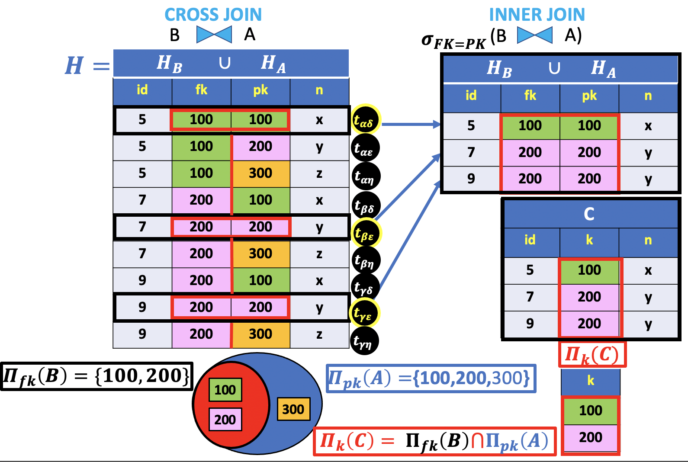
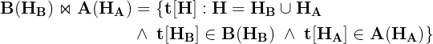
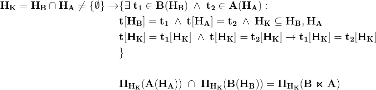
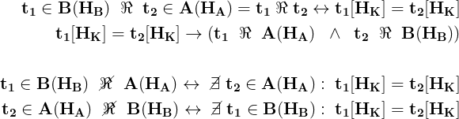
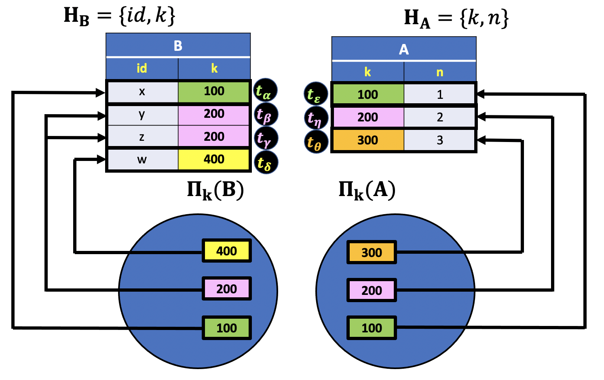
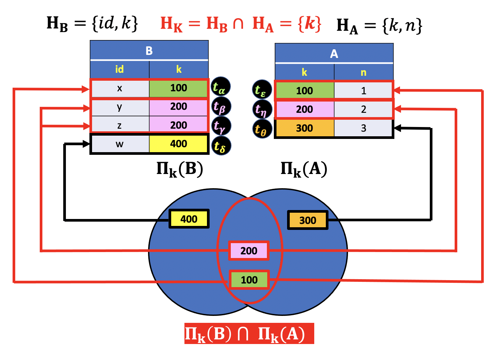
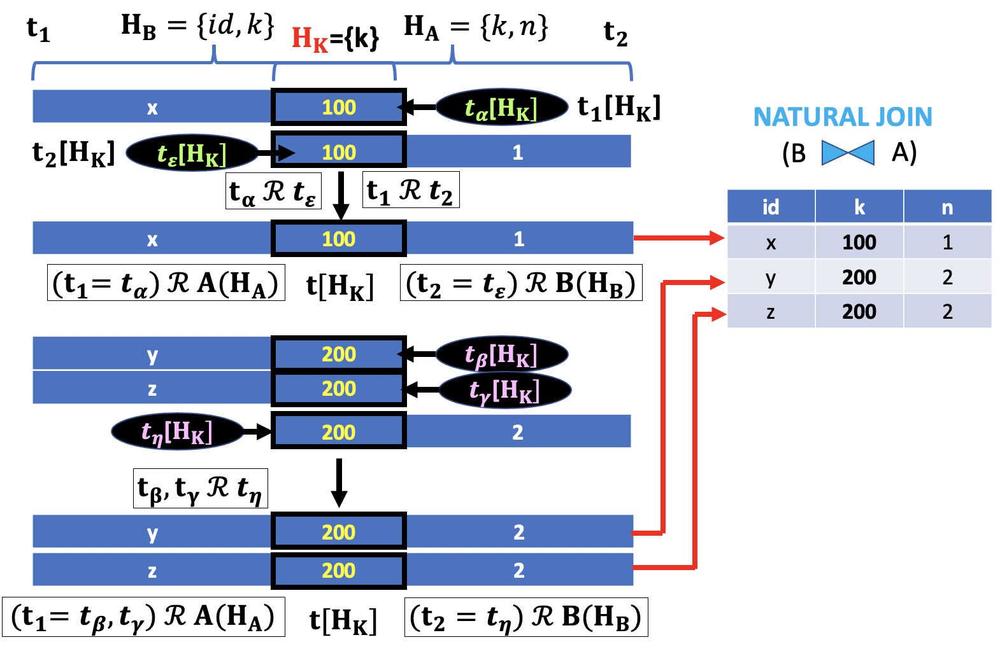
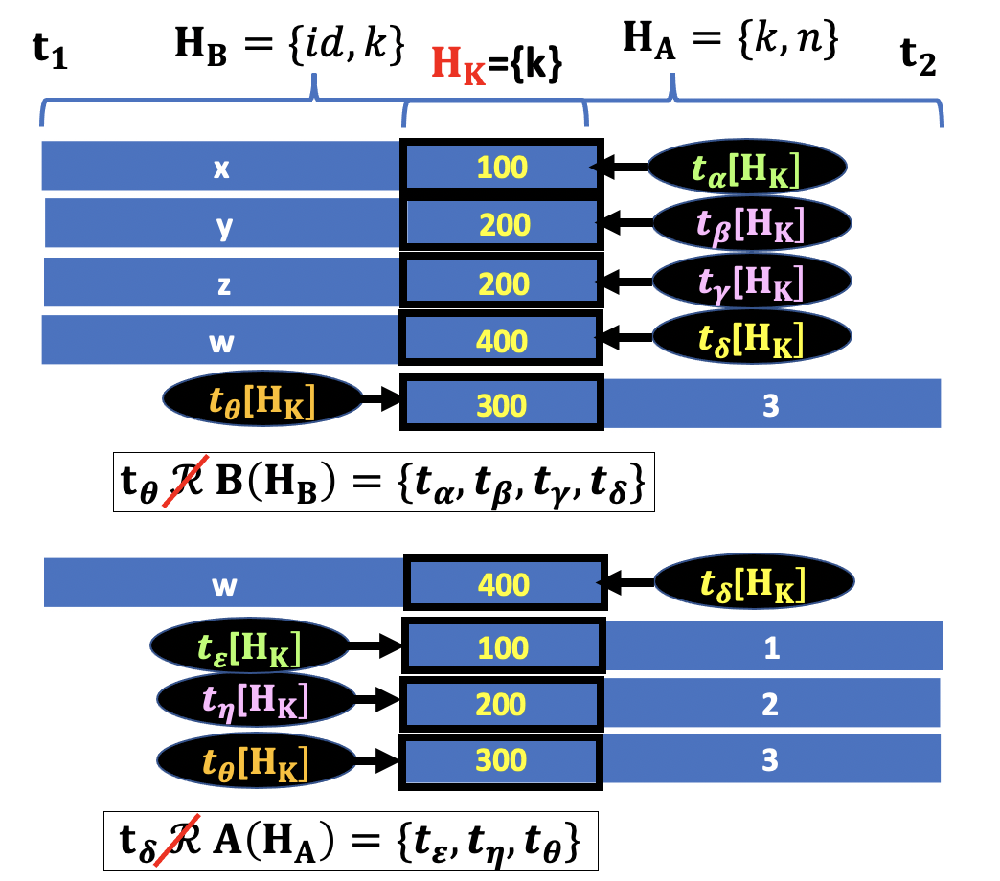

# Natural Join

In the previous lesson we introduced the `EQUI JOIN` or `INNER JOIN` operator as a way to link the records of two tables with common values on a set of attributes.

In the examples discussed so far, we assumed that the joining columns will have distinct names. The resulting table is, therefore, a new relation containing columns from both tables. More precisely, the number of columns in the `INNER JOIN` table is equal to the sum of the columns in the first and second tables.



For instance, in the example of the previous lesson, both tables have two columns with distinct names, `id`,`fk`,`pk` and `n`. Thus, the column heading in the `INNER JOIN` table will have four columns. The corresponding SQL query is:

**SQL**
```SQL
SELECT *
  FROM B INNER JOIN A
    ON B.fk = A.pk;   
```

We also notice that the joining columns convey the same information and, therefore, it's better to replace both columns with a single renamed column `k`, as follow:

**SQL**
```SQL
SELECT B.id, B.fk as k, A.n
  FROM B INNER JOIN A
    ON B.fk = A.pk;  
```

In some cases, however, the column names in the `INNER JOIN` clause could be identical. Let's say, the joining columns in tables `B` and `A` have a common identifier `k`. The SQL query does not change much except for the `ON` clause.

**SQL**
```SQL
SELECT B.id, B.k, A.n
  FROM B INNER JOIN A
    ON B.k = A.k;  
```

At this point you might be asking if database systems do take advantage of attributes names in order to combine relations.

In most recent versions of SQL, a new join operator has been introduced: The `NATURAL JOIN`.

The `NATURAL JOIN` is an operator that correlates data in different relations, **on the basis of equal values of attributes with the same name**.

The convenience of the `NATURAL JOIN` is that it does not require you to specify the JOIN clause because it uses an **implicit clause based on the common column**. For instance, the SQL query of the last example is as simple as this:

**SQL**
```SQL
SELECT *
FROM B
NATURAL JOIN A;
```

**OUTPUT**

|id|k|n|
|:-:|:-:|:-:|
|5|100|x|
|7|200|y|
|9|200|y|

The number of columns in the output table is reduced to the number of common attributes plus the non-common ones.

The attribute `k` contains the common values in both tables. In other words, those values correspond to the intersection of the set of values in the `k` column of tables `B` and `A`. Since the result of the `NATURAL JOIN` **is based on the values in columns with the same name**, the tuples that belong to the first and second relations must be necessarily only those containing values included in the **intersection of both tables**.

However we must be aware that a relation or table is not generically a set of tuples, but **a set of homogenous tuples**, that is, **tuples defined on the same attributes**. So, even if it were possible, in principle, to define these operators on any pair of relations, **there is no sense**, from the point of view of the relational model, in **defining them with reference to relations on different attributes**. Therefore, in relational algebra, we allow applications of `intersection` operator (or other set operators such as union and difference) **only to pairs of relations defined on the same attributes**.  

The existence of a common attribute in a `JOIN` between tables allows to define the `INNER JOIN` operator in a more `NATURAL` :smile: way, as follow:



The `NATURAL JOIN` of **B(H<sub>B</sub>)** and **A(H<sub>A</sub>)** is a relation defined on the column heading **H**. The column set **H** is the the union  of sets **H<sub>B</sub>** and **H<sub>A</sub>**, (set of columns in tables `B` and `A`).

The definition confirms that the tuples of the result are obtained by combining tuples of the operands with equal values on the common attributes.



In fact, assuming the two relations have columns with same name. If we indicate the common attributes as **H<sub>K</sub>**, then the intersection of column identifiers **H<sub>B</sub>** and **H<sub>A</sub>** is clearly a subset of both tables column headings. Consequently, the conditions **t[H<sub>B</sub>]=t<sub>1</sub>** and **t[H<sub>A</sub>]=t<sub>2</sub>**, where **t<sub>1</sub>** and **t<sub>2</sub>** are generic tuples in tables `B` and `A`, imply that a tuple's values on the common attributes of the `NATURAL JOIN` table,**t[H<sub>K</sub>]**, must be equal to the tuple's values on the same attributes of both tables `B` and `A`, **t[H<sub>K</sub>]=t<sub>1</sub>[H<sub>k</sub>]** and **t[H<sub>K</sub>]=t<sub>2</sub>[H<sub>k</sub>]**. It follows that **t<sub>1</sub>[H<sub>k</sub>]=t<sub>2</sub>[H<sub>k</sub>]**.

Hence, the tuples belonging to the first and second relations of the `NATURAL JOIN` operator must be necessarily only those containing values included in the intersection of the set of values in the **H<sub>k</sub>** columns of tables `B` and `A`.

On the other hand the set of tuples not included in the intersection and, therefore, excluded in the `INNER JOIN` table, are not related to any tuple of the other table. This simple consideration gives the definition of a `not related tuple` in an `INNER JOIN` as follow:



The definition of the `NATURAL JOIN` operator and the meaning of the `intersection` operation can be better understood with a simple example.



In this example the two relations `B` and `A` are represented as two sets containing the values in the column `K`, illustrated as Veen Diagram in the picture above.

More precisely, each set partitions the table in distinct groups of records according to the `K` column's value. For instance, the value `200` groups the second and third tuples in table `B`. Similarly, the value `200` forms a group of a single record in table `A`.

A naive set notation is given below:

```console
B_K = {400 -> ({id -> 'w'}),
       200 -> ({id -> 'y'},{id -> 'z'}),
       100 -> ({id -> 'x'})}

A_K = {300 -> ({n -> 3}),
       200 -> ({n -> 2}),
       100 -> ({n -> 1})}
```

The `B_K` and `A_K` sets have common values in the column `K` and, therefore, the intersection of these sets is not empty.



In the picture above, the number `100` (illustrated in the Veen Diagram intersection) binds the first records in both tables and the number `200` binds the second and third record in table `B` to the second record in table `A`. On the other hand, the values `400` and `300` do not belong to the intersection and, therefore, there is no linking between records of both tables.

A naive set notation is given below:

```console
K = B_K INTERSECTION A_K
K = { 100 -> ((t_alpha),(t_epsilon)),
      200 -> ((t_beta, t_gamma),(t_eta))}

B_K \ K = {400 -> (t_delta)}
A_K \ K = {300 -> (t_theta)}
```



The picture above shows the `Natural JOIN` operation applied to each tuple of both relations. The `INNER JOIN` tuple has only three columns because the common attribute `K` of the tuples operands appears only once in the result. If a tuple in a table matches any tuple in the other table, then `the tuple is in relation with a Table`. We can imagine the `INNER JOIN` operation as a `CROSS JOIN` between rows with the same value in the common attributes columns.



Lastly, the remaining tuples are isolated since they do not match any value in the column `K` of the tuples in the other table. It folows that `they are not in relation with a Table`.
