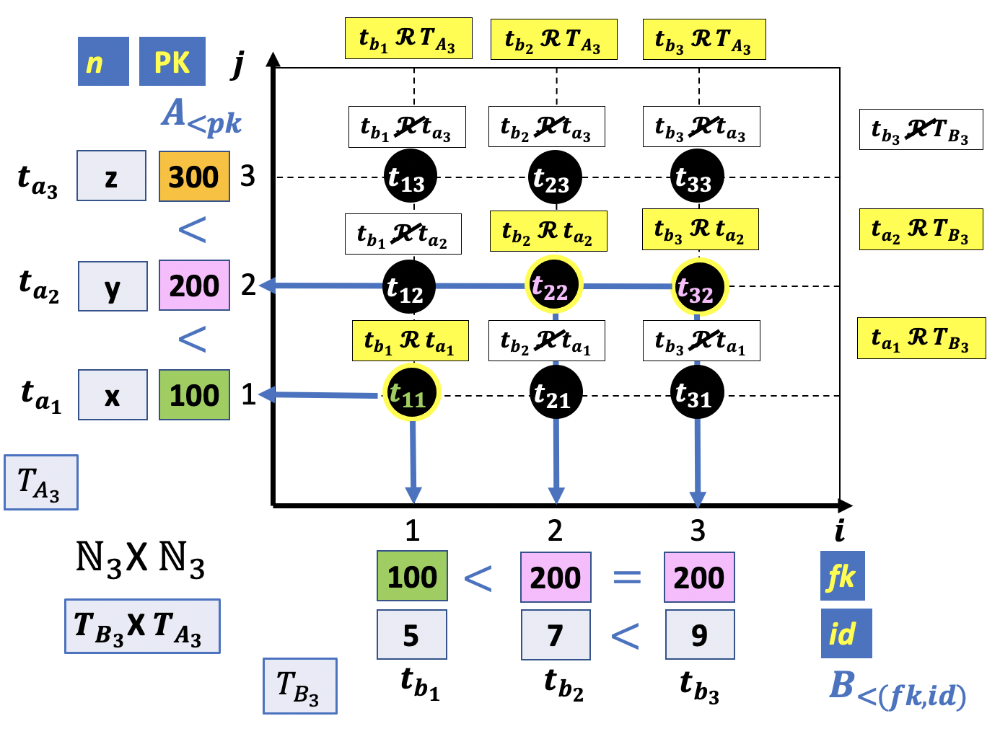
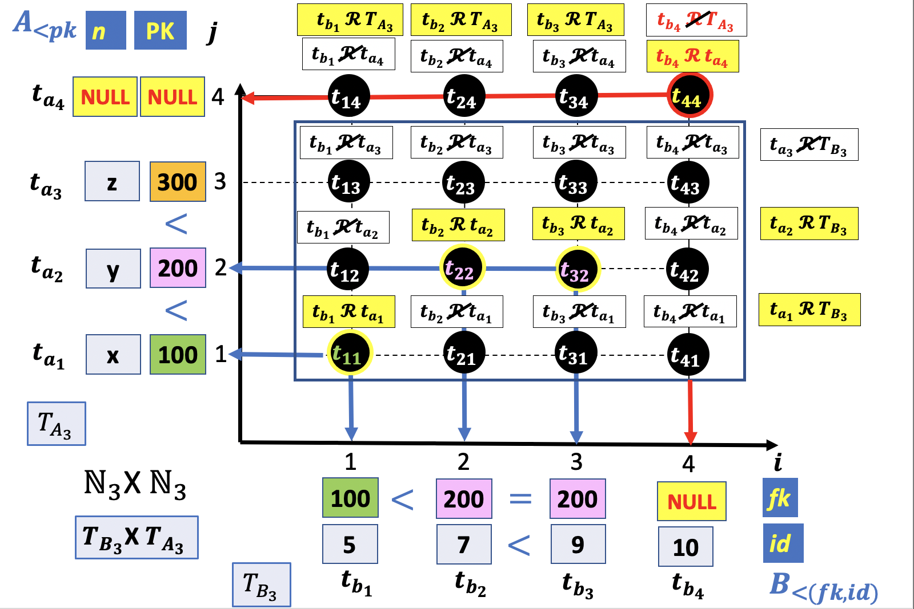
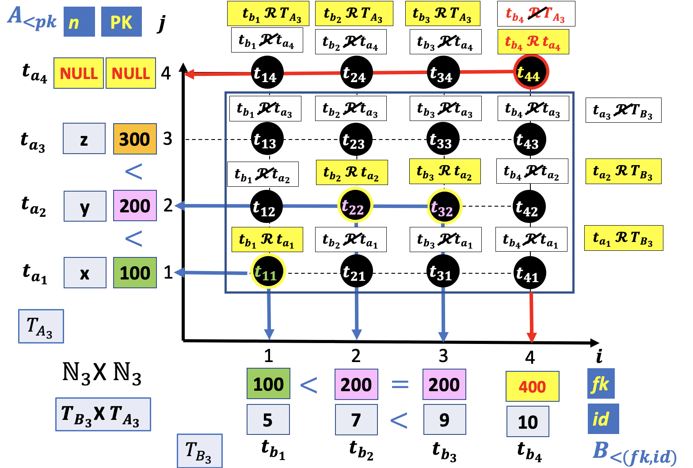
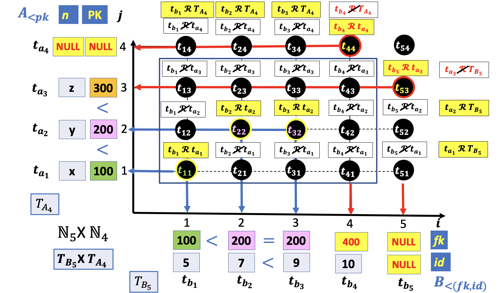

# Outer Join

In the previous lessons we represented the `INNER JOIN` between two tables, table `A` and `B`, as a mapping between a primary key value or row (in table `A`) to `zero`, `one` or `more` rows (in table `B`), depending on the foreign key value.



In this picture:

- `100`, (row number **1**) is mapped to `one` row in table `B` (row number **1**).
- `200`, (row number **2**) is mapped to `two` rows in table `B` (row **2** and **3**).
- `300`, (row number **3**) is mapped to `zero` rows in table `B`.

Lastly, assuming the foreign key column does not allow `NULL` values, the **referential integrity constraint** enforces each record in the child table to have a matching row in the parent table `A`. Consequently, the values of the columns will be in the results of the `INNER JOIN` table.

There are, therefore, three types of primary-foreign keys mapping:

| A-B Mapping| Meaning |
|:----------:|:-------:|
|`one`-TO-**zero**| A row in the parent table A does not have a matching row (`zero`) in the child table B|
|`one`-TO-**one**| A row in the parent table A has `one` matching row in the child table B|
|`one`-TO-**many**| A row in the parent table A has two or `more` matching rows in the child table B|

On the other hand, for each row in the child table there is `ONE AND ONLY ONE` matching row in the parent table. In other words, the correspondence between the rows in the child and parent table is `UNIQUE`. This special type of relation, where every input (row) has a unique output (row) is called a **function**. Thus, a vertical line in the cartesian plane crosses the `INNER JOIN` graph in a single point.

The `INNER JOIN` operator is a function only for tables that do not allow `NULL` values in the `foreign key` column. The rows with `NULL` values in the foreign key column do not have a matching row in the parent table. The fact that the `JOIN` operator `leaves out` the tuples of a relation that have no counterpart in the other operand is useful in some cases but inconvenient in others, given the possibility of omitting important information. For this purpose, a variant of the operator called `OUTER JOIN` was proposed. **This allows the possibility that all tuples contribute to the result**.

At this point you might be asking yourself:

- How do we extend the `INNER JOIN` or `NATURAL JOIN` to include unmatching rows in the resulting table?

In the `INNER` or `NATURAL JOIN` table the excluded rows are not matched to any row and, therefore, they are **not related to a table**. Thus, the unmatched rows in the child table are not combined to the parent table rows in the resulting relation.

The final relation must be a set of `homogeneous tuples` and, therefore, **the column heading must include the attributes of both tables**. Naturally, there must be a logical connection that establishes a relation between the columns' name in the parent and child tables. In the case a `tuple in the child table is not related to any tuples in the parent table`, the values in the parent table's attributes is `unknown` or `missing` and, therefore, does not belong to the column identifier's domain.

Consequently, we need to extend the set of tuples in the parent table to include  a `missing` or `unmatched` tuple. This `virtual` tuple always matches with not related tuples in the child table, and is filled with **NULL** values.

Graphically look s like this:



In this picture, Relation `A` has an additional `virtual` row filled with `NULL` values (**t<sub>a<sub>4</sub></sub>**) and Relation `B` has a `NULL` value in the `fk` column of the last row, (**t<sub>b<sub>4</sub></sub>**). There is, therefore, an augmented cartesian product in which the virtual tuple is combined with the tuples in Relation `B`, (**t<sub>14</sub>**,**t<sub>24</sub>**,**t<sub>34</sub>**,**t<sub>44</sub>**). This allows for the possibility that all the tuples in table `B` not related to table `A` contribute to the result of the `OUTER JOIN`. In this way, the `OUTER JOIN` relation of tables with primary and foreign keys joining columns is still a `function`. Each row in the child table contributes to the result of the `OUTER JOIN`.

The `OUTER JOIN` will contain all the related tuples and keep the unmatched tuples in relation `B`. In the picture above, tuples **t<sub>b<sub>1</sub></sub>**, **t<sub>b<sub>2</sub></sub>** and **t<sub>b<sub>3</sub></sub>** are matched with a row in table `A`. On the other hand, tuple **t<sub>b<sub>4</sub></sub>** is not related to any tuple in table `A` as indicated on the labels above the tuples **t<sub>41</sub>**,**t<sub>42</sub>**,**t<sub>43</sub>**. It follows that **t<sub>b<sub>4</sub></sub>** is the only unmatched row and, therefore, **t<sub>44</sub>** will be in the result of the `OUTER JOIN`.

The resulting `OUTER JOIN` table is:

|id|fk|pk|n|
|:-:|:-:|:-:|:-:|
|5|100|100|x|
|7|200|200|y|
|9|200|200|y|
|10|NULL|NULL|NULL|

To demonstrate how to reproduce the results of the last example, let's create the two Relations A and B.

```console
uniy=# CREATE TABLE b
uniy-#   (id SMALLINT, fk SMALLINT);
CREATE TABLE
uniy=# CREATE TABLE a
uniy-#   (pk SMALLINT, n CHAR);
CREATE TABLE
```

Let's insert the records in tables A and B.

```console
uniy=# INSERT INTO a
uniy-#        (pk,n)
uniy-# VALUES (100,'x'),
uniy-#        (200,'y'),
uniy-#        (300,'z'),
uniy-#        (NULL,NULL);
INSERT 0 4
uniy=# INSERT INTO b
uniy-#        (id, fk)
uniy-# VALUES (5,100),
uniy-#        (7,200),
uniy-#        (9,200),
uniy-#        (10,NULL);
INSERT 0 4
```

Relation `A` is given below:

```console
uniy=# \pset null NULL
Null display is "NULL".
uniy=# SELECT * FROM a;
  pk  |  n
------+------
  100 | x
  200 | y
  300 | z
 NULL | NULL
(4 rows)
```

Relation `B` is given below:

```console
uniy=# SELECT * FROM b;
 id |  fk
----+------
  5 |  100
  7 |  200
  9 |  200
 10 | NULL
(4 rows)
```

The `CROSS JOIN` of tables `B` and `A` is given below:

**SQL**
```SQL
SELECT *
  FROM b,a;
```

**Output**

```console
uniy=# SELECT *
uniy-# FROM b,a;
 id |  fk  |  pk  |  n
----+------+------+------
  5 |  100 |  100 | x
  5 |  100 |  200 | y
  5 |  100 |  300 | z
  5 |  100 | NULL | NULL
  7 |  200 |  100 | x
  7 |  200 |  200 | y
  7 |  200 |  300 | z
  7 |  200 | NULL | NULL
  9 |  200 |  100 | x
  9 |  200 |  200 | y
  9 |  200 |  300 | z
  9 |  200 | NULL | NULL
 10 | NULL |  100 | x
 10 | NULL |  200 | y
 10 | NULL |  300 | z
 10 | NULL | NULL | NULL
(16 rows)
```

In the `OUTER JOIN` we want to keep all the matching rows and the unmatched rows in table B.

|id |  fk  |  pk  |  n|
|:--:|:---:|:----:|:----:|
| **5** |  **100** |  **100** | **x**|
| 5 |  100 |  200 | y|
| 5 |  100 |  300 | z|
| 5 |  100 | NULL | NULL|
| 7 |  200 |  100 | x|
| **7** |  **200** |  **200** | **y**|
| 7 |  200 |  300 | z|
| 7 |  200 | NULL | NULL|
| 9 |  200 |  100 | x|
| **9** |  **200** |  **200** | **y**|
| 9 |  200 |  300 | z|
| 9 |  200 | NULL | NULL|
|10 | NULL |  100 | x|
|10 | NULL |  200 | y|
|10 | NULL |  300 | z|
|**10** | **NULL** | **NULL** | **NULL**|

**SQL**
```SQL
SELECT *
  FROM b,a
 WHERE b.fk = a.pk OR
       (b.fk IS NULL AND a.pk IS NULL AND a.n IS NULL);
```


```console
uniy=# SELECT *
uniy-#   FROM b,a
uniy-#  WHERE b.fk = a.pk OR (b.fk IS NULL AND a.pk IS NULL AND a.n IS NULL);
 id |  fk  |  pk  |  n
----+------+------+------
  5 |  100 |  100 | x
  7 |  200 |  200 | y
  9 |  200 |  200 | y
 10 | NULL | NULL | NULL
(4 rows)
```

## SQL LEFT OUTER JOIN

The `SQL` language provides the `LEFT JOIN` operator to return all the matching rows of the `INNER JOIN` and the unmatched rows of the left table as follow:

**SQL**
```SQL
SELECT *
  FROM b
  LEFT JOIN a ON b.fk = a.pk;
```

**Output**

```console
uniy=# SELECT *
uniy-#   FROM b
uniy-#   LEFT JOIN a ON b.fk = a.pk;
 id |  fk  |  pk  |  n
----+------+------+------
  5 |  100 |  100 | x
  7 |  200 |  200 | y
  9 |  200 |  200 | y
 10 | NULL | NULL | NULL
(4 rows)
```

In this example, we assumed that the unmatched rows in table `B` are only those with `NULL` values in the `fk` column. Consequently, the `WHERE` condition checks only the existence of rows with `NULL` values in the child table. This condition does not work anymore if the joining column in table `B` is not a foreign key and has a value not in common with the values in column `pk`.



In this picture the column `fk` in the last tuple of table `B` contains the value `400`. This value does not appear in the set of values of column `pk` and, therefore, it's not in the result of the `INNER JOIN` table.

```console
uniy=# DELETE FROM b WHERE fk IS NULL;
DELETE 1
uniy=# INSERT INTO b
uniy-#        (id,fk)
uniy-# VALUES (10,400);
INSERT 0 1
uniy=# SELECT * FROM b;
 id | fk
----+-----
  5 | 100
  7 | 200
  9 | 200
 10 | 400
(4 rows)
```

The `LEFT JOIN` operator returns all the tuples in the `INNER JOIN` and the unmatched tuples in the left table.

|id | fk  |  pk  |  n|
|:-:|:---:|:----:|:-:|
| 5 | 100 |  100 | x|
| 7 | 200 |  200 | y|
| 9 | 200 |  200 | y|
|10 | 400 | NULL | NULL|

**Output**

```console
uniy=# SELECT *
uniy-#   FROM b
uniy-#   LEFT JOIN a ON b.fk = a.pk;
 id | fk  |  pk  |  n
----+-----+------+------
  5 | 100 |  100 | x
  7 | 200 |  200 | y
  9 | 200 |  200 | y
 10 | 400 | NULL | NULL
(4 rows)
```

Is there an equivalent `SQL` query for this `LEFT JOIN` example?

The `LEFT JOIN` must include two sets:

- The set of rows included in the `INNER JOIN`
- The set of unmatched rows in table `B`

The solution should be the union of these two sets.

The inner join resulting table is:

**SQL**
```SQL
SELECT *
  FROM b,a
 WHERE b.fk = a.pk;
```

```console
uniy=# SELECT *
uniy-#   FROM b, a
uniy-#  WHERE b.fk = a.pk;
 id | fk  | pk  | n
----+-----+-----+---
  5 | 100 | 100 | x
  7 | 200 | 200 | y
  9 | 200 | 200 | y
(3 rows)
```

The set of unmatched row in table `B` is:

**SQL**
```SQL
SELECT *
  FROM b,a
 WHERE b.fk NOT IN (SELECT pk FROM a WHERE pk IS NOT NULL) AND
       a.pk IS NULL AND a.n IS NULL;    
```

```console
uniy=# SELECT *
uniy-#   FROM b,a
uniy-#  WHERE b.fk NOT IN (SELECT pk FROM a WHERE pk IS NOT NULL) AND
uniy-#        pk IS NULL AND n IS NULL;
 id | fk  |  pk  |  n
----+-----+------+------
 10 | 400 | NULL | NULL
(1 row)
```
This query check the existence of values in the `fk` column not in common with the set of values in the `pk` column of table `A`.

The union of the two conditions is:

**SQL**
```SQL
SELECT *
  FROM b,a
 WHERE b.fk = a.pk OR
       b.fk NOT IN (SELECT pk FROM a WHERE pk IS NOT NULL) AND
       a.pk IS NULL AND a.n IS NULL;
```

```console
uniy=# SELECT *
uniy-#   FROM b,a
uniy-#  WHERE b.fk = a.pk OR
uniy-#        b.fk NOT IN (SELECT pk FROM a WHERE pk IS NOT NULL) AND
uniy-#        a.pk IS NULL AND a.n IS NULL;
 id | fk  |  pk  |  n
----+-----+------+------
  5 | 100 |  100 | x
  7 | 200 |  200 | y
  9 | 200 |  200 | y
 10 | 400 | NULL | NULL
(4 rows)
```

This solution works fine but the query might be a long sequence of `AND` conditions in the case of joining columns with two or more attributes.

An equivalent solution is the use of the `NOT EXISTS` operator, (this operator is introduced later in the course). The `NOT EXISTS` allows us to test the non-existence of records returned by a subquery. A subquery preceded by `NOT EXISTS` will be true if the subquery returns no records.

Suppose, for example, that we wished to find the unmatched rows in table `B`.

**SQL**
```SQL
SELECT *
  FROM b
 WHERE NOT EXISTS (
   SELECT *
     FROM a
    WHERE a.pk = b.fk
 );
```

**Results**

|id | fk|
|:-:|:-:|
|10 | 400|


**Output**

```console
uniy=# SELECT * FROM b WHERE NOT EXISTS (SELECT * FROM a WHERE a.pk = b.fk);
 id | fk
----+-----
 10 | 400
(1 row)
```


If we extend the result to the `CROSS PRODUCT`, the resulting relation is a combination of the unmatched row with all the tuples in table `A`:


**SQL**
```SQL
SELECT *
  FROM b,a
 WHERE NOT EXISTS (
   SELECT *
     FROM a
    WHERE a.pk = b.fk
 );
```

**Results**

|id | fk  |  pk  |  n|
|:--:|:---:|:----:|:----:|
|10 | 400 |  100 | x|
|10 | 400 |  200 | y|
|10 | 400 |  300 | z|
|**10** | **400** | `NULL` | `NULL`|


**Results**

```console
uniy=# SELECT *
uniy-#   FROM b,a
uniy-#  WHERE NOT EXISTS
uniy-#     (SELECT *
uniy(#        FROM a
uniy(#       WHERE a.pk = b.fk);
 id | fk  |  pk  |  n
----+-----+------+------
 10 | 400 |  100 | x
 10 | 400 |  200 | y
 10 | 400 |  300 | z
 10 | 400 | NULL | NULL
(4 rows)
```

This table confirms that tuple (`10`,`400`) does not match with any rows in table `A` and, therefore, must be combined with the `virtual` tuple, (`NULL`,`NULL`), in the `OUTER JOIN` relation.

**Results**

```console
uniy=# SELECT *
uniy-#   FROM b,a
uniy-#  WHERE NOT EXISTS
uniy-#     (SELECT *
uniy(#        FROM a
uniy(#       WHERE a.pk = b.fk) AND
uniy-#      a.pk IS NULL AND
uniy-#      a.n IS NULL;
 id | fk  |  pk  |  n
----+-----+------+------
 10 | 400 | NULL | NULL
(1 row)
```

Finally, we can combine the two sets into a single query:

**SQL**
```SQL
SELECT *
  FROM b,a
 WHERE b.fk = a.pk OR
       NOT EXISTS (SELECT * FROM a WHERE a.pk = b.fk) AND
       pk IS NULL AND n IS NULL;
```

**Output**

```console
uniy=# SELECT *
uniy-#   FROM b,a
uniy-#  WHERE b.fk = a.pk OR
uniy-#        NOT EXISTS (SELECT * FROM a WHERE a.pk = b.fk) AND
uniy-#        pk IS NULL AND n IS NULL;
 id | fk  |  pk  |  n
----+-----+------+------
  5 | 100 |  100 | x
  7 | 200 |  200 | y
  9 | 200 |  200 | y
 10 | 400 | NULL | NULL
(4 rows)
```

## SQL RIGHT OUTER JOIN

The most commonly used `OUTER JOIN` is the `LEFT JOIN`; you use this whenever you look up additional data from another table, because it preserves the original rows even when there isn't a match. There are, however, other variants of the `JOIN` operators:

- The **RIGHT OUTER JOIN**: which extends tuples of the second operand;
- The **FULL OUTER JOIN**: which extends all tuples.

For instance, the `LEFT JOIN` query of the last example.

**SQL**
```SQL
SELECT *
  FROM b
  LEFT JOIN a ON b.fk = a.pk;
```

**Output**

```console
uniy=# SELECT *
uniy-#   FROM b
uniy-#   LEFT JOIN a ON a.pk = b.fk;
 id | fk  |  pk  |  n
----+-----+------+------
  5 | 100 |  100 | x
  7 | 200 |  200 | y
  9 | 200 |  200 | y
 10 | 400 | NULL | NULL
(4 rows)
```

It's equivalent to the following `RIGHT JOIN` query.

**SQL**
```SQL
SELECT *
  FROM a
 RIGHT JOIN b ON a.pk = b.fk;
```

**Output**

```console
uniy=# SELECT *
uniy-#   FROM a
uniy-#  RIGHT JOIN b ON a.pk = b.fk;
  pk  |  n   | id | fk
------+------+----+-----
  100 | x    |  5 | 100
  200 | y    |  7 | 200
  200 | y    |  9 | 200
 NULL | NULL | 10 | 400
(4 rows)
```

The difference is only in the columns order but the result is clearly identical to the `LEFT JOIN` table.

## SQL FULL OUTER JOIN

In this section we introduce the last `OUTER JOIN` operator: `FULL OUTER JOIN`.



In this picture, both tables have an additional `virtual` row filled with `NULL` values. The `FULL OUTER JOIN` combines the results of both left join and right join.

If the rows in the joined table do not match, the full outer join sets NULL values for every column of the table that does not have the matching row.

If a row from one table matches a row in another table, the result row will contain columns populated from columns of rows from both tables.

**SQL**

```SQL
SELECT *
  FROM b,a
 WHERE b.fk = a.pk OR (
       NOT EXISTS (SELECT * FROM a WHERE a.pk = b.fk) AND
       pk IS NULL AND n IS NULL) OR (
       NOT EXISTS (SELECT * FROM b WHERE a.pk = b.fk) AND
       id IS NULL AND fk IS NULL);
```

**Results**

|id  |  fk  |  pk  |  n|
|:--:|:----:|:----:|:----:|
|  5 |  100 |  100 | x|
|  7 |  200 |  200 | y|
|  9 |  200 |  200 | y|
| 10 |  400 | NULL | NULL|
|NULL | NULL |  300 | z|
|NULL | NULL | NULL | NULL|


```console
uniy=# SELECT *
uniy-#   FROM b,a
uniy-#  WHERE b.fk = a.pk OR (
uniy(#        NOT EXISTS (SELECT * FROM a WHERE a.pk = b.fk) AND
uniy(#        pk IS NULL AND n IS NULL) OR (
uniy(#        NOT EXISTS (SELECT * FROM b WHERE a.pk = b.fk) AND
uniy(#        id IS NULL AND fk IS NULL);
  id  |  fk  |  pk  |  n
------+------+------+------
    5 |  100 |  100 | x
    7 |  200 |  200 | y
    9 |  200 |  200 | y
   10 |  400 | NULL | NULL
 NULL | NULL |  300 | z
 NULL | NULL | NULL | NULL
(6 rows)
```

If we assume that the `id` and `pk` columns are the primary keys of tables `B` and `A`, then the following query gets rid off the `NULL` row in the result.

**SQL**
```SQL
SELECT *
  FROM b,a
 WHERE b.fk = a.pk OR (
       NOT EXISTS (SELECT * FROM a WHERE a.pk = b.fk) AND
       id IS NOT NULL AND pk IS NULL AND n IS NULL) OR (
       NOT EXISTS (SELECT * FROM b WHERE a.pk = b.fk) AND
       pk IS NOT NULL AND id IS NULL AND fk IS NULL);
```

**Results**

|id  |  fk  |  pk  |  n|
|:---:|:----:|:----:|:----:|
|  5 |  100 |  100 | x|
|  7 |  200 |  200 | y|
|  9 |  200 |  200 | y|
| 10 |  400 | NULL | NULL|
|NULL | NULL |  300 | z|


```console
uniy=# SELECT *
uniy-#   FROM b,a
uniy-#  WHERE b.fk = a.pk OR (
uniy(#        NOT EXISTS (SELECT * FROM a WHERE a.pk = b.fk) AND
uniy(#        id IS NOT NULL AND pk IS NULL AND n IS NULL) OR (
uniy(#        NOT EXISTS (SELECT * FROM b WHERE a.pk = b.fk) AND
uniy(#        pk IS NOT NULL AND id IS NULL AND fk IS NULL);
  id  |  fk  |  pk  |  n
------+------+------+------
    5 |  100 |  100 | x
    7 |  200 |  200 | y
    9 |  200 |  200 | y
   10 |  400 | NULL | NULL
 NULL | NULL |  300 | z
(5 rows)
```

Similarly, the `UNION` of the `LEFT` and `RIGHT` join should return the same result.

**SQL**
```SQL
SELECT b.id, b.fk, a.pk, a.n
  FROM b
  LEFT JOIN a ON a.pk = b.fk
UNION
SELECT b.id, b.fk, a.pk, a.n
  FROM b
  RIGHT JOIN a ON a.pk = b.fk
ORDER BY id, fk, pk;
```

**Results**

|id  |  fk  |  pk  |  n|
|---:|:----:|:----:|:----:|
|  5 |  100 |  100 | x|
|  7 |  200 |  200 | y|
|  9 |  200 |  200 | y|
| 10 |  400 | NULL | NULL|
|NULL | NULL |  300 | z|
|NULL | NULL | NULL | NULL|


**Output**

```console
uniy=# SELECT b.id, b.fk, a.pk, a.n
uniy-#   FROM b
uniy-#   LEFT JOIN a ON a.pk = b.fk
uniy-# UNION
uniy-# SELECT b.id, b.fk, a.pk, a.n
uniy-#   FROM b
uniy-#   RIGHT JOIN a ON a.pk = b.fk
uniy-# ORDER BY id, fk, pk;
  id  |  fk  |  pk  |  n
------+------+------+------
    5 |  100 |  100 | x
    7 |  200 |  200 | y
    9 |  200 |  200 | y
   10 |  400 | NULL | NULL
 NULL | NULL |  300 | z
 NULL | NULL | NULL | NULL
(6 rows)
```

There is still the `NULL` values row in the result. The use of the `JOIN` operator is limited to return the Relation with no possibility to filter the result.

```console
uniy=# SELECT *
uniy-#   FROM b
uniy-#   LEFT JOIN a ON a.pk = b.fk
uniy-#   AND id IS NOT NULL;
  id  |  fk  |  pk  |  n
------+------+------+------
    5 |  100 |  100 | x
    7 |  200 |  200 | y
    9 |  200 |  200 | y
   10 |  400 | NULL | NULL
 NULL | NULL | NULL | NULL
(5 rows)
```

Lastly, the use of the `FULL JOIN` should return the same result. Let's give a try:

**SQL**
```SQL
SELECT *
  FROM b
  FULL JOIN a ON a.pk = b.fk
  ORDER BY id,fk,pk;
```

|id  |  fk  |  pk  |  n|
|:---:|:----:|:----:|:--:|
|  5 |  100 |  100 | x|
|  7 |  200 |  200 | y|
|  9 |  200 |  200 | y|
| 10 |  400 | NULL | NULL|
|NULL | NULL |  300 | z|
|NULL | NULL | NULL | NULL|
|NULL | NULL | NULL | NULL|

It's weird!! It does not return a Relation, there are duplicates in the result. Maybe there is a bug in the `FULL JOIN` operator ?

```console
uniy=# SELECT *
uniy-#   FROM b
uniy-#   FULL JOIN a ON a.pk = b.fk
uniy-#   ORDER BY id,fk,pk;
  id  |  fk  |  pk  |  n
------+------+------+------
    5 |  100 |  100 | x
    7 |  200 |  200 | y
    9 |  200 |  200 | y
   10 |  400 | NULL | NULL
 NULL | NULL |  300 | z
 NULL | NULL | NULL | NULL
 NULL | NULL | NULL | NULL
(7 rows)
```

We can try the following:

**SQL**
```SQL
SELECT DISTINCT *
  FROM b
  FULL JOIN a ON a.pk = b.fk
  ORDER BY id,fk,pk;
```

|id  |  fk  |  pk  |  n|
|:---:|:----:|:----:|:--:|
|  5 |  100 |  100 | x|
|  7 |  200 |  200 | y|
|  9 |  200 |  200 | y|
| 10 |  400 | NULL | NULL|
|NULL | NULL |  300 | z|
|NULL | NULL | NULL | NULL|


```console
uniy=# SELECT DISTINCT *
uniy-#   FROM b
uniy-#   FULL JOIN a ON a.pk = b.fk
uniy-#   ORDER BY id, fk, pk;
  id  |  fk  |  pk  |  n
------+------+------+------
    5 |  100 |  100 | x
    7 |  200 |  200 | y
    9 |  200 |  200 | y
   10 |  400 | NULL | NULL
 NULL | NULL |  300 | z
 NULL | NULL | NULL | NULL
```
