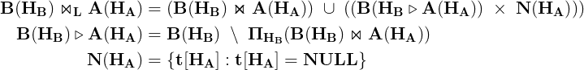

# OUTER JOIN

In the previous lesson we introduced the `OUTER JOIN` operator as a subset Relation of the Cartesian Product between tables extended with a `virtual` tuple of `NULL` values.

The extension to `NULL` values in both tables is only for teaching purposes and to visualize the `OUTER JOIN` in the Cartesian Plane. In real databases, however, the existence of `NULL` values in the primary key columns is not allowed. This is not a big deal, since it's always possible to define the `OUTER JOIN` Relation in terms of the `NATURAL JOIN` or `INNER JOIN` using set and projection operators.

In the following sections, we propose a simple implementation of the `OUTER JOIN` operator using the `INNER JOIN`, `SEMI-JOIN`, `CROSS JOIN` and set operators. Next, we give a formal definition of the `OUTER JOIN` using a non-positional notation. Lastly, we illustrate the `Veen Diagram` representation of the `OUTER JOIN` with a simple example.

## OUTER JOIN SET DEFINITION


In the picture above, the tuples inside the blue rectangle in the Cartesian Plane belong to the `CROSS JOIN` of tables B and A defined as follow:


**Table B**

|id | fk|
|:-:|:--:|
| 5 | 100|
| 7 | 200|
| 9 | 200|
|10 | 400|


**Table A**

| pk  | n|
|:---:|:--:|
| 100 | x|
| 200 | y|
| 300 | z|

The creation of these tables in `PostgreSQL` is given below:

```console
uniy=# CREATE TABLE a
uniy-#   (pk SMALLINT PRIMARY KEY, n CHAR);
CREATE TABLE
uniy=# CREATE TABLE b
uniy-#   (id SMALLINT PRIMARY KEY, fk SMALLINT);
CREATE TABLE
uniy=# INSERT INTO a
uniy-#        (pk,n)
uniy-# VALUES (100,'x'),
uniy-#        (200,'y'),
uniy-#        (300,'z');
INSERT 0 3
uniy=# INSERT INTO b
uniy-#        (id, fk)
uniy-# VALUES (5,100),
uniy-#        (7,200),
uniy-#        (9,200);
uniy-#        (10,400);
INSERT 0 3
```

In the tables definition the `pk` and `id` columns are the primary keys of tables `A` and `B`, respectively. It follows that `NULL` values are forbidden in those columns. Moreover, there is no referential integrity constraint between tables.

Assuming that the joining columns are `pk` and `fk`, the `LEFT JOIN` table is given below:

**SQL**
```SQL
SELECT *
  FROM b
  LEFT JOIN a ON b.fk = a.pk;
```

**LEFT JOIN**

|id | fk  |  pk  |  n|
|:--:|:---:|:----:|:----:|
| 5 | 100 |  100 | x|
| 7 | 200 |  200 | y|
| 9 | 200 |  200 | y|
|10 | 400 | NULL | NULL|


```console
uniy=# SELECT *
uniy-#   FROM b
uniy-#   LEFT JOIN a ON b.fk = a.pk;
 id | fk  |  pk  |  n
----+-----+------+------
  5 | 100 |  100 | x
  7 | 200 |  200 | y
  9 | 200 |  200 | y
 10 | 400 | NULL | NULL
(4 rows)
```

The `LEFT` outer join sets NULL values for every column of table `A` that does not have the matching row.

Is there an equivalent `QUERY` that returns the `LEFT JOIN` relation?

The `LEFT JOIN` must include two sets:

1. The set of rows included in the `INNER JOIN`
2. The set of unmatched rows in table `B`

The first set or relation is the `INNER JOIN` table.

**SQL**

```SQL
SELECT *
  FROM b
  INNER JOIN a ON b.fk = a.pk;
```


|id | fk  | pk  | n|
|:--:|:---:|:--:|:--:|
| 5 | 100 | 100 | x|
| 7 | 200 | 200 | y|
| 9 | 200 | 200 | y|


```console
uniy=# SELECT *
uniy-#   FROM b
uniy-#   INNER JOIN a ON b.fk = a.pk;
 id | fk  | pk  | n
----+-----+-----+---
  5 | 100 | 100 | x
  7 | 200 | 200 | y
  9 | 200 | 200 | y
(3 rows)
```

The set of unmatched rows in table `B` is the set of rows excluded in the `INNER JOIN` table.

**Table B**

|id | fk|
|:-:|:--:|
| 5 | 100|
| 7 | 200|
| 9 | 200|
|**10** | **400**|

It's, therefore, the set difference between the rows in Relation B and `INNER JOIN` table. The set `difference` must be defined on a set of **homogeneous** tuples in the operands.

**SQL**

```SQL
SELECT b.*
  FROM b
  INNER JOIN a ON b.fk = a.pk;
```

If we take the `INNER JOIN` Relation and make a selection of the columns that belong to the `LEFT` table `B`, the resulting table, also known as **semi-join**, will be a Relation defined on the same attributes as Relation `B`.

**Left semi-join**

|id | fk|
|:--:|:--:|
| 5 | 100|
| 7 | 200|
| 9 | 200|


```console
uniy=# SELECT b.*
uniy-#   FROM b
uniy-#   INNER JOIN a ON b.fk = a.pk;
 id | fk
----+-----
  5 | 100
  7 | 200
  9 | 200
(3 rows)
```

Next, we must return all the unmatched rows as the set `difference` between relation `B` and the **semi-join** resulting table.

**SQL**
```SQL
SELECT *
  FROM b
EXCEPT
SELECT b.*
  FROM b
  INNER JOIN a ON b.fk = a.pk;
```

In `PostgreSQL`, the `EXCEPT` operator implements the difference between two homogeneous Relations.

**unmatched rows in Left table**

|id | fk|
|:-:|:--:|
|10 | 400|

The **unmatched rows table** is also known as **Anti-Join** table.

```console
uniy=# SELECT *
uniy-#   FROM b
uniy-# EXCEPT
uniy-# SELECT b.*
uniy-#   FROM b
uniy-#   INNER JOIN a ON b.fk = a.pk;
 id | fk
----+-----
 10 | 400
(1 row)
```

Lastly, the unmatched rows in the Left table `B` must be combined with the `virtual` row defined on the attributes of relation `A`. In this case, the `virtual` row is a `virtual Relation`, **a_null**, with a single row filled with `NULL` values.

**a_null**

|pk  |  n|
|:--:|:--:|
|NULL | NULL|


```console
uniy=# CREATE TABLE a_null
uniy-#        (pk SMALLINT, n CHAR);
CREATE TABLE
uniy=# INSERT INTO a_null
uniy-#        (pk,n)
uniy-# VALUES (NULL,NULL);
INSERT 0 1
```

The `CROSS JOIN` between the **semi-join** and **a_null** tables is given below:

**SQL**
```SQL
WITH b_nomatch AS (
     SELECT *
       FROM b
     EXCEPT
     SELECT b.*
       FROM b
      INNER JOIN a ON b.fk = a.pk
)
SELECT *
  FROM b_nomatch, a_null;
```

In this example, we used a `COMMON TABLE EXPRESSION` to make the SQL query more readable.

|id | fk  |  pk  |  n|
|:--:|:--:|:----:|:------:|
|10 | 400 | NULL | NULL|


```console
uniy=# WITH b_nomatch AS (
uniy(#      SELECT *
uniy(#        FROM b
uniy(#      EXCEPT
uniy(#      SELECT b.*
uniy(#        FROM b
uniy(#       INNER JOIN a ON b.fk = a.pk
uniy(# )
uniy-#
uniy-# SELECT *
uniy-#   FROM b_nomatch, a_null;
 id | fk  |  pk  |  n
----+-----+------+------
 10 | 400 | NULL | NULL
(1 row)
```

The Final step is to include the `INNER JOIN` rows in the result using the `UNION` operator.

### LEFT OUTER JOIN

**SQL**
```SQL
WITH b_nomatch AS (
     SELECT *
       FROM b
     EXCEPT
     SELECT b.*
       FROM b
      INNER JOIN a ON b.fk = a.pk
)
SELECT *
  FROM b
 INNER JOIN a ON b.fk = a.pk
UNION
SELECT *
  FROM b_nomatch, a_null;
```

**Results**

|id | fk  |  pk  |  n|
|:--:|:---:|:----:|:------:|
| 5 | 100 |  100 | x|
| 7 | 200 |  200 | y|
| 9 | 200 |  200 | y|
|10 | 400 | NULL | NULL|


**Output**

```console
uniy=# WITH b_nomatch AS (
uniy(#      SELECT *
uniy(#        FROM b
uniy(#      EXCEPT
uniy(#      SELECT b.*
uniy(#        FROM b
uniy(#       INNER JOIN a ON b.fk = a.pk
uniy(# )
uniy-#
uniy-# SELECT *
uniy-#   FROM b
uniy-#  INNER JOIN a ON b.fk = a.pk
uniy-# UNION
uniy-# SELECT *
uniy-#   FROM b_nomatch, a_null;
 id | fk  |  pk  |  n
----+-----+------+------
  5 | 100 |  100 | x
  7 | 200 |  200 | y
  9 | 200 |  200 | y
 10 | 400 | NULL | NULL
(4 rows)
```
The definition of the `LEFT JOIN` is given below:



This definition can be easily extended to the other `OUTER JOIN` operators.


### RIGHT OUTER JOIN

Let's turn our attention on the other `OUTER JOIN`: the **RIGHT JOIN**.

**SQL**
```SQL
SELECT *
 FROM b
 RIGHT JOIN a ON a.pk = b.fk;
```

**Results**

|id  |  fk  | pk  | n|
|:----:|:----:|:---:|:---:|
|  5 |  100 | 100 | x|
|  7 |  200 | 200 | y|
|  9 |  200 | 200 | y|
|NULL | NULL | 300 | z|

The resulting Table includes the `unmatched rows` in table `A`, as indicated by the last row in the table above.

**Output**

```console
uniy=# SELECT *
uniy-#  FROM b
uniy-#  RIGHT JOIN a ON a.pk = b.fk;
  id  |  fk  | pk  | n
------+------+-----+---
    5 |  100 | 100 | x
    7 |  200 | 200 | y
    9 |  200 | 200 | y
 NULL | NULL | 300 | z
(4 rows)
```

The implementation of the `RIGHT JOIN` follows the same steps of the `LEFT JOIN`. As we did in the previous section, we create a `virtual` table for the left table `B` to execute the right outer join of table `A`.

```console
uniy=# CREATE TABLE b_null
uniy-#        (id SMALLINT, fk SMALLINT);
CREATE TABLE
uniy=# INSERT INTO b_null
uniy-#        (id,fk)
uniy-# VALUES (NULL,NULL);
INSERT 0 1
```

The `RIGHT OUTER JOIN` query is given below:

```SQL
WITH a_nomatch AS (
     SELECT *
       FROM a
     EXCEPT
     SELECT a.*
       FROM b
      INNER JOIN a ON b.fk = a.pk
)
SELECT *
  FROM b
 INNER JOIN a ON b.fk = a.pk
UNION
SELECT *
  FROM b_null, a_nomatch;
```

**Results**

|id  |  fk  | pk  | n|
|:---:|:---:|:---:|:---:|
|  5 |  100 | 100 | x|
|  7 |  200 | 200 | y|
|  9 |  200 | 200 | y|
|NULL | NULL | 300 | z|


**Output**

```console
uniy=# WITH a_nomatch AS (
uniy(#      SELECT *
uniy(#        FROM a
uniy(#      EXCEPT
uniy(#      SELECT a.*
uniy(#        FROM b
uniy(#       INNER JOIN a ON b.fk = a.pk
uniy(# )
uniy-#
uniy-# SELECT *
uniy-#   FROM b
uniy-#  INNER JOIN a ON b.fk = a.pk
uniy-# UNION
uniy-# SELECT *
uniy-#   FROM b_null, a_nomatch;
  id  |  fk  | pk  | n
------+------+-----+---
    5 |  100 | 100 | x
    7 |  200 | 200 | y
    9 |  200 | 200 | y
 NULL | NULL | 300 | z
(4 rows)
```

### FULL OUTER JOIN

We conclude this lesson with the last `OUTER JOIN` operator: The **FULL OUTER JOIN**

**SQL**
```SQL
SELECT *
  FROM b
  FULL JOIN a ON b.fk = a.pk;
```

**Results**

|id  |  fk  |  pk  |  n|
|:---:|:----:|:---:|:-----:|
|  5 |  100 |  100 | x|
|  7 |  200 |  200 | y|
|  9 |  200 |  200 | y|
| 10 |  400 | NULL | NULL|
|NULL | NULL |  300 | z|


**Output**

```console
uniy=# SELECT *
uniy-#   FROM b
uniy-#   FULL JOIN a ON b.fk = a.pk;
  id  |  fk  |  pk  |  n
------+------+------+------
    5 |  100 |  100 | x
    7 |  200 |  200 | y
    9 |  200 |  200 | y
   10 |  400 | NULL | NULL
 NULL | NULL |  300 | z
(5 rows)
```

The `FULL JOIN` is equivalent to the union of the left and right join relations.

**SQL**
```SQL
SELECT *
  FROM b
  LEFT JOIN a ON b.fk = a.pk
UNION
SELECT *
  FROM b
 RIGHT JOIN a ON b.fk = a.pk
ORDER BY id,fk,pk;
```

**Output**

```console
uniy=# SELECT *
uniy-#   FROM b
uniy-#   LEFT JOIN a ON b.fk = a.pk
uniy-# UNION
uniy-# SELECT *
uniy-#   FROM b
uniy-#  RIGHT JOIN a ON b.fk = a.pk
uniy-# ORDER BY id,fk,pk;
  id  |  fk  |  pk  |  n
------+------+------+------
    5 |  100 |  100 | x
    7 |  200 |  200 | y
    9 |  200 |  200 | y
   10 |  400 | NULL | NULL
 NULL | NULL |  300 | z
(5 rows)
```

Finally, we provide a simple implementation of the `FULL JOIN` operator as follow:

**SQL**
```SQL
WITH b_nomatch AS (
     SELECT *
       FROM b
     EXCEPT
     SELECT b.*
       FROM b
      INNER JOIN a ON b.fk = a.pk
),
a_nomatch AS (
     SELECT *
       FROM a
     EXCEPT
     SELECT a.*
       FROM b
      INNER JOIN a ON b.fk = a.pk
)
SELECT *
  FROM b
 INNER JOIN a ON b.fk = a.pk
UNION
SELECT *
  FROM b_nomatch, a_null
UNION
SELECT *
  FROM b_null, a_nomatch
ORDER BY id,fk,n;
```

**Results**

|id  |  fk  |  pk  |  n|
|:---:|:---:|:----:|:-----:|
|  5 |  100 |  100 | x|
|  7 |  200 |  200 | y|
|  9 |  200 |  200 | y|
| 10 |  400 | NULL | NULL|
|NULL | NULL |  300 | z|

**Output**

```console
uniy=# WITH b_nomatch AS (
uniy(#      SELECT *
uniy(#        FROM b
uniy(#      EXCEPT
uniy(#      SELECT b.*
uniy(#        FROM b
uniy(#       INNER JOIN a ON b.fk = a.pk
uniy(# ),
uniy-# a_nomatch AS (
uniy(#      SELECT *
uniy(#        FROM a
uniy(#      EXCEPT
uniy(#      SELECT a.*
uniy(#        FROM b
uniy(#       INNER JOIN a ON b.fk = a.pk
uniy(# )
uniy-# SELECT *
uniy-#   FROM b
uniy-#  INNER JOIN a ON b.fk = a.pk
uniy-# UNION
uniy-# SELECT *
uniy-#   FROM b_nomatch, a_null
uniy-# UNION
uniy-# SELECT *
uniy-#   FROM b_null, a_nomatch
uniy-# ORDER BY id,fk,n;
  id  |  fk  |  pk  |  n
------+------+------+------
    5 |  100 |  100 | x
    7 |  200 |  200 | y
    9 |  200 |  200 | y
   10 |  400 | NULL | NULL
 NULL | NULL |  300 | z
(5 rows)
```
