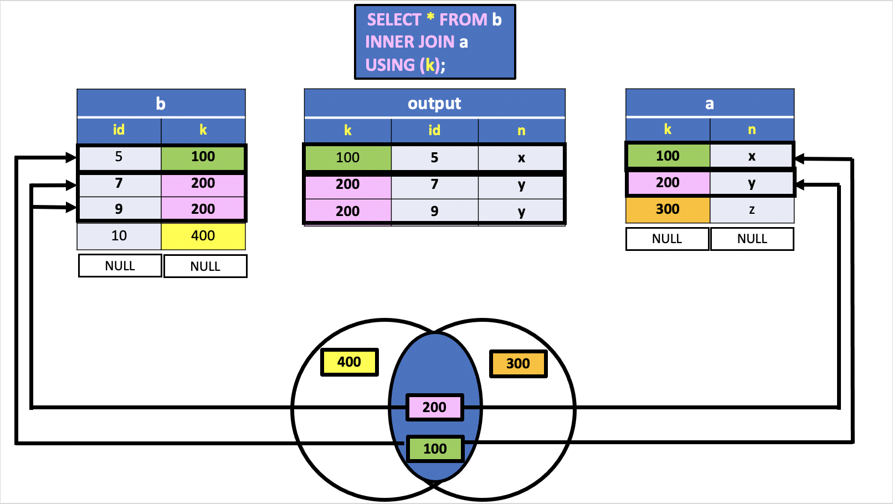
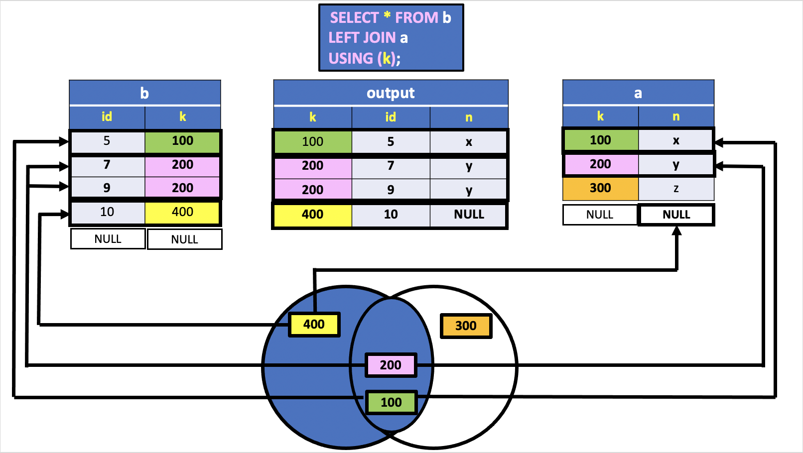
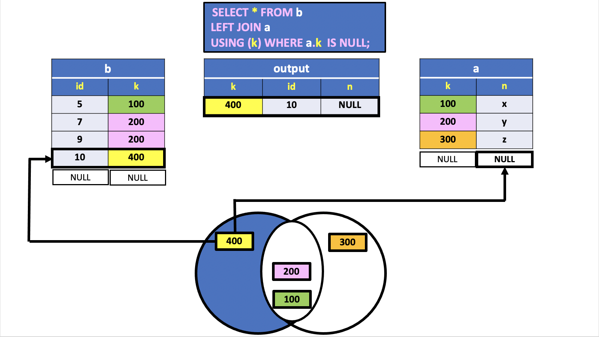
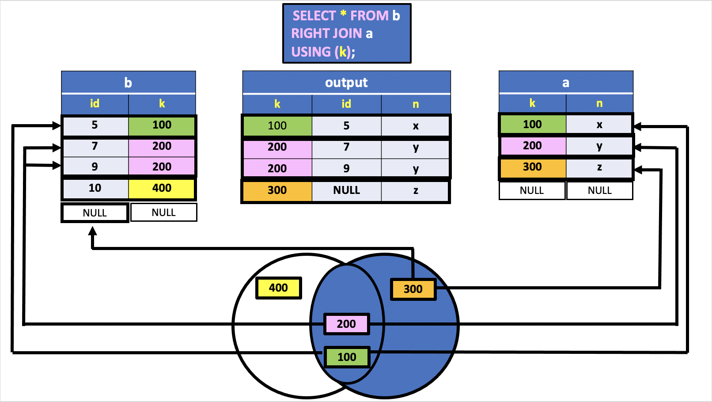
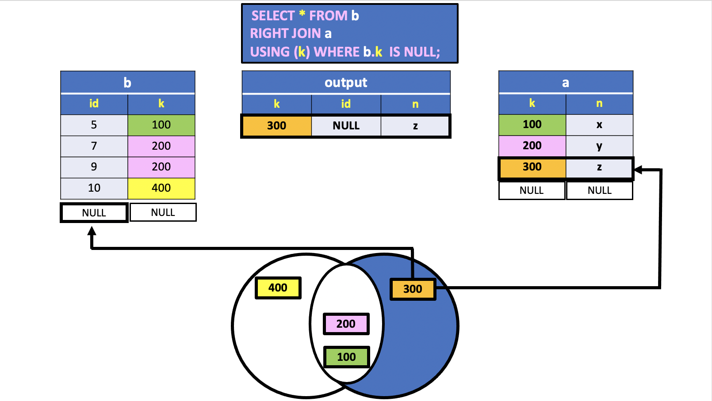
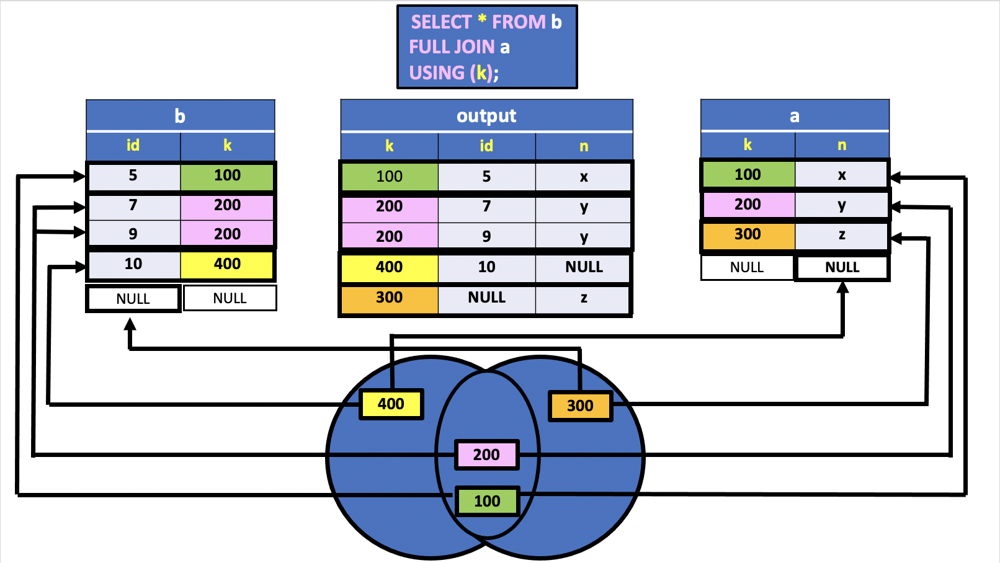
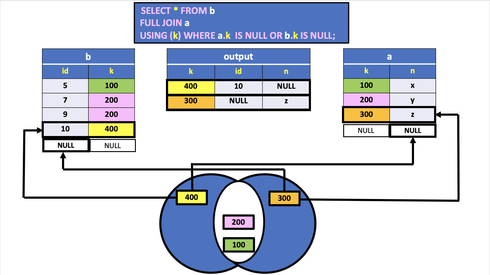
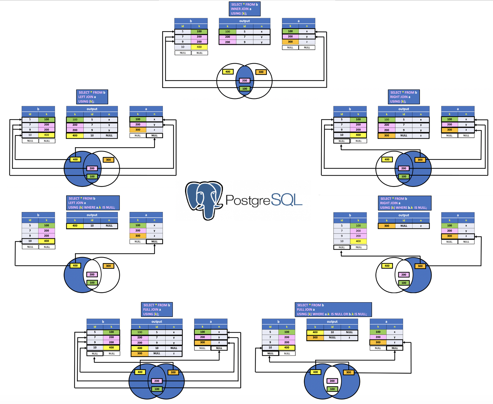

# PostgreSQL INNER and OUTER JOINS Summary

In the previous lesson the `INNER` and `OUTER` JOINS operators have been introduced.

With the `INNER JOIN` between the two tables, the rows involved in the join are generally a **subset of the rows of each table**.

It can happen that some rows are not included because there exists no corresponding row in the other table for which the condition is satisfied. This property often conflicts with the demands of applications that might need to retain the rows that would be eliminated by the join. In writing the application, we might prefer to use `NULL` **values to represent the absence of information in the other table**.

As we have seen in the last lesson, the `OUTER JOIN` has precisely the **task of executing a join while maintaining all the rows that appear in one or both the tables involved**.

There are three different types of outer join:

- `LEFT`,
- `RIGHT` and
- `FULL`.

The `LEFT JOIN` gives the **same result as the inner join**, but **includes the rows of the table that appears in the left of the join for which no corresponding rows exist in the right-hand table**.

The `RIGHT JOIN` behaves symmetrically (**keeps the rows of the right-hand table**);

finally, the `FULL JOIN` gives the **result of the inner join along with the rows excluded from both tables**.

Moreover, a subset of the `LEFT` or `RIGHT` OUTER JOIN is the Relation that contains only the excluded rows (unmatched rows) extended with `NULL` values in the columns of the other table. In the following sections we'll show how to retrieve only those rows using a condition in the `WHERE` clause.

Similarly, it is possible to include only the excluded rows of both tables using a condition in the `WHERE` clause of the `FULL OUTER JOIN`.


In this lesson we illustrate the various types of JOINS between two tables that have the same name in the joining columns. Therefore, in the joining of two tables, we take advantage of the keyword `USING` specifying an implicit condition of equality on the attribute having the same name. Furthermore, the set representation of each JOIN is illustrated with a `Veen Diagram` picture.

Consider the tables `b` and `a` given below:

**Table b**

| id |  k|
|:--:|:---:|
|  5 | 100|
|  7 | 200|
|  9 | 200|
| 10 | 400|


**Table a**

|k  | n|
|:--:|:---:|
|100 | x|
|200 | y|
|300 | z|


The column `k` is the common attribute between tables `b` and `a`. The joining column will be, therefore, the column `k`.

## INNER JOIN




In this example, the two relations `b` and `a` are represented as two sets containing the values in the column `k`, illustrated as `Veen Diagram` in the picture above.

More precisely, each set partitions the table in distinct groups of records according to the `k` column's values. For instance, the value `200` groups the second and third tuples in table `b`. Similarly, the value `200` forms a group of a single record in table `a`.

The `b` and `a` tables have common values in the column `k` and, therefore, the intersection of these sets is not empty. Since the result of the `INNER JOIN` is based on the values in column `k`, the tuples that belong to the first and second relations must be necessarily those containing values included in the intersection of both tables.

Consequently, number `100` (illustrated in the `Veen Diagram` intersection) **binds the first records in both tables** and number `200` **binds the second and third records** in table `b` to the **second record** in table `a`. On the other hand, the values `400` and `300` do not belong to the intersection and, therefore, there is no linking between records of both tables.

The `INNER JOIN` table has only three columns because the common attribute `k` of tuples operands appears only once in the result. We can imagine the `INNEER JOIN` operation as a `CROSS JOIN` between rows with the same value in the common attributes columns.

The following script in PostgreSQL reproduces the result of the example above:

**SQL**
```SQL
SELECT *
  FROM b
 INNER JOIN a USING(k);
```

**Results**

|k  | id | n|
|:--:|:-:|:---:|
|100 |  5 | x|
|200 |  7 | y|
|200 |  9 | y|

**Query**

```console
uniy=# SELECT *
uniy-#   FROM b
uniy-#  INNER JOIN a USING(k);
  k  | id | n
-----+----+---
 100 |  5 | x
 200 |  7 | y
 200 |  9 | y
(3 rows)
```

## LEFT JOIN



In this example, the `LEFT JOIN` table includes the rows of the `INNER JOIN` and the rows in table `b` for which no corresponding rows exists in the right-hand table `a`.

The last row of the `output` table has the value `400` and `10` in column `k` and `id`, respectively. On the other hand, the last column `n` contains the value `NULL`. In fact, the value `400` appears only in column `k` of table `b` and, therefore, there is no matching rows in table `a`. Consequently, the columns in table `b` heading are filled with `NULL` values. In this case a single column `n` appears in the output relation.

The following script in PostgreSQL reproduces the result of the example above:

**SQL**
```SQL
SELECT *
  FROM b
  LEFT JOIN a USING(k);
```

**Results**

|k  | id |  n|
|:-:|:---:|:------:|
|100 |  5 | x|
|200 |  7 | y|
|200 |  9 | y|
|400 | 10 | NULL|

**Query**

```console
uniy=# SELECT *
uniy-#   FROM b
uniy-#   LEFT JOIN a USING(k);
  k  | id |  n
-----+----+------
 100 |  5 | x
 200 |  7 | y
 200 |  9 | y
 400 | 10 | NULL
(4 rows)
```

## LEFT JOIN SUBSET



In this example the `output` table includes only the unmatched rows in the left-hand table `b`. The condition used in the `WHERE` clause is `a.k IS NULL`.

In fact, the mechanism behind the `LEFT JOIN` followed by the `USING` options is basically an `EQI-JOIN` followed by a selection of the column `k` in table `b`.


```console
uniy=# SELECT *
uniy-#   FROM b
uniy-#   LEFT JOIN a ON a.k = b.k;
 id |  k  |  k   |  n
----+-----+------+------
  5 | 100 |  100 | x
  7 | 200 |  200 | y
  9 | 200 |  200 | y
 10 | 400 | NULL | NULL
(4 rows)
```

The `USING` option in the `LEFT JOIN` collapses the two `k` columns into a single `k` column, and the condition `a.k IS NULL` filters the unmatched row in table `b`.

The following script in PostgreSQL reproduces the result of the example above:

**SQL**
```SQL
SELECT *
  FROM b
  LEFT JOIN a USING(k)
 WHERE a.k IS NULL;
```

**Results**

|k  | id |  n|
|:--:|:--:|:------:|
|400 | 10 | NULL|


**Query**

```console
uniy=# SELECT *
uniy-#   FROM b
uniy-#   LEFT JOIN a USING(k)
uniy-#  WHERE a.k IS NULL;
  k  | id |  n
-----+----+------
 400 | 10 | NULL
(1 row)
```

## RIGHT JOIN



The `RIGHT JOIN` behaves symmetrically to the `LEFT JOIN`. The right join is a reversed version of the left join.

The following script in PostgreSQL reproduces the result of the example above:


**SQL**
```SQL
SELECT *
  FROM b
 RIGHT JOIN a USING(k);
```

**Results**

|k  |  id  | n|
|:---:|:--:|:---:|
|100 |    5 | x|
|200 |    7 | y|
|200 |    9 | y|
|300 | NULL | z|


**Query**

```console
uniy=# SELECT *
uniy-#   FROM b
uniy-#  RIGHT JOIN a USING(k);
  k  |  id  | n
-----+------+---
 100 |    5 | x
 200 |    7 | y
 200 |    9 | y
 300 | NULL | z
(4 rows)
```

## RIGHT JOIN SUBSET



The `RIGHT JOIN SUBSET` behaves symmetrically to the `LEFT JOIN SUBSET` example.

The following script in PostgreSQL reproduces the result of the example above:

**SQL**
```SQL
SELECT *
  FROM b
 RIGHT JOIN a USING(k)
 WHERE b.k IS NULL;
```

**Results**

|k  |  id  | n|
|:---:|:---:|:---:|
|300 | NULL | z|


**Query**

```console
uniy=# SELECT *
uniy-#   FROM b
uniy-#  RIGHT JOIN a USING(k)
uniy-#  WHERE b.k IS NULL;
  k  |  id  | n
-----+------+---
 300 | NULL | z
(1 row)
```

## FULL JOIN



The full outer join or `FULL JOIN` returns a result set that contains all rows from both left and right tables, with the matching rows from both sides if available. In case there is no match, the columns of the table will be filled with `NULL`.

The following script in PostgreSQL reproduces the result of the example above:

**SQL**
```SQL
SELECT *
  FROM b
  FULL JOIN a USING(k);
```

**Results**

|k  |  id  |  n|
|:--:|:----:|:------:|
|100 |    5 | x|
|200 |    7 | y|
|200 |    9 | y|
|400 |   10 | NULL|
|300 | NULL | z|

**Query**

```console
uniy=# SELECT *
uniy-#   FROM b
uniy-#   FULL JOIN a USING(k);
  k  |  id  |  n
-----+------+------
 100 |    5 | x
 200 |    7 | y
 200 |    9 | y
 400 |   10 | NULL
 300 | NULL | z
(5 rows)
```

## FULL JOIN UNMATCHED ROWS




To return rows in a table that do not have matching rows in the other, you use the full join with a WHERE clause like this:

**SQL**
```SQL
SELECT *
  FROM b
  FULL JOIN a USING(k)
 WHERE a.k IS NULL OR b.k IS NULL;
```

**Results**

|k  |  id  |  n|
|:---:|:----:|:------:|
|400 |   10 | NULL|
|300 | NULL | z|


**Query**

```console
uniy=# SELECT *
uniy-#   FROM b
uniy-#   FULL JOIN a USING(k)
uniy-#  WHERE a.k IS NULL OR b.k IS NULL;
  k  |  id  |  n
-----+------+------
 400 |   10 | NULL
 300 | NULL | z
(2 rows)
```


## JOIN SUMMARY

The following picture shows all the PostgreSQL joins that we discussed so far with the detailed syntax:


