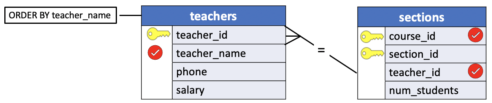
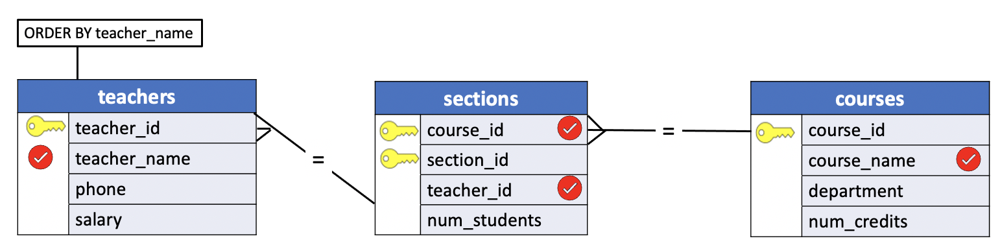
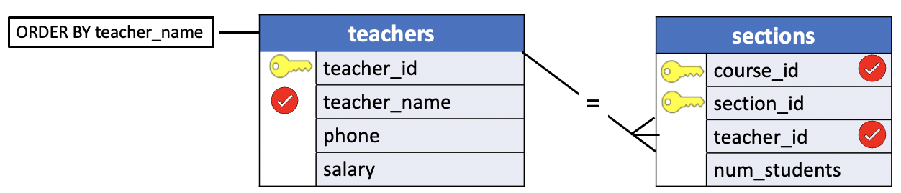
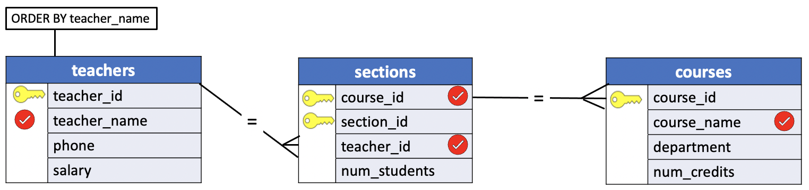
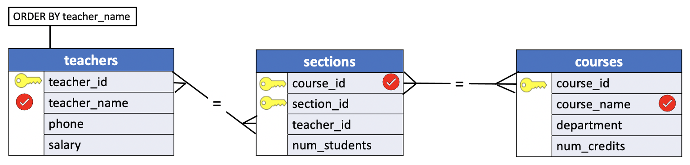

# OUTER JOIN QUERY DIAGRAMS

In the previous lesson we illustrated a summary of the `OUTER JOIN` operators available in PostgreSQL and represented each Query as a `Veen Diagram` between sets.

In this lesson we introduce the **Query diagram** for the `OUTER JOINs`. The query diagram for `OUTER JOINs` is a simple extension of the diagrams used for the `INNER JOINs`. The tables being joined are indicated by a line connecting them with the operator used in the `ON` clause marked above it. The table(s) from which the specified columns in all records will be returned are marked with a crow's foot.

We'll use the `teachers`, `sections` and `courses` tables of the **uniy** sample database for demonstration.

**teachers**

|teacher_id |    teacher_name    |   phone    |  salary|
|:----------:|:-----------------:|:----------:|:---------:|
|       303 | Dr. Horn           | 257-3049   | 27540.00|
|       290 | Dr. Lowe           | 257-2390   | 31450.00|
|       430 | Dr. Engle          | 256-4621   | 38200.00|
|       180 | Dr. Cooke          | 257-8088   | 29560.00|
|       560 | Dr. Olsen          | 257-8086   | 31778.00|
|       784 | Dr. Scango         | 257-3046   | 32098.00|
|       **213** | **Dr. Wright**         | 257-3393   | 35000.00|

**sections**

|course_id | section_id | teacher_id | num_students|
|:--------:|:-----------:|:---------:|:-----------:|
|      450 |          1 |        303 |            2|
|      730 |          1 |        290 |            6|
|      290 |          1 |        430 |            3|
|      480 |          1 |        180 |            3|
|      450 |          2 |        560 |            2|
|      480 |          2 |        784 |            2|

**courses**

|course_id |     course_name      |    department    | num_credits|
|:--------:|:--------------------:|:----------------:|:------------:|
|      450 | Western Civilization | History          |           3|
|      730 | Calculus IV          | Math             |           4|
|      290 | English Composition  | English          |           3|
|      480 | Compiler Writing     | Computer Science |           3|
|      **550** | **Art History**          | History          |           3|

Notice that `Dr. Wright` is not teaching any courses and course `550` (`Art History`) does not have any sections because no teacher is assigned to course number `550`.

## Example: A LEFT OUTER JOIN

**Problem**

List alphabetically the names of all teachers, even those who aren't currently teaching, and the number of the course assigned to each (if there is one).

**Query Diagram**



**SQL**
```SQL
SELECT t.teacher_name, s.course_id
  FROM teachers t
  LEFT JOIN sections s USING(teacher_id)
 ORDER BY teacher_name;
```

**Results**

|teacher_name    | course_id|
|:---------------:|:-----------:|
|Dr. Cooke          |       480|
|Dr. Engle          |       290|
|Dr. Horn           |       450|
|Dr. Lowe           |       730|
|Dr. Olsen          |       450|
|Dr. Scango         |       480|
|**Dr. Wright**         |      **NULL**|


Notice that `Dr. Wright`, who is not currently assigned to any course, has a `NULL` value for course number.

**Query**
```console
uniy=# SELECT t.teacher_name, s.course_id
uniy-#   FROM teachers t
uniy-#   LEFT JOIN sections s USING(teacher_id)
uniy-#  ORDER BY teacher_name;
```

**Output**
```console
    teacher_name    | course_id
--------------------+-----------
 Dr. Cooke          |       480
 Dr. Engle          |       290
 Dr. Horn           |       450
 Dr. Lowe           |       730
 Dr. Olsen          |       450
 Dr. Scango         |       480
 Dr. Wright         |      NULL
(7 rows)
```

## Example: A LEFT OUTER JOIN THREE TABLES

In this example we illustrate how to join three tables. Later in lesson [10_multi_table_join](./10_multi_table_join.md) we introduce a more in depth discussion of this topic.

**Problem**

List alphabetically the names of all teachers, even those who aren't currently teaching, and the `names` of the course assigned to each (if there is one).

**Query Diagram**



**SQL**
```SQL
SELECT t.teacher_name, s.course_id, c.course_name
  FROM teachers t
  LEFT JOIN sections s USING(teacher_id)
  LEFT JOIN courses c USING(course_id)
 ORDER BY teacher_name;
```

**Results**

|teacher_name    | course_id |     course_name|
|:---------------:|:---------:|:---------------------:|
|Dr. Cooke          |       480 | Compiler Writing|
|Dr. Engle          |       290 | English Composition|
|Dr. Horn           |       450 | Western Civilization|
|Dr. Lowe           |       730 | Calculus IV|
|Dr. Olsen          |       450 | Western Civilization|
|Dr. Scango         |       480 | Compiler Writing|
|**Dr. Wright**         |      **NULL** | **NULL**|

Notice that `NULL` value is extended to `course_name` column for `Dr. Wright`.

**Query**

```console
uniy=# SELECT t.teacher_name, s.course_id, c.course_name
uniy-#   FROM teachers t
uniy-#   LEFT JOIN sections s USING(teacher_id)
uniy-#   LEFT JOIN courses c USING(course_id)
uniy-#  ORDER BY teacher_name;
```

**Output**
```console
    teacher_name    | course_id |     course_name
--------------------+-----------+----------------------
 Dr. Cooke          |       480 | Compiler Writing
 Dr. Engle          |       290 | English Composition
 Dr. Horn           |       450 | Western Civilization
 Dr. Lowe           |       730 | Calculus IV
 Dr. Olsen          |       450 | Western Civilization
 Dr. Scango         |       480 | Compiler Writing
 Dr. Wright         |      NULL | NULL
(7 rows)
```

## Example: A RIGHT OUTER JOIN

**Problem**

List the numbers of all courses together with an alphabetical list of the teacher assigned to each (if there is one).

**Query Diagram**



**SQL**
```SQL
SELECT t.teacher_name, s.course_id
  FROM teachers t
 RIGHT JOIN sections s USING(teacher_id)
 ORDER BY teacher_name;
```

**Results**

|teacher_name    | course_id|
|:---------------:|:----------:|
|Dr. Cooke          |       480|
|Dr. Engle          |       290|
|Dr. Horn           |       450|
|Dr. Lowe           |       730|
|Dr. Olsen          |       450|
|Dr. Scango         |       480|

Notice there is no unmatched row because all sections courses have a teacher.

**Query**
```console
uniy=# SELECT t.teacher_name, s.course_id
uniy-#   FROM teachers t
uniy-#  RIGHT JOIN sections s USING(teacher_id)
uniy-#  ORDER BY teacher_name;
```

**Output**
```console
    teacher_name    | course_id
--------------------+-----------
 Dr. Cooke          |       480
 Dr. Engle          |       290
 Dr. Horn           |       450
 Dr. Lowe           |       730
 Dr. Olsen          |       450
 Dr. Scango         |       480
(6 rows)
```

## Example: A RIGHT OUTER JOIN THREE TABLES

**Problem**

List the numbers of all courses `name` together with an alphabetical list of the teacher assigned to each (if there is one).

**Query Diagram**



**SQL**
```SQL
SELECT t.teacher_name, c.course_id, c.course_name
  FROM teachers t
 RIGHT JOIN sections s USING(teacher_id)
 RIGHT JOIN courses c USING(course_id)
 ORDER BY teacher_name;
```

**Results**

|teacher_name    | course_id |     course_name|
|:---------------:|:---------:|:---------------------:|
|Dr. Cooke          |       480 | Compiler Writing|
|Dr. Engle          |       290 | English Composition|
|Dr. Horn           |       450 | Western Civilization|
|Dr. Lowe           |       730 | Calculus IV|
|Dr. Olsen          |       450 | Western Civilization|
|Dr. Scango         |       480 | Compiler Writing|
|**NULL**               |       **550** | **Art History**|


Note that course `550` is not assigned to any teacher and, therefore, has `NULL` value for `teacher_name`.

**Query**

```console
uniy=# SELECT t.teacher_name, c.course_id, c.course_name
uniy-#   FROM teachers t
uniy-#  RIGHT JOIN sections s USING(teacher_id)
uniy-#  RIGHT JOIN courses c USING(course_id)
uniy-#  ORDER BY teacher_name;
```

**Output**
```console
    teacher_name    | course_id |     course_name
--------------------+-----------+----------------------
 Dr. Cooke          |       480 | Compiler Writing
 Dr. Engle          |       290 | English Composition
 Dr. Horn           |       450 | Western Civilization
 Dr. Lowe           |       730 | Calculus IV
 Dr. Olsen          |       450 | Western Civilization
 Dr. Scango         |       480 | Compiler Writing
 NULL               |       550 | Art History
(7 rows)
```

## Example: A FULL OUTER JOIN THREE TABLES

Finally, a `FULL OUTER JOIN` returns the specified columns from all records in both the left most and the right most tables specified.

**Query Diagram**




**SQL**
```SQL
SELECT t.teacher_name, c.course_id, c.course_name
  FROM teachers t
  FULL JOIN sections s USING(teacher_id)
  FULL JOIN courses c USING(course_id)
 ORDER BY teacher_name;
```

**Results**

|teacher_name    | course_id |     course_name|
|:--------------:|:---------:|:---------------------:|
|Dr. Cooke          |       480 | Compiler Writing|
|Dr. Engle          |       290 | English Composition|
|Dr. Horn           |       450 | Western Civilization|
|Dr. Lowe           |       730 | Calculus IV|
|Dr. Olsen          |       450 | Western Civilization|
|Dr. Scango         |       480 | Compiler Writing|
|**Dr. Wright**         |      **NULL** | **NULL**|
|**NULL**               |       **550** | **Art History**|


Both, `Dr. wright`, the teacher without a course, and course number `550`, the course without a teacher, appear in this case.

**Query**
```console
uniy=# SELECT t.teacher_name, c.course_id, c.course_name
uniy-#   FROM teachers t
uniy-#   FULL JOIN sections s USING(teacher_id)
uniy-#   FULL JOIN courses c USING(course_id)
uniy-#  ORDER BY teacher_name;
```

**Output**
```console
    teacher_name    | course_id |     course_name
--------------------+-----------+----------------------
 Dr. Cooke          |       480 | Compiler Writing
 Dr. Engle          |       290 | English Composition
 Dr. Horn           |       450 | Western Civilization
 Dr. Lowe           |       730 | Calculus IV
 Dr. Olsen          |       450 | Western Civilization
 Dr. Scango         |       480 | Compiler Writing
 Dr. Wright         |      NULL | NULL
 NULL               |       550 | Art History
(8 rows)
```
