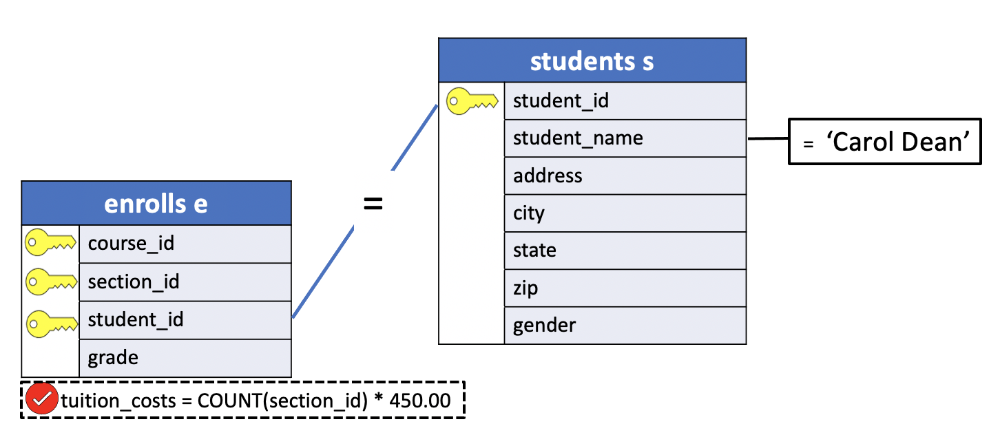

# Tables Aliases

In lesson [13](../01_basic_sql/13_derived_column_op_alias.md) we introduced the notion of `column alias` as a way to assign a column or an expression in the select list of a `SELECT` statement a temporary name. Similarly, we can assign **aliases to tables**.


## Why Tables Aliases?

Every table in a database must have a unique name. Sometimes it's useful to assign an `alias` to a table, a name that can be used in place of the table's real name.

Aliases, sometimes more formally known as "correlation names", exist only for the life of a particular query (for example, for the duration of one `SELECT` statement). A common reason to use aliases is to **reduce the amount of typing required to enter a query**.

To create an alias name for a table, simply type the alias name after the table name in the `FROM` clause. Leave at least one space between the table's name and the alias. For example, the query:

**SQL**
```SQL
SELECT student_name,
       grade
  FROM students s INNER JOIN enrolls e
    ON s.student_id = e.student_id
 WHERE course_id = 450 AND
       section_id = 1;
```

defines two aliases: **s** for `students` and **e** for `enrolls`. This query could also be expressed as:

**SQL**
```SQL
SELECT student_name,
       grade
  FROM students INNER JOIN enrolls
    ON students.student_id = enrolls.student_id
 WHERE course_id = 450 AND
       section_id = 1;
```

and the results would be identical. The only difference is **the number of characters typed** :smile:.

If qualified names are used in specifying the selected columns, it is even possible to use an alias before it is defined. We could, for example, say:

**SQL**
```SQL
SELECT c.department, c.course_id,
       s.section_id, s.num_students
  FROM courses c INNER JOIN sections s
 WHERE c.course_id = s.course_id;
```

Here, the aliases are defined as usual in the `FROM` clause but are used in both the qualified names and in the `WHERE` or `ON` clause.

Keep always in mind the processing order: `FROM` **->** `SELECT` **->** `WHERE`

Because their most common use is to reduce the amount of typing, alias names are often kept to a single character. It is legal, however, to use longer alias names. It's even possible (although probably not very useful) to create an alias name that is longer than the original table name.  

## Table Alias example

**Problem**: Assuming that tuition is $450 per course, what is Carol Dean's total tuition bill?

- **Tables**: students, enrolls
- **Columns**: `tuition_costs` -> number of courses x $450
- **Condition**:
  - (join) `students.student_id = enrolls.students_id`
  - student's name Carol Dean

```console
uniy=# \d enrolls
                 Table "public.enrolls"
   Column   |   Type   | Collation | Nullable | Default
------------+----------+-----------+----------+---------
 course_id  | smallint |           | not null |
 section_id | smallint |           | not null |
 student_id | smallint |           | not null |
 grade      | smallint |           |          |
Indexes:
    "enrolls_pkey" PRIMARY KEY, btree (course_id, section_id, student_id)
Foreign-key constraints:
    "enrolls_fkey_course" FOREIGN KEY (course_id) REFERENCES courses(course_id) ON DELETE CASCADE
    "enrolls_fkey_section" FOREIGN KEY (course_id, section_id) REFERENCES sections(course_id, section_id) ON DELETE CASCADE
    "enrolls_fkey_student" FOREIGN KEY (student_id) REFERENCES students(student_id) ON DELETE CASCADE
```

**Query Diagram**



**SQL**

```SQL
SELECT COUNT(section_id) * 450.00 AS tuition_costs
  FROM enrolls e INNER JOIN students s
    ON e.student_id = s.student_id
 WHERE s.student_name = 'Carol Dean';
```

**Results**

|tuition_costs|
|:------------:|
|      1350.00|

**Query**
```console
uniy=# SELECT COUNT(section_id) * 450.00 As tuition_costs
uniy-#   FROM enrolls e INNER JOIN students s
uniy-#     ON e.student_id = s.student_id
uniy-#  WHERE s.student_name = 'Carol Dean';
```

**Output**
```console
 tuition_costs
---------------
       1350.00
(1 row)
```
