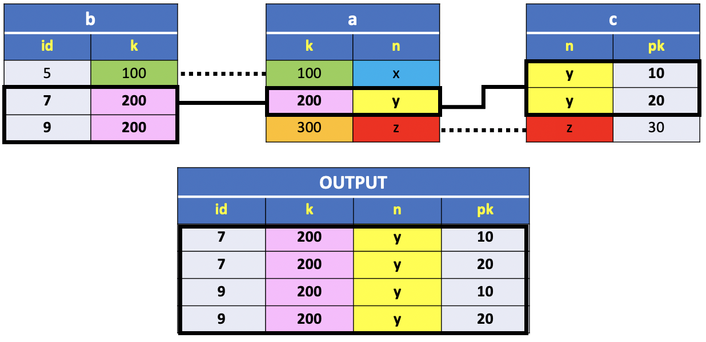
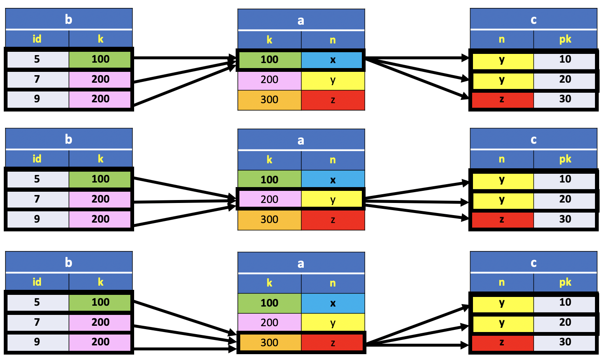
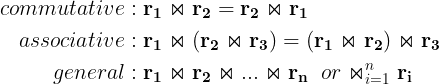
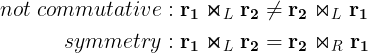

# Multi Tables JOIN

Earlier in this chapter we introduced the `INNER` and `NATURAL` JOIN Relations as a subset of the Cartesian Product between tables.

Similarly, a JOIN with three or more tables is a fairly straightforward extension of the two-table join.



For instance, the picture above shows three tables (`b`,`a` and `c`), with common column identifiers to link the records between tables. The columns `k` and `n` are the joining columns in Table `a` that link the records between table `b` and `c`. Thus, the middle table `a` acts as a bridge between the other two tables. The output table consists of four named columns and four records, each with values that meet the matching condition on the joining columns `k` and `n`.


We wish to join all three tables based on common values in the joining columns.  
To do this, we just need to list all necessary tables in the `FROM` clause, then includes appropriate restrictions in the `WHERE` clause.

Thus, we could use the following query:

**SQL**
```SQL
SELECT id, b.k, a.n, pk
  FROM b, a, c
 WHERE b.k = a.k AND a.n = c.n
 ORDER BY id;
```

**Results**

|id |  k  | n | pk|
|:--:|:---:|:--:|:----:|
| 7 | 200 | y | 10|
| 7 | 200 | y | 20|
| 9 | 200 | y | 10|
| 9 | 200 | y | 20|


**Query**

```console
uniy=# SELECT id, b.k, a.n, pk
uniy-#   FROM b, a, c
uniy-#  WHERE b.k = a.k AND a.n = c.n
uniy-#  ORDER BY id;
 id |  k  | n | pk
----+-----+---+----
  7 | 200 | y | 10
  7 | 200 | y | 20
  9 | 200 | y | 10
  9 | 200 | y | 20
(4 rows)
```

If you find it hard to believe that the simple restrictions given in the `WHERE` clause produced the desired results, try the query without the `WHERE` clause. The resulting Relation is the `CARTESIAN PRODUCT` of three Relations as follow:


**SQL**
```SQL
SELECT id,
       b.k AS bk,
       a.k AS ak,
       a.n AS an,
       c.n AS cn,
       pk
  FROM b, a, c;
```

The picture below shows how the tuples of the CARTESIAN PRODUCT are combined.




If you search through the results, you'll find that the resulting rows for which the conditions in the `WHERE` clause are true are exactly those desired.

**Results**

||id  | bk | ak  | an  | cn  | pk   |b.k = a.k| a.n = c.n|
|:-:|:--:|:--:|:---:|:---:|:---:|:----:|:-------:|:--------:|
|| 5  | **100** | **100** | x  | y  | 10    |**TRUE**|`FALSE`|
|| 7  | 200 | 100 | x  | y  | 10    |`FALSE`|`FALSE`|
|| 9  | 200 | 100 | x  | y  | 10    |`FALSE`|`FALSE`|
|| 5  | **100** | **100** | x  | y  | 20    |**TRUE**|`FALSE`|
|| 7  | 200 | 100 | x  | y  | 20    |`FALSE`|`FALSE`|
|| 9  | 200 | 100 | x  | y  | 20    |`FALSE`|`FALSE`|
|| 5  | **100** | **100** | x  | z  | 30    |**TRUE**|`FALSE`|
|| 7  | 200 | 100 | x  | z  | 30    |`FALSE`|`FALSE`|
|| 9  | 200 | 100 | x  | z  | 30    |`FALSE`|`FALSE`|
|| 5  | 100 | 200 | y  | y  | 10    |`FALSE`|`FALSE`|
|:heavy_multiplication_x:| 7  | **200** | **200** | **y**  | **y**  | 10    |**TRUE**|**TRUE**|
|:heavy_multiplication_x:| 9  | **200** | **200** | **y**  | **y**  | 10    |**TRUE**|**TRUE**|
|| 5  | 100 | 200 | **y**  | **y**  | 20    |`FALSE`|**TRUE**|
|:heavy_multiplication_x:| 7  | **200** | **200** | **y**  | **y**  | 20    |**TRUE**|**TRUE**|
|:heavy_multiplication_x:| 9  | **200** | **200** | **y**  | **y**  | 20    |**TRUE**|**TRUE**|
|| 5  | 100 | 200 | y  | z  | 30    |`FALSE`|`FALSE`|
|| 7  | **200** | **200** | y  | z  | 30    |**TRUE**|`FALSE`|
|| 9  | **200** | **200** | y  | z  | 30    |**TRUE**|`FALSE`|
|| 5  | 100 | 300 | z  | y  | 10    |`FALSE`|`FALSE`|
|| 7  | 200 | 300 | z  | y  | 10    |`FALSE`|`FALSE`|
|| 9  | 200 | 300 | z  | y  | 10    |`FALSE`|`FALSE`|
|| 5  | 100 | 300 | z  | y  | 20    |`FALSE`|`FALSE`|
|| 7  | 200 | 300 | z  | y  | 20    |`FALSE`|`FALSE`|
|| 9  | 200 | 300 | z  | y  | 20    |`FALSE`|`FALSE`|
|| 5  | 100 | 300 | **z**  | **z**  | 30    |`FALSE`|**TRUE**|
|| 7  | 200 | 300 | **z**  | **z**  | 30    |`FALSE`|**TRUE**|
|| 9  | 200 | 300 | **z**  | **z**  | 30    |`FALSE`|**TRUE**|


In this table the cross illustrated in the first column indicates the rows matching the condition in the `WHERE` clause. As expected, the result is a subset of the CARTESIAN PRODUCT.


## INNER JOIN PROPERTIES

First, let us observe that a CARTESIAN PRODUCT of three or more tables is a `commutative` and `associative` operator, meaning that the order of operands do not determine the resulting relation. The same properties hold for the `INNER JOIN` operator, since it is a subset of the CARTESIAN PRODUCT.


Note also that all tables in the picture above have linking lines with no arrows indicating that the order of intermediate joining tables do not determine the values in the output table. In fact, a **Multi INNER JOIN** or `EQUI-JOIN` is basically a CARTESIAN PRODUCT followed by a selection of rows matching two or more conditions, based on the number of joining columns, expressed as a combination of logic `ANDS`. Naturally, the order execution could have an impact only on the Query computational efficiency. However, this is not an issue since there are query optimizers implemented in the RDBMS. It follows that the properties of the INNER JOIN could be stated as follow:



Thus, we can write, where necessary, the join sequences without brackets.

The Previous query could be expressed using the `INNER JOIN` clause as follow:

**SQL**

```SQL
SELECT id, b.k, a.n, pk
  FROM b
 INNER JOIN a ON b.k = a.k
 INNER JOIN c ON a.n = c.n
 ORDER BY id;
 ```

 There is also another way to express these kinds of multi-table joins. The existence of common identifiers in the previous example gives the possibility to use the the `USING` option in the `INNER JOIN` clause as follow:

**SQL**

```SQL
SELECT *
  FROM b
 INNER JOIN a USING(k)
 INNER JOIN c USING(n)
 ORDER BY id;
```

**Results**

|n |  k  | id | pk|
|:--:|:----:|:----:|:----:|
|y | 200 |  7 | 10|
|y | 200 |  7 | 20|
|y | 200 |  9 | 10|
|y | 200 |  9 | 20|

The only subtle difference is the order of the columns in the result. In fact, the joining columns come first in the column heading of the resulting table. The columns order depends on the execution of the SQL query.

The joining columns order follow a bottom-up execution. The first column is the last joining column of the result (`n`), next comes the column of the previous join (`k`) and so on.

On the other hand, the remaining columns follows a top-down execution. The first column next to the `k` column belongs to table `b`, the second column belongs to table `c`.

```console
uniy=# SELECT *
uniy-#   FROM c
uniy-#  INNER JOIN a USING(n)
uniy-#  INNER JOIN b USING(k)
uniy-#  ORDER BY id;
  k  | n | pk | id
-----+---+----+----
 200 | y | 10 |  7
 200 | y | 20 |  7
 200 | y | 10 |  9
 200 | y | 20 |  9
(4 rows)
```

In this example, we reversed the order of execution for the `INNER JOIN`. As expected, the column order is reversed for the joining columns.

In this example the joining columns are distinct for both tables and, therefore, it's possible to express the same query as a `NATURAL JOIN`.

**SQL**

```SQL
SELECT *
  FROM b
NATURAL JOIN a
NATURAL JOIN c;
```

## OUTER JOIN PROPERTIES

In the previous section we discussed the general properties of the `INNER JOIN` operator.

At this point you might be asking if the `OUTER JOINS` are `commutative` and `associative`.




It's obvious that the order of the operands in an `OUTER JOIN` does change the result of the output relation. It follows that the `LEFT` and `RIGHT` Outer Joins are not commutative. In fact, the `LEFT JOIN` is symmetrical to the `OUTER JOIN`, meaning that it is equivalent to a `RIGHT JOIN` with an inverse order of the operands. That's why the left join is often the default join in most of the queries: use it unless you have a strong reason to prefer one of the others.

Similarly, the order of the relations in the `OUTER JOIN` does change the result of a `multi table join`, also known as `n-ary join`. This result can be easily illustrated with a simple example.


For instance, the `LEFT JOIN` of the last example returns the following relation:

**SQL**
```SQL
SELECT *
  FROM b
  LEFT JOIN a USING(k)
  LEFT JOIN c USING(n);
```

**Results**

|n |  k  | id |  pk|
|:-:|:-----:|:----:|:------:|
|**x** | **100** |  **5** | **NULL**|
|y | 200 |  7 |   10|
|y | 200 |  9 |   10|
|y | 200 |  7 |   20|
|y | 200 |  9 |   20 |

The `LEFT JOIN` table includes the `INNER JOIN` rows and the **unmatched rows in the left table indicated in the** `FROM` **clause**. In this case the first row in table `b`. At this point it's not hard to guess the result of the `LEFT JOIN` query that indicates table `c` in the `FROM` clause. It'll includes the **unmatched rows in table** `c`.

**SQL**
```SQL
SELECT n, k, id, pk
  FROM c
  LEFT JOIN a USING(n)
  LEFT JOIN b USING(k);
```

**Results**

|n |  k  |  id  | pk|
|:--:|:----:|:-----:|:----:|
|y | 200 |    7 | 10|
|y | 200 |    9 | 10|
|y | 200 |    7 | 20|
|y | 200 |    9 | 20|
|**z** | **300** | **NULL** | **30**|


The `LEFT JOIN` table includes the unmatched rows in table `c`. This result can be extended to the case of four or more tables. The resulting relation will include the rows of the `INNER JOIN` and the **unmatched rows of the relation indicated in the** `FROM` clause.

Lastly, we observe that the symmetry property holds in the general case. The previous query is equivalent to the following query:

**SQL**
```SQL
SELECT n, k, id, pk
  FROM b
  RIGHT JOIN a USING(k)
  RIGHT JOIN c USING(n);
```

**Results**

|n |  k  |  id  | pk|
|:-:|:---:|:------:|:----:|
|y | 200 |    7 | 10|
|y | 200 |    9 | 10|
|y | 200 |    7 | 20|
|y | 200 |    9 | 20|
|**z** | **300** | **NULL** | **30**|

Finally, the `associative` **property does not hold either**. The proof is not immediate but it can be illustrated with a simple example.

**SQL**

```SQL
SELECT n, k, id, pk
  FROM a
  LEFT JOIN c USING(n)
  LEFT JOIN b USING(k);
```
**Results**

| n |  k  |  id  |  pk|
|:--:|:-----:|:------:|:------:|
| x | 100 |    5 | NULL|
| y | 200 |    7 |   10|
| y | 200 |    9 |   10|
| y | 200 |    7 |   20|
| y | 200 |    9 |   20|
| z | 300 | NULL |   30|

In this example, the execution of the first `LEFT JOIN` is between the middle table `a` and the last table `c`. On the other hand, the following query executes the `LEFT JOIN` between table `b` and `a`, then table `c`.

**SQL**
```SQL
SELECT n, k, id, pk
  FROM b
  LEFT JOIN a USING(k)
  LEFT JOIN c USING(n);
```

**Results**

|n |  k  | id |  pk|
|:-:|:-----:|:----:|:------:|
|x | 100 |  5 | NULL|
|y | 200 |  7 |   10|
|y | 200 |  9 |   10|
|y | 200 |  7 |   20|
|y | 200 |  9 |   20|

## NATURAL JOIN PROPERTIES

Let us look at some of the properties of the natural join.

### NATURAL JOIN AS INTERSECTION OF TABLES

Let's start with the extreme case where both tables have the same column heading.

What is the result of a `NATURAL JOIN` between tables with the same column heading?

Assume there are two relations `b` and `d`:

**Relation b**

|id |  k|
|:--:|:----:|
| 5 | 100|
| **7** | **200**|
| **9** | **200**|
|10 | 400|

**Relation d**

|id |  k|
|:--:|:---:|
| 4 |  50|
| **7** | **200**|
| **9** | **200**|
|11 | 400|

What would be the result of the following query:


**SQL**
```SQL
SELECT *
  FROM b
  NATURAL JOIN d;
```

**Results**

|id |  k|
|:---:|:----:|
|**7** | **200**|
|**9** | **200**|

The `NATURAL JOIN` of tables defined on the same attributes coincides with the `INTERSECTION`.


### NATURAL JOIN AS CARTESIAN PRODUCT

The other extreme case is where the two sets of attributes are disjoint.

What is the result of a `NATURAL JOIN` between tables without common attributes ?

Assume there are two relations `b` and `c`:

**Relation b**

|id |  k|
|:--:|:----:|
| 5 | 100|
| 7 | 200|
| 9 | 200|
|10 | 400|

**Relation c**

|n | pk|
|:-:|:--:|
|y | 10|
|y | 20|
|z | 30|

**SQL**
```SQL
SELECT *
  FROM b
 NATURAL JOIN c;
```

**Results**

|id |  k  | n | pk|
|:---:|:-----:|:---:|:----:|
| 5 | 100 | y | 10|
| 5 | 100 | y | 20|
| 5 | 100 | z | 30|
| 7 | 200 | y | 10|
| 7 | 200 | y | 20|
| 7 | 200 | z | 30|
| 9 | 200 | y | 10|
| 9 | 200 | y | 20|
| 9 | 200 | z | 30|
|10 | 400 | y | 10|
|10 | 400 | y | 20|
|10 | 400 | z | 30 |


The result is always defined on the union of the attributes, and each tuple is always derived from two tuples, one for each of the operands. However, since such tuples have no attributes in common, there is no requirement to be satisfied in order for them to participate in the join. The condition that the tuples must have the same values on the common attributes is always verified. So the result of this join contains the tuples obtained by combining the tuples of the operands in all possible ways. In this case, we often say that the join becomes a cartesian product. This could be described as an operator defined (using the same definition given above for natural join) on relations that have no attributes in common.
