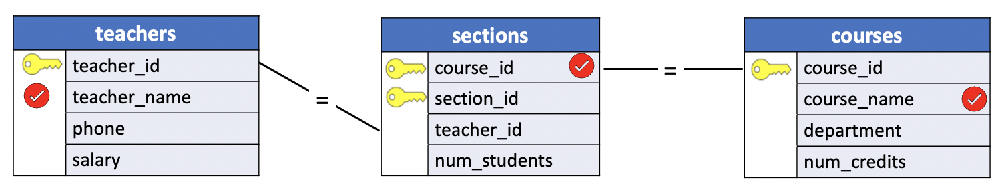
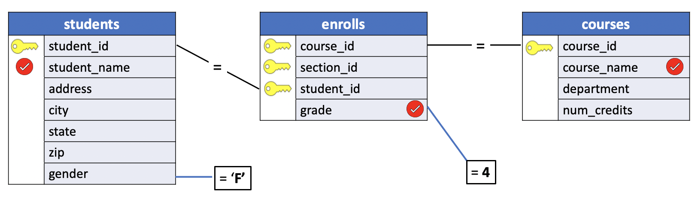
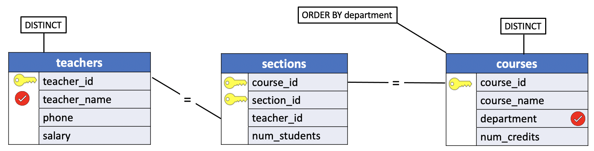
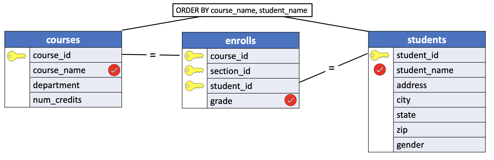
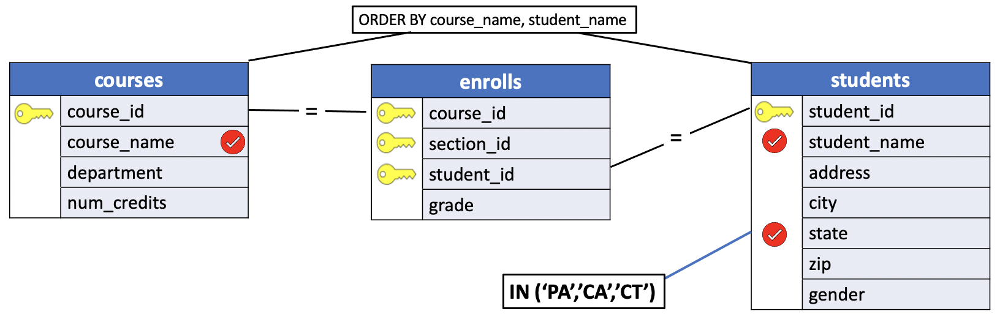
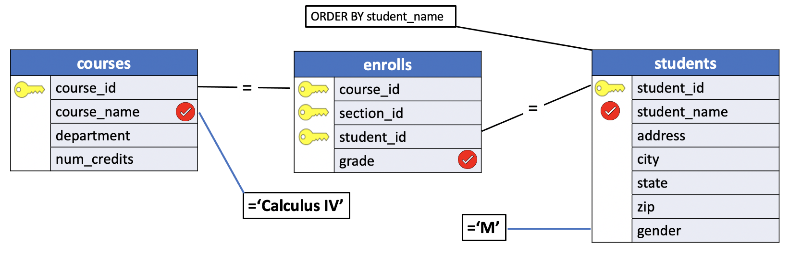

# Example: Joins with Three tables

In lesson [10_multi_table_join](./10_multi_table_join) we introduce the syntax to join three or more tables. In this lesson we illustrate a number of examples using the `uniy` sample database.


## Example: Uniy Sample Database

In this example we use the **teachers**, **sections** and **courses** tables of the `uniy` sample database to demonstrate how to join three tables.

### Problem 1

List the names of all active teachers along with the names and numbers of the courses taught by each.



**SQL**
```SQL
SELECT t.teacher_name, s.course_id, c.course_name
  FROM teachers t, sections s, courses c
 WHERE t.teacher_id = s.teacher_id AND
       s.course_id = c.course_id;
```

**SQL2**
```SQL
SELECT t.teacher_name, s.course_id, c.course_name
  FROM teachers t
 INNER JOIN sections s USING(teacher_id)
 INNER JOIN courses c USING(course_id);
```

**SQL3**
```SQL
SELECT t.teacher_name, s.course_id, c.course_name
  FROM teachers t
  NATURAL JOIN sections s
  NATURAL JOIN courses c;
```

**Results**

|teacher_name    | course_id |     course_name|
|------------------:|:-----------:|:----------------------:|
|Dr. Horn           |       450 | Western Civilization|
|Dr. Lowe           |       730 | Calculus IV|
|Dr. Engle          |       290 | English Composition|
|Dr. Cooke          |       480 | Compiler Writing|
|Dr. Olsen          |       450 | Western Civilization|
|Dr. Scango         |       480 | Compiler Writing|

### Problem 2

In which courses did any female student get an `A`? (List both the courses and the students by name)

**Query Diagram**




**SQL1**
```SQL
SELECT s.student_name, c.course_name, e.grade
  FROM students s
  INNER JOIN enrolls e USING(student_id)
  INNER JOIN courses c USING(course_id)
 WHERE s.gender = 'F' AND
       e.grade = 4;
```

**SQL2**
```SQL
SELECT s.student_name, c.course_name, e.grade
  FROM students s
NATURAL JOIN enrolls e
NATURAL JOIN courses c
 WHERE s.gender = 'F' AND
       e.grade = 4;
```

**Results**

|student_name    |     course_name      | grade|
|:---------------:|:---------------------:|:-------:|
|Janet Thomas       | Western Civilization |     4|


**Query**
```console
uniy=# SELECT s.student_name, c.course_name, e.grade
uniy-#   FROM students s
uniy-#   INNER JOIN enrolls e USING(student_id)
uniy-#   INNER JOIN courses c USING(course_id)
uniy-#  WHERE s.gender = 'F' AND
uniy-#        e.grade = 4;
```

**Output**
```console
    student_name    |     course_name      | grade
--------------------+----------------------+-------
 Janet Thomas       | Western Civilization |     4
(1 row)
```

### Problem 3

List the names of all active teachers and their departments, ordered alphabetically by department.

**Query Diagram**




**SQL**
```SQL
SELECT DISTINCT t.teacher_name, c.department
  FROM teachers t
 INNER JOIN sections s USING(teacher_id)
 INNER JOIN courses c USING(course_id)
 ORDER BY department;
```

**Results**

|teacher_name    |    department|
|:--------------:|:-----------------:|
|Dr. Cooke          | Computer Science|
|Dr. Scango         | Computer Science|
|Dr. Engle          | English|
|Dr. Horn           | History|
|Dr. Olsen          | History|
|Dr. Lowe           | Math|


**Query**
```console
uniy=# SELECT DISTINCT t.teacher_name, c.department
uniy-#   FROM teachers t
uniy-#  INNER JOIN sections s USING(teacher_id)
uniy-#  INNER JOIN courses c USING(course_id)
uniy-#  ORDER BY department;
```
**Output**
```console
    teacher_name    |    department
--------------------+------------------
 Dr. Cooke          | Computer Science
 Dr. Scango         | Computer Science
 Dr. Engle          | English
 Dr. Horn           | History
 Dr. Olsen          | History
 Dr. Lowe           | Math
(6 rows)
```

### Problem 4

List each student's grade for each course. Order the list alphabetically by course name, then for each course, by student name.

**Query Diagram**




**SQL**
```SQL
SELECT c.course_name, s.student_name, e.grade
  FROM courses c
 INNER JOIN enrolls e USING(course_id)
 INNER JOIN students s USING(student_id)
 ORDER BY c.course_name, s.student_name;
```

**Results**

|course_name      |    student_name    | grade|
|:---------------:|:------------------:|:-------:|
|Calculus IV          | Bob Dawson         |     1|
|Calculus IV          | Carol Dean         |     3|
|Calculus IV          | John Anderson      |     4|
|Calculus IV          | Susan Powell       |     3|
|Calculus IV          | Susan Pugh         |     2|
|Calculus IV          | Val Shipp          |     3|
|Compiler Writing     | Bill Jones         |     2|
|Compiler Writing     | Carol Dean         |     0|
|Compiler Writing     | Howard Mansfield   |     3|
|Compiler Writing     | John Anderson      |     4|
|English Composition  | Allen Thomas       |     2|
|English Composition  | Howard Mansfield   |     3|
|English Composition  | Joe Adams          |     4|
|Western Civilization | Allen Thomas       |  NULL|
|Western Civilization | Bob Dawson         |     3|
|Western Civilization | Carol Dean         |     2|
|Western Civilization | Janet Thomas       |     4|

Allen Thomas has yet to receive his grade in Western civilization. Because this field in the corresponding record in the `enrolls` table contains a `NULL` value, no grade for that course appears in the result of the query.

```console
uniy=# SELECT * FROM enrolls;
 course_id | section_id | student_id | grade
-----------+------------+------------+-------
       730 |          1 |        148 |     3
       450 |          2 |        210 |     3
       730 |          1 |        210 |     1
       290 |          1 |        298 |     3
       480 |          2 |        298 |     3
       730 |          1 |        348 |     2
       290 |          1 |        349 |     4
       480 |          1 |        410 |     2
       450 |          1 |        473 |     2
       730 |          1 |        473 |     3
       480 |          2 |        473 |     0
       290 |          1 |        548 |     2
       730 |          1 |        558 |     3
       730 |          1 |        649 |     4
       480 |          1 |        649 |     4
       450 |          1 |        654 |     4
       450 |          2 |        548 |  NULL
(17 rows)
```


**Query**
```console
uniy=# SELECT c.course_name, s.student_name, e.grade
uniy-#   FROM courses c
uniy-#  INNER JOIN enrolls e USING(course_id)
uniy-#  INNER JOIN students s USING(student_id)
uniy-#  ORDER BY c.course_name, s.student_name;
```

**Output**
```console
     course_name      |    student_name    | grade
----------------------+--------------------+-------
 Calculus IV          | Bob Dawson         |     1
 Calculus IV          | Carol Dean         |     3
 Calculus IV          | John Anderson      |     4
 Calculus IV          | Susan Powell       |     3
 Calculus IV          | Susan Pugh         |     2
 Calculus IV          | Val Shipp          |     3
 Compiler Writing     | Bill Jones         |     2
 Compiler Writing     | Carol Dean         |     0
 Compiler Writing     | Howard Mansfield   |     3
 Compiler Writing     | John Anderson      |     4
 English Composition  | Allen Thomas       |     2
 English Composition  | Howard Mansfield   |     3
 English Composition  | Joe Adams          |     4
 Western Civilization | Allen Thomas       |  NULL
 Western Civilization | Bob Dawson         |     3
 Western Civilization | Carol Dean         |     2
 Western Civilization | Janet Thomas       |     4
(17 rows)
```

### Problem 5

Which courses are the students from Pennsylvania, California and Connecticut taking? Order the results first by course name, then by state.

**Query Diagram**



**SQL**
```SQL
SELECT s.student_name, c.course_name, s.state
  FROM students s
 INNER JOIN enrolls USING(student_id)
 INNER JOIN courses c USING(course_id)
 WHERE s.state IN ('PA','CA','CT')
 ORDER BY c.course_name, s.state;
```

**Results**

|student_name    |     course_name      | state|
|:--------------:|:--------------------:|:------:|
|Susan Pugh         | Calculus IV          | CT|
|Susan Powell       | Calculus IV          | PA|
|Bill Jones         | Compiler Writing     | CA|
|Janet Thomas       | Western Civilization | PA|


**Query**
```console
uniy=# SELECT s.student_name, c.course_name, s.state
uniy-#   FROM students s
uniy-#  INNER JOIN enrolls USING(student_id)
uniy-#  INNER JOIN courses c USING(course_id)
uniy-#  WHERE s.state IN ('PA','CA','CT')
uniy-#  ORDER BY c.course_name, s.state;
```

**Output**
```console
    student_name    |     course_name      | state
--------------------+----------------------+-------
 Susan Pugh         | Calculus IV          | CT
 Susan Powell       | Calculus IV          | PA
 Bill Jones         | Compiler Writing     | CA
 Janet Thomas       | Western Civilization | PA
(4 rows)
```

### Problem 6

List alphabetically the names and grades of all male students enrolled in Calculus IV.

**Query Diagram**




**SQL**
```SQL
SELECT c.course_name, s.student_name, e.grade
  FROM courses c
 INNER JOIN enrolls e USING(course_id)
 INNER JOIN students s USING(student_id)
 WHERE c.course_name = 'Calculus IV' AND
       s.gender = 'M';
```

**Results**

|course_name      |    student_name    | grade|
|:----------------:|:------------------:|:-------:|
|Calculus IV          | Bob Dawson         |     1|
|Calculus IV          | John Anderson      |     4|

**Query**
```console
uniy=# SELECT c.course_name, s.student_name, e.grade
uniy-#   FROM courses c
uniy-#  INNER JOIN enrolls e USING(course_id)
uniy-#  INNER JOIN students s USING(student_id)
uniy-#  WHERE c.course_name = 'Calculus IV' AND
uniy-#        s.gender = 'M';
```
**Output**
```console
     course_name      |    student_name    | grade
----------------------+--------------------+-------
 Calculus IV          | Bob Dawson         |     1
 Calculus IV          | John Anderson      |     4
(2 rows)
```
