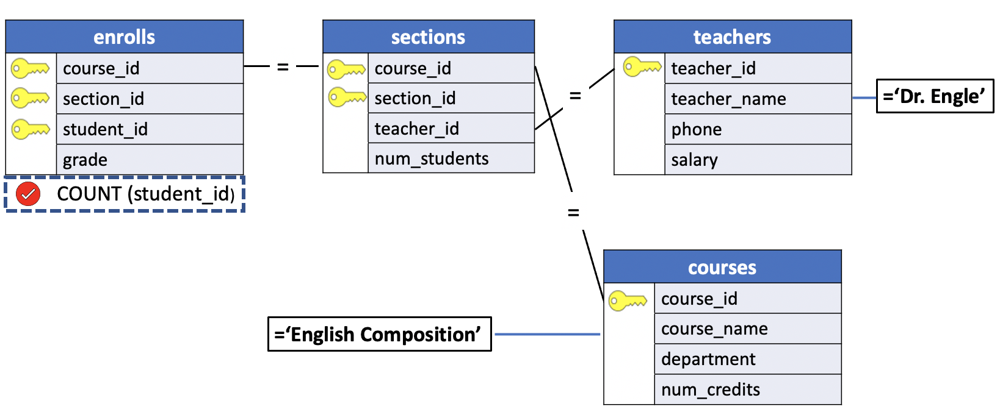
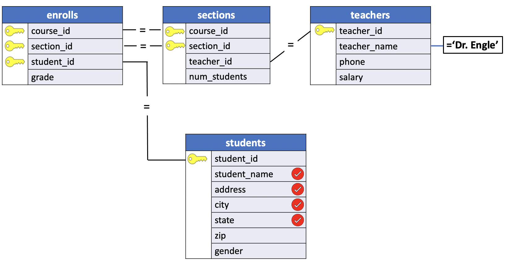
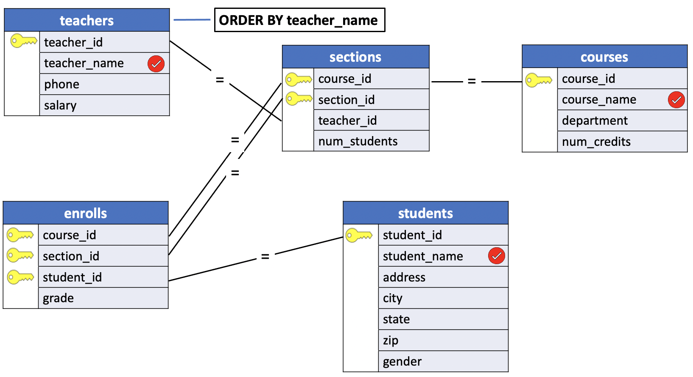

# Join with More Than Three Tables

A single query can access information stored in any number of tables within a database (theoretically, anyway - in practice, real systems often have limits). Four, five or more tables can be joined together, usually in combination with an appropriate `WHERE` clause, to retrieve the required information. In SQL, these larger joins are constructed just like those using only two or three tables. ?The only differences are the number of tables in the `FROM` clause (and usually, the complexity of the `WHERE` clause).

Once again, the visual approach is helpful. Because extracting the required information requires matching values from various columns in the different tables, a diagram of the tables in the database makes it easy to see which tables in which columns are to be matched. By first visualizing (or actually drawing) a complex join, creating the required SQL for the query is made much easier.

## Retrieving the Same Information in Different Ways

Answering apparently simple questions sometimes can require surprisingly complicated queries. Suppose, for example, that we want to learn in the `hr` sample database how many students are enrolled in `Dr. Engle's` English class (assuming that Dr.Engle teaches only one section of this course). To answer the question, we must access no less than three different tables: `teachers`, `sections` and `courses`. A three-table join that answers this question is:

**SQL**
```SQL
SELECT num_students
  FROM teachers, sections, courses
 WHERE teacher_name = 'Dr. Engle' AND
       course_name = 'English Composition' AND
       teachers.teacher_id = sections.teacher_id AND
       sections.course_id = courses.course_id;
```

In our example database, however, there is another way to answer this same question. Using `COUNT` and accessing information stored in four tables, we can retrieve the same information with:

**SQL**
```SQL
SELECT COUNT(student_id)
  FROM courses, sections, enrolls, teachers
 WHERE course_name = 'English Compostion' AND
       teacher_name = 'Dr. Engle' AND
       teachers.teacher_id = sections.teacher_id AND
       courses.course_id = sections.course_id AND
       sections.course_id = enrolls.course_id AND
       sections.section_id = enrolls.section_id;
```

The result of both this query and the previous is a single value indicating the number of students in Dr. Engle's English class.

A reasonable question to ask is, 'Why bother to store the number of students in each class at all? Couldn't we dispense entirely with the column called `num_students` in the `sections` table?'

The answer is yes; that column contains information that we can always derive based on values stored in other tables. Nevertheless, storing such redundant information is sometimes a useful thing. In this database, for instance, it is reasonable to believe that many queries will request the number of students in a particular section of a course. To avoid the overhead of frequently performing the complex four-table join previously shown, it might be worthwhile to store the information directly int its own column. A drawback of this choice, however, is that the `num_students` column must be updated each time a student is added to or deleted from a section of a course. Whether redundant columns such as these are included in a databasde is just one example of the kinds of decisions that must be made when designing a relational database.

## Problem 1

How many students are in Dr. Engle's English class?

**Query Diagram**



**SQL**
```SQL
SELECT COUNT(e.student_id)
  FROM enrolls e
 INNER JOIN sections USING(course_id)
 INNER JOIN teachers t USING(teacher_id)
 INNER JOIN courses c USING(course_id)
 WHERE t.teacher_name = 'Dr. Engle' AND
       c.course_name = 'English Composition';
```

**Results**

|count|
|:-----:|
|    3|

**Query**
```console
uniy=# SELECT COUNT(e.student_id)
uniy-#   FROM enrolls e
uniy-#  INNER JOIN sections USING(course_id)
uniy-#  INNER JOIN teachers t USING(teacher_id)
uniy-#  INNER JOIN courses c USING(course_id)
uniy-#  WHERE t.teacher_name = 'Dr. Engle' AND
uniy-#        c.course_name = 'English Composition';
```

**Output**
```console
 count
-------
     3
(1 row)
```

## Problem 2

Produce a list of the names and addresses of Dr. Horn's students. Order the list alphabetically by student name.

**Query Diagram**




**SQL**
```SQL
SELECT s.student_name, s.address, s.city, s.state
  FROM students s
 INNER JOIN enrolls USING(student_id)
 INNER JOIN sections USING(course_id,section_id)
 INNER JOIN teachers t USING(teacher_id)
 WHERE t.teacher_name = 'Dr. Horn'
 ORDER BY s.student_name;
```

**Results**

|student_name    |       address        |    city    | state|
|:--------------:|:--------------------:|:-----------:|:------:|
|Carol Dean         | 983 Park Avenue      | Boston     | MA|
|Janet Thomas       | 441 6th Street       | Erie       | PA|


**Query**
```console
uniy=# SELECT s.student_name, s.address, s.city, s.state
uniy-#   FROM students s
uniy-#  INNER JOIN enrolls USING(student_id)
uniy-#  INNER JOIN sections USING(course_id,section_id)
uniy-#  INNER JOIN teachers t USING(teacher_id)
uniy-#  WHERE t.teacher_name = 'Dr. Horn'
uniy-#  ORDER BY s.student_name;
```

**Output**
```console
    student_name    |       address        |    city    | state
--------------------+----------------------+------------+-------
 Carol Dean         | 983 Park Avenue      | Boston     | MA
 Janet Thomas       | 441 6th Street       | Erie       | PA
(2 rows)
```

## Problem 3

Produce a roster for each course by teacher, listing the courses and sections they teach along with the names of all students enrolled in each.

**Query Diagram**




**SQL**
```SQL
SELECT t.teacher_name, c.course_name, s.student_name
  FROM teachers t
 INNER JOIN sections USING(teacher_id)
 INNER JOIN courses c USING(course_id)
 INNER JOIN enrolls USING(course_id,section_id)
 INNER JOIN students s USING(student_id)
 ORDER BY t.teacher_name;
```

**Results**

|teacher_name    |     course_name      |    student_name|
|:--------------:|:---------------------:|:-------------------:|
|Dr. Cooke          | Compiler Writing     | John Anderson|
|Dr. Cooke          | Compiler Writing     | Bill Jones|
|Dr. Engle          | English Composition  | Allen Thomas|
|Dr. Engle          | English Composition  | Howard Mansfield|
|Dr. Engle          | English Composition  | Joe Adams|
|Dr. Horn           | Western Civilization | Janet Thomas|
|Dr. Horn           | Western Civilization | Carol Dean|
|Dr. Lowe           | Calculus IV          | Susan Powell|
|Dr. Lowe           | Calculus IV          | Bob Dawson|
|Dr. Lowe           | Calculus IV          | Susan Pugh|
|Dr. Lowe           | Calculus IV          | Carol Dean|
|Dr. Lowe           | Calculus IV          | Val Shipp|
|Dr. Lowe           | Calculus IV          | John Anderson|
|Dr. Olsen          | Western Civilization | Allen Thomas|
|Dr. Olsen          | Western Civilization | Bob Dawson|
|Dr. Scango         | Compiler Writing     | Howard Mansfield|
|Dr. Scango         | Compiler Writing     | Carol Dean|

**Query**
```console
uniy=# SELECT t.teacher_name, c.course_name, s.student_name
uniy-#   FROM teachers t
uniy-#  INNER JOIN sections USING(teacher_id)
uniy-#  INNER JOIN courses c USING(course_id)
uniy-#  INNER JOIN enrolls USING(course_id,section_id)
uniy-#  INNER JOIN students s USING(student_id)
uniy-#  ORDER BY t.teacher_name;
```

**Output**
```console
    teacher_name    |     course_name      |    student_name
--------------------+----------------------+--------------------
 Dr. Cooke          | Compiler Writing     | John Anderson
 Dr. Cooke          | Compiler Writing     | Bill Jones
 Dr. Engle          | English Composition  | Allen Thomas
 Dr. Engle          | English Composition  | Howard Mansfield
 Dr. Engle          | English Composition  | Joe Adams
 Dr. Horn           | Western Civilization | Janet Thomas
 Dr. Horn           | Western Civilization | Carol Dean
 Dr. Lowe           | Calculus IV          | Susan Powell
 Dr. Lowe           | Calculus IV          | Bob Dawson
 Dr. Lowe           | Calculus IV          | Susan Pugh
 Dr. Lowe           | Calculus IV          | Carol Dean
 Dr. Lowe           | Calculus IV          | Val Shipp
 Dr. Lowe           | Calculus IV          | John Anderson
 Dr. Olsen          | Western Civilization | Allen Thomas
 Dr. Olsen          | Western Civilization | Bob Dawson
 Dr. Scango         | Compiler Writing     | Howard Mansfield
 Dr. Scango         | Compiler Writing     | Carol Dean
(17 rows)
```
