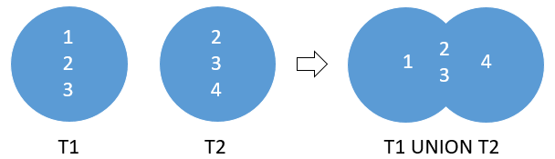
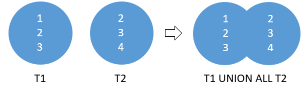

# UNION OPERATOR

The `UNION` operator **combines result sets of two or more** `SELECT` statements into a **single result set**.

The following illustrates the syntax of the `UNION` operator that combines result sets from two queries:

**SQL**
```SQL
SELECT select_list_1
  FROM table_1
UNION
SELECT select_list_2
  FROM table_2;
```

To combine the result sets of two queries using the `UNION` operator, the queries must conform to the following rules:

- The **number** and the **order** of the columns in the select list of both queries must be the same.
- The **data types must be compatible**.

The `UNION` operator **removes all duplicate rows from the combined data set**.

By default, the `UNION` operator returns the unique rows from both result sets. If you want **to retain the duplicate rows**, you explicitly use `UNION ALL` as follows:

**SQL**
```SQL
SELECT column_list
  FROM table_1
UNION ALL
SELECT column_list
  FROM table_2;
```

## UNION OPERATOR ILLUSTRATION

Suppose, we have two tables `T1` and `T2`:

- `T1` has three rows `1`, `2` and `3`
- `T2` also has three rows `2`, `3` and `4`

The following picture illustrates the `UNION` of `T1` and `T2` tables:



The `UNION` removed the duplicate rows `2` and `3`

The following picture illustrates the result of the `UNION ALL` of the `T1` and `T2` tables:



As you can see, the `UNION ALL` retains the duplicate rows `2` and `3`.

## PostgreSQL UNION with ORDER BY clause

The `UNION` operator may place the rows from the result set of the first query before, after, or between the rows from the result set of the second query.

To sort rows in the final result set, **you use the** `ORDER BY` **clause in the second query**.

In practice, you often use the `UNION` operator to combine data from similar tables, which are not perfectly normalized, in the data warehouse or business intelligence systems.

## Setting up sample tables

The following statements create two tables: `top_rated_films` and `most_popular_films`, and insert data into these tables:

```console
uniy=# CREATE TABLE top_rated_films (
uniy(#    title VARCHAR NOT NULL,
uniy(#    release_year SMALLINT
uniy(# );
CREATE TABLE
uniy=# CREATE TABLE most_popular_films (
uniy(#     title VARCHAR NOT NULL,
uniy(#     release_year SMALLINT
uniy(# );
CREATE TABLE
uniy=# INSERT INTO top_rated_films
uniy-#        (title, release_year)
uniy-# VALUES ('the Shawshank Redemption',1994),
uniy-#        ('The Godfather',1972),
uniy-#        ('12 Angry Men',1957);
INSERT 0 3
uniy=# INSERT INTO most_popular_films
uniy-#        (title, release_year)
uniy-# VALUES ('An American Pickle',2020),
uniy-#        ('The Godfather',1972),
uniy-#        ('Greyhound',2020);
INSERT 0 3
```

The following shows the data from the `top_rated_films` table:

```SQL
SELECT * FROM top_rated_films;
```

|title           | release_year|
|:-----------------------:|:-------------:|
|the Shawshank Redemption |         1994|
|**The Godfather**            |         **1972**|
|12 Angry Men             |         1957|

The following statement returns the data from the `most_popular_films` table:

```SQL
SELECT * FROM most_popular_films;
```

|title        | release_year|
|:-----------------:|:------------:|
|An American Pickle |         2020|
|**The Godfather**      |         **1972**|
|Greyhound          |         2020|

## PostgreSQL UNION examples

Let’s take some examples of using the PostgreSQL `UNION` operator.

The following statement uses the UNION operator to combine data from both tables:


**Query Diagram**


**SQL**
```SQL
SELECT *
  FROM top_rated_films
UNION
SELECT *
  FROM most_popular_films;
```

In query diagrams, a union is represented by surrounding the tables involved with a box, then joining the boxes with a double line.

**Results**

|title           | release_year|
|:-----------------------:|:-------------:|
|An American Pickle       |         2020|
|Greyhound                |         2020|
|The Godfather            |         1972|
|12 Angry Men             |         1957|
|the Shawshank Redemption |         1994|

The result set includes five rows in the result set because the `UNION` operator removes one duplicate row.

**Query**
```console
uniy=# SELECT *
uniy-#   FROM top_rated_films
uniy-# UNION
uniy-# SELECT *
uniy-#   FROM most_popular_films;
```

**Output**
```console
          title           | release_year
--------------------------+--------------
 An American Pickle       |         2020
 Greyhound                |         2020
 The Godfather            |         1972
 12 Angry Men             |         1957
 the Shawshank Redemption |         1994
(5 rows)
```

## PostgreSQL UNION ALL example

The following statement uses the `UNION ALL` operator to combine result sets from the `top_rated_films` and `most_popular_films` tables:

**SQL**
```SQL
SELECT *
  FROM top_rated_films
UNION ALL
SELECT *
  FROM most_popular_films;
```

**Results**

|title           | release_year|
|:-----------------------:|:--------------:|
|the Shawshank Redemption |         1994|
|**The Godfather**            |         **1972**|
|12 Angry Men             |         1957|
|An American Pickle       |         2020|
|**The Godfather**            |         **1972**|
|Greyhound                |         2020|

In this example, the duplicate row is retained in the result set.

**Query**
```console
uniy=# SELECT *
uniy-#   FROM top_rated_films
uniy-# UNION ALL
uniy-# SELECT *
uniy-#   FROM most_popular_films;
```

**Output**
```console
          title           | release_year
--------------------------+--------------
 the Shawshank Redemption |         1994
 The Godfather            |         1972
 12 Angry Men             |         1957
 An American Pickle       |         2020
 The Godfather            |         1972
 Greyhound                |         2020
(6 rows)
```

## PostgreSQL UNION ALL with ORDER BY clause example

To sort the result returned by the `UNION` operator, you place the `ORDER BY` clause end of the last query like this:

**SQL**
```SQL
SELECT *
  FROM top_rated_films
UNION ALL
SELECT *
  FROM most_popular_films
 ORDER BY title;
```

**Results**

|title           | release_year|
|:-----------------------:|:-------------:|
|12 Angry Men             |         1957|
|An American Pickle       |         2020|
|Greyhound                |         2020|
|**The Godfather**            |         **1972**|
|**The Godfather**            |         **1972**|
|the Shawshank Redemption |         1994|


If you place the `ORDER BY` clause at the end of each query, the combined result set will not be sorted as you expected.

Because when `UNION` operator combines the sorted result sets from each query, it does not guarantee the order of rows in the final result set.

The database system performs the following steps:

- First, execute each SELECT statement individually.
- Second, combine result sets and remove duplicate rows to create the combined result set.
- Third, sort the combined result set by the column specified in the ORDER BY clause.

**Query**
```console
uniy=# SELECT *
uniy-#   FROM top_rated_films
uniy-# UNION ALL
uniy-# SELECT *
uniy-#   FROM most_popular_films
uniy-#  ORDER BY title;
```

**Output**
```console
          title           | release_year
--------------------------+--------------
 12 Angry Men             |         1957
 An American Pickle       |         2020
 Greyhound                |         2020
 The Godfather            |         1972
 The Godfather            |         1972
 the Shawshank Redemption |         1994
(6 rows)
```

## UNION WARNING

Unions are simple, but they do have some interesting restrictions. For instance, SQL combines the columns returned by each `SELECT` statement in the `UNION` according to their **position**, not their name. This means that each query must specify the same number of columns, and corresponding columns must be of the same data type.

For example, the query

**SQL**
```SQL
SELECT student_id, student_name
  FROM students
UNION
SELECT teacher_name, teacher_id
  FROM teachers;
```

would fail. The way it is expressed, `student_id` and `teacher_name` would need to appear in the same columns, yet `student_id` is a SMALLINT while `teacher_name` is CHAR. Because these two columns have different data types, they can't be combined in this way. The columns `student_name` and `teacher_id` have the same problem, so this query would likely generate nothing but an error message.

```console
uniy=# SELECT student_id, student_name
uniy-#   FROM students
uniy-# UNION
uniy-# SELECT teacher_name, teacher_id
uniy-#   FROM teachers;
ERROR:  UNION types smallint and character cannot be matched
LINE 4: SELECT teacher_name, teacher_id
               ^
```

The following query solves the problem:

**SQL**
```SQL
SELECT student_id AS id, student_name AS name
  FROM students
 UNION
SELECT teacher_id AS id, teacher_name AS name
  FROM teachers
 ORDER BY id;
```

**Results**

|id  |        name|
|:---:|:------------------:|
|148 | Susan Powell|
|180 | Dr. Cooke|
|210 | Bob Dawson|
|213 | Dr. Wright|
|290 | Dr. Lowe|
|298 | Howard Mansfield|
|303 | Dr. Horn|
|348 | Susan Pugh|
|349 | Joe Adams|
|354 | Janet Ladd|
|410 | Bill Jones|
|430 | Dr. Engle|
|473 | Carol Dean|
|548 | Allen Thomas|
|558 | Val Shipp|
|560 | Dr. Olsen|
|649 | John Anderson|
|654 | Janet Thomas|
|784 | Dr. Scango|

**Query**
```console
uniy=# SELECT student_id AS id, student_name AS name
uniy-#   FROM students
uniy-#  UNION
uniy-# SELECT teacher_id AS id, teacher_name AS name
uniy-#   FROM teachers
uniy-#  ORDER BY id;
```
**Output**
```console
 id  |        name
-----+--------------------
 148 | Susan Powell
 180 | Dr. Cooke
 210 | Bob Dawson
 213 | Dr. Wright
 290 | Dr. Lowe
 298 | Howard Mansfield
 303 | Dr. Horn
 348 | Susan Pugh
 349 | Joe Adams
 354 | Janet Ladd
 410 | Bill Jones
 430 | Dr. Engle
 473 | Carol Dean
 548 | Allen Thomas
 558 | Val Shipp
 560 | Dr. Olsen
 649 | John Anderson
 654 | Janet Thomas
 784 | Dr. Scango
(19 rows)
```


## UNION vs. JOIN

A `UNION` places a result set on top another, meaning that **it appends result sets vertically**.

However, a join such as `INNER JOIN` or `LEFT JOIN` **combines result sets horizontally**.

The following picture illustrates the difference between union and join:


