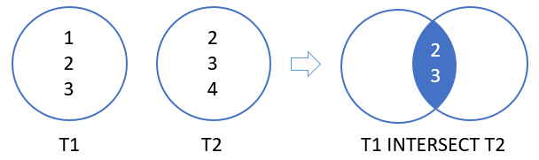

# INTERSECT

The PostgreSQL `INTERSECT` operator **combines result sets of two or more** `SELECT` statements into a **single result set**.

The `INTERSECT` operator **returns any rows that are available in both result sets**.

The following illustrates the syntax of the `INTERSECT` operator:

**SQL**
```SQL
SELECT column_list_1
  FROM table_1
INTERSECT
SELECT column_list_2
  FROM table_2;
```

Similar to the `UNION` operator, you must follow these rules when using the INTERSECT operator:

- The `number` and the `order` of columns must be the same in the two queries.
- The **data type of the corresponding columns must be in the same data type group** such as numeric or character.

## INTERSECT OPERATOR ILLUSTRATION

Suppose we have two queries that return the `T1` and `T2` result set.

- `T1` result set includes `1`, `2`, `3`.
- `T2` result set includes `2`, `3`, `4`.

The intersect of `T1` and `T2` result returns `2` and `3`. **Because these are distinct values that are output by both queries**.

The following picture illustrates the intersection of `T1` and `T2`:



The illustration showed that the INTERSECT returns the intersection of two circles (or sets).

## PostgreSQL INTERSECT with ORDER BY clause

If you want to sort the result set returned by the `INTERSECT` operator, you place the `ORDER BY` at the final query in the query list like this:

**SQL**
```SQL
SELECT column_list_1
  FROM table_1
INTERSECT
SELECT column_list_2
  FROM table_2
 ORDER BY sort_expression;
```

## SQL INTERSECT operator example

We’ll use the `top_rated_films` and `most_popular_films` tables created in the `UNION` tutorial:

The following shows the data from the `top_rated_films` table:

```SQL
SELECT * FROM top_rated_films;
```

|title           | release_year|
|:-----------------------:|:-------------:|
|the Shawshank Redemption |         1994|
|**The Godfather**            |         **1972**|
|12 Angry Men             |         1957|

The following statement returns the data from the `most_popular_films` table:

```SQL
SELECT * FROM most_popular_films;
```

|title        | release_year|
|:-----------------:|:------------:|
|An American Pickle |         2020|
|**The Godfather**      |         **1972**|
|Greyhound          |         2020|

To get popular films which are also top rated films, you use the `INTERSECT` operator as follows:

**SQL**
```SQL
SELECT *
  FROM most_popular_films
INTERSECT
SELECT *
  FROM top_rated_films;
```

**Results**

|title     | release_year|
|:--------:|:-------------:|
|The Godfather |         1972|

The result set returns one film that appears on both tables.

**Query**
```console
uniy=# SELECT *
uniy-#   FROM most_popular_films
uniy-# INTERSECT
uniy-# SELECT *
uniy-#   FROM top_rated_films;
```
**Output**
```console
     title     | release_year
---------------+--------------
 The Godfather |         1972
(1 row)
```

## Emulate SQL INTERSECT operator using INNER JOIN clause

Most relational database system supports the `INTERSECT` operator such as Oracle Database, Microsoft SQL Server, PostgreSQL, etc. However, some database systems do not provide the `INTERSECT` operator like `MySQL`.

To emulate the SQL `INTERSECT` operator, you can use the `INNER JOIN` clause as follows:

**SQL**
```SQL
SELECT *
  FROM most_popular_films
 INNER JOIN top_rated_films USING(title,release_year);
```

**Results**

|title     | release_year|
|:--------:|:------------:|
|The Godfather |         1972|


**Query**
```console
uniy=# SELECT *
uniy-#   FROM most_popular_films
uniy-#  INNER JOIN top_rated_films USING(title,release_year);
```
**Output**
```console
     title     | release_year
---------------+--------------
 The Godfather |         1972
(1 row)
```
