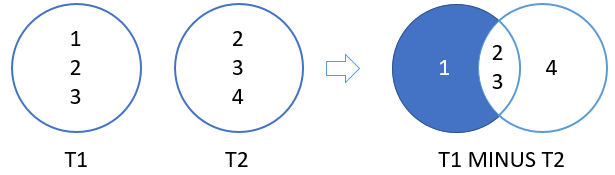

# EXCEPT

The PostgreSQL `EXCEPT` operator **compares two queries and returns distinct rows from the first query that are not output by the second query**. In other words, the `EXCEPT` operator **subtracts one result set from another**.

The following illustrates the syntax of the PostgreSQL `EXCEPT` operator:

**SQL**
```SQL
SELECT column_list_1
  FROM table_1
EXCEPT
SELECT column_list_2
  FROM table_2;
```

Similar to the `UNION` and `INTERSECT` operators, the queries above must conform with the following rules:

- The `number` of columns and their `orders` must match.
- The **data type of the corresponding columns must be in the same data type group** such as numeric or character.

Suppose the first query returns the `T1` result set that includes `1`, `2` and `3`. And the second query returns the `T2` result set that includes `2`, `3` and `4`.

The following picture illustrates the result of the `EXCEPT` of `T1` and `T2`:



## SQL EXCEPT operator example

We’ll use the `top_rated_films` and `most_popular_films` tables created in the `UNION` tutorial:

The following shows the data from the `top_rated_films` table:

```SQL
SELECT * FROM top_rated_films;
```

|title           | release_year|
|:-----------------------:|:-------------:|
|the Shawshank Redemption |         1994|
|**The Godfather**            |         **1972**|
|12 Angry Men             |         1957|

The following statement returns the data from the `most_popular_films` table:

```SQL
SELECT * FROM most_popular_films;
```

|title        | release_year|
|:-----------------:|:------------:|
|An American Pickle |         2020|
|**The Godfather**      |         **1972**|
|Greyhound          |         2020|

To get only the top rated movies that are not popular run the following query:

**SQL**
```SQL
SELECT *
  FROM top_rated_films
EXCEPT
SELECT *
  FROM most_popular_films;
```

**Results**

|title           | release_year|
|:--------------:|:-------------:|
|12 Angry Men             |         1957|
|the Shawshank Redemption |         1994|


**Query**
```console
uniy=# SELECT *
uniy-#   FROM top_rated_films
uniy-# EXCEPT
uniy-# SELECT *
uniy-#   FROM most_popular_films;
```
**Output**
```console
          title           | release_year
--------------------------+--------------
 12 Angry Men             |         1957
 the Shawshank Redemption |         1994
(2 rows)
```
## Emulate SQL EXCEPT operator using LEFT JOIN clause

To emulate the SQL `EXCEPT` operator, you can use the `LEFT JOIN` clause as follows:

**SQL**
```SQL
SELECT t.*
  FROM top_rated_films t
  LEFT JOIN most_popular_films m USING(title, release_year)
  WHERE m.title IS NULL AND m.release_year IS NULL;
```

**Results**

|title           | release_year|
|:--------------:|:------------:|
|the Shawshank Redemption |         1994|
|12 Angry Men             |         1957|


**Query**
```console
uniy=# SELECT t.*
uniy-#   FROM top_rated_films t
uniy-#   LEFT JOIN most_popular_films m USING(title, release_year)
uniy-#   WHERE m.title IS NULL AND m.release_year IS NULL;
```

**Output**
```console
          title           | release_year
--------------------------+--------------
 the Shawshank Redemption |         1994
 12 Angry Men             |         1957
(2 rows)
```
